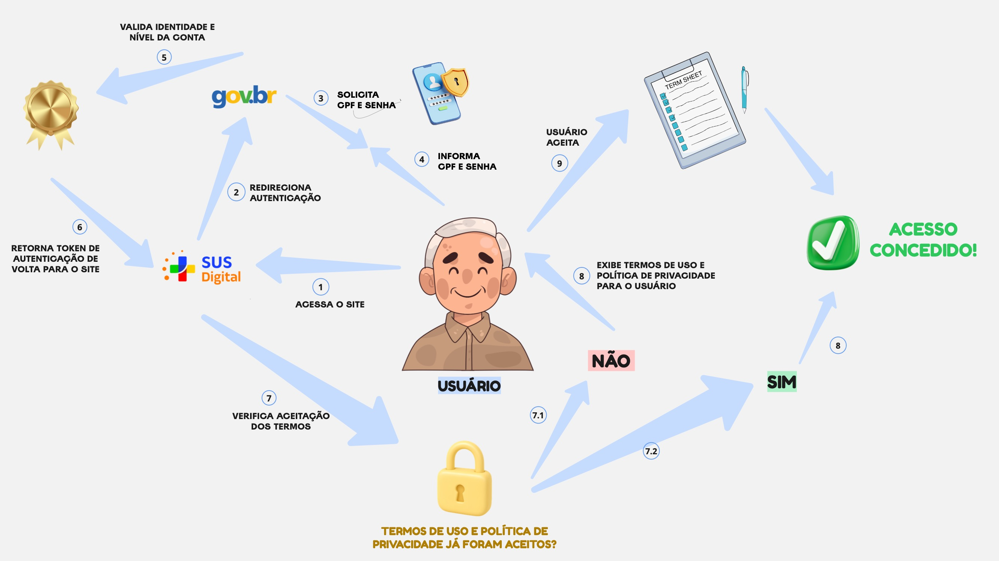
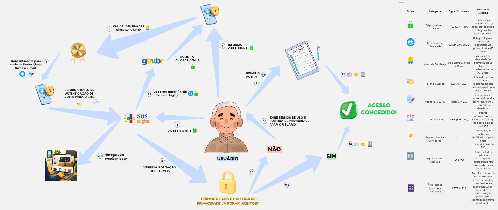
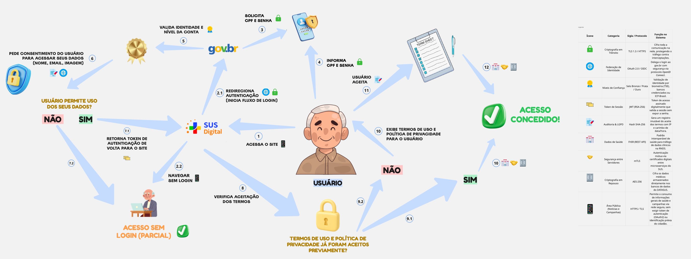
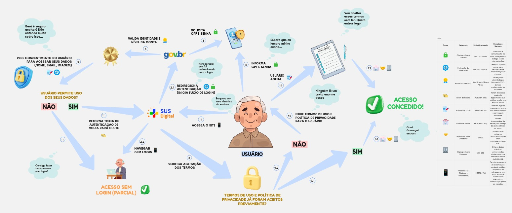

# Artefato Generalista | Rich Picture 

<iframe 
  width="768" 
  height="432" 
  src="https://miro.com/app/board/uXjVHuZIJiQ=/?share_link_id=624239053530" 
  frameborder="0" 
  scrolling="no" 
  allow="fullscreen; clipboard-read; clipboard-write" 
  allowfullscreen>
</iframe>

**Legenda:** Fluxo de Jornada de Acesso e Segurança (Meu SUS Digital)

[Clique aqui para descer a página até a versão final](#versão-14-final)

---

## Participantes 
| Nome do Membro | 
| :--- |
| [Artur Galdino](https://github.com/ArturFGaldino) |
| [Giovani Coelho](https://github.com/Gotc2607) |
| [João Leles](https://github.com/joaoleless) |
| [Nicole Jovita](https://github.com/nicolejovita) |

---

## Fundamentação

### O que é um Artefato Generalista 

Artefatos generalistas são ferramentas e representações visuais ou textuais informais usadas no início do projeto para apoiar o levantamento (elicitação) de requisitos, debates com clientes e organização de ideias sem ficar preso a metodologias rígidas. 

No contexto da engenharia de requisitos e da modelagem de sistemas, esses elementos atuam como pontes de comunicação de baixo acoplamento cognitivo, priorizando a flexibilidade, a facilidade de iteração e o entendimento compartilhado entre partes interessadas (stakeholders) técnicas e não técnicas. 

### O que é uma Rich Picture 

Rich picture (ou "imagem rica") é uma técnica de representação informal, originada na Soft Systems Methodology (SSM) de Peter Checkland, usada para retratar de forma visual e holística uma situação-problema antes de qualquer tentativa de solução técnica. Diferente de fluxogramas ou diagramas UML, ela não segue uma notação formal: combina desenhos, ícones, setas e balões de fala/pensamento para capturar não só o processo (o que acontece, em que ordem), mas também os atores envolvidos, o ambiente em que atuam e — principalmente — as preocupações, conflitos e percepções subjetivas que cada um tem sobre a situação.

Essa liberdade de notação é proposital: o objetivo não é documentar um sistema com precisão técnica, mas construir um entendimento compartilhado sobre um contexto complexo, incluindo aspectos "soft" (humanos, sociais, emocionais) que dificilmente apareceriam em um diagrama estruturado.

Elementos comuns a uma rich picture:

- **Atores:** bonecos ou ícones de pessoas representando quem participa da situação;
- **Setas:** indicam fluxos, comunicação ou sequência de ações entre os atores e o sistema;
- **Balões de fala/pensamento (nuvens):** expressam preocupações, dúvidas ou sentimentos — os chamados _concerns_;
- **Ícones e desenhos simples:** substituem caixas e formas geométricas padronizadas, tornando o artefato mais próximo de um esboço do que de um diagrama técnico;
- **Ausência de sintaxe fixa:** o mesmo elemento pode ser desenhado de formas diferentes por autores diferentes, desde que o significado fique claro para quem lê.

Neste artefato, a técnica foi usada para representar o fluxo de acesso ao site do Meu SUS Digital sob a ótica de um usuário idoso, evidenciando — por meio dos balões de pensamento -, os pontos de fricção de usabilidade, segurança e privacidade percebidos em cada etapa, algo que um fluxograma tradicional, focado apenas na sequência de telas, não capturaria. 

A equipe, durante a elaboração, fundamentou-se nas diretrizes teóricas de **Andrew Monk** e **Steve Howard** no artigo **"The Rich Picture: A Tool for Reasoning About Work Context"**, aplicando os elementos essenciais sintetizados na tabela abaixo (Tabela 1 - Elementos de um Rich Picture Eficaz):

  

- **Estrutura** e **Processos**: Mapeou-se a estrutura necessária dos atores envolvidos no ecossistema (Cidadão, gov.br, Meu SUS Digital) e o fluxo geral de autenticação e consentimento sem sobrecarregar o diagrama com detalhes técnicos excessivos de implementação inicial.
- **Preocupações**, **Linguagem** e **Dispositivos Pictóricos**: Representou-se os receios e incertezas reais dos usuários por meio de nuvens de pensamento (thought bubbles). Adotou-se a linguagem natural dos cidadãos nas expressões dos balões e utilizou-se uma combinação flexível de ícones, figuras e símbolos visuais para tornar a leitura intuitiva.

Além disso, a equipe guiou-se pelas orientações práticas e convenções recomendadas pela The Open University (OpenLearn — materiais "What are rich pictures?" e "How to draw rich pictures?"). Essa referência orientou o passo a passo da construção, o uso adequado de conectores e a criação da legenda padronizada para explicitar os elementos e garantir a clareza do modelo.

---

## Evolução da Rich Picture

### Versão 1.0 

**Autoria:** [Nicole Jovita](https://github.com/nicolejovita)

**O que foi feito:** Elaboração da primeira versão do Rich Picture, estabelecendo a identidade visual e o fluxo de autenticação do usuário no Meu SUS Digital via integração com o Gov.br, cobrindo as etapas de validação de credenciais, retorno de token e verificação do aceite dos Termos de Uso e Política de Privacidade.

---

### Versão 1.1

**Autoria:** [Artur Galdino](https://github.com/ArturFGaldino)

**O que foi feito:** Evolução do Rich Picture com a integração da camada técnica e de segurança ao fluxo de autenticação. Foram inseridos marcadores visuais ao longo das etapas e adicionada uma tabela técnica lateral detalhando os padrões, protocolos e mecanismos de conformidade adotados (TLS 1.3, OAuth 2.0/OIDC, JWT, Hash SHA-256 para auditoria/LGPD, interoperabilidade com FHIR, mTLS e criptografia AES-256).

---

### Versão 1.2

**Autoria:** [Giovani Coelho](https://github.com/Gotc2607)

**O que foi feito:** Refinamento do diagrama com a inclusão da rota de navegação sem login, detalhamento da etapa de consentimento de dados (escopos OAuth/Gov.br), renumeração completa das ações e adição da segurança da área pública na tabela técnica.

---

### Versão 1.3 

**Autoria:** [Artur Galdino](https://github.com/ArturFGaldino) e [Nicole Jovita](https://github.com/nicolejovita)

**O que foi feito:** Adição do fluxo alternativo de recusa no compartilhamento de dados do Gov.br direcionando ao "Acesso sem Login (Parcial)" e atualização iconográfica no diagrama.

---

### Versão 1.4 (Final)

**Autoria:** [João Leles](https://github.com/joaoleless)

[Link de Acesso à Versão Final | MIRO](https://miro.com/app/board/uXjVHuZIJiQ=/?share_link_id=624239053530)

**O que foi feito:** Inclusão de balões de pensamento para mapear as percepções, dúvidas e atritos do usuário ao longo da autenticação e navegação, complementando a modelagem técnica com a perspectiva de usabilidade e comportamento real.

#### Matriz de Impacto 
##### Percepções do Usuário e Vulnerabilidades em Privacidade, Segurança e Usabilidade

Esta tabela mapeia as preocupações, sentimentos e modelos mentais expressos pelos usuários durante o fluxo de autenticação e uso da plataforma, correlacionando-os diretamente com os riscos técnicos e de experiência que provocam.

O objetivo do artefato é traduzir a subjetividade do cidadão (capturada no Rich Picture) em requisitos acionáveis de Engenharia de Software e Privacy by Design, evidenciando como falhas de clareza ou sobrecarga de informação podem comprometer a conformidade com a LGPD, a robustez da segurança da informação e a acessibilidade do sistema.

| Preocupação | Onde | Problema evidenciado |
| ----- | ----------- | ----------- |
| _"Nem percebi que fui redirecionado para o login"_ | Passo 2.1 – Redirecionamento Gov.br | Falta de clareza sobre qual entidade está coletando e processando as credenciais no momento do acesso. |
| _"Espero que eu lembre minha senha..."_ | Passo 4 – Autenticação Gov.br | Fricção severa na autenticação e alta probabilidade de bloqueio de conta ou abandono do fluxo. |
| _"Será é seguro aceitar? Não entendo muito sobre isso..."_ | Passo 6 – Consentimento de dados | Ausência de indicadores visuais de segurança perceptível (perceived security), gerando desconfiança e potencial abandono da plataforma em serviços críticos. |
| _"Consigo fazer tudo, mesmo sem login?"_ | Passo 7.2 – Acesso parcial / Recusa de consentimento | Falta de clareza prévia sobre os limites do modo visitante (guest mode). O usuário pode acabar investir tempo desnecessário preenchendo formulários. |
| _"Ninguém lê um texto enorme desse"_/_"Vou aceitar esses termos sem ler. Quero entrar logo"_ | Passos 10 e 11 – Termos e Políticas | Fenômeno do consentimento cego (click-wrap fatigue). O usuário concorda com cláusulas de retenção, compartilhamento ou perfilamento de dados sem conhecê-las, minando a autodeterminação informativa. |
                                    
----

## Organização
A equipe organizou-se por meio de uma reunião inicial, na qual definiu-se a divisão estratégica das tarefas para garantir a colaboração contínua de todos os integrantes. Ficou alinhado que Nicole Jovita e Artur Galdino seriam responsáveis por elaborar a estrutura base do Rich Picture, mapeando os atores e os fluxos primários. Sequencialmente, João Leles e Giovani Coelho atuaram no refinamento do artefato, adicionando notas técnicas, efetuando revisões do modelo e propondo melhorias de segurança e privacidade para consolidar a entrega final. 

A principal ferramenta utilizada pela equipe foi o [MIRO](https://miro.com/app/board/uXjVHuZIJiQ=/?share_link_id=624239053530). As deliberações e os alinhamentos dessa etapa podem ser consultados na [Ata da Reunião - 25/08](/Projeto/Atas/AtasSub1/Ata-25-08.md).

---

## Embasamento Metodológico
1. SERRANO, Maurício; LEITE, Julio Cesar Sampaio do Prado. [A social interaction based pre-traceability for i* models](http://ftp.informatik.rwth-aachen.de/Publications/CEUR-WS/Vol-766/paper23.pdf). In: INTERNATIONAL I* WORKSHOP, 5., 2011. CEUR Proceedings of the 5th International i* Workshop (iStar 2011). [S. l.]: CEUR-WS, 2011. p. 132-137. (Base teórica para a seção "Rastreabilidade com o Artefato Generalista".) ler artigo e incrementar rastreamento
1. MONK, Andrew; HOWARD, Steve. The Rich Picture: [A Tool for Reasoning About Work Context](https://drive.google.com/file/d/1tI_kdAZ3Yle44t86N-NJqdAwT3il7U9t/view). Interactions, [S. l.], v. 5, n. 2, p. 21-30, mar./abr. 1998. 
2. [THE OPEN UNIVERSITY. Rich pictures](https://www.open.edu/openlearn/science-maths-technology/engineering-technology/rich-pictures). OpenLearn, 2021. Acesso em: 28 ago. 2026. (Orientações práticas, materiais "What are rich pictures?" e "How to draw rich pictures?", direcionando o passo a passo da construção, conectores e legenda padronizada.)

---

## Histórico de Versionamento

| Nome do Membro | Contribuição | Data | Commit |
| :--- | :--- | :--- | :--- |
| [Artur Galdino](https://github.com/ArturFGaldino) | Criar o template | 27/08/2026 | [8f64af2](https://github.com/UnBArqDsw2026-2-Turma01/2026.2-T01-_G5_ProjetoGovernoEletronico_Entrega_01/commit/8f64af2073b22ef2c295241ad12a19827e35f792) |
| [Nicole Jovita](https://github.com/nicolejovita) | Inserção da Versão 1.0 Rich Picture | 27/08/2026 | [5d141a7](https://github.com/UnBArqDsw2026-2-Turma01/2026.2-T01-_G5_ProjetoGovernoEletronico_Entrega_01/commit/5d141a794d96cc0118541610adfc593b07118fdf) |
| [Artur Galdino](https://github.com/ArturFGaldino) | Inserção da Versão 1.1 Rich Picture | 27/08/2026 | [5be707e](https://github.com/UnBArqDsw2026-2-Turma01/2026.2-T01-_G5_ProjetoGovernoEletronico_Entrega_01/commit/5be707e1716f64bf00a19323b243d0259f438c37) |
| [Giovani Coelho](https://github.com/Gotc2607) | Refinamento do Rich Picture (Versão 1.2): Inclusão de navegação sem login e expansão da autenticação via token | 27/08/2026 | [83a7029](https://github.com/UnBArqDsw2026-2-Turma01/2026.2-T01-_G5_ProjetoGovernoEletronico_Entrega_01/commit/83a7029df6e59b56c38bc9612082ffe57c3fc447) |
| [Artur Galdino](https://github.com/ArturFGaldino) e [Nicole Jovita](https://github.com/nicolejovita)| Inserção da Versão 1.3 Rich Picture | 27/08/2026 | [00a7843](https://github.com/UnBArqDsw2026-2-Turma01/2026.2-T01-_G5_ProjetoGovernoEletronico_Entrega_01/commit/00a7843487798ff8398032b9a4dca1b7205a76b9) |
| [João Leles](https://github.com/joaoleless) |Inserção da versão 1.4 com adição de balões de texto para descrever melhor o fluxo | 27/08/2026 | [cac4cae](https://github.com/UnBArqDsw2026-2-Turma01/2026.2-T01-_G5_ProjetoGovernoEletronico_Entrega_01/commit/cac4cae8888861dcbaf11cc45085809afe58427c) |
| [Nicole Jovita](https://github.com/nicolejovita) | Estruturação: Fundamentação Artefato generalista & Rich Picture, organização da equipe e embasamento metodológico | 27/08/2026 | [f398e77](https://github.com/UnBArqDsw2026-2-Turma01/2026.2-T01-_G5_ProjetoGovernoEletronico_Entrega_01/commit/f398e77f1e15595a8aea07d90357013453564493) |
| [Artur Galdino](https://github.com/ArturFGaldino) e [Nicole Jovita](https://github.com/nicolejovita) | Criação da Matriz de Impacto com identificação de problemas de privacidade, usabilidade e segurança a partir de pensamentos do usuário | 28/08/2026 | [cb242ae](https://github.com/UnBArqDsw2026-2-Turma01/2026.2-T01-_G5_ProjetoGovernoEletronico_Entrega_01/commit/cb242ae172a429b8504bf137a4d3b31819765dc6) |