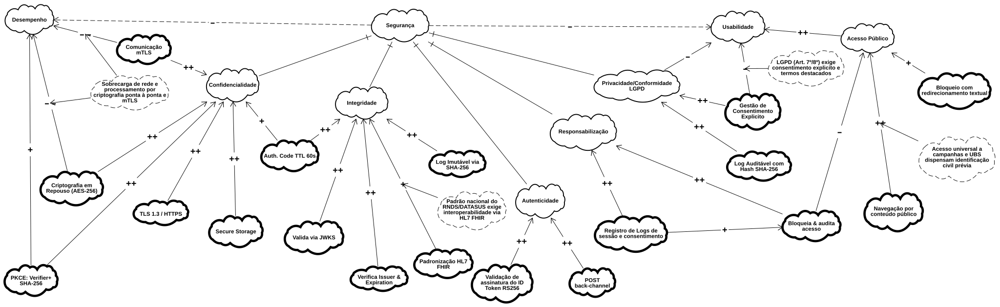
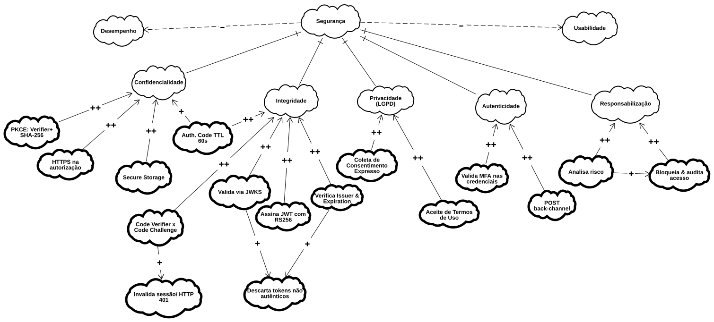

# SIG | NFR Framework 

**Legenda:** Grafo de Interdependência de Metas Suaves (NFR Framework/SIG)

---

## Participantes 
| Nome do Membro | 
| :--- |
| [Artur Galdino](https://github.com/ArturFGaldino) |
| [Giovani Coelho](https://github.com/Gotc2607) |
| [João Leles](https://github.com/joaoleless) |
| [Nicole Jovita](https://github.com/nicolejovita) |

---

## Fundamentação 
### O que é um NFR (Requisito Não Funcional)

NFR (Non-Functional Requirement, ou Requisito Não Funcional) é um requisito que não descreve uma função específica que o sistema deve executar, mas sim uma qualidade ou restrição sobre _como_ essas funções devem ser realizadas — por exemplo, usabilidade, segurança, desempenho, privacidade ou acessibilidade. Enquanto um requisito funcional responde "o que o sistema faz" (ex.: "o usuário deve conseguir buscar uma unidade de saúde"), um NFR responde "com que qualidade" isso deve acontecer (ex.: "a busca deve ser acessível a usuários com baixo letramento digital").

Chung et al. (2000) argumentam que NFRs raramente podem ser completamente satisfeitos de forma binária (sim/não): eles são, na prática, _softgoals_, sem um critério de satisfação claro e objetivo, cujo cumprimento é sempre uma questão de grau e de compromisso com outros objetivos do sistema. É justamente por isso que o NFR Framework trata a Usabilidade do Meu SUS Digital não como uma caixa a ser marcada, mas como um softgoal a ser refinado, discutido e avaliado ao longo do processo de design, o que motiva o uso do SIG descrito a seguir.

Para mais informações sobre: [Guia NFR Framework](../../../Projeto/GuiaNFR.md)

### O que é um SIG (Softgoal Interdependency Graph)

O SIG (Softgoal Interdependency Graph, ou Grafo de Interdependência de Softgoals) é a notação gráfica proposta pelo NFR Framework (CHUNG et al., 2000) para representar como um softgoal de alto nível se decompõe em softgoals mais específicos, e como decisões de design concretas impactam essa rede de objetivos. Um SIG é composto principalmente por três tipos de elementos:

- **Softgoals**: os próprios requisitos não funcionais, em diferentes níveis de abstração (ex.: Usabilidade → Acessibilidade → Percepção). Representados como nuvens de borda fina.
- **Métodos de Operacionalização**: decisões concretas de design ou implementação que contribuem — positiva ou negativamente — para um ou mais softgoals (ex.: "Autenticação via CPF e senha"). Representados como nuvens de borda grossa.
- **Claims**: argumentos ou justificativas usados para embasar por que determinada contribuição foi avaliada de certa forma, geralmente quando o contexto importa para a interpretação do link. Representados como nuvens de borda tracejada.

Esses elementos são conectados por **links de contribuição** (rotulados com `++`, `+`, `-` ou `--`), que indicam o quanto um nó filho satisfaz ou prejudica o nó pai, e podem opcionalmente receber avaliações finais (`!` crítico, `✓` aceito, `X` rejeitado) que sintetizam o resultado da análise para cada softgoal.

O valor do SIG está em tornar **explícitas e rastreáveis** as decisões de design e seus trade-offs: como o mesmo método pode satisfazer um softgoal enquanto prejudica outro, e como esse raciocínio pode ser revisitado posteriormente — funcionando como um registro do processo de design, e não apenas do seu resultado final.

---

## Rastreabilidade com a Rich Picture 
#### Fluxo de Autenticação e Privacidade

Seguindo a proposta de pré-rastreabilidade baseada em interação social de Serrano e Leite (2011), é possível comparar as preocupações, falas e percepções levantadas na Rich Picture com os nós do Softgoal Interdependency Graph (SIG) para verificar em que medida cada uma delas está representada na análise formal de requisitos não funcionais.

| Preocupação / Percepção (Rich Picture) | Representada no SIG? |
| ------------------------------------------------------------------------------------------------------ | -------------------------------------------------------------------------------------------------------------------------------------------------------------------------------- |
| _"Nem percebi que fui redirecionado para o login"_ (Passo 2.1 – Redirecionamento Gov.br)               | **Sim**. Mapeado na interdependência negativa (`-`) entre *Segurança* e *Usabilidade*, decorrente das etapas mandatórias de federação e proteção de sessão (*Auth. Code TTL 60s*, *PKCE*). |
| _"Espero que eu lembre minha senha..."_ (Passo 4 – Autenticação Gov.br)                                | **Parcialmente**. O SIG foca nas validações técnicas de *Autenticidade* e *Confidencialidade*, gerando impacto negativo indireto (`-`) de *Segurança* em *Usabilidade*, mas sem nó específico de recuperação de credenciais no fluxo federado (isso porque o Gov.br é tratado no estudo como um ator externo). |
| _"Será é seguro aceitar? Não entendo muito sobre isso..."_ (Passo 6 – Consentimento de dados)           | **Sim**. Softgoal *Privacidade/Conformidade LGPD*, operacionalizado por *Gestão de Consentimento Explícito* (`++`) e *Log Auditável com Hash SHA-256* (`++`).                    |
| _"Consigo fazer tudo, mesmo sem login?"_ (Passo 7.2 – Acesso parcial / Recusa de consentimento)         | **Sim**. O SIG contempla a restrição em *Responsabilização* (*Bloqueia & audita acesso*) e explicita o tratamento de degradação da experiência pública sob *Usabilidade*. |
| _"Ninguém lê um texto enorme desse"_ / _"Vou aceitar esses termos sem ler. Quero entrar logo"_ (Passos 10 e 11 – Termos e Políticas) | **Sim**. Representado pelo impacto negativo direto (`--`) da operacionalização *Gestão de Consentimento Explícito* sobre o softgoal de *Usabilidade*.                            |

---
## Evolução do SIG

### Versão 1.0

**Autoria:** [João Leles](https://github.com/joaoleless)

<b>Clique aqui para abrir e copiar o arquivo goalModel.txt (Versão 1.0)</b>

[goalModel.txt](../assets/subequipe01-fluxos/NFR/nfr-goalModel-versao1.0.txt ':include :type=code json')

**O que foi feito:**  Este modelo NFR estrutura a Segurança do fluxo de autenticação a partir de quatro pilares: **Confidencialidade** (protegendo dados com HTTPS, PKCE e armazenamento seguro), **Integridade** (validando a autenticidade dos tokens JWT via RS256 e JWKS), **Autenticidade** (confirmando a identidade por meio de MFA e canais diretos) e **Responsabilização** (auditando e bloqueando acessos suspeitos). Como efeito dessas proteções adicionais, o sistema assume um impacto negativo (trade-off) direto na **Usabilidade** e no **Desempenho**, devido às etapas extras de validação e ao processamento computacional exigido.

---

### Versão 1.1

**Autoria:** [Giovani Coelho](https://github.com/Gotc2607)

<b>Clique aqui para abrir e copiar o arquivo goalModel.txt (Versão 1.1)</b>

[goalModel.txt](../assets/subequipe01-fluxos/NFR/nfr-goalModel-versao1.1.txt ':include :type=code json')

**O que foi feito:** Nesta atualização, a principal alteração é a inclusão da meta suave **Privacidade (LGPD)** como um novo pilar direto de **Segurança**. Esse novo requisito é operacionalizado por meio da **Coleta de Consentimento Expresso** e da exigência do **Aceite de Termos de Uso** (ambas com contribuição ++), garantindo conformidade legal e maior controle do titular sobre seus dados no fluxo de autenticação.

---

### Versão 1.2 (Final)

**Autoria:** [Artur Galdino](https://github.com/ArturFGaldino) e [Nicole Jovita](https://github.com/nicolejovita)

<b>Clique aqui para abrir e copiar o arquivo goalModel.txt (Versão 1.2)</b>

[goalModel.txt](../assets/subequipe01-fluxos/NFR/nfr-goalModel-versao1.2.txt ':include :type=code json')

**O que foi feito:**

Nesta versão, a árvore de requisitos não funcionais foi aprimorada com a inclusão de **argumentos de domínio (claims)** e o refinamento do **mapeamento de conflitos (trade-offs)**, que passaram a explicitar os impactos negativos diretos na usabilidade e no desempenho do sistema. No pilar de confidencialidade, foram introduzidos o **mTLS** e a **criptografia em repouso (AES-256)**, a camada de transporte foi atualizada para **TLS 1.3** e os nós redundantes de validação de sessão foram removidos. Para a integridade, incorporou-se a **padronização HL7 FHIR** e a **geração de logs imutáveis com SHA-256**, eliminando duplicações do modelo anterior. Em autenticidade, a validação de MFA foi substituída pela verificação rigorosa da assinatura do **ID Token em RS256**. Por fim, as metas de privacidade e responsabilização foram integradas por meio da **gestão de consentimento explícito** e de **logs auditáveis**, trocando a análise de risco preliminar pelo registro contínuo de logs de sessão e consentimento.  

#### Detalhamento do Fluxo e Interdependências do NFR SIG

O **Softgoal Interdependency Graph (SIG)** organiza os requisitos não funcionais do **Meu SUS Digital** a partir de três Softgoals de alto nível: **Segurança**, **Usabilidade** e **Desempenho**.

| Softgoal Principal | Pilar / Subcategoria | Decisões Operacionais (Mapeadas no SIG) | Impacto / Função |
| :--- | :--- | :--- | :--- |
| **Segurança** | **Confidencialidade** | TLS 1.3 / HTTPS, Criptografia AES-256, Secure Storage, PKCE (Verifier + SHA-256), mTLS, Auth. Code TTL 60s | Cifra dados em trânsito e repouso, protegendo contra interceptação. |
| | **Integridade** | Auth. Code TTL 60s, Valida via JWKS, Verifica Issuer & Expiration, Padronização HL7 FHIR | Garante a inalterabilidade das requisições e a interoperabilidade da RNDS. |
| | **Autenticidade** | Validação de assinatura do ID Token RS256, POST back-channel | Assegura a emissão genuína de tokens pelo gov.br em canal direto servidor-a-servidor. |
| | **Responsabilização** | Registro de Logs de Sessão, Bloqueia & Audita Acesso | Sustenta a gestão de consentimento e conformidade legal (Art. 7º/8º LGPD). |
| | **Privacidade/Conformidade LGPD** | Log Imutável/Auditável (SHA-256), Gestão de Consentimento | Escrita explicita dos termos. |
| **Usabilidade** | **Acesso Público** | Navegação por conteúdo público (notícias, campanhas e UBSs), Bloqueio com redirecionamento textual | Permite inclusão e acesso universal sem exigência prévia de login. |
| **Desempenho** | | PKCE: Verifier + SHA-256 | Avalia o impacto colateral do processamento criptográfico na rede. |

**Resumo de Trade-offs e Interdependências (Contribuições)**

| Origem (Operacionalização) | Destino (Softgoal) | Contribuição | Descrição resumida |
| :--- | :--- | :---: | :--- |
| **PKCE / TLS 1.3 / AES-256/ Secure Storage / Criptografia mTLS** | **Confidencialidade** | ++ | Assegura proteção total dos dados em trânsito e repouso. |
| **Logs SHA-256 / Consentimento** | **Privacidade / LGPD** | ++ | Garante respaldo legal e rastreabilidade auditável. |
| **Navegação Pública Direta** | **Acesso Público** | ++ | Maximiza a usabilidade para usuários não autenticados. |
| **Criptografia mTLS / AES-256** | **Desempenho** | - | O excesso de processamento de cifra adiciona latência ao sistema. |
| **Exigências Estritas de LGPD** | **Usabilidade** | - | Adiciona telas intermediárias e fricção à navegação do usuário. |
| **Bloqueio Textual Rígido** | **Acesso Público** | - | Barreira descartada por prejudicar o acesso universal a informações básicas. |

---

## Organização 
A equipe organizou-se por meio de uma reunião inicial, na qual definiu-se a divisão estratégica das tarefas para garantir a colaboração contínua de todos os integrantes. Ficou alinhado que João Leles seria o responsável por elaborar a estrutura base do SIG (NFR Framework). Sequencialmente, Artur Galdino, Giovani Coelho e Nicole Jovita atuaram no refinamento do modelo, efetuando revisões e propondo melhorias para consolidar a entrega final. 

O [DSM3](https://www.cin.ufpe.br/~jhcp/dsm3goals/nfr.html#) foi a principal ferramenta utilizada para criar e aprimorar as versões do modelo. As deliberações e os alinhamentos dessa etapa podem ser consultados na [Ata da Reunião - 25/08](/Projeto/Atas/AtasSub1/Ata-25-08.md).

---

## Embasamento Metodológico 
1. CHUNG, Lawrence; NIXON, Brian A.; YU, Eric; MYLOPOULOS, John. [Non-Functional Requirements in Software Engineering](https://drive.google.com/file/d/1afNs6Z9qrAW-tBG53TgI16kxiioFUIb8/view). Boston: Kluwer Academic Publishers, 2000. DOI: 10.1007/978-1-4615-5269-7.
2. SERRANO, Maurício; LEITE, Julio Cesar Sampaio do Prado. [A social interaction based pre-traceability for i* models](http://ftp.informatik.rwth-aachen.de/Publications/CEUR-WS/Vol-766/paper23.pdf). In: INTERNATIONAL I* WORKSHOP, 5., 2011. CEUR Proceedings of the 5th International i* Workshop (iStar 2011). [S. l.]: CEUR-WS, 2011. p. 132-137. (Base teórica para a seção "Rastreabilidade com o Artefato Generalista".)
3. SERRANO, Milene; SERRANO, Maurício. [Requisitos – Aula 17: NFR Framework](https://drive.google.com/file/d/1barJrSu7LXNuprttazBs7J7nVgCTgul8/view). Material de aula. Universidade de Brasília (UnB) - Faculdade do Gama (FGA).  

---

## Histórico de Versionamento

| Nome do Membro | Contribuição | Data | Commit |
| :--- | :--- | :--- | :--- |
| [Artur Galdino](https://github.com/ArturFGaldino) | Criar o template | 27/08/2026 | [8f64af2](https://github.com/UnBArqDsw2026-2-Turma01/2026.2-T01-_G5_ProjetoGovernoEletronico_Entrega_01/commit/8f64af2073b22ef2c295241ad12a19827e35f792) |
| [João Leles](https://github.com/joaoleless) | Inserção da versão 1.0 com diagrama inicial | 27/08/2026 | [cac4cae](https://github.com/UnBArqDsw2026-2-Turma01/2026.2-T01-_G5_ProjetoGovernoEletronico_Entrega_01/commit/cac4cae8888861dcbaf11cc45085809afe58427c) |
| [Giovani Coelho](https://github.com/Gotc2607) | Inserção da versão 1.1 - Adição do nó de privacidade e seus dois nós de especialização | 27/08/2026 | [1926c55](https://github.com/UnBArqDsw2026-2-Turma01/2026.2-T01-_G5_ProjetoGovernoEletronico_Entrega_01/commit/1926c5543c174270b3a58620e468591d70b8101e) |
| [Nicole Jovita](https://github.com/nicolejovita) | Estruturação: fundamentação NFR & SIG, organização da equipe e embasamento metodológico | 28/08/2026 | [eb3b5c1](https://github.com/UnBArqDsw2026-2-Turma01/2026.2-T01-_G5_ProjetoGovernoEletronico_Entrega_01/commit/eb3b5c1dd53f43aa64002cb11d2a61b98f97d101) |
| [Artur Galdino](https://github.com/ArturFGaldino) e [Nicole Jovita](https://github.com/nicolejovita) | Inserção da versão 1.2 (final) | 28/08/2026 | [6af8cc5](https://github.com/UnBArqDsw2026-2-Turma01/2026.2-T01-_G5_ProjetoGovernoEletronico_Entrega_01/commit/6af8cc5c77048be6d634ff98583258b26e354eaf) |
| [Artur Galdino](https://github.com/ArturFGaldino) e [Nicole Jovita](https://github.com/nicolejovita) | Tabela de Rastreabilidade com a Rich Picture | 28/08/2026 | [9bdc74b](https://github.com/UnBArqDsw2026-2-Turma01/2026.2-T01-_G5_ProjetoGovernoEletronico_Entrega_01/commit/9bdc74bcdf73d44be074d800fc00991cc4f29fe5) |
