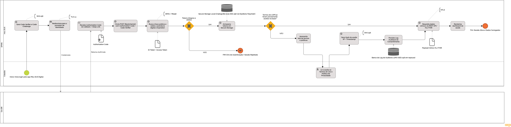
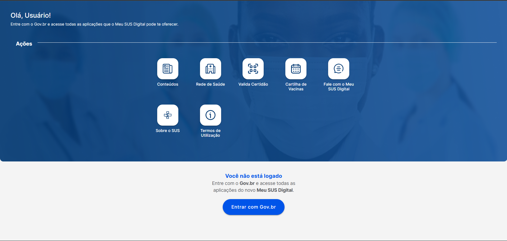
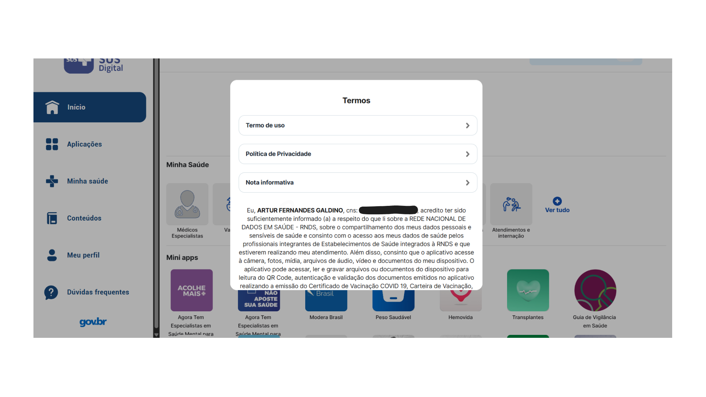
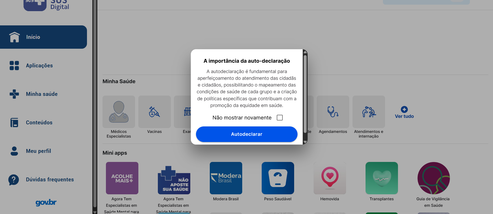
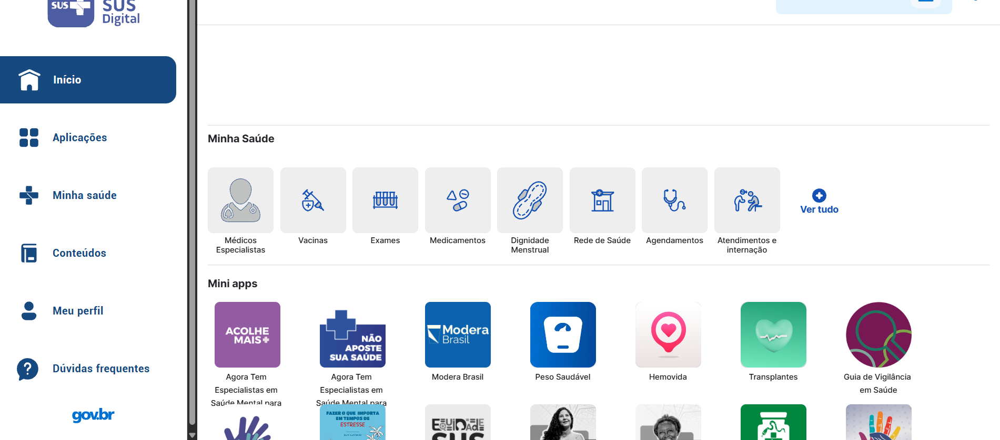
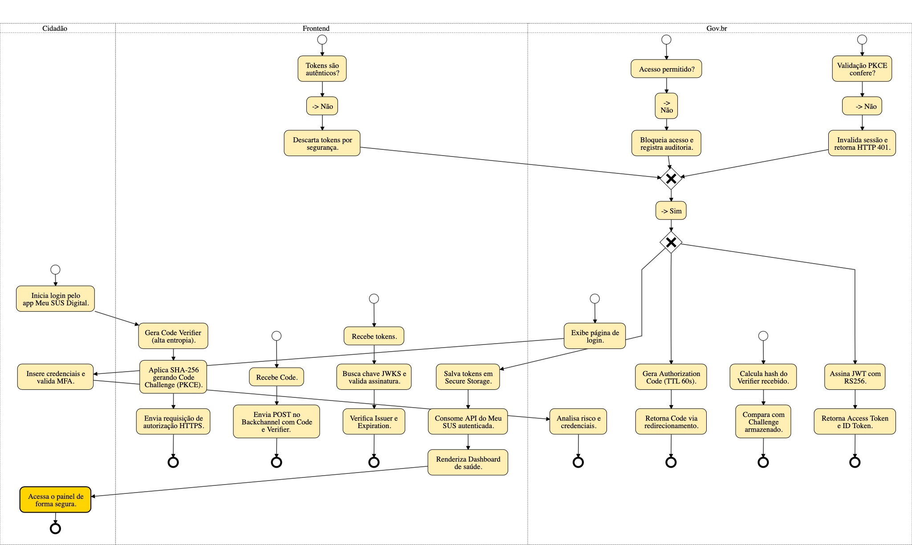
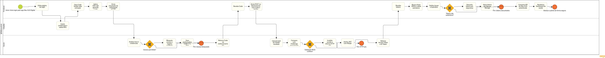

# BPMN Finalizado

**Legenda:** Diagrama BPMN: Fluxo Seguro de Autenticação, Consentimento e Consumo Clínico

---

## Participantes
| Nome do Membro | 
| :--- |
| [Artur Galdino](https://github.com/ArturFGaldino) |
| [Giovani Coelho](https://github.com/Gotc2607) |
| [João Leles](https://github.com/joaoleless) |
| [Nicole Jovita](https://github.com/nicolejovita) |

---

## Fundamentação 
### O que é Engenharia Reversa? 
A **Engenharia Reversa de Software** é o processo de analisar um programa de computador já finalizado (compilado) para descobrir como ele funciona internamente, compreender sua estrutura e, em muitos casos, tentar recuperar o seu código-fonte ou design original.

Enquanto o desenvolvimento tradicional segue o caminho de escrever o código para gerar o aplicativo, a engenharia reversa faz exatamente o oposto: parte do aplicativo pronto e funcional para desvendar as lógicas e os códigos que o construíram. 

### O que é BPMN? 

O **BPMN** (*Business Process Management Notation*) é o padrão internacional para modelagem e diagramação visual de processos de negócio. No contexto do **DSW**, ele é utilizado durante a **Engenharia Reversa** para documentar fluxos de trabalho e a jornada do usuário, ajudando a traduzir regras e comportamentos do negócio em visões arquiteturais claras do software.

#### Principais Elementos do BPMN

| Elemento | Função no Mapeamento | Exemplo no DSW / Engenharia Reversa |
| :---: | :---:| :---: |
| **Piscinas (*Pools*) e Raias (*Lanes*)** | Definição de fronteiras, papéis, atores e sistemas envolvidos no processo. | Identificação de qual perfil (ex: *Admin*, *Cliente*) ou serviço executa a ação. |
| **Atividades / Tarefas** | Representam o trabalho ou ação concreta realizada em cada etapa. | Registro de uma ação no sistema, como *Preencher Formulário* ou *Validar Token*. |
| **Eventos**| Sinalizam gatilhos, estados intermediários e condições de término do fluxo. | *Início de Sessão* (Início), *Aguardar Resposta da API* (Intermediário), *Pedido Finalizado* (Fim). |
| **Gateways** | Pontos de decisão, controle de fluxo e divergência/convergência de caminhos. | Lógica de bifurcação: *Exclusivo* (IF/ELSE), *Inclusivo* (Múltiplas opções) ou *Paralelo* (AND). |
| **Conectores de Fluxo** | Linhas e setas que indicam a sequência de execução e a troca de mensagens. | Mapeamento das chamadas entre telas, serviços ou transição de estados. |

---

## Processo de Engenharia Reversa

A Engenharia Reversa foi conduzida sob uma abordagem comportamental (black-box). O processo consistiu na simulação de um fluxo real de autenticação no Meu SUS Digital via conta Gov.br, mapeando visualmente os redirecionamentos de navegador e analisando a arquitetura esperada para esse modelo de integração, baseada no protocolo OAuth 2.0 com extensão PKCE (Proof Key for Code Exchange).

Os resultados indicaram que o Meu SUS Digital interage com o Gov.br por meio da geração de pares de verificação (Code Verifier e Challenge), trafegados via backchannel. Após a recepção dos tokens, o sistema realiza a validação das assinaturas via JWKS (JSON Web Key Sets) antes de conceder o acesso ao painel do cidadão.

### Fluxo de Telas | Engenharia Reversa
| # | Descrição da Tela | Captura de Tela |
| :-: | :--- | :--- |
| 1 | Tela Inicial (desligado) |  |
| 2 | Login Gov.br |  |
| 3 | Aceite de Termos de Uso |  |
| 4 | Autodeclaração |  |
| 5 | Tela quando logado |  |

---

## Evolução do BPMN

### Versão 1.0 

**Autoria:** [Giovani Coelho](https://github.com/Gotc2607)

[Acessar diagrama no BPMN Sketch Miner](https://www.bpmn-sketch-miner.ai/index.html#EYBwNgdgXAbgjAKALRIQYQJYBMCGWDHA9lAAQCSEGAxhjiWIQOYYQkgCmDJOIIJAsuwCuJAMoBVUSQAiGZgBccYAHQIAYgCdCEeewhZSAcXYa6aQlnYkAaiYwAzDCZIAKJYpJ75WkLQCUqprauvqkAILg1HSiABJhSABMAKwAbCSMJjj6hCTmlrkAFkpgehmuAAoA0mgAogHqWjp6BiQ1EDC0JBrsAI5CGADOGADnRCT5OELyhBoYAF44ozkxACor5aKqCIaEMMrAGqQ1AB4YwFYgAIfMEHT5DDeqmLgExOQQAyZWVN2WEDQ4QaeEgwJTYOj8NRhVQ7PYHcK3MCDOizAZUHLfX56AGDLZhKjsAYDHIcDQAWww8mwhAA-MgAHwkAByRAQJHZJFh+0OJAAQgw+uxOjgCUSMV12MwBt46JMsJSZrRVEhGaIMGS2RyufDOZkSGEpgVFQsqdpchYrC41gAZEgpAAMA3qHM5u25pAASuxphpbub8h0Uex5d0aNocGSvIQti6gk1QiQvQTzv72KpY40Qi02oGSOUAPKiFYkCA5XkigDWVCKEAgnBI6LJqeBtlmjhMMa1bp1aCUVCEYDoRQGBXGOVbDicGglyep6a7cJ55jJIBwpgbhCbaCKYBKEDKa7JODmejw0YQmvZ1jBuCWeeqNQ3EHsXzpLpVzNZLpd2p5FFBSK4CQnxEmMVjdD6fqrOsJAACz2nA87sh+aoat+C7uvqRIsHQABSADqxaNomojJCkSHfr+nrejMfr4qKAwkCshAVnowJkNITEsXonboXGWbUcmVjTKxHwURmwTNKQvJCGidDVjgMBWARlRSFYAHgtw2G3PIQimOJHL8VJNh2I4VB0GQRJCM4VgnL4pimhAvHfsxomMQMYyTPIABXOjUIQAxvuhJAfiyhCXsF7JGQm0iEuZGgeCJeiMSAMzAZKelZMMOAGchqrqhFkXRS0ohKKCJBJR8nhNqI7D9t0Yg+jgGS5d+xWkOYHyblYYTlGQY4CMIYiSNwUxeFEuCtRJ8YtF6+h2AsMg4COwCEGuWDjFYAw4AAX5YU0cs8eBEOEDF0CSgJ1mAm0kPYMxHuljCZcoQA)

**O que foi feito:** Nesta primeira versão do BPMN, foi realizada a engenharia reversa do fluxo de login com o Gov.br, modelando a interação em três raias de responsabilidade: **Cidadão**, **Frontend** e **Gov.br**. O diagrama mapeia ponta a ponta a autenticação segura baseada no protocolo OAuth 2.0 com extensão PKCE (SHA-256), a validação de credenciais com MFA e a emissão e verificação de tokens JWT via JWKS e RS256. Além da modelagem visual, foram integradas a fundamentação teórica orientada às diretrizes do Gov.br e recomendações da OWASP, acompanhadas de uma tabela descritiva detalhando o comportamento de cada etapa do fluxo.

---
### Versão 1.1

**Autoria:** [João Leles](https://github.com/joaoleless)

**O que foi feito:**  Nesta segunda iteração do BPMN, a modelagem foi reestruturada em um fluxo estritamente linear e contínuo da esquerda para a direita, eliminando a dispersão de nós da versão anterior. Os gateways de decisão exclusivos foram reposicionados diretamente no caminho das transições, conectando claramente os desvios de exceção e falha a eventos finais de término específicos (Acesso bloqueado, HTTP 401 e Tokens descartados). Essa organização tornou a leitura cronológica das trocas de mensagens entre **Frontend**, **Cidadão** e **Gov.br** mais fluida, intuitiva e aderente às boas práticas da notação BPMN.

---
### Versão 1.2 (Final)

**Autoria:** [Artur Galdino](https://github.com/ArturFGaldino) e [Nicole Jovita](https://github.com/nicolejovita) 

**O que foi feito:** Nesta terceira iteração do BPMN, a modelagem foi significativamente refinada em termos de semântica e padrões arquiteturais: o **Gov.br** passou a ser tratado como um ator externo (piscina em estilo caixa-preta), comunicando-se estritamente por mensagens assíncronas. O fluxo incorporou um novo **Gateway de Conformidade LGPD** para validação do aceite de termos, bem como artefatos de dados (Data Objects) e repositórios persistentes (Data Stores), mapeando o armazenamento seguro em cliente (Secure Storage) e o banco de logs auditáveis com criptografia em repouso. Além disso, adicionaram-se a integração final com a **Camada de Saúde** (consumo de dados clínicos sob o padrão HL7 FHIR via mTLS) e a tipificação explícita das tarefas (Service Task, User Task e Send/Receive Task), tornando o processo tecnicamente preciso e pronto para execução.

#### Detalhamento do Fluxo 

A tabela abaixo detalha as responsabilidades de cada componente e as justificativas arquiteturais e de cibersegurança para cada etapa, artefato e decisão (*gateways*) modeladas no BPMN, incorporando as validações criptográficas, auditoria de consentimento (LGPD) e o consumo de dados em saúde.

| Ator / Raia | Elemento BPMN (Ação / Decisão / Artefato) | Justificativa de Engenharia e Cibersegurança |
| :--- | :--- | :--- |
| **Cidadão** | **Início:** Inicia login pelo Meu SUS Digital | Ponto de partida e gatilho do caso de uso de autenticação do usuário. |
| **Meu SUS** | Gera Code Verifier e Code Challenge | Criação de um segredo criptográfico temporário de alta entropia no cliente. Sendo um aplicativo móvel (cliente público), o app não pode armazenar um *Client Secret* fixo com segurança ([RFC 8252](https://datatracker.ietf.org/doc/html/rfc8252)). O cálculo unidirecional com Hash **SHA-256** prepara a mitigação contra interceptação do código de autorização ([RFC 7636 - PKCE](https://datatracker.ietf.org/doc/html/rfc7636)). |
| **Meu SUS Digital** | Redireciona para Provedor de Identidade | Envio da requisição de autorização via canal seguro criptografado em trânsito (**[TLS 1.3](https://datatracker.ietf.org/doc/html/rfc8446) / HTTPS**), delegando a autenticação ao Gov.br (*OpenID Connect / OAuth 2.0*). |
| **Gov.br (Caixa-Preta)** | *Message Flow:* Autenticação do Cidadão | Processamento externo das credenciais, fatores biométricos e níveis de conta (Prata/Ouro) fora do escopo interno do app. |
| **Meu SUS Digital** | Recebe Authorization Code via Callback / Deep Link | Recepção do `Authorization Code (Data Object - TTL 60s)` de curtíssimo tempo de vida, minimizando a janela de exposição e riscos de vazamento em logs locais. |
| **Meu SUS Digital** | Envia POST (Backchannel) com Code + Code Verifier | A troca do código pelos tokens ocorre nos bastidores via chamada direta e segura. O envio do *Code Verifier* original prova ao Gov.br que a aplicação que requisita o token é a mesma que iniciou a sessão. |
| **Meu SUS Digital** | Recebe Tokens e valida assinatura digital e expiração | Recepção do `ID Token + Access Token (Data Object)`. O sistema consulta a chave pública (JWKS) oficial do Gov.br para validar a integridade, a assinatura assimétrica (**RSA-256**) e a validade temporal da sessão sem trafegar ou armazenar senhas (Requisito do [Manual de Integração do Gov](https://manual-roteiro-integracao-login-unico.servicos.gov.br/)). |
| **Meu SUS Digital** | **Gateway:** Tokens íntegros e válidos? (Não) | **Proteção contra Man-in-the-Middle (MitM) e forjamento:** Qualquer token com assinatura inválida, expirado ou corrompido é imediatamente descartado, finalizando o fluxo em **Fim de Erro (Tokens Descartados)**. |
| **Meu SUS Digital** | Armazena Tokens em Secure Storage | Persistência segura em cofre criptografado local (*KeyStore/Keychain - Data Store*), prevenindo extração indevida de sessão por malwares ou outros apps ([OWASP Mobile Top 10](https://owasp.org/www-project-mobile-top-10/)). |
| **Meu SUS Digital** | **Gateway:** Termos LGPD já aceitos na base? | Decisão de negócio/conformidade: verifica se o cidadão já possui registro de consentimento prévio válido na versão vigente do documento. |
| **Meu SUS Digital** | Apresenta tela de Termos e Políticas | Se **Não**, exibe a minuta contratual e a política de privacidade para cumprimento do dever de transparência da LGPD. |
| **Cidadão** | Lê e aceita os Termos de Privacidade e Uso | **User Task:** Ação explícita e inequívoca do cidadão concedendo o consentimento para tratamento dos dados de saúde. |
| **Meu SUS Digital** | Gera Log de Consentimento com Hash SHA-256 | Aplicação da função matemática **SHA-256** sobre o registro (IP + Timestamp + Versão dos Termos + ID do Usuário) e persistência no banco de dados de auditoria (*Data Store*), garantindo a imutabilidade e auditabilidade do aceite perante a LGPD. |
| **Meu SUS Digital** | Requisita dados clínicos via REST API / [HL7 FHIR](https://hl7.org/fhir/R4/) | Chamada de serviços protegida por autenticação mútua entre servidores (**mTLS**) utilizando o padrão internacional de interoperabilidade em saúde (**HL7 FHIR**) e consumindo a RNDS (onde os dados em repouso são protegidos por **[AES-256](https://doi.org/10.6028/NIST.FIPS.197)**). |
| **Meu SUS Digital** | Renderiza Dashboard de Saúde | Apresentação dos prontuários, exames e registros clínicos validados ao usuário final. |
| **Meu SUS Digital** | **Fim:** Sessão Ativa / Acesso Concedido | Conclusão bem-sucedida do processo com trânsito seguro e conformidade regulatória. |

---

## Organização 
A equipe organizou-se por meio de uma reunião inicial, na qual definiu-se a divisão estratégica das tarefas para garantir a colaboração contínua de todos os integrantes. Ficou alinhado que Giovani Coelho seria o responsável por elaborar a estrutura base do Fluxo BPMN. Sequencialmente, Artur Galdino, João Leles e Nicole Jovita atuaram no refinamento do fluxo, adicionando notas técnicas, efetuando revisões do modelo e propondo melhorias para consolidar a entrega final. 

O trabalho foi realizado com foco no fluxo de autenticação via Gov.br, analisando-o sob uma perspectiva de cibersegurança. Para isso, foi conduzida uma experimentação prática no aplicativo 

O [BPMN Sketch Miner](https://www.bpmn-sketch-miner.ai/) e o [HEFLO App](https://app.heflo.com/) foram as principais ferramentas utilizadas para criar os modelos. As deliberações e os alinhamentos dessa etapa podem ser consultados na [Ata da Reunião - 25/08](/Projeto/Atas/AtasSub1/Ata-25-08.md).

---

## Embasamento Metodológico 
1. DECKER, Gero et al. BPMN 2.0 Poster. 2010. Disponível em: [BPM Conference](https://bpm-conference.org/BPMNPoster/) - BPMN Poster. Acesso em: 28 ago. 2026. 
2. SERRANO, Milene. Arquitetura e Desenho de Software - [Aula BPMN Exemplos](https://drive.google.com/file/d/1wLDrtIJleri9zf0g5VANhwqzCJ7WTpOE/view). Notas de aula. Universidade de Brasília (UnB Gama), [s.d.]. Acesso em: 28 ago. 2026. 
3. OBJECT MANAGEMENT GROUP (OMG). [Business Process Model and Notation (BPMN), Version 2.0](https://www.omg.org/spec/BPMN/2.0/). Needham: OMG, 2011. (Especificação oficial da notação BPMN, definindo os elementos de piscina, raia, evento, atividade e gateway utilizados na modelagem.)
4. CHIKOFSKY, Elliot J.; CROSS, James H. Reverse engineering and design recovery: a taxonomy. IEEE Software, Los Alamitos, v. 7, n. 1, p. 13-17, jan. 1990. (Trabalho seminal que define Engenharia Reversa como "o processo de análise de um sistema para identificar seus componentes e as relações entre eles, e criar representações do sistema em outra forma ou em um nível mais alto de abstração", base da definição de Rosana Braga citada acima.)
5. Roger S. Pressman. [ISBN 978-85-8055-044-3](https://toaz.info/doc-view-4) 1. Roger S. Pressman, Ph.D. © 2011, The McGraw-Hill Companies, Inc., New York, NY, 779 pages.

---

## Histórico de Versionamento

| Nome do Membro | Contribuição | Data | Commit |
| :--- | :--- | :--- | :--- |
| [Artur Galdino](https://github.com/ArturFGaldino) | Criar o template | 27/08/2026 | [8f64af2](https://github.com/UnBArqDsw2026-2-Turma01/2026.2-T01-_G5_ProjetoGovernoEletronico_Entrega_01/commit/8f64af2073b22ef2c295241ad12a19827e35f792) |
| [Giovani Coelho](https://github.com/Gotc2607) | Estruturação: Engenharia Reversa e BPMN do fluxo de login (Gov.br) e Inserção da versão 1.0 | 26/08/2026 | [eec0150](https://github.com/UnBArqDsw2026-2-Turma01/2026.2-T01-_G5_ProjetoGovernoEletronico_Entrega_01/commit/eec0150cfc570bbe0d03af0ecbc519b45884dd00) |
| [Giovani Coelho](https://github.com/Gotc2607) | Adição de fundamentação teórica e referências bibliográficas (OAuth 2.0, OWASP, Gov.br) | 26/08/2026 | [eec0150](https://github.com/UnBArqDsw2026-2-Turma01/2026.2-T01-_G5_ProjetoGovernoEletronico_Entrega_01/commit/eec0150cfc570bbe0d03af0ecbc519b45884dd00) |
| [João Leles](https://github.com/joaoleless) | Inserção da versão 1.1 com a organização dos gateways e sequência do fluxo contínua | 27/08/2026 | [cac4cae](https://github.com/UnBArqDsw2026-2-Turma01/2026.2-T01-_G5_ProjetoGovernoEletronico_Entrega_01/commit/cac4cae8888861dcbaf11cc45085809afe58427c) |
| [Artur Galdino](https://github.com/ArturFGaldino) e [Nicole Jovita](https://github.com/nicolejovita) | Inserção da versão 1.2 (final) | 28/08/2026 | [211e995](https://github.com/UnBArqDsw2026-2-Turma01/2026.2-T01-_G5_ProjetoGovernoEletronico_Entrega_01/commit/211e995ec0a133d0dd9d31d77346e8d0c4d5ff02) |
| [Nicole Jovita](https://github.com/nicolejovita) | Estruturação fundamentação BPMN e Engenharia Reversa, metodologia e organização da equipe | 28/08/2026 | [4aabddb](https://github.com/UnBArqDsw2026-2-Turma01/2026.2-T01-_G5_ProjetoGovernoEletronico_Entrega_01/commit/4aabddb5f27a8e194e2f7f572ee18267a5097212) |
| [Artur Galdino](https://github.com/ArturFGaldino), [Giovani Coelho](https://github.com/Gotc2607), [João Leles](https://github.com/joaoleless) e [Nicole Jovita](https://github.com/nicolejovita) | Processo de Engenharia Reversa | 28/08/2026 | [605a9f4](https://github.com/UnBArqDsw2026-2-Turma01/2026.2-T01-_G5_ProjetoGovernoEletronico_Entrega_01/commit/605a9f4fcfbeec98842f8eab4c22711904dedb77) |
