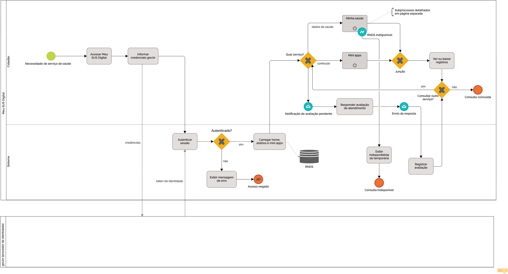
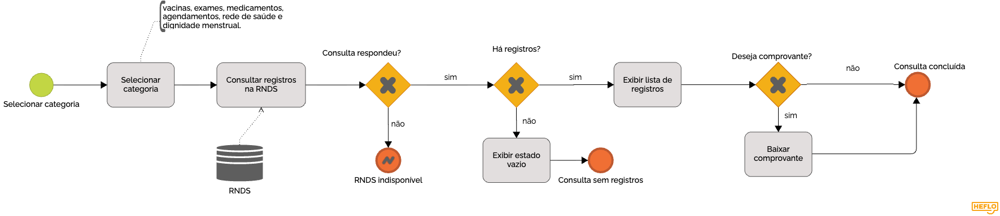
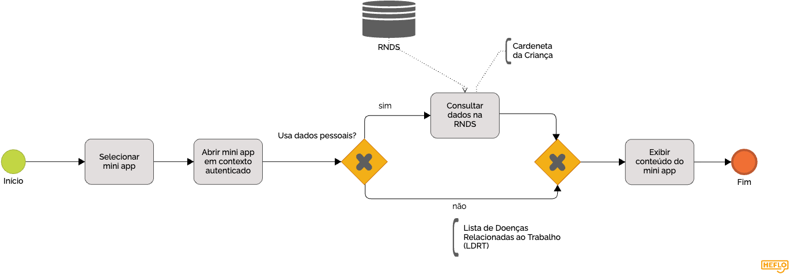

# SubEquipe_02
## Focos do Relatório:
### FOCO_01: Artefatos Generalistas & NFR Framework
#### Participantes no Foco_01
| Nome do Membro |
|   --- |
| Ana Beatriz Souza Araujo |
| Gustavo Gomes Fornaciari |

#### Metodologia do Foco_01
Espaço para contar um pouco sobre como ocorreu o trabalho em equipe. Vídeos ajudam aqui.
### Rich Picture

#### Legenda da Rich Picture: 

##### Convenção geral

- **Meu SUS Digital:** elemento central que representa a plataforma e sua interação com os demais componentes do ecossistema.
- **Setas:** representam as trocas de informações, serviços e dados entre os elementos.
- **Balões de pensamento:** representam preocupações e dificuldades relacionadas às interações com o sistema.
- **Espadas cruzadas:** representam conflitos ou dificuldades presentes no contexto analisado.

##### Atores e elementos representados

| Elemento | Representação na Rich Picture |
| --- | --- |
| **Cidadão** | Usuário que busca realizar uma demanda de saúde por meio do Meu SUS Digital. |
| **Gestão do SUS** | Responsável pela disponibilização e gestão das vagas de atendimento. |
| **RNDS** | Camada de integração e compartilhamento dos dados de saúde. |
| **Laboratório** | Origem de resultados e laudos de exames disponibilizados ao cidadão. |
| **Sala de Vacinação** | Ponto de registro das doses aplicadas e envio das informações à RNDS. |
| **UBS** | Unidade de atendimento presencial utilizada pelo cidadão quando a demanda não é resolvida digitalmente. |
| **Profissional da Saúde** | Representa o atendimento realizado na unidade de saúde. |
| **Meu SUS Digital** | Plataforma que reúne serviços e informações de saúde, representada pelos ícones de **Agendamento, Vacinação e Exames/Laudos**. |

##### Preocupações representadas

| Elemento | Preocupação |
| --- | --- |
| **Cidadão** | Dificuldade para realizar sua demanda de forma digital e necessidade de recorrer ao atendimento presencial. |
| **Gestão do SUS** | Restrição da quantidade de vagas disponibilizadas pela plataforma, podendo gerar dificuldade de acesso ao atendimento. |
| **Equipe de saúde** | Necessidade de atender presencialmente demandas que não foram resolvidas pelo meio digital. |

#### Embasamento teórico para criação

1. MONK, Andrew; HOWARD, Steve. The rich picture: a tool for reasoning about work context. *Interactions*, New York, v. 5, n. 2, p. 21-30, mar./abr. 1998.

### NFR Framework

#### Legenda do SIG

#### Tipos de Elementos

* **Nuvem de Borda Fina (Softgoal / Sub-Softgoal):** Representa os objetivos de qualidade e requisitos não funcionais do sistema (ex.: *Facilidade de Navegação*, *Privacidade e Segurança*).
* **Nuvem de Borda Grossa (Operacionalização):** Representa as soluções técnicas, escolhas de arquitetura ou funcionalidades implementadas (ex.: *Criptografia e Mascaramento de Dados*, *Chamada API Externa*).
* **Nuvem Tracejada (Claim / Justificativa):** Representa argumentos ou justificativas que esclarecem a motivação de uma escolha de projeto.

---

#### Tipos de Impacto e Contribuição

| Símbolo | Conceito | Descrição / Impacto |
| :---: | :---: | :--- |
| **`++`** | **Make** | Contribuição positiva forte: a solução técnica atende e garante o requisito. |
| **`+`** | **Help** | Contribuição positiva parcial: a solução ajuda a alcançar o requisito. |
| **`-`** | **Hurt** | Contribuição negativa parcial: a solução prejudica levemente o requisito (ex.: gera latência no tempo de resposta). |
| **`--`** | **Break** | Contribuição negativa forte: a solução compromete severamente o requisito (ex.: gera riscos de exposição de dados). |
| **Linha Contínua** | **Decomposição** | Conexão hierárquica que detalha um requisito geral em sub-requisitos ou operacionalizações. |
| **Linha Tracejada** | **Impacto / Relação Indireta** | Conecta justificativas (*Claims*) aos elementos ou indica impactos e riscos colaterais detectados. |

### FOCO_02: Engenharia Reversa & Modelagem BPMN
### Participantes no Foco_02
| Nome do Membro |
| --- |
| Victor Leandro Rocha de Assis |

### O sistema analisado

O **Meu SUS Digital** é a plataforma do Ministério da Saúde que reúne, em um único ponto de acesso, os serviços digitais de saúde do cidadão: carteira de vacinação, resultados de exames, medicamentos, agendamentos, busca por unidades da rede de saúde e conteúdos informativos.

A Engenharia Reversa revelou que a plataforma **não é a dona dos dados que exibe**: ela funciona como camada de apresentação sobre dois sistemas externos.

| Sistema externo | Papel no Meu SUS Digital | Efeito observado |
| :--- | :--- | :--- |
| **gov.br** | Provedor de identidade: toda a autenticação é delegada a ele | Nenhum serviço personalizado abre sem o login único; a plataforma recebe um token de identidade e monta a sessão a partir dele |
| **RNDS** (Rede Nacional de Dados em Saúde) | Origem dos dados de saúde do cidadão | Os registros exibidos vêm de consulta à base nacional, e a indisponibilidade dela derruba a consulta mesmo com a sessão válida |

Essa dependência é a característica arquitetural mais relevante encontrada: o Meu SUS Digital **agrega e apresenta**, mas a identidade e o dado clínico moram fora dele.

### Como o sistema se comporta

O modelo BPMN abaixo descreve o percurso do cidadão. As três seções seguintes leem o que cada diagrama diz sobre o funcionamento da plataforma.

#### Fluxo geral: da necessidade de saúde à conclusão da consulta

O diagrama separa o que a pessoa faz (raia `Cidadão`) do que a plataforma executa (raia `Sistema`), e mantém o gov.br em piscina própria e fechada, porque seu processamento interno não é visível de fora: só se observam as mensagens `credenciais` e `token de identidade`.

O que o fluxo mostra sobre o sistema:

| Trecho do diagrama | O que revela sobre o Meu SUS Digital |
| :--- | :--- |
| `Informar credenciais gov.br` → `Autenticar sessão` → `Autenticado?` | A plataforma não tem cadastro próprio: a decisão de acesso depende inteiramente do provedor de identidade. Sem token válido o processo termina em `Acesso negado`. |
| `Carregar home, atalhos e mini apps`, associada à `RNDS` | A home é montada **depois** da sessão: atalhos e mini apps são personalizados, e a plataforma já consulta a base nacional nesse momento. |
| `Qual serviço?`, com os caminhos `dados de saúde` e `conteúdo` | A home organiza dois tipos de serviço com naturezas diferentes: os que expõem o histórico clínico da pessoa e os que entregam conteúdo. |
| `RNDS indisponível` (evento de borda) → `Exibir indisponibilidade temporária` | A falha da base nacional é um estado real do sistema, não uma exceção rara: o app trata a indisponibilidade com mensagem própria, em vez de erro genérico. |
| `Notificação de avaliação pendente` → `Responder avaliação de atendimento` → `Registrar avaliação` | A avaliação do atendimento é **iniciada pela plataforma**, por notificação, e não é uma opção que o cidadão procura no menu. |
| `Consultar outro serviço?`, com retorno a `Qual serviço?` | A sessão é reaproveitada: consultar vários serviços seguidos não exige novo login, o que caracteriza a plataforma como um agregador de serviços e não como um aplicativo de tarefa única. |

#### Consulta aos dados de saúde ("Minha saúde")

Este é o ramo que expõe o histórico clínico. As categorias encontradas foram vacinas, exames, medicamentos, agendamentos, rede de saúde e dignidade menstrual, todas seguem o **mesmo padrão de comportamento**, o que indica uma tela genérica de listagem parametrizada pela categoria, e não seis funcionalidades independentes.

Os três pontos de decisão mostram como o sistema distingue situações que o usuário poderia confundir:

| Situação | Como o sistema responde |
| :--- | :--- |
| A RNDS não respondeu | Mensagem de indisponibilidade: o problema é da integração, e os dados podem existir |
| A RNDS respondeu, mas não há registros na categoria | Estado vazio: a consulta funcionou e a pessoa realmente não tem registro ali |
| Há registros | Lista exibida e, nas categorias que têm valor legal (ex.: certificado de vacinação), o download do comprovante fica disponível como passo opcional |

A separação entre **falha** e **ausência de dado** é uma decisão de projeto relevante: em saúde, "não consegui consultar" e "você não tem esse registro" têm consequências muito diferentes para o cidadão.

#### Serviços de conteúdo ("Mini apps")

Os mini apps são módulos abertos dentro da sessão autenticada, e o gateway `Usa dados pessoais?` expõe que eles **não são todos iguais**:

- **Caderneta da Criança**: consulta a RNDS, porque depende do histórico de uma pessoa específica.
- **Lista de Doenças Relacionadas ao Trabalho (LDRT)**: conteúdo de referência, igual para qualquer usuário, sem consulta a dado pessoal.

Ambos os caminhos convergem antes de `Exibir conteúdo do mini app`, ou seja, do ponto de vista de quem usa, os dois tipos se apresentam da mesma forma — a diferença de sensibilidade dos dados fica invisível na interface, ainda que exista na arquitetura.

### Método e evolução do artefato

O método de Engenharia Reversa aplicado, as decisões de notação e a evolução do modelo entre as versões estão registrados na página [BPMN](/DesenhoDeSoftware/Relatórios/1.1.2.SubEquipe_02/BPMN.md).

### FOCO_03: IA Generativa

Entrega Mínima: pontos de vista de cada membro da equipe sobre as lições aprendidas e uso da IA Generativa.
TODOS DEVEM PARTICIPAR!

### Participantes no Foco_03

---

| Nome do Membro | Contribuição | Data |
| -- | -- | -- |
| [Gustavo Fornaciari](https://github.com/GUGOFO) | Criação do Repositorio | 17/08/2026 |
| [Gustavo Fornaciari](https://github.com/GUGOFO) | Adicionando SIG versão 1 | 27/08/2026 |
| [Ana Beatriz](https://github.com/AnnaBeatrizAraujo) | Adicionando o Rich Picture e a legenda | 27/08/2026 |
| [Victor Leandro](https://github.com/Afrontoso) | Engenharia Reversa do Meu SUS Digital e modelagem BPMN | 28/08/2026 |