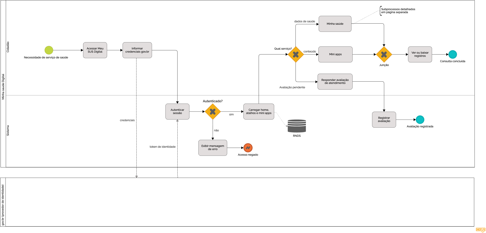

# BPMN

Esta página registra **como** o BPMN do Meu SUS Digital foi produzido: o método de Engenharia Reversa aplicado, as decisões de notação tomadas e a evolução do artefato entre as versões.

O modelo em si, com a leitura de cada fluxo do sistema, está no relatório da subequipe: [1.1.2. SubEquipe_02](/DesenhoDeSoftware/Relatórios/1.1.2.SubEquipe_02.md).

### Participantes
| Nome do Membro |
| :--- |
| [Victor Leandro](https://github.com/Afrontoso) |

---

## Metodologia

### Abordagem escolhida

O Meu SUS Digital é um sistema de governo em produção: não há código-fonte publicado, documentação de arquitetura ou manual técnico disponíveis. Isso descarta a análise estática e deixa como caminho viável a **análise comportamental (caixa-preta)**, em que o sistema é observado de fora, pelo que ele apresenta ao usuário, e o processo é reconstruído a partir desse comportamento.

O objetivo, seguindo a taxonomia de Chikofsky e Cross (1990), foi **elevar o nível de abstração**: sair das telas concretas (baixo nível) e chegar a um modelo de processo (alto nível) que descreva o que o sistema faz, independentemente de como as telas estão organizadas.

### Ferramenta

O modelo foi desenhado no [HEFLO](https://www.heflo.com/), escolhido por dar suporte nativo aos elementos de BPMN 2.0 necessários ao modelo, piscinas e raias, fluxo de mensagem entre piscinas, gateways exclusivos, eventos intermediários de mensagem, eventos de borda de erro, subprocessos colapsados com página própria e depósito de dados, sem precisar improvisar formas genéricas, como aconteceria em uma ferramenta de desenho livre.

## Processo de Engenharia Reversa Aplicado

### Etapas do trabalho

| Etapa | O que foi feito | Decisão tomada |
| :--- | :--- | :--- |
| 1. Delimitação do escopo | Escolha do percurso a modelar: da necessidade de saúde do cidadão até a conclusão de uma consulta de registros | Modelar o fluxo geral de acesso aos serviços, e não um serviço isolado, para que o modelo mostre a estrutura da plataforma |
| 2. Exploração do sistema | Navegação no Meu SUS Digital autenticado com conta gov.br, percorrendo os serviços da home | Explorar também os caminhos que não dão certo (login inválido, categoria sem registros, falha de consulta), não só o caminho feliz |
| 3. Registro das telas | Cada passo percorrido foi anotado: o que o usuário faz, o que o sistema responde e de onde parece vir o dado | Separar desde o registro o que é ação do cidadão e o que é resposta do sistema, o que depois virou a divisão em raias |
| 4. Abstração para BPMN | Tradução das telas em elementos da notação: ações do usuário viram atividades, respostas do sistema viram atividades da raia `Sistema`, pontos de escolha viram gateways | Nomear toda atividade com verbo no infinitivo e todo gateway com pergunta explícita, conforme o padrão da disciplina |
| 5. Decomposição | Os dois grandes ramos da home (`Minha saúde` e `Mini apps`) foram extraídos como subprocessos em páginas próprias | Manter o diagrama principal legível: o processo principal mostra a estrutura, os subprocessos mostram o detalhe |
| 6. Revisão da notação | Conferência do modelo contra a especificação BPMN 2.0 e os exemplos da disciplina | Correções de notação aplicadas na v2 (ver histórico abaixo) |

## Modelagem BPMN

Os três diagramas produzidos, com a leitura do que cada fluxo revela sobre o Meu SUS Digital, estão no relatório da subequipe: [1.1.2. SubEquipe_02](/DesenhoDeSoftware/Relatórios/1.1.2.SubEquipe_02.md). As versões do artefato estão no histórico ao final desta página.

### Decisões de notação

| Decisão | Justificativa |
| :--- | :--- |
| Duas raias (`Cidadão` e `Sistema`) dentro da piscina `Meu SUS Digital` | Separa responsabilidades genuinamente distintas: o que a pessoa faz e o que a plataforma executa. Não há duplicação espelhada de passos entre as raias. |
| gov.br em **piscina separada e fechada** (*black box*) | O provedor de identidade é outro participante, e seu processo interno não é observável pela Engenharia Reversa: só se conhecem as mensagens trocadas (`credenciais`, `token de identidade`). |
| Fluxo de mensagem (tracejado) entre as piscinas | Exigência da especificação: entre piscinas distintas só há fluxo de mensagem; fluxo de sequência vale apenas dentro de uma mesma piscina. |
| Subprocessos colapsados em vez de um único diagrama | Decomposição hierárquica prevista na BPMN 2.0, usada para preservar a legibilidade do processo principal. |
| Caminhos de exceção modelados explicitamente | Um modelo só com o caminho feliz esconderia comportamentos reais do sistema (falha da RNDS, categoria sem registros). |

## Embasamento teórico para criação

1. CHIKOFSKY, Elliot J.; CROSS, James H. Reverse engineering and design recovery: a taxonomy. *IEEE Software*, Los Alamitos, v. 7, n. 1, p. 13-17, jan. 1990. (Define Engenharia Reversa como o processo de analisar um sistema para identificar seus componentes e criar representações em um nível mais alto de abstração.)
2. OBJECT MANAGEMENT GROUP (OMG). *Business Process Model and Notation (BPMN), Version 2.0*. Needham: OMG, 2011. Disponível em: https://www.omg.org/spec/BPMN/2.0/.
3. SERRANO, Milene. *Arquitetura e Desenho de Software - Aula: Notação BPMN*. Gama: FGA/UnB, 2026. (Padrão de modelagem seguido: atividades com verbo no infinitivo, gateways com pergunta explícita e raias por responsabilidade.)

---

## Histórico de Versionamento

### Versão 1.0 (v1)

#### Quem fez a versão
- [Victor Leandro](https://github.com/Afrontoso)

#### O que mudou da versão anterior
- Primeira modelagem do fluxo do Meu SUS Digital a partir da Engenharia Reversa: piscinas `Minha saude Digital` (raias `Cidadão` e `Sistema`) e `gov.br (provedor de identidade)`, fluxo de autenticação, bifurcação por tipo de serviço e depósito de dados `RNDS`.

#### Limitações identificadas nesta versão
- Só o caminho feliz estava modelado: nenhuma falha de consulta era representada.
- `Minha saúde` e `Mini apps` apareciam como atividades comuns, sem o marcador de subprocesso, apesar da anotação já prometer detalhamento em página separada.
- A avaliação de atendimento saía do gateway `Qual serviço?`, como se fosse uma opção escolhida pelo cidadão na home.
- O processo terminava sem representar o reuso da sessão para consultar outro serviço.

---

### Versão 2.0 (v2)

#### Quem fez a versão
- [Victor Leandro](https://github.com/Afrontoso)
- [Ana Beatriz](https://github.com/AnnaBeatrizAraujo) 
- [Gustavo Fornaciari](https://github.com/GUGOFO)

#### O que mudou da versão anterior

| # | Mudança | Motivo |
| :--- | :--- | :--- |
| 1 | Piscina renomeada de `Minha saude Digital` para `Meu SUS Digital` | Correção do nome oficial do sistema analisado. |
| 2 | `Minha saúde` e `Mini apps` passaram a subprocessos colapsados (marcador `+`), com diagramas próprios | Torna a decomposição explícita na notação, e não apenas prometida em anotação de texto. |
| 3 | Inclusão do evento de borda de erro `RNDS indisponível`, com desvio para `Exibir indisponibilidade temporária` → `Consulta indisponível` | A falha de integração observada durante a exploração era um caminho real que a v1 não representava. |
| 4 | Avaliação de atendimento remodelada: de caminho do gateway `Qual serviço?` (rótulo `Avaliação pendente`) para eventos intermediários de mensagem `Notificação de avaliação pendente` e `Envio da resposta` | A avaliação não é uma escolha do cidadão na home, e sim uma notificação disparada pelo sistema; o evento de mensagem representa isso corretamente. |
| 5 | O fluxo da avaliação deixou de terminar em `Avaliação registrada` e passou a retornar ao processo, após `Registrar avaliação` | Na v1 a avaliação era um beco sem saída; na prática o cidadão continua usando o app depois de avaliar. |
| 6 | Inclusão do gateway `Consultar outro serviço?`, com laço de retorno para `Qual serviço?` | Representa o ciclo observado: consultar vários serviços na mesma sessão, sem refazer o login. |
| 7 | Correção dos eventos de fim (`Consulta concluída` em círculo de borda grossa) | Na v1 os círculos de encerramento estavam com a marcação de evento intermediário, incorreta para um ponto final do processo. |
| 8 | Gateways de exceção criados dentro dos subprocessos (`Consulta respondeu?`, `Há registros?`, `Deseja comprovante?`, `Usa dados pessoais?`) e anotações com as categorias e os exemplos de mini apps | Tornam visíveis distinções que a v1 não fazia: erro de integração x ausência de dados, e mini apps que consomem a RNDS x conteúdo estático. |

---

| Nome do Membro | Contribuição | Data | Commit |
| -- | -- | -- | -- |
| [Gustavo Fornaciari](https://github.com/GUGOFO) | Criação do Repositorio | 17/08/2026 | [16f12f9](https://github.com/UnBArqDsw2026-2-Turma01/2026.2-T01-_G5_ProjetoGovernoEletronico_Entrega_01/tree/16f12f934a85996e1045dc30a5bf5ce656c91e1a) |
| [Victor Leandro](https://github.com/Afrontoso) | Primeira versao do BPMN | 27/08/2026 | [3b7d92d](https://github.com/UnBArqDsw2026-2-Turma01/2026.2-T01-_G5_ProjetoGovernoEletronico_Entrega_01/tree/3b7d92d01a0b5785be0c526696a4d3bc18423427) |
| [Victor Leandro](https://github.com/Afrontoso), [Ana Beatriz](https://github.com/AnnaBeatrizAraujo) e [Gustavo Fornaciari](https://github.com/GUGOFO) | Segunda versão do BPMN: subprocessos, caminhos de exceção, ciclo de avaliação e correções de notação | 28/08/2026 | [54ff343](https://github.com/UnBArqDsw2026-2-Turma01/2026.2-T01-_G5_ProjetoGovernoEletronico_Entrega_01/tree/54ff34344982474d622259624f86dc923608f649) |
