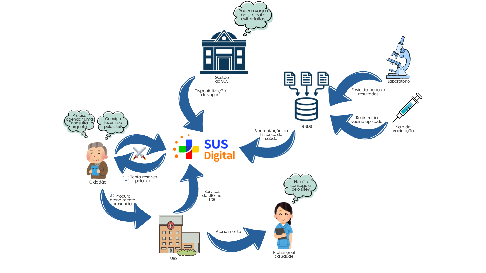
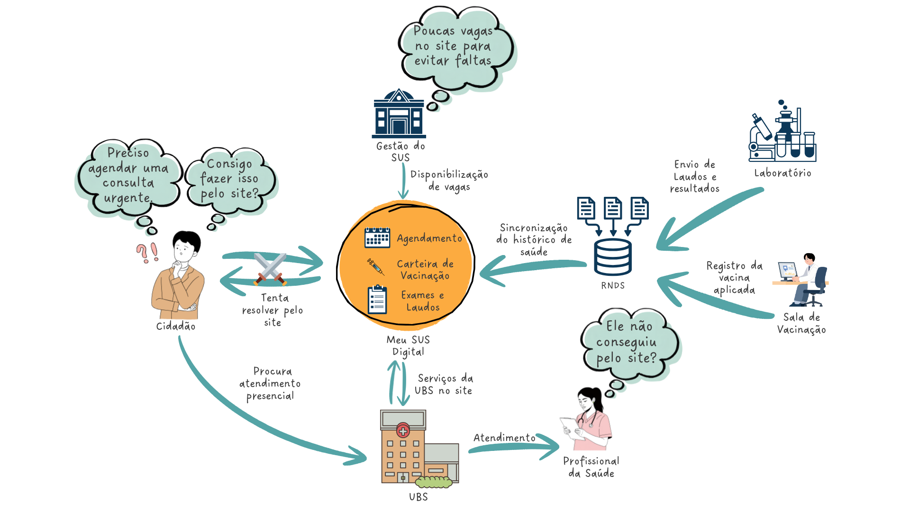

# Rich Picture

Nesta seção, apresenta-se a versão finalizada do **Rich Picture**, que ilustra o contexto, atores, sistemas envolvidos, fluxos de informação e principais preocupações do sistema.

### Legenda e Descrição do Rich Picture

##### Convenção geral

- **Meu SUS Digital:** elemento central que representa a plataforma e sua interação com os demais componentes do ecossistema.
- **Setas:** representam as trocas de informações, serviços e dados entre os elementos.
- **Balões de pensamento:** representam preocupações e dificuldades relacionadas às interações com o sistema.
- **Espadas cruzadas:** representam conflitos ou dificuldades presentes no contexto analisado.
- **Numeração:** representa a sequência do fluxo principal de atendimento analisado. Primeiro, o cidadão tenta realizar sua demanda por meio do Meu SUS Digital, utilizando os serviços digitais disponíveis. Quando não consegue resolver sua demanda pelo meio digital, ele recorre à UBS para buscar atendimento presencial. Dessa forma, a numeração evidencia a passagem do atendimento digital para o atendimento presencial quando o primeiro não atende à necessidade do cidadão.

##### Atores e elementos representados

| Elemento | Representação na Rich Picture |
| --- | --- |
| **Cidadão** | Usuário que busca realizar uma demanda de saúde por meio do Meu SUS Digital. |
| **Gestão do SUS** | Responsável pela disponibilização e gestão das vagas de atendimento. |
| **RNDS** | Camada de integração e compartilhamento dos dados de saúde. |
| **Laboratório** | Origem de resultados e laudos de exames disponibilizados ao cidadão. |
| **Sala de Vacinação** | Ponto de registro das doses aplicadas e envio das informações à RNDS. |
| **UBS** | Unidade de atendimento presencial utilizada pelo cidadão quando a demanda não é resolvida digitalmente. |
| **Profissional da Saúde** | Representa o atendimento realizado na unidade de saúde. |
| **Meu SUS Digital** | Plataforma que reúne serviços e informações de saúde, representada pelos ícones de **Agendamento, Vacinação e Exames/Laudos**. |

##### Preocupações representadas

| Elemento | Preocupação |
| --- | --- |
| **Cidadão** | Dificuldade para realizar sua demanda de forma digital e necessidade de recorrer ao atendimento presencial. |
| **Gestão do SUS** | Restrição da quantidade de vagas disponibilizadas pela plataforma, podendo gerar dificuldade de acesso ao atendimento. |
| **Equipe de saúde** | Necessidade de atender presencialmente demandas que não foram resolvidas pelo meio digital. |

#### Embasamento teórico para criação

1. MONK, Andrew; HOWARD, Steve. The rich picture: a tool for reasoning about work context. *Interactions*, New York, v. 5, n. 2, p. 21-30, mar./abr. 1998.

---

### Participantes
| Nome do Membro |
| :--- |
| [Ana Beatriz](https://github.com/AnnaBeatrizAraujo) |

### Metodologia

O trabalho foi realizado em conjunto pela equipe, com discussões sobre quais elementos e relações deveriam aparecer na Rich Picture. A partir dessas discussões, foi criada uma primeira versão do desenho. Depois, a equipe revisou a representação e recebeu feedback sobre a organização dos elementos, os fluxos e a clareza das relações apresentadas. Esses feedbacks ajudaram a identificar alguns pontos que precisavam ser ajustados. A partir dessas observações, foram feitas alterações no desenho até chegar à versão final apresentada no relatório. A validação foi feita principalmente por meio da revisão e discussão da representação entre os integrantes da equipe, verificando se o desenho estava de acordo com o contexto que queríamos representar.

## Histórico de Versionamento

### Versão 1.0 (v1)

#### Quem fez a versão
- [Ana Beatriz](https://github.com/AnnaBeatrizAraujo)

#### O que mudou da versão anterior
- Criação inicial do documento de Artefatos Generalistas e definição do escopo do Rich Picture.

---

### Versão 2.0 (v2)

#### Quem fez a versão

- [Ana Beatriz](https://github.com/AnnaBeatrizAraujo) 
- [Gustavo Fornaciari](https://github.com/GUGOFO)
- [Victor Leandro](https://github.com/Afrontoso)

#### O que mudou da versão anterior
- Melhoria do Rich Picture utilizando nova fonte, setas maiores, novo estilo padronizado e numeração.

---

| Nome do Membro | Contribuição | Data | Commit |
| :--- | :--- | :--- | :--- |
| [Gustavo Fornaciari](https://github.com/GUGOFO) | Criação do Repositorio | 17/08/2026 | [16f12f9](https://github.com/UnBArqDsw2026-2-Turma01/2026.2-T01-_G5_ProjetoGovernoEletronico_Entrega_01/tree/16f12f934a85996e1045dc30a5bf5ce656c91e1a) |
| [Ana Beatriz](https://github.com/AnnaBeatrizAraujo) | Adicionando o Rich Picture e a legenda | 27/08/2026 | [9b56286](https://github.com/UnBArqDsw2026-2-Turma01/2026.2-T01-_G5_ProjetoGovernoEletronico_Entrega_01/tree/9b562860382f2c3c6bf83f8c0f92bfdaf3939a58) |
| [Ana Beatriz](https://github.com/AnnaBeatrizAraujo), [Gustavo Fornaciari](https://github.com/GUGOFO) e [Victor Leandro](https://github.com/Afrontoso) | Adicionando segunda versão do Rich Picture | 27/08/2026 | [5468d1c](https://github.com/UnBArqDsw2026-2-Turma01/2026.2-T01-_G5_ProjetoGovernoEletronico_Entrega_01/tree/5468d1cf08d365502b6271cd7b52297abb961a01) |