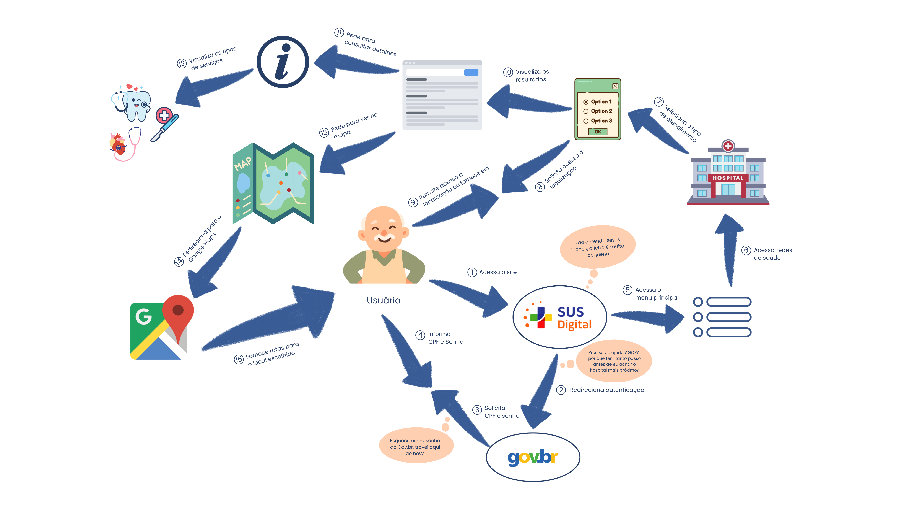
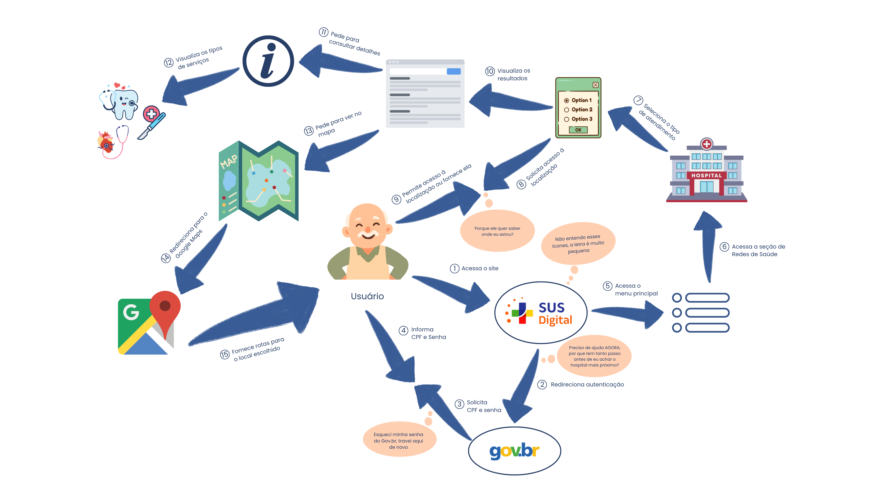
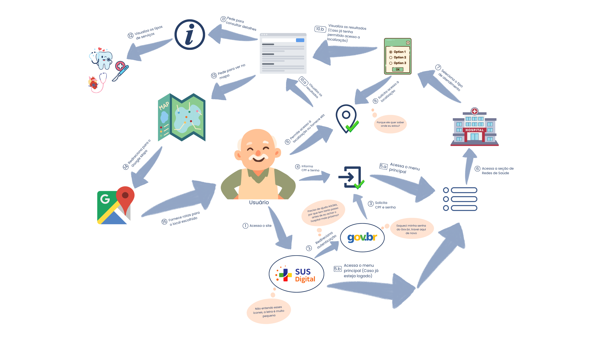
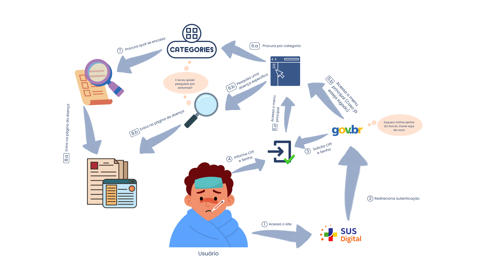

# Rich Picture - Foco_01

## Participantes do artefato

| Nome do Membro            |
| ------------------------- |
| Yasmim de Souza Santos    |
| Davi Ursulino de Oliveira |
| Gabriel Mota Oliveira     |

## Metodologia da Rich Picture

O trabalho foi dividido em duas etapas principais: criação e revisão.

Na etapa de criação, com base no fluxo de busca por uma rede de saúde já levantado na fase de Engenharia Reversa (do login via gov.br até a obtenção de rotas no Google Maps), Yasmim de Souza Santos elaborou a primeira versão do rich picture na ferramenta Canva. As 15 interações identificadas foram representadas por meio de setas numeradas, e um usuário idoso foi escolhido como personagem central para evidenciar barreiras de usabilidade associadas a um perfil de baixo letramento digital. Em seguida, Yasmim também redigiu a metodologia e a contextualização do artefato produzido.

Na etapa de revisão, Davi Ursulino de Oliveira analisou o artefato de forma crítica e propôs a inclusão de um novo balão de preocupação sobre a falta de transparência na solicitação de geolocalização, ajuste posteriormente incorporado por ele mesmo em uma nova versão da Rich Picture. A partir dessa revisão, Gabriel Mota Oliveira produziu a Versão 2 do artefato, documentando as mudanças realizadas e atualizando a legenda, e, em uma revisão subsequente, ajustou o tamanho do usuário principal e corrigiu a legenda. Por fim, Yasmim de Souza Santos adicionou o versionamento das Rich Pictures ao documento, de modo a garantir a rastreabilidade das alterações entre as versões.

Essa dinâmica de criação individual seguida de revisão colaborativa assíncrona está registrada, com as respectivas datas e commits, na tabela de contribuições ao final deste documento.

## O que é uma Rich Picture

Rich picture (ou "imagem rica") é uma técnica de representação informal, originada na Soft Systems Methodology (SSM) de Peter Checkland, usada para retratar de forma visual e holística uma situação-problema antes de qualquer tentativa de solução técnica. Diferente de fluxogramas ou diagramas UML, ela não segue uma notação formal: combina desenhos, ícones, setas e balões de fala/pensamento para capturar não só o processo (o que acontece, em que ordem), mas também os atores envolvidos, o ambiente em que atuam e — principalmente — as preocupações, conflitos e percepções subjetivas que cada um tem sobre a situação.

Essa liberdade de notação é proposital: o objetivo não é documentar um sistema com precisão técnica, mas construir um entendimento compartilhado sobre um contexto complexo, incluindo aspectos "soft" (humanos, sociais, emocionais) que dificilmente apareceriam em um diagrama estruturado.

Elementos comuns a uma rich picture:

- **Atores:** bonecos ou ícones de pessoas representando quem participa da situação;
- **Setas:** indicam fluxos, comunicação ou sequência de ações entre os atores e o sistema;
- **Balões de fala/pensamento (nuvens):** expressam preocupações, dúvidas ou sentimentos — os chamados _concerns_;
- **Ícones e desenhos simples:** substituem caixas e formas geométricas padronizadas, tornando o artefato mais próximo de um esboço do que de um diagrama técnico;
- **Ausência de sintaxe fixa:** o mesmo elemento pode ser desenhado de formas diferentes por autores diferentes, desde que o significado fique claro para quem lê.

Neste artefato, a técnica foi usada para representar o fluxo de busca por uma rede de saúde no Meu SUS Digital sob a ótica de um usuário idoso, evidenciando — por meio dos balões de pensamento, os pontos de fricção de usabilidade percebidos em cada etapa, algo que um fluxograma tradicional, focado apenas na sequência de telas, não capturaria. As referências teóricas utilizadas na construção estão detalhadas na seção "Embasamento teórico para criação", ao final deste documento.

## Rich Picture - Fluxo Rede de Saude

### Versão inicial

**Autoria: Yasmim de Souza**

**Legenda da Rich Picture:** Fluxo de Busca de Rede Credenciada no Meu SUS Digital - Versão 1.0

Estrutura inicial do Rich Picture: a jornada do usuário é descrita por meio de uma sequência cronológica de 15 interações numeradas que mapeiam o percurso desde o login inicial via Gov.br até a navegação final para obtenção de rotas no Google Maps. O protagonismo da jornada é atribuído a um usuário idoso, escolhido estrategicamente para evidenciar as barreiras de usabilidade enfrentadas por perfis de baixo letramento digital, enquanto balões de fala expressam preocupações (concerns) reais vivenciadas ao longo do processo, como entraves na autenticação de senhas, excesso de passos intermediários, dificuldades de leitura de ícones e receios sobre o compartilhamento de localização, explicitando visualmente os gargalos de acessibilidade que impactam a experiência e a autonomia do cidadão na busca por atendimento em saúde.

### Versão 1.1

**Autoria: Davi Ursulino**

**Legenda da Rich Picture:** Fluxo de Busca de Rede Credenciada no Meu SUS Digital - Versão 1.1

Arquivo editável: [Rich Picture Usabilidade - V1](https://canva.link/5nzidpjb7mkkt9k)

A estrutura inicial foi mantida, e foi acrescido um balão de preocupação sobre a falta de transparência na solicitação de geolocalização, evidenciando a necessidade de maior clareza e comunicação sobre o uso de dados sensíveis, especialmente para usuários com baixo letramento digital.

### Versão 2.0 - Final

**Autoria: Gabriel Mota**

**Legenda da Rich Picture:** Fluxo de Busca de Rede Credenciada no Meu SUS Digital - Versão Final

Arquivo editável: [Rich Picture Usabilidade - V2](https://canva.link/2kcko4c4ml3u3k1)

A estrutura de bolhas e relacionamentos foi mantida, e os "elos perdidos", representados pela colisão das setas _3 e 4_, e _8 e 9_, foram adicionados para deixar a leitura mais fluida. as setas _5_ e _10_ receberam uma subdvisão (_x.a/x.b_) com o intuito de indicar caminhos alternativos para um mesmo destino. Além disso, uma leve reorganização das bolhas foi feita para poder acomodar melhor as mudanças anteriores.

#### Convenção geral:

- **Setas numeradas (1-15):** sequência cronológica de interações entre o usuário e o sistema, do login até a obtenção da rota até o atendimento.
<!-- TODO: Não sei se o termo "letradas" é um bom indicativo da qualidade do meu portugues, caso seja encontrado uma palavra melhor trocar por favor, eu insisto -->
- **Setas letradas (x.a/x.b):** sequência alternativa de interações que levam para um mesmo destino/resultado.
- **Balões de fala (nuvens):** preocupações de usabilidade (concerns) expressas pelo usuário em cada etapa do fluxo.
- **Personagem central:** usuário idoso, escolhido propositalmente para evidenciar barreiras de usabilidade em um perfil de baixo letramento digital.

#### Sequência de interações

| Nº  | Ação                                        | Descrição                                                                               |
| --- | ------------------------------------------- | --------------------------------------------------------------------------------------- |
| 1   | Acessa o site                               | Usuário entra na plataforma Meu SUS Digital                                             |
| 2   | Redireciona autenticação                    | Sistema encaminha o usuário para o login via gov.br                                     |
| 3   | Solicita CPF e senha                        | gov.br pede as credenciais                                                              |
| 4   | Informa CPF e Senha                         | Usuário preenche os dados de login                                                      |
| 5   | Acessa o menu principal                     | Usuário retorna à plataforma já autenticado                                             |
| 6   | Acessa redes de saúde                       | Usuário navega até a seção de busca de estabelecimentos                                 |
| 7   | Seleciona o tipo de atendimento             | Usuário escolhe a categoria de necessidade (emergência, maternidade, especialista etc.) |
| 8   | Solicita acesso à localização               | Sistema pede permissão de geolocalização                                                |
| 9   | Permite acesso à localização ou fornece ela | Usuário autoriza o uso do GPS ou digita o endereço manualmente                          |
| 10  | Visualiza os resultados                     | Lista de estabelecimentos compatíveis é exibida                                         |
| 11  | Pede para consultar detalhes                | Usuário solicita mais informações sobre um resultado                                    |
| 12  | Visualiza os tipos de serviços              | Detalhamento das especialidades/serviços oferecidos pelo estabelecimento                |
| 13  | Pede para ver no mapa                       | Usuário solicita visualização geográfica do local                                       |
| 14  | Redireciona para o Google Maps              | Sistema integra com aplicativo externo de mapas                                         |
| 15  | Fornece rotas para o local escolhido        | Google Maps entrega o trajeto até o estabelecimento                                     |

#### Preocupações de usabilidade (balões de pensamento)

| Preocupação                                                                                    | Onde                                                       | Problema de usabilidade evidenciado                                                                                                                                                                                 |
| ---------------------------------------------------------------------------------------------- | ---------------------------------------------------------- | ------------------------------------------------------------------------------------------------------------------------------------------------------------------------------------------------------------------- |
| _"Esqueci minha senha do Gov.br, travei aqui de novo"_                                         | Etapa 3 (login)                                            | Falta de prevenção/recuperação de erro; barreira de autenticação para usuários com baixo letramento digital                                                                                                         |
| _"Preciso de ajuda AGORA, por que tem tanto passo antes de eu achar o hospital mais próximo?"_ | Etapa 2 (pós-login)                                        | Baixa eficiência do fluxo em cenários de urgência; excesso de passos para uma tarefa crítica                                                                                                                        |
| _"Não entendo esses ícones, a letra é muito pequena"_                                          | Etapas 7-8 (seleção de atendimento/localização)            | Falta de reconhecimento visual e legibilidade inadequada para público idoso                                                                                                                                         |
| _"Por que ele quer saber onde eu estou?"_                                                      | Etapas 8-9 (solicitação/concessão de acesso à localização) | Falta de transparência sobre o motivo da solicitação de dado sensível (geolocalização); gera desconfiança de privacidade em usuários com baixo letramento digital _(adição: Davi Ursulino de Oliveira, 26/08/2026)_ |

#### Elementos gráficos e seu significado

- **SUS Digital / gov.br:** sistemas envolvidos na autenticação e navegação.
- **Ícone de menu (linhas horizontais):** representa o menu principal da plataforma.
- **Hospital:** representando a seção de Rede de Saúde.
- **Ícone "i" (informação):** tela de detalhes do estabelecimento selecionado.
- **Ícones de dente, coração e cruz médica:** tipos de serviços/especialidades disponíveis (ex.: saúde bucal, cardiologia, emergência).
- **Mapa / Google Maps:** integração externa para visualização geográfica e cálculo de rota.

## Rich Picture - Fluxo Conteudo

### Versão 1.0 - Final

**Autoria: Gabriel Mota**

**Legenda da Rich Picture:** Fluxo de Busca de Conteudos no Meu SUS Digital - Versão Final

Arquivo editável: [Rich Picture Usabilidade - V2](https://canva.link/3vhv5z8zezra9j7)

Estrutura inicial do Rich Picture: a jornada do usuário é descrita por meio de uma sequência cronológica de 8 interações numeradas que mapeiam o percurso desde o login inicial via Gov.br até a navegação final para obtenção de Conteudos no SUS digital. O protagonismo da jornada é atribuído a um usuário com duvidas sobre um doença especifica, escolhido estrategicamente para evidenciar as barreiras de usabilidade de um usuário comum, enquanto balões de fala expressam preocupações (concerns) reais vivenciadas ao longo do processo, como entraves na autenticação de senhas, explicitando visualmente os gargalos de acessibilidade que impactam a experiência e a autonomia do cidadão na busca por atendimento em saúde.

#### Convenção geral:

- **Setas numeradas (1-N):** sequência cronológica de interações entre o usuário e o sistema, do login até a obtenção da rota até o atendimento.
<!-- TODO: Não sei se o termo "letradas" é um bom indicativo da qualidade do meu portugues, caso seja encontrado uma palavra melhor trocar por favor, eu insisto -->
- **Setas letradas (x.a/x.b):** sequência alternativa de interações que levam para um mesmo destino/resultado.
- **Balões de fala (nuvens):** preocupações de usabilidade (concerns) expressas pelo usuário em cada etapa do fluxo.
- **Personagem central:** usuário comum com duvidas.

#### Sequência de interações

| Nº  | Ação                         | Descrição                                           |
| --- | ---------------------------- | --------------------------------------------------- |
| 1   | Acessa o site                | Usuário entra na plataforma Meu SUS Digital         |
| 2   | Redireciona autenticação     | Sistema encaminha o usuário para o login via gov.br |
| 3   | Solicita CPF e senha         | gov.br pede as credenciais                          |
| 4   | Informa CPF e Senha          | Usuário preenche os dados de login                  |
| 5   | Acessa o menu principal      | Usuário retorna à plataforma já autenticado         |
| 6   | Pesquisa o conteudo desejado | Usuário pesquisa pela doença ou categoria de doença |
| 7   | Procura se encaixa           | Usuário verifica se a categoria encaixa na doença   |
| 8   | Entra na página da doença    | Acessa e le o conteudo da doença                    |

#### Preocupações de usabilidade (balões de pensamento)

| Preocupação                                            | Onde               | Problema de usabilidade evidenciado                                                                         |
| ------------------------------------------------------ | ------------------ | ----------------------------------------------------------------------------------------------------------- |
| _"Esqueci minha senha do Gov.br, travei aqui de novo"_ | Etapa 3 (login)    | Falta de prevenção/recuperação de erro; barreira de autenticação para usuários com baixo letramento digital |
| _"E se eu quiser pesquisar por sintomas?"_             | Etapa 6 (pesquisa) | Falta de opções de busca para pessoas que não tem conhecimento imediato da doença                           |

#### Elementos gráficos e seu significado

- **SUS Digital / gov.br:** sistemas envolvidos na autenticação e navegação.
- **Ícone de menu (linhas horizontais):** representa o menu principal da plataforma.
- **Ícone de lupa (pesquisa):** tela de pesquisa de doenças
- **Ícones de categorias (categories):** pesquisa por tipos de categorias de doenças
- **Documentos/paginas:** pagina relativa da doença escohida.

### Embasamento teórico para criação:

1. DE MONTFORT UNIVERSITY. CTEC2402 Software Development Project: introducing rich pictures. Leicester: De Montfort University.
2. MONK, Andrew; HOWARD, Steve. The rich picture: a tool for reasoning about work context. Interactions, New York, v. 5, n. 2, p. 21-30, mar./abr. 1998.
3. SERRANO, Maurício; LEITE, Julio Cesar Sampaio do Prado. A social interaction based pre-traceability for i* models. In: INTERNATIONAL I* WORKSHOP, 5., 2011. CEUR Proceedings of the 5th International i\* Workshop (iStar 2011). [S. l.]: CEUR-WS, 2011. p. 132-137.

---

| Nome do Membro                                               | Contribuição                                                                                                         | Data       | Commit                                                                                                                                                                                                                         |
| ------------------------------------------------------------ | -------------------------------------------------------------------------------------------------------------------- | ---------- | ------------------------------------------------------------------------------------------------------------------------------------------------------------------------------------------------------------------------------ |
| [Gustavo Fornaciari](https://github.com/GUGOFO)              | Criação do Repositorio                                                                                               | 17/08/2026 | [bd89d73](https://github.com/UnBArqDsw2026-2-Turma01/2026.2-T01-_G5_ProjetoGovernoEletronico_Entrega_01/commit/bd89d539a01494091740097d678627ae40bea3b4)                                                                       |
| [Yasmim de Souza Santos](https://github.com/eii-yahs)        | Criação da Rich Picture (Foco_01)                                                                                    | 26/08/2026 | [15a0bd4](https://github.com/UnBArqDsw2026-2-Turma01/2026.2-T01-_G5_ProjetoGovernoEletronico_Entrega_01/commit/15a0bd48098080d4ccb30ff62adddb7065d30900#diff-150f62565e3799f0fc9eb794bca536c4d4c1c9f30c99a9944c4a3d03c25ae62a) |
| [Davi Ursulino de Oliveira](https://github.com/DaviUrsulino) | Revisão da Rich Picture (Foco_01): balão de preocupação sobre geolocalização e nota de fidelidade dos ícones de tela | 27/08/2026 | [ab4ecfe](https://github.com/UnBArqDsw2026-2-Turma01/2026.2-T01-_G5_ProjetoGovernoEletronico_Entrega_01/commit/ab4ecfeb5fabbcb751118cbc5e6853c8adb0b089)                                                                       |
| [Yasmim de Souza Santos](https://github.com/eii-yahs)        | Criação do arquivo separado para o artefato produzido                                                                | 28/08/2026 | [b3ff0bd](https://github.com/UnBArqDsw2026-2-Turma01/2026.2-T01-_G5_ProjetoGovernoEletronico_Entrega_01/commit/b3ff0bd607119ba03d1a7e0f335f0a59f35fe36d)                                                                       |
| [Yasmim de Souza Santos](https://github.com/eii-yahs)        | Adiciona metodologia e contextualização sobre o que é o artefato                                                     | 28/08/2026 | [46d8228](https://github.com/UnBArqDsw2026-2-Turma01/2026.2-T01-_G5_ProjetoGovernoEletronico_Entrega_01/commit/46d822878e6eb6785ee8a3d1a1d4ee72dee9ee5f)                                                                       |
| [Davi Ursulino de Oliveira](https://github.com/DaviUrsulino) | Atualiza a Rich Picture com o balão de preocupação sobre geolocalização proposto na revisão                          | 28/08/2026 | [5926d56](https://github.com/UnBArqDsw2026-2-Turma01/2026.2-T01-_G5_ProjetoGovernoEletronico_Entrega_01/commit/5926d565ca8d294c770681451b0bc1a7be7fcd4d)                                                                       |
| [Gabriel Mota Oliveira](https://github.com/Gabro-MO)         | Adição da Versão 2 da Rich Picture juntamente com a descrição das mudanças e atualização das legendas                | 28/08/2026 | [c336fef](https://github.com/UnBArqDsw2026-2-Turma01/2026.2-T01-_G5_ProjetoGovernoEletronico_Entrega_01/commit/c336fef6be8eadff44b53fba01e699a89bb5c7f8)                                                                       |
| [Gabriel Mota Oliveira](https://github.com/Gabro-MO)         | Aumento do tamanho do usuário principal na Rich Picture V2 e correção da legenda                                     | 28/08/2026 | [09c2cca](https://github.com/UnBArqDsw2026-2-Turma01/2026.2-T01-_G5_ProjetoGovernoEletronico_Entrega_01/commit/09c2ccaf596e22c9cb93ffb0a5127d190fe5899a)                                                                       |
| [Yasmim de Souza Santos](https://github.com/eii-yahs)        | Adiciona versionamento das Rich Pictures para melhor rastreabilidade                                                 | 28/08/2026 | [b29c79a](https://github.com/UnBArqDsw2026-2-Turma01/2026.2-T01-_G5_ProjetoGovernoEletronico_Entrega_01/commit/b29c79ab49c998a204de44370e2e89710192e7a2)                                                                       |
| [Gabriel Mota Oliveira](https://github.com/Gabro-MO)         | Adiciona a Rich Picture do fluxo de conteudos                                                                        | 28/08/2026 | [296b56e](https://github.com/UnBArqDsw2026-2-Turma01/2026.2-T01-_G5_ProjetoGovernoEletronico_Entrega_01/commit/296b56e1f6f716f836e3d6f90e05f5157b4cefa0)                                                                       |
| [Yasmim de Souza Santos](https://github.com/eii-yahs)        | Modifica o arquivo da Rich Picture de conteúdo para remover a marca d'água e padronizar nome dos arquivos de foto | 28/08/2026 | [0322ee4](https://github.com/UnBArqDsw2026-2-Turma01/2026.2-T01-_G5_ProjetoGovernoEletronico_Entrega_01/commit/0322ee405a00f7f340dffd1033aa9ab09e18d594)  |