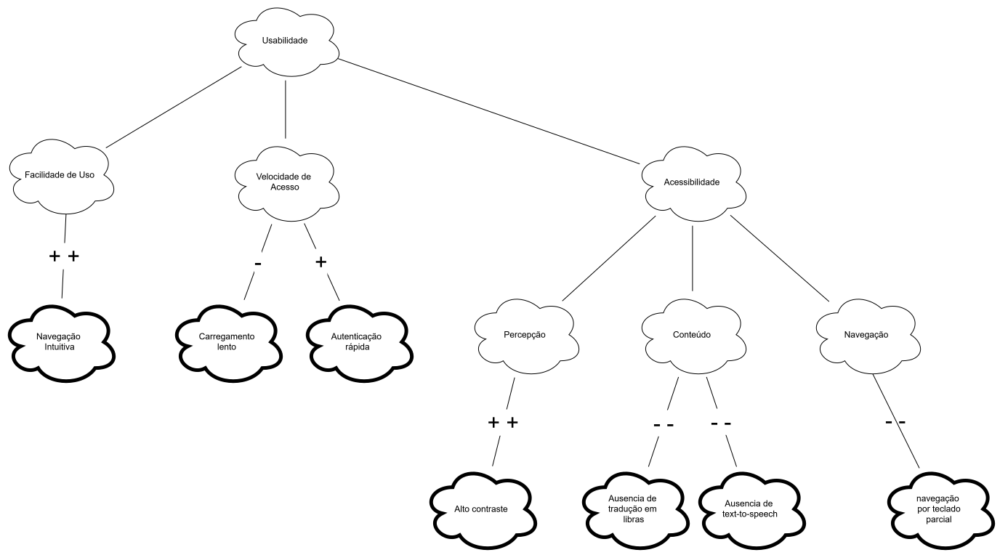

# NFR Framework - Foco_1

## Participantes do artefato

| Nome do Membro            |
| ------------------------- |
| Gabriel Mota Oliveira     |
| Yasmim de Souza Santos    |
| Davi Ursulino de Oliveira |

## Metodologia do NFR/SIG

O trabalho foi dividido em duas etapas principais: criação e revisão.

Na etapa de criação, Gabriel Mota Oliveira elaborou a primeira versão do SIG (Softgoal Interdependency Graph) de Usabilidade, incluindo a legenda da notação do NFR Framework, e complementou o artefato com o embasamento teórico, a justificativa de uso e comentários adicionais sobre as escolhas de modelagem. Posteriormente, Yasmim de Souza Santos separou o artefato em um arquivo próprio e produziu a Versão 2 do SIG, junto das seções conceituais "O que é um NFR" e "O que é um SIG" e da seção "Leitura do SIG", que interpreta textualmente a decomposição dos softgoals representados no diagrama.

Na etapa de revisão, Gabriel Mota Oliveira adicionou o link para o guia de NFR utilizado como referência e realizou correções textuais no documento. Em seguida, Davi Ursulino de Oliveira revisou criticamente o SIG produzido e elaborou a Versão 3 do artefato, incorporando ajustes que fecharam as quatro lacunas identificadas na tabela de rastreabilidade com o Foco_01.

Essa dinâmica de criação individual seguida de revisão colaborativa assíncrona está registrada, com as respectivas datas e commits, na tabela de contribuições ao final deste documento.

## O que é um NFR (Requisito Não Funcional)

NFR (Non-Functional Requirement, ou Requisito Não Funcional) é um requisito que não descreve uma função específica que o sistema deve executar, mas sim uma qualidade ou restrição sobre _como_ essas funções devem ser realizadas — por exemplo, usabilidade, segurança, desempenho, privacidade ou acessibilidade. Enquanto um requisito funcional responde "o que o sistema faz" (ex.: "o usuário deve conseguir buscar uma unidade de saúde"), um NFR responde "com que qualidade" isso deve acontecer (ex.: "a busca deve ser acessível a usuários com baixo letramento digital").

Chung et al. (2000) argumentam que NFRs raramente podem ser completamente satisfeitos de forma binária (sim/não): eles são, na prática, _softgoals_, sem um critério de satisfação claro e objetivo, cujo cumprimento é sempre uma questão de grau e de compromisso com outros objetivos do sistema. É justamente por isso que o NFR Framework trata a Usabilidade do Meu SUS Digital não como uma caixa a ser marcada, mas como um softgoal a ser refinado, discutido e avaliado ao longo do processo de design, o que motiva o uso do SIG descrito a seguir.

Para mais informações sobre: [Guia NFR Framework](../../../Projeto/GuiaNFR.md)

## O que é um SIG (Softgoal Interdependency Graph)

O SIG (Softgoal Interdependency Graph, ou Grafo de Interdependência de Softgoals) é a notação gráfica proposta pelo NFR Framework (CHUNG et al., 2000) para representar como um softgoal de alto nível se decompõe em softgoals mais específicos, e como decisões de design concretas impactam essa rede de objetivos. Um SIG é composto principalmente por três tipos de elementos:

- **Softgoals**: os próprios requisitos não funcionais, em diferentes níveis de abstração (ex.: Usabilidade → Acessibilidade → Percepção). Representados como nuvens de borda fina.
- **Métodos de Operacionalização**: decisões concretas de design ou implementação que contribuem — positiva ou negativamente — para um ou mais softgoals (ex.: "Autenticação via CPF e senha"). Representados como nuvens de borda grossa.
- **Claims**: argumentos ou justificativas usados para embasar por que determinada contribuição foi avaliada de certa forma, geralmente quando o contexto importa para a interpretação do link. Representados como nuvens de borda tracejada.

Esses elementos são conectados por **links de contribuição** (rotulados com `++`, `+`, `-` ou `--`), que indicam o quanto um nó filho satisfaz ou prejudica o nó pai, e podem opcionalmente receber avaliações finais (`!` crítico, `✓` aceito, `X` rejeitado) que sintetizam o resultado da análise para cada softgoal.

O valor do SIG está em tornar **explícitas e rastreáveis** as decisões de design e seus trade-offs: como o mesmo método pode satisfazer um softgoal enquanto prejudica outro, e como esse raciocínio pode ser revisitado posteriormente — funcionando como um registro do processo de design, e não apenas do seu resultado final.

## SIG de Usabilidade

### Versão 1

**Autoria: Gabriel Mota**

Estrutura inicial do SIG de Usabilidade: o softgoal _Usabilidade_ foi decomposto em _Facilidade de Uso_, _Velocidade de Acesso_ e _Acessibilidade_ (refinada em _Percepção_, _Conteúdo_ e _Navegação_), conectados aos métodos identificados no Meu SUS Digital por meio dos links de contribuição (`++`, `+`, `-`, `--`). Nesta versão, os nós ainda não têm avaliação final (`!`, `✓` ou `X`) — a análise mostra apenas o sentido de cada contribuição, sem indicar quais softgoals foram aceitos ou rejeitados.

### Versão 2

**Autoria: Yasmim de Souza**

A estrutura de nós e links da Versão 1 foi mantida, e os símbolos de avaliação final foram adicionados a cada softgoal. *Facilidade de Uso* e *Percepção* receberam `✓` (aceito), sustentados por métodos com contribuição fortemente positiva (*Navegação Intuitiva* e *Alto contraste*). *Acessibilidade*, *Conteúdo* e *Navegação* receberam `X` (rejeitado), devido às lacunas de acessibilidade do sistema (ausência de libras, ausência de text-to-speech e navegação por teclado parcial, todas `--`). *Velocidade de Acesso* recebeu `!` (crítico) por um trade-off interno: a contribuição positiva de *Autenticação rápida* (`+`) não compensa a negativa de *Carregamento lento* (`-`). O softgoal raiz *Usabilidade* também recebeu `!`, propagando o resultado misto dos três ramos filhos (um aceito, um crítico, um rejeitado).

Arquivo editável: [SIG_Usabilidade.drawio](https://viewer.diagrams.net/?tags=%7B%7D&lightbox=1&highlight=0000ff&edit=_blank&layers=1&nav=1&title=SIG_Usabilidade_V2&dark=0#R%3Cmxfile%3E%3Cdiagram%20name%3D%22Pagina-1%22%20id%3D%22czpdueMdJo24robT8H2u%22%3E7Vxbd9o4EP41fsRHF1%2FwI5Cm27PdNrs53TaPwhagxraoLRKyv34lI4NtLoEUsELCySHWWIxkfZ9mRiOBhQfJ%2FGNGppO%2FeERjC4FobuErCyEIAyz%2FKcnTQtKFzkIwzlikK60Et%2Bw%2FqoVAS2csonmtouA8FmxaF4Y8TWkoajKSZfyxXm3E43qrUzKma4LbkMTr0u8sEhP9FMhfyf%2BgbDwpW4ZesLiTkLKyfpJ8QiL%2BWBHhDxboWeq6%2FocHGedi6%2B2yUjIf0FgNdjmOuh0LXR%2F%2B2eVjZjQVv69OZL%2B%2B3fydfLm7439%2F8kYU3P0cdtyFQhqtjfiqUS3K%2BSwL6Q5dZT3xVAKV8VkaUdW%2B7FGfZ2LCxzwl8WfOp1IIpfAnFeJJU4zMBJeiiUhifZemUU8RRhZTntKF5JrFsVapyUeyMRU7eoZ2Qdscto%2BUJ1RkT7Kc0ZgI9lAfGqLZO17W2xcSWUejchzwvDcBHr5M8LpvAjz%2FMsHbgdUKA6lHekQ1dNLNTJUwjPlMqu0%2FTpigt1NSgPoonXR97BeaHkg805os5MWymX7EHuTlWF1%2By8mQxSwiES3vyoesVNBKaCbovNLDF2AxqflS7YIeV44Xelqm23HLOjq8WLotc%2FBD58XvmoRLrEDx9i3nJwIIPQ8QAnWAHGAcQNg5wDye3extmJojLntV7Yv3a8bLG528aE8NCwbTeaGnvF%2FO105lGi%2BUrebxKQ3oPrpXLdxwVjxnOdV9aAMHB07geB5wYLfGKxf5dgCcru85vutA4NR7sXBrWuN%2BRHuuOxjL7gQ4QI6Hsdf1at3xMLIhdKAPfNlx7DUGZeHLXtAdzf7l4J99rhwzDsTmxoHu6SafhfotTb%2BWzGvr8cu%2FNOZh1SV6JFFq0mE%2BXQCzMaZZ09MLaa586RlDIHR4CORA4zwsdI65AAmObzZyaRFEw3AUsorpeM60xGRI4z4J78dFdwY85lml7pyJH6qm7bq6eFcUg7J4NS8bUoWnSuGGZkwiSLPDjBiEZ4gg6vYLbI8sXl%2FAAaFbn1ldHxwpqmjbjaNjZgR8Y904vNCUAAreBnzdC42IwNuAL7hM%2BPzzBrRF1MlWCbi24kwIfPMDzdMmS3OR8fvlPqC75%2FJjU6iUkgc6JtYAWz2%2FeMd8x7JkSyS1e7WyqdmpDEnlzKVhTCJ%2BkgZIFjISH6i6NUo7jbVT1zMvO4mOuXZqwVtsWRdFdERmsTggJwNPnJMBby0zA%2F3WUzNyaRvSadMOGmUkuk7dRngGbjHhY9qI7uu1ESU0J0p5gM6bsg%2FIeeW02pc1F3pmpzykps%2FGkWE58GAdxp0EqHoDyYXParbWkSAxG6fKNUiFKk%2FZV5aahSTu6RsJiyKlo59ROdd0V0ARkrJUFEPm9i33an9jcEjQfbJpf1pXtZFfWiewMWxsOnZOlQn1G80E9Xb4aJTTV5YBLc3RuWKfgaQNVRFOvxdxgxbxBkYzJb3OBc2XTWvx1gDC0PxwExiYZenNcpqGjPzeFq%2FEW3QE7%2BRTSsOJcfmKtR0p8%2FIVCF0uOTISzRp2AtDkxfpiNswkcIaRLAjMz4m1nubtxYIvImtJily0mJb3u%2BbDhduGa0CyTPr4RDa%2FzC8Ns%2BU8XIjbQtDBDY%2BPzUPQNdKoC9kZucjcdxtltzXOCgVwyiJimkn2oPkM8Q1kyJeDdtl20%2BNTKmZMLsaNI0fzhL2J5DjmcSN8kj0sOT7V43mqXD2fp8qrA3pF6alaah7RO%2BaXCd%2B3vF7ExNFXisJP%2Fe9fP%2F75c3Z7f3s9uPlnvy%2FjlLnLIs95w3M57bnKYQ65EDzZkNwUvGmutHVL5mP1tWh7SHIW2vIz9ypXKheXxTeVR2yuSKuNW%2BPA6EiSpRTFyiJ0IpLdW%2BrkHgbFy0KDynUgPyMbi5h8sA2qbvXj5TxWA7TJfJ7CgG2yX37dfPnQdmsGDPvANNrsFcCq3EGdBpuc2rNga9EBGfWa9ftti4HwVosBd9iK43MHr3OnefS9kcyEgXHMcd%2BZYyRzGqtmbB5zvFfpqlYeySAfEzRX2MA4tPfajiqxYknxqyVVGDfj%2FCw9tuy1ShRHxUtWKRrrlUQAm1ih%2B3M1EUL9LEtPDSC6ZiFPcztiRBIrye1UbRFekzynItdWoEMeaS5HXhblw17%2FsPOHcalu1akV0VoklNtIxOOu7bumm5DgnVTmkArZnv%2BcoYKw27RUyC7Tp%2BbwCoJ3Yr0ma4UDt8Eq9%2FSUKups%2BSWr8vTH6jfD8If%2FAQ%3D%3D%3C%2Fdiagram%3E%3C%2Fmxfile%3E)

### Versão 3
**Autoria: Davi Ursulino de Oliveira**

A partir da tabela de rastreabilidade acima (ver "Rastreabilidade com o Foco_01"), esta versão fecha as quatro lacunas identificadas entre o SIG e as preocupações reais do usuário levantadas na Rich Picture:

- **Nova folha em *Facilidade de Uso*:** *Ícones pequenos / pouco reconhecíveis* (`--`), correspondendo à preocupação *"Não entendo esses ícones, a letra é muito pequena"*. Como *Facilidade de Uso* passou a ter um filho negativo além do positivo (*Navegação Intuitiva*, `++`), sua avaliação final foi corrigida de `✓` (aceito) para `!` (crítico) — mantendo a mesma coerência de propagação já aplicada a *Velocidade de Acesso*.
- **Novo softgoal *Privacidade*:** adicionado como quarto filho direto de *Usabilidade*, com a folha *Solicitação de geolocalização sem explicação* (`--`), correspondendo à preocupação *"Por que ele quer saber onde eu estou?"*. Recebeu avaliação `X` (rejeitado), já que nenhum método de operacionalização no sistema atual mitiga essa falta de transparência.
- **Nova folha em *Velocidade de Acesso*:** *Muitas etapas até o resultado* (`--`), correspondendo à preocupação *"Preciso de ajuda AGORA, por que tem tanto passo antes de eu achar o hospital mais próximo?"*. Complementa o trade-off já existente nesse softgoal (que antes só cobria desempenho técnico), sem alterar sua avaliação final (`!`), já que o softgoal já estava marcado como crítico.
- **Novo softgoal *Confiabilidade*:** adicionado como quinto filho direto de *Usabilidade*, com a folha *Recuperação de senha pouco visível* (`--`), correspondendo à preocupação *"Esqueci minha senha do Gov.br, travei aqui de novo"*. Recebeu avaliação `X` (rejeitado), pois o fluxo de recuperação de senha não é exposto de forma clara ao usuário durante o processo de autenticação via gov.br.

Com esta versão, as 4 preocupações de usabilidade levantadas na Rich Picture (Foco_01) passam a ter correspondência direta no SIG, fechando o ciclo de rastreabilidade identificado na análise acima.

Arquivo editável: [SIG_Usabilidade_V3.drawio](https://viewer.diagrams.net/?tags=%7B%7D&lightbox=1&highlight=0000ff&edit=_blank&layers=1&nav=1&title=SIG_Usabilidade_V3&dark=0#R%3Cmxfile%3E%3Cdiagram%20name%3D%22Pagina-1%22%20id%3D%22czpdueMdJo24robT8H2u%22%3E7V1Zd9o6EP41PMKRLK%2BPQJrentslbU5v20dhC1BrLNeWCemvv5IXsI3ZUsCCkNOTxmNlJPR9Gs2MlnTQcLZ4G%2BFw%2BoF5xO9owFt00F1H0yB0kPhPSp4ziQ31TDCJqJcXWgke6R%2BSC0EuTahH4kpBzpjPaVgVuiwIiMsrMhxF7KlabMz8aq0hnpA1waOL%2FXXpN%2BrxaSbVoAFWL%2F4hdDItqgZ2%2FmaGi9K5IJ5ijz2VROhNB%2FQ78ufqPzSMGOMbXxeFZosh8WVvFx2Z19PR7g%2F%2F3eXnjEjA%2F14dj35%2Fffg8%2B%2FjjB%2Fv8zhwT8OPnqGtkCom31uWrSnNRzJLIJVt0FeX4c4FUxJLAI7J%2B0aIBi%2FiUTViA%2FfeMhUIIhfAn4fw55xhOOBOiKZ%2F5%2BVsSeH3JGPEYsIBkknvq%2B7nKnH04mhC%2BpWXaNmjr3faWsBnh0bN4joiPOZ1Xuwbn9J0sy%2B0LiSiTo3Ic8MxXAR66TvDsVwGedZ3gbcFqhYHQI6ZE2XVimgml0PVZItQOnqaUk8cQp6A%2BiVm62veZpjn2k1xTRzN9Uc3Ao3Px40T%2B%2BDXGI%2BpTD3ukeCs%2BZKlAroREnCxKLXwBFtPyXFo4AU%2BrmReauSyvxyjK5P7FctpSBz%2FtvPjdY3eJFUi%2FfY3ZiQDSdgOkgSpAOlAOIKQfYB7PbvYahuaYiVaV22L%2BTljxohun9cluQSBcpHqK98V47ZaGcaZsNY5PaUD30b2q4YHR9HMWQ92CPaAjR3d00wQ6tCu8MjSr5wDdtkzdMnQI9Gorsmkt17gf0XY1ByHRHAc5mm4iZNpmpTkm0noQ6tAClmg4Mmudks1lL2hOzv5l5599rBzTD0Tq%2BoHG6QZfRxu0NPxaMq%2Bt%2By%2F%2FEZ%2B55SnRxDOpJhjFYQZMo0%2BzpqfvkljOpWd0gbTDXSAdKjfDQv2YAYhzfLMRC4vAa4YjlZVMxy7T4uMR8QfY%2FTVJmzNkPotKZReUf5cle4aRP%2F5IH53i8W5RVCQfnksPDySiAkESHWbEIDyDB1G1X2CzZ3F5DgdcZvmK5KUFjuRVtD2Na8fMCFjKTuPwSlMCmvM64LOv1CMCrwM%2B5zrhs87r0KZeJ10l4NryMyGw1Hc0T5ssjXnEfi0XAo09w48mVynAczLBnSHq9K30O2JbwpINntT2aKWp2lC4pGLkEtfHHjtJBThyKfYPVN0apfVa7GSb6mUntWPGTi3MFhviIo%2BMceLzA3Iy8MQ5GfDaMjPQaj01I0Jbl4R1O6iUkbD1qo0wFVxiQse0Efbl2ogCmhOlPED3VdkHTb9wWu3Lmivds6NZlc1xeFR0PFiHcSsByrOB4MJ7OVqrSGCfTgI5NQiFMk85kJaautjv5y9m1POkjkFExFjLmwJSl5QGPO0yY9Ax7vY3Boc43Scb9qedqhr5lesEPQRri47dU2VCrVo1TrUeNh7H5MIyoIU5OpfvMxS0IdLDGfQ9plAQr6A3U9DrXNB8bIrFWwMIQfXdTaBglqWfxCRwKf67JV6BN%2B9y1o1DQtypcvmKtRUp9fIVmna95Iiwl9TsBCCzF%2Bvz6SgSwClGMsdRPyfWepq373OWedaCFDFvMS1v2erDhdqGa4ijSMzxM1H9Mr80ipbjMBO3haCOajM%2BUg9BQ0mjzkVjRJC57zLKdmscpQpgSD2smkk2ofoMsRRkyMeDVtm20%2BNdwBMqgnHlyFHfYa8iOY653QidZA1L9E95e558Lu%2FPk8%2BrDXrp03P5qb5F75iHCW9LXi9i4vgT0dx3g2%2Bf3v77M3n89Xg%2FfPiy32EcGQRW%2BdFknTKTVNvmORYQ10QHpEYrNP5r6DW0EXq4BfTjWzG0bsTqNqwW1yLTUI056MYcFZlj1PKZ0AGqMce4MUdJ5tQCZ6Qec8x9mFNAm67KPbBYOKlMQjxinLNZA%2Fac1Z3r3BefLSbyFo%2FeCMfU7Ynf%2BSWpFIfZxRpjupA82c3Bjuj89KuZUKdAu8lNtqpZrXqQDZRDe68VqQIrOktvLinD2IzzTnpsWG4VKI7TL1EkraxfEAE0sSJvz92Uc3k1S192oHZPXRbEPY9iQaxZ3AvkKuE9jmPC49wKdPETiUXPi0fxYe%2B%2F9%2BL5pFC3atSKaC0Syqjl4pHdswzVTYhzI5U6pNJ6prXLUEFo1y2V1isyqOrwCoIbsS7JWiHHqLHqDBHWYTzz8Jx2IzKn5Kmr5D7%2BIerYd4IjJJZNI78TErA476x904ghS1yW5kmEoilx07Tk3ZxQ5dYBlVqVKHNDU%2Bh2jrWM5s70pbae%2Bmsg%2Fm0D618Q5Mw3DjxEdI7dtk9nmYZKp7PKcOgXPV7h9vGKrmrkGDen7pKcOqs4%2BKFE%2FFkmkqmg%2F%2FbIfOpSXl8PBptvtVtTIfrTZ4LJ9A%2Fe68zSmoJYbhcDZBH6DfsWzuf%2B6U35svqEohuKOoDWpUwoDU7JpnnEvPl9dV68nCC2gtbnQyJMj4wWCcfh5l2fa7%2BH5eZCkIWMceLz6sFtNSLFWqjoAFUshaOEpVje%2FVS6%2BAluv%2FWptB%2Blsh1lx16Ulzq5O4yTfZ3G6ZAzUQJg%2FFzSkx9bO0jLxvNVqLbl2kDgJbdU7q1%2FOUAPvQVTlM86QrEjXpUMCjj7ya4xxQrcz2I7qmYAILzmFAAEV5UDgNotCXBJSQDHVDUJAJGCfvgX4iYhibCLi9gfxCSY4oNXcOY0FmPXb90Zr8fttq1q3A71Swzci1l0o%2FlHt9C9To1UvuGvGBVu4eoPRqE3%2FwM%3D%3C%2Fdiagram%3E%3C%2Fmxfile%3E)

## Legenda do SIG

| Categoria                                    | Símbolo / Elemento Visual | Texto Original                | Tradução (Português)                      |
| :------------------------------------------- | :------------------------ | :---------------------------- | :---------------------------------------- |
| **Softgoals**                                | Nuvem com borda fina      | NFR Softgoal                  | Softgoal de NFR (Requisito Não-Funcional) |
|                                              | Nuvem com borda grossa    | Operationalizing Method       | Método de Operacionalização               |
|                                              | Nuvem com borda tracejada | Claim                         | Argumento (ou Afirmação)                  |
|                                              | `!`                       | Critical                      | Crítico                                   |
|                                              | `✓`                       | Accepted                      | Aceito                                    |
|                                              | `X`                       | Rejected                      | Rejeitado                                 |
| **Interdependência**  _(Interdependency)_ | Seta com linha contínua   | Implicity                     | Implícito                                 |
|                                              | Seta com linha tracejada  | Explicity                     | Explícito                                 |
|                                              | `++`                      | Strongly positive satisficing | Satisfação fortemente positiva            |
|                                              | `+`                       | Positive satisficing          | Satisfação positiva                       |
|                                              | `-`                       | Negative satisficing          | Satisfação negativa                       |
|                                              | `--`                      | Strongly Negative satisficing | Satisfação fortemente negativa            |

## Leitura do SIG

O SIG de Usabilidade construído para o Meu SUS Digital decompõe o softgoal de topo em três softgoals de segundo nível, Facilidade de Uso, Velocidade de Acesso e Acessibilidade, sendo o último refinado ainda em Percepção, Conteúdo e Navegação. Essa decomposição aproxima-se dos princípios POUR (Perceivable, Operable, Understandable, Robust) usados pela WCAG para estruturar requisitos de acessibilidade.

| Softgoal pai         | Softgoal/Método filho          | Contribuição | Tipo de nó (nuvem)          |
| -------------------- | ------------------------------ | :----------: | --------------------------- |
| Facilidade de Uso    | Navegação Intuitiva            |     `++`     | Método de Operacionalização |
| Velocidade de Acesso | Carregamento lento             |     `-`      | Método de Operacionalização |
| Velocidade de Acesso | Autenticação rápida            |     `+`      | Método de Operacionalização |
| Acessibilidade       | Percepção                      |      —       | Softgoal                    |
| Acessibilidade       | Conteúdo                       |      —       | Softgoal                    |
| Acessibilidade       | Navegação                      |      —       | Softgoal                    |
| Percepção            | Alto contraste                 |     `++`     | Método de Operacionalização |
| Conteúdo             | Ausência de tradução em libras |     `--`     | Método de Operacionalização |
| Conteúdo             | Ausência de text-to-speech     |     `--`     | Método de Operacionalização |
| Navegação            | Navegação por teclado parcial  |     `--`     | Método de Operacionalização |
| Facilidade de Uso    | Ícones pequenos / pouco reconhecíveis | `--` | Método de Operacionalização |
| Usabilidade          | Privacidade                    |      —       | Softgoal                    |
| Privacidade          | Solicitação de geolocalização sem explicação | `--` | Método de Operacionalização |
| Velocidade de Acesso | Muitas etapas até o resultado  |     `--`     | Método de Operacionalização |
| Usabilidade          | Confiabilidade                 |      —       | Softgoal                    |
| Confiabilidade       | Recuperação de senha pouco visível | `--`     | Método de Operacionalização |

O ramo de Velocidade de Acesso é o único que apresenta explicitamente um trade-off dentro do mesmo softgoal (um método com contribuição negativa e outro com contribuição positiva), evidenciando que nem toda decisão de otimização de desempenho converge no mesmo sentido.

## Rastreabilidade com o Foco_01

Seguindo a proposta de pré-rastreabilidade baseada em interação social de Serrano e Leite (2011), é possível comparar as preocupações de usabilidade levantadas na Rich Picture (Foco_01) com os nós do SIG para verificar em que medida cada uma delas já está representada na análise formal de requisitos não funcionais.

| Preocupação (Foco_01)                                                                           | Representada no SIG?                                                                 |
| ------------------------------------------------------------------------------------------------ | -------------------------------------------------------------------------------------- |
| _"Esqueci minha senha do Gov.br, travei aqui de novo"_                                            | **Sim**. Novo softgoal *Confiabilidade* (`X`) com a folha *Recuperação de senha pouco visível* (`--`). |
| _"Preciso de ajuda AGORA, por que tem tanto passo antes de eu achar o hospital mais próximo?"_    | **Sim**. Nova folha *Muitas etapas até o resultado* (`--`) em *Velocidade de Acesso*. |
| _"Não entendo esses ícones, a letra é muito pequena"_                                             | **Sim**. Nova folha *Ícones pequenos / pouco reconhecíveis* (`--`) em *Facilidade de Uso*, que teve a avaliação corrigida de `✓` para `!`. |
| _"Por que ele quer saber onde eu estou?"_                                                         | **Sim**. Novo softgoal *Privacidade* (`X`) com a folha *Solicitação de geolocalização sem explicação* (`--`). |

Das quatro preocupações identificadas na Rich Picture, inicialmente apenas uma encontrava correspondência (ainda que parcial) no SIG. Na Versão 3, as 4 lacunas foram fechadas: 2 folhas negativas adicionadas a softgoals já existentes (*Facilidade de Uso*, *Velocidade de Acesso*) e 2 softgoals novos criados (*Privacidade*, *Confiabilidade*), cada um avaliado com base nas evidências já levantadas na Engenharia Reversa e na Rich Picture.

Essa comparação materializa, na prática, a rastreabilidade entre o modelo informal (Foco_01) e o modelo formal de NFR, permitindo verificar se decisões de design capturadas de forma qualitativa no rich picture estão sendo de fato consideradas na análise estruturada de requisitos não funcionais — e, neste caso, corrigidas quando a análise formal ainda não as cobria.

## Embasamento teórico para criação:

1. CHUNG, Lawrence; NIXON, Brian A.; YU, Eric; MYLOPOULOS, John. Non-Functional Requirements in Software Engineering. Boston: Kluwer Academic Publishers, 2000. DOI: 10.1007/978-1-4615-5269-7.
2. SERRANO, Maurício; LEITE, Julio Cesar Sampaio do Prado. A social interaction based pre-traceability for i* models. In: INTERNATIONAL I* WORKSHOP, 5., 2011. CEUR Proceedings of the 5th International i* Workshop (iStar 2011). [S. l.]: CEUR-WS, 2011. p. 132-137. (Base teórica para a seção "Rastreabilidade com o Foco_01".)

---

| Nome do Membro| Contribuição | Data | Commit |
| -------- | ---------- | ---------- | ----- |
| [Gustavo Fornaciari](https://github.com/GUGOFO)       | Criação do Repositorio  | 17/08/2026 | [bd89d73](https://github.com/UnBArqDsw2026-2-Turma01/2026.2-T01-_G5_ProjetoGovernoEletronico_Entrega_01/commit/bd89d539a01494091740097d678627ae40bea3b4) |
| [Gabriel Mota Oliveira](https://github.com/Gabro-MO)  | Adição do SIG de usabilidade, juntamente com a legenda da notação do NFR Framework (Foco_01)  | 26/08/2026 | [828b595](https://github.com/UnBArqDsw2026-2-Turma01/2026.2-T01-_G5_ProjetoGovernoEletronico_Entrega_01/commit/828b595e2bad4fc1cf12ae1d7d3b9f3f434d2893) |
| [Gabriel Mota Oliveira](https://github.com/Gabro-MO)  | Adição do embasamento teórico e justificativa para o SIG, e comentarios extras (Foco_01) | 27/08/2026 | [9595868](https://github.com/UnBArqDsw2026-2-Turma01/2026.2-T01-_G5_ProjetoGovernoEletronico_Entrega_01/commit/9595868713e3934fb9a3968d986340b1842be4a8) |
| [Yasmim de Souza Santos](https://github.com/eii-yahs) | Criação do arquivo separado para o artefato produzido  | 28/08/2026 | [b3ff0bd](https://github.com/UnBArqDsw2026-2-Turma01/2026.2-T01-_G5_ProjetoGovernoEletronico_Entrega_01/commit/b3ff0bd607119ba03d1a7e0f335f0a59f35fe36d) |
| [Yasmim de Souza Santos](https://github.com/eii-yahs) | Adição da Versão 2 do SIG de Usabilidade, das seções conceituais "O que é um NFR" e "O que é um SIG", e da seção "Leitura do SIG" | 28/08/2026 | [d1dae6e](https://github.com/UnBArqDsw2026-2-Turma01/2026.2-T01-_G5_ProjetoGovernoEletronico_Entrega_01/commit/d1dae6e296667890477c4802b22f6f08ebc06a73) |
| [Gabriel Mota Oliveira](https://github.com/Gabro-MO)  | Adição do link para guia NFR e correção textual (Foco_01) | 28/08/2026 | [2811137](https://github.com/UnBArqDsw2026-2-Turma01/2026.2-T01-_G5_ProjetoGovernoEletronico_Entrega_01/commit/281113700f39c9d4521e498f0913245cfbb77ac5) |
| [Davi Ursulino de Oliveira](https://github.com/DaviUrsulino) | Revisão do SIG e criação da Versão 3, fechando as 4 lacunas da tabela de rastreabilidade com o Foco_01 | 28/08/2026 | [59beaae](https://github.com/UnBArqDsw2026-2-Turma01/2026.2-T01-_G5_ProjetoGovernoEletronico_Entrega_01/commit/59beaaeb24a4b2733432713cec543a4686ee777a) [4200208](https://github.com/UnBArqDsw2026-2-Turma01/2026.2-T01-_G5_ProjetoGovernoEletronico_Entrega_01/commit/4200208fa818f65fadef76e51aa716a922c0cfc8) [83a126f](https://github.com/UnBArqDsw2026-2-Turma01/2026.2-T01-_G5_ProjetoGovernoEletronico_Entrega_01/commit/83a126f702fd672b8f5248532a4792f7fe3dcea0) |
| [Yasmim de Souza Santos](https://github.com/eii-yahs) | Adição da metodologia de criação e revisão do SIG | 28/08/2026 | [5fd2b03](https://github.com/UnBArqDsw2026-2-Turma01/2026.2-T01-_G5_ProjetoGovernoEletronico_Entrega_01/commit/5fd2b03bbf94aeda18d966dad63352f4279713cb) |