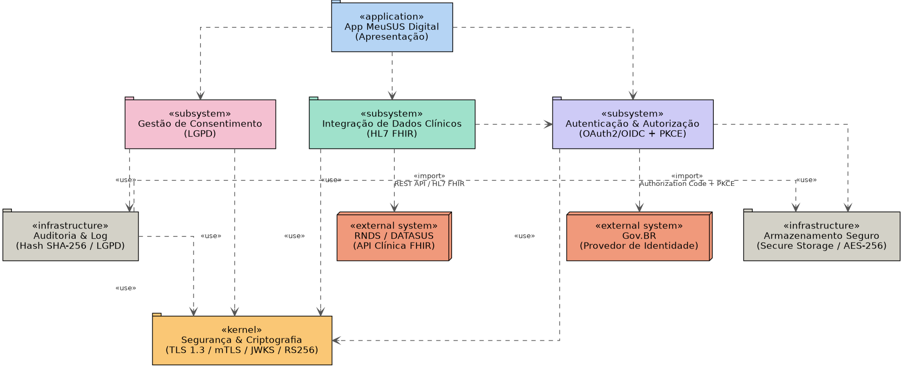
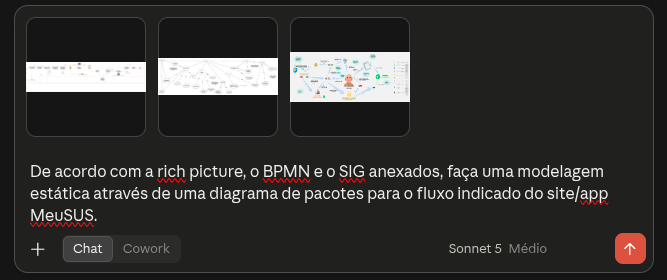
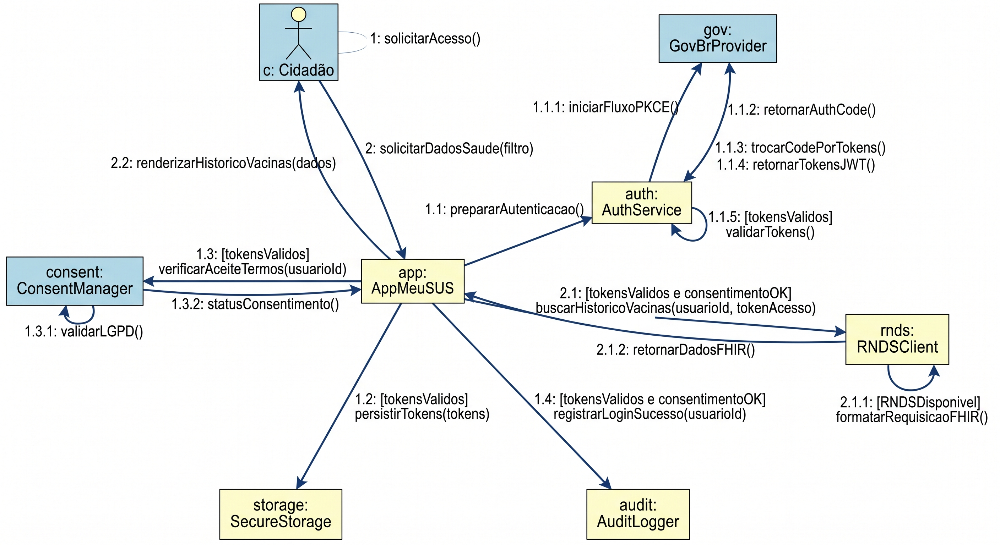
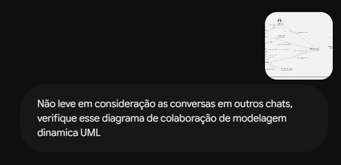
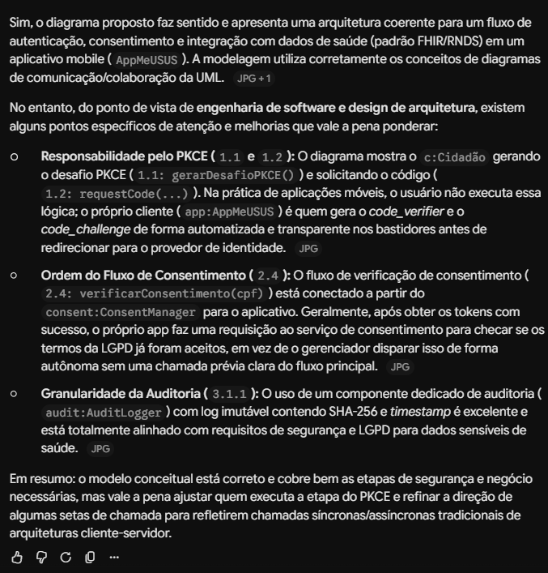

# Uso de Inteligência Artificial Generativa

---

## 1. Descrição e Objetivo

Este documento registra o apoio e o uso de ferramentas de **Inteligência Artificial Generativa (IAG)** na **Entrega 2** pela **SubEquipe 01**. O objetivo é apresentar com transparência, senso crítico e rastreabilidade como os modelos de linguagem foram utilizados no processo de engenharia de software, na construção e validação da **Modelagem Estática (Diagrama de Pacotes)** e da **Modelagem Dinâmica (Diagrama de Colaboração)**, bem como na documentação no MkDocs.

A abordagem adotada priorizou o uso da IA como um **agente colaborador e acelerador**, mantendo o rigor técnico, a revisão humana constante e a tomada de decisão final sob responsabilidade exclusiva dos integrantes da equipe.

---

## 2. Metodologia do Foco

A coleta de depoimentos e dados de uso ocorreu de forma **assíncrona e individual**. Cada integrante contribuiu com sua própria avaliação crítica e relatos de prompts/experimentos, garantindo a autoria e a perspectiva individualizada do aprendizado.

### Ferramentas Empregadas
* **Claude (Anthropic - Claude 3.5 Sonnet):** Utilizado nos experimentos de geração inicial de diagramas, revisão sintática da UML 2.0 e apoio na estruturação de relatórios em Markdown.
* **Gemini (Google - Advanced / 1.5 Pro):** Empregado na análise comparativa de requisitos com os artefatos da Entrega 1, experimentos de validação de consistência dinâmica e resumos de atas de reunião.

---

## 3. Experimentos com IA Generativa nas Modelagens

Como parte da avaliação prática das capacidades e limitações das ferramentas, a subequipe realizou quatro experimentos divididos em duas frentes: **Geração Inicial de Rascunhos** (a partir de artefatos da Entrega 1) e **Validação Crítica das Versões Finais** (confrontando os modelos consolidados da equipe contra a análise das IAs).

---

### Experimento 01: Modelagem Estática — Geração Inicial (Diagrama de Pacotes)

#### Objetivo: 
Verificar se uma IA generativa (Claude Sonnet 3.5) é capaz de produzir um **Diagrama de Pacotes UML** coerente com o domínio do aplicativo **MeuSUS Digital**, a partir de artefatos visuais já elaborados pela equipe. Para isso, foram anexados ao prompt três insumos de entrada — a **Rich Picture**, o **BPMN** e o **SIG (NFR Framework)** — acompanhados da instrução: *"De acordo com a rich picture, o BPMN e o SIG anexados, faça uma modelagem estática através de um diagrama de pacotes para o fluxo indicado do site/app MeuSUS."* O resultado gerado pela IA foi então comparado com a **Versão 1.0** do diagrama de pacotes construída manualmente pela subequipe, com o objetivo de identificar diferenças de estrutura, notação, granularidade e adequação às convenções UML.

#### Resultado Obtido: 

<strong>Legenda:</strong> Diagrama de Pacotes gerado pela IA a partir da Rich Picture, BPMN e SIG do MeuSUS Digital

<strong>Legenda:</strong> Prompt fornecido à IA com os três artefatos visuais anexados (Rich Picture, BPMN e SIG)

A IA gerou um diagrama com estrutura **hierárquica vertical**, contendo os seguintes pacotes estereotipados:
- **`«application»` App MeuSUS Digital (Apresentação)** — camada de topo representando a interface do aplicativo.
- **`«subsystem»` Gestão de Consentimento (LGPD)**, **`«subsystem»` Integração de Dados Clínicos (HL7 FHIR)** e **`«subsystem»` Autenticação & Autorização (OAuth2/OIDC + PKCE)** — três subsistemas centrais.
- **`«infrastructure»` Auditoria & Log (Hash SHA-256 / LGPD)** e **`«infrastructure»` Armazenamento Seguro (Secure Storage / AES-256)** — pacotes de infraestrutura.
- **`«external system»` RNDS / DATASUS (API Clínica FHIR)** e **`«external system»` Gov.BR (Provedor de Identidade)** — sistemas externos representados explicitamente.
- **`«kernel»` Segurança & Criptografia (TLS 1.3 / mTLS / JWKS / RS256)** — camada de base consumida por todos os demais.

As dependências utilizaram os estereótipos `<<use>>` e `<<import>>` com rótulos descritivos.

#### Análise Crítica e Intervenção Humana: 

A comparação entre o resultado gerado pela IA e a **Versão 1.0** do diagrama de pacotes (de autoria de [Artur Galdino](https://github.com/ArturFGaldino)) revelou diferenças estruturais e conceituais significativas:
1. **Abordagem arquitetural distinta:** a Versão 1.0 adota uma disposição horizontal com quatro pacotes de mesmo nível (`Presentation`, `Authentication`, `SecurityAndCompliance`, `HealthIntegration`), enquanto a IA gerou uma estrutura vertical.
2. **Granularidade e subpacotes:** a Versão 1.0 detalha subpacotes técnicos internos (ex.: `OAuthClient`, `PKCEHandler`), enquanto a IA não criou subpacotes reais.
3. **Mapeamento externo:** a IA incluiu explicitamente pacotes `«external system»`, contribuição considerada válida para discussões de limites do ecossistema.
4. **Mistura de estereótipos UML:** a IA tendeu a misturar notações do Diagrama de Componentes no Diagrama de Pacotes.

---

### Experimento 02: Modelagem Estática — Validação Final (Diagrama de Pacotes V1.3)

#### Objetivo: 
Submeter a **Versão 1.3 Final do Diagrama de Pacotes** (de autoria de [Nicole Jovita](https://github.com/nicolejovita)) para auditoria automática por uma IA Generativa (Gemini/Claude). O objetivo foi testar a capacidade da IA em atuar como um *reviewer* arquitetural, auditando a conformidade com a UML 2.0, o desacoplamento de pacotes, a consistência dos estereótipos `<<import>>` vs `<<use>>` e a aderência aos requisitos do NFR Framework.

#### Resultado Obtido e Prompt: 
*[INSERIR PRINT DO PROMPT DE VALIDAÇÃO E DA RESPOSTA DA IA]*

<strong>Legenda:</strong> Prompt de auditoria arquitetural fornecido à IA com a imagem da Versão 1.3 do Diagrama de Pacotes

#### Análise Crítica e Intervenção Humana: 
1. **Ponto:** Lorem ipsum

---

### Experimento 03: Modelagem Dinâmica — Geração Inicial (Diagrama de Colaboração)

#### Objetivo: 
Verificar se a IA generativa Gemini (Google - Advanced / 1.5 Pro) é capaz de produzir um **Diagrama de Colaboração (Comunicação) UML** coerente com as regras de negócio do aplicativo **MeuSUS Digital**, a partir de instruções textuais e de contexto. O resultado gerado pela IA foi comparado com as **Versões 1.1 e 1.2** do diagrama construído pela subequipe (com participação de [Giovani Coelho](https://github.com/Gotc2607) e [João Leles](https://github.com/joaoleless)).

#### Resultado Obtido: 

<strong>Legenda:</strong> Diagrama de Colaboração gerado pela IA Gemini com base no contexto textual

A IA gerou um diagrama distribuindo as instâncias de maneira radial, em que o aplicativo MeuSUS Digital funciona como um hub central.

#### Análise Crítica e Intervenção Humana: 
1. **Mapeamento de atores:** A IA instanciou adequadamente os papéis (`c: Cidadão`, `app: AppMeuSUS`, `auth: AuthService`).
2. **Ordens e rotulagem numérica:** A numeração decimal aninhada (`1.1`, `1.1.1`) foi aplicada corretamente.
3. **Deficiência na sintaxe visual:** A IA desenhou os enlaces de comunicação como setas direcionais longas ligando caixas, violando a notação clássica da UML 2.0 (que exige linha sólida contínua com vetor de mensagem paralelo).
4. **Ausência de fluxos de exceção:** A IA gerou apenas o "caminho feliz", exigindo que a equipe adicionasse manualmente os fluxos de falha e negação de acesso nas versões humanas.

---

### Experimento 04: Modelagem Dinâmica — Validação Final (Diagrama de Colaboração V1.3)

#### Objetivo: 
Submeter a **Versão 1.3 Final do Diagrama de Colaboração** (de autoria de [Artur Galdino](https://github.com/ArturFGaldino)) à IA Generativa para validar a consistência da sequência de mensagens, o uso de seletores de coleção (`[índice]`), laços de repetição (`*`) e expressões de guarda em cenários de exceção.

#### Prompt e Resultado Obtido: 

<strong>Legenda:</strong> Prompt fornecido ao Google Gemini

<strong>Legenda:</strong> Resultado fornecido pelo Google Gemini

#### Análise Crítica e Intervenção Humana:

A submissão do Diagrama de Colaboração para auditoria pela IA Generativa permitiu avaliar a precisão do modelo final quanto ao rigor da notação UML 2.0 e às boas práticas de arquitetura de software:

1. **Validação da Coerência Geral e Conformidade com a Notação:** A IA confirmou que o diagrama está conceitualmente correto e atende aos princípios de modelagem dinâmica para a jornada de autenticação, consentimento (LGPD) e integração com dados de saúde (HL7 FHIR / RNDS), reconhecendo a aplicação adequada dos conceitos de diagramas de comunicação.

2. **Percepção sobre a Responsabilidade do PKCE (`1.1` e `1.2`):** A IA apontou um ponto de atenção alegando que o ator `c:Cidadao` aparecia disparando a geração do desafio PKCE (`gerarDesafioPKCE()`). A equipe analisou o apontamento e constatou uma interpretação limitada da IA sobre o enlace visual: a chamada é disparada quando o cidadão clica no botão de login na interface, mas a execução técnica é tratada pelo cliente móvel (`app:AppMeuSUS`). A observação foi útil para reforçar a clareza visual no alinhamento do rótulo da mensagem sobre o enlace.

3. **Análise da Ordem do Fluxo de Consentimento (`2.4`):** A IA sugeriu revisar a conexão do método `verificarConsentimento(cpf)` partindo do `consent:ConsentManager`. A equipe validou que o fluxo orquestrado pelo aplicativo já atua como requisitante síncrono após o retorno do token, mas utilizou a crítica para garantir que o sentido das setas de disparo estivesse perfeitamente inequívoco e sem ambiguidades de interpretação síncrona/assíncrona.

4. **Reconhecimento do Rigor de Segurança e Auditoria (`3.1.1`):** A IA elogiou e validou expressamente o uso do componente dedicado `audit[cpf]:AuditLogger`, destacando que o registro de logs imutáveis com Hash SHA-256 e *timestamp* está em total consonância com as exigências de cibersegurança da LGPD e com os requisitos do NFR Framework mapeados na Entrega 1.

**Conclusão do Experimento:** O teste de validação comprovou que a IA funciona de forma eficiente como um revisor de código/arquitetura (*peer reviewer*), sendo capaz de identificar trechos com potencial ambiguidade de leitura. Contudo, cabe à engenharia humana filtrar as observações, diferenciando limitações de interpretação visual do modelo de linguagem de falhas reais de arquitetura.

---

## 4. Análise Crítica e Lições Aprendidas

Abaixo estão consolidados os aspectos avaliados durante a experimentação de IA Generativa na construção e validação dos artefatos de modelagem:

* **Cobertura Conceitual:** O Gemini conseguiu cobrir bem todos os atores e serviços envolvidos no ecossistema (App, Cidadão, RNDS, Gov.br), refletindo fielmente os objetos fornecidos no prompt.
* **Legibilidade e Organização:** O diagrama gerado distribuiu bem as instâncias ao redor do AppMeuSUS, facilitando a leitura inicial das trocas de mensagens na arquitetura.
* **Aderência à Técnica UML:** Baixa aderência visual à UML 2.0. Os enlaces de comunicação foram desenhados incorretamente como setas direcionais longas. Por outro lado, o emprego da numeração decimal aninhada das mensagens e expressões de guarda foi satisfatório.
* **Influência do Prompting:** Foi essencial fornecer o escopo arquitetural rigoroso previamente. A precisão na identificação dos sistemas externos só ocorreu porque o prompt já declarava o papel de "Facade" da plataforma.
* **Editabilidade dos Artefatos:** O fato de a IA entregar o código em PlantUML facilitou testes rápidos, porém a limitação da própria engine do PlantUML em renderizar Diagramas de Colaboração precisos frustrou refinamentos mais finos por código.
* **Confiabilidade e Validação:** O fluxo principal ("caminho feliz") mostrou-se confiável, mas as omissões dos tratamentos de exceção (ex: falha de token) exigiram que a equipe expandisse as regras de negócio de forma manual.
* **Limites do Experimento:** O teste confirmou que a IA é muito útil para *brainstorming* e rascunho de estruturas relacionais, mas não substitui a modelagem criteriosa de exceções, resiliência e rigor formal exigidos pela UML.

---

## 5. Pontos de Vista Individuais

### Artur Galdino
* **GitHub:** [@ArturFGaldino](https://github.com/ArturFGaldino)

* **Uso da IA Generativa (Senso Crítico):** Lorem ipsum dolor sit amet, consectetur adipiscing elit...

* **Lições Aprendidas:**
  Lorem ipsum dolor sit amet, consectetur adipiscing elit...

---

### Giovani Coelho
* **GitHub:** [@Gotc2607](https://github.com/Gotc2607)

* **Uso da IA Generativa (Senso Crítico):** Usar a Inteligência Artificial ajudou bastante no começo para montar a base dos nossos diagramas estáticos e dinâmicos. Mas ficou claro que a gente precisa ficar de olho o tempo todo, porque a IA às vezes cria umas relações que não têm nada a ver com as regras de negócio do projeto, ou inventa fluxos meio sem sentido se o prompt não estiver muito bem explicado. A revisão manual e o ajuste do que ela gerou foram essenciais.

* **Lições Aprendidas:**
  A principal lição é que a IA não faz o trabalho de modelagem sozinha, ela só dá um empurrão. Percebi que o melhor jeito é ir fazendo aos poucos, tipo gerar uma parte do modelo, validar com o pessoal da equipe, melhorar o prompt e depois acertar os detalhes na mão nas ferramentas. Isso salva tempo e evita que a gente aceite coisas erradas ou alucinações. O resultado final depende muito de como a gente escreve o prompt no começo.
---

### João Leles
* **GitHub:** [@joaoleless](https://github.com/joaoleless)

* **Uso da IA Generativa (Senso Crítico):** Utilizei IA generativa para acelerar a modelagem visual do diagrama de colaboração UML, mas todo o conteúdo técnico foi validado por mim antes de ser aceito. Ao revisar a primeira versão gerada, identifiquei que a notação de moldura (Diagram Frame) e o cabeçalho pentagonal precisavam seguir estritamente a especificação oficial de UML, e não apenas uma aproximação visual — pedi correções específicas até o resultado condizer com a convenção formal. Também conferi manualmente a lógica de cada mensagem numerada (ex.: a ordem do fluxo OAuth 2.0/PKCE e o momento exato da verificação de consentimento LGPD) para garantir que a IA não tivesse alterado a semântica do processo apenas para "encaixar" visualmente as setas. A ferramenta foi tratada como um assistente de produtividade para desenhar e formatar, não como fonte de decisão arquitetural.

* **Lições Aprendidas:** Aprendi que gerar um diagrama estruturalmente correto é diferente de gerar um diagrama semanticamente correto — a IA pode produzir uma peça visualmente convincente com pequenos erros de direção de seta ou de nomenclatura que só um revisor com conhecimento do domínio percebe. Também reforcei a importância de seguir rigorosamente as convenções da UML (nomeação de instância no formato `instancia: Classe`, distinção entre linha de comunicação e seta de disparo, uso correto de expressões de guarda) em vez de aceitar qualquer representação "parecida". Por fim, entendi que documentar versão a versão o que mudou e por quê é tão importante quanto o próprio diagrama, pois isso torna as decisões de design rastreáveis para o restante da equipe.

---

### Nicole Jovita
* **GitHub:** [@nicolejovita](https://github.com/nicolejovita)

* **Uso da IA Generativa (Senso Crítico):**
  Utilizei a IA Generativa em dois momentos principais: nas etapas de *brainstorming* e estruturação inicial dos artefatos e, posteriormente, na condução de auditorias e validações das versões finais dos diagramas de modelagem estática e dinâmica (como realizado no Experimento 04)[cite: 9, 10]. A ferramenta atuou como um apoio para testes de hipóteses e verificação de consistência, mas exigi rigor no questionamento de suas respostas[cite: 10]. No Experimento 04, por exemplo, a IA apontou uma suposta inconsistência no disparo do PKCE, mas identifiquei que se tratava de uma limitação de interpretação visual do modelo de linguagem sobre o enlace, reafirmando que o julgamento técnico final deve ser estritamente humano[cite: 10].

* **Lições Aprendidas:**
  A principal lição foi compreender na prática os limites claros da IA Generativa em engenharia de software[cite: 10]. Ela é excelente para acelerar discussões iniciais, organizar ideias e apontar potenciais pontos cegos de documentação, mas não possui a capacidade de compreender o contexto real de negócio e as sutilezas visuais da notação UML 2.0 sem supervisão[cite: 10]. Validar rigorosamente cada retorno e confrontar as sugestões da ferramenta com a bibliografia oficial da disciplina são etapas indispensáveis para garantir a qualidade do projeto[cite: 10].

---

## 6. Síntese do Aprendizado da Subequipe

Lorem ipsum dolor sit amet, consectetur adipiscing elit...

---

## 7. Referências e Ferramentas Utilizadas

* **Ferramenta (versão):** Descrição do uso e link para a ferramenta.
* Colocar link para atas da subequipe caso pertinente (por exemplo, uso de transcricao automatica da gravacao com IA - nesse caso citar anteriormente no uso de IA)
* Experimentos com IA (link puxando para a secao 3 desse documento caso tenham optado por inserir)

---

## Histórico de Versionamento

| Nome do Membro  | Contribuição   | Data  | Commit |
| ---- | ------ | ----- | ---- |
| [Gustavo Fornaciari](https://github.com/GUGOFO) | Criação do Repositorio | 10/09/2026 | [efd139e](https://github.com/UnBArqDsw2026-2-Turma01/2026.2-T01-_G5_ProjetoGovernoEletronico_Entrega_02/commit/efd139e36025a5c1610fff909ac41451ab13eecd) |
| [Artur Galdino](https://github.com/ArturFGaldino) e [Nicole Jovita](https://github.com/nicolejovita) | Criação do template da documentação de IA Generativa, experimentos e relatos | 17/09/2026 | [8ddaf26](https://github.com/UnBArqDsw2026-2-Turma01/2026.2-T01-_G5_ProjetoGovernoEletronico_Entrega_02/commit/8ddaf262b0619515620ef2f029cc1ae973b3626f) |
| [Giovani Coelho](https://github.com/Gotc2607) | Relato do uso de IA Generativa e lições aprendidas | 17/09/2026 | [54d3bd9](https://github.com/UnBArqDsw2026-2-Turma01/2026.2-T01-_G5_ProjetoGovernoEletronico_Entrega_02/commit/54d3bd9db024ebb55333559599d4d9c8306e13ce) |
| [João Leles](https://github.com/joaoleless) | Relato de uso de IA Generativa | 17/09/2026 | [c4547eb](https://github.com/UnBArqDsw2026-2-Turma01/2026.2-T01-_G5_ProjetoGovernoEletronico_Entrega_02/commit/c4547eb16406dc3d11a1b329f62436a3a73ef251) |
| [Nicole Jovita](https://github.com/nicolejovita) | Adição do Experimento 04 (Validação da Modelagem Dinâmica), relato pessoal e lições aprendidas | 18/09/2026 | |