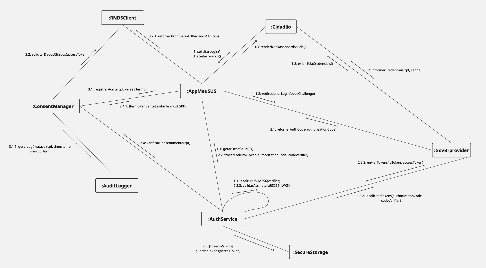
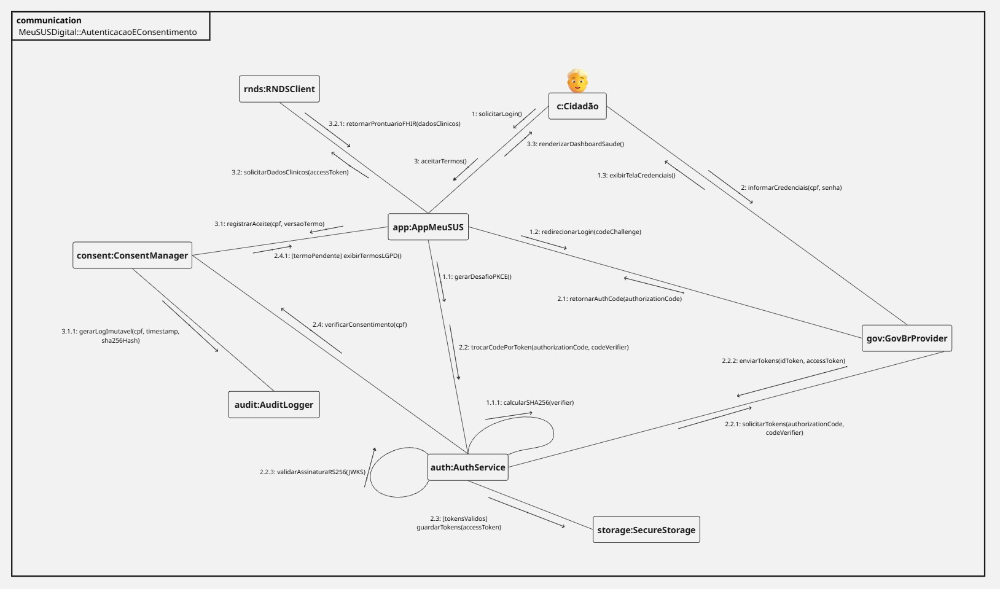
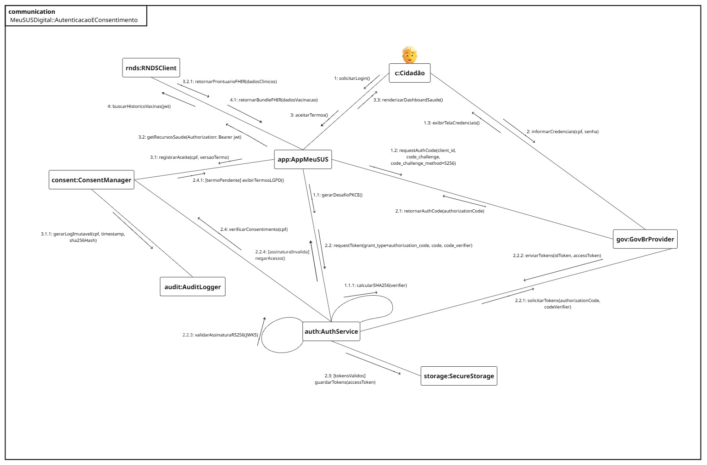
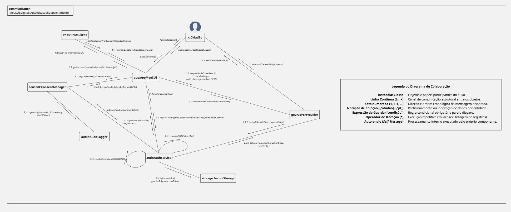

# Modelagem Dinâmica | Diagrama de Colaboração (Comunicação)

---

## Versão Final

<iframe 
  width="768" 
  height="432" 
  src="https://miro.com/app/board/uXjVHmpqMHQ=/?share_link_id=17243576178" 
  frameborder="0" 
  scrolling="no" 
  allow="fullscreen; clipboard-read; clipboard-write" 
  allowfullscreen>
</iframe>

<strong>Legenda:</strong> Diagrama de Colaboração Final (Fluxo Seguro de Autenticação, Consentimento e Consumo Clínico no Meu SUS Digital)

---

## Participantes 
| Nome do Membro | 
| :--- |
| [Artur Galdino](https://github.com/ArturFGaldino) |
| [Giovani Coelho](https://github.com/Gotc2607) |
| [João Leles](https://github.com/joaoleless) |
| [Nicole Jovita](https://github.com/nicolejovita) |

---

## Fundamentação Teórica

### O que é o Diagrama de Colaborações 

O **Diagrama de Colaboração** (denominado **Diagrama de Comunicação** a partir da especificação UML 2.0) é um artefato da **modelagem dinâmica** da UML (*Unified Modeling Language*). Ele é utilizado para demonstrar a interação comportamental entre objetos ou partes do sistema por meio de mensagens sequenciais organizadas em torno de uma estrutura gráfica de enlaces.

Conforme apresentado nas diretrizes teóricas da Profa. Milene Serrano, os diagramas dinâmicos da UML buscam revelar a dimensão comportamental da solução computacional. Diferentemente do Diagrama de Sequência — que prioriza a ordenação estritamente temporal disposta ao longo de linhas de vida verticais —, o Diagrama de Colaboração destaca a **organização e o relacionamento estrutural entre os objetos** que participam da interação, dando ênfase no caminho pelo qual as mensagens trafegam durante determinado cenário de uso.

A fundamentação conceitual do Diagrama de Colaboração na UML resgata as contribuições históricas de **Grady Booch**, um dos criadores da notação ao lado de James Rumbaugh (OMT) e Ivar Jacobson (OOSE).

### Principais Elementos e Regras da Notação UML

* **Atores e Objetos (*Lifelines*):** Representam os papéis e as instâncias de classes envolvidas no fluxo (ex.: `c: Cidadao`, `app: AppMeuSUS`).
* **Enlaces de Comunicação (*Links*):** Linhas sólidas ligando os objetos para indicar a existência de um canal de comunicação estrutural por onde as mensagens transitam.
* **Setas de Mensagem e Sentido de Disparo:** Setas paralelas aos enlaces que indicam a direção da chamada de método.
* **Numeração de Sequência Cronológica:** Identificadores numéricos que estabelecem a ordem temporal do fluxo (ex.: `1`, `1.1`, `2.2.1`). A notação decimal aninhada expressa sub-operações ou chamadas derivadas disparadas a partir de um método pai.
* **Expressões de Guarda (`[condição]`):** Regras condicionais entre colchetes que delimitam o disparo da mensagem mediante validação de contexto (ex.: `[tokensValidos]`, `[termoPendente]`).
* **Iteração (`*`):** Símbolo de asterisco associado à sequência para indicar execuções repetitivas em laço.
* **Moldura e Cabeçalho (*Diagram Frame* e *Frame Heading*):** Delimitação retangular do diagrama com um pentágono no canto superior esquerdo identificando a notação (`communication` ou `sd`) e o nome do caso de uso modelado.

---

## Desenvolvimento

### Versão 1.0

**Autoria:** [Nicole Jovita](https://github.com/nicolejovita)

<strong>Legenda:</strong> Estruturação inicial da rede de colaboração e fluxo sequencial de mensagens

Nesta primeira versão do artefato dinâmico, realizou-se o mapeamento primário das interações entre as instâncias envolvidas na jornada de autenticação federada (Gov.br), gestão de consentimento (LGPD) e consumo de dados clínicos (HL7 FHIR / RNDS), integrando os requisitos levantados na Rich Picture, no NFR SIG e no BPMN.

#### Convenções Visuais e Legenda do Modelo
Para orientar a interpretação do diagrama, a modelagem foi sustentada pelas seguintes regras formais:
* **Objetos / Instâncias (`:Classe`):** Representam os componentes e instâncias operacionais do ecossistema.
* **Enlaces de Comunicação (Linhas Contínuas):** Explicitam os caminhos de comunicação diretamente estabelecidos entre dois objetos.
* **Setas de Disparo:** Apontam o sentido da chamada de método entre os objetos.
* **Sequência Numérica Aninhada (`1`, `1.1`, `2.2.1`):** Define a ordem cronológica exata de execução. A numeração decimal ramificada mapeia a hierarquia de métodos chamados durante o tempo de ativação de uma operação superior.
* **Expressões de Guarda (`[condição]`):** Condicionantes de negócio aplicadas ao envio das mensagens.

#### Mapeamento de Objetos e Responsabilidades

| Objeto / Papel | Tipo / Camada | Responsabilidade no Fluxo |
| :--- | :--- | :--- |
| **`:Cidadao`** | Ator Externo | Cidadão que interage com a interface do aplicativo. |
| **`:AppMeuSUS`** | Frontend / Cliente | Cliente móvel que coordena a navegação e a renderização da interface. |
| **`:AuthService`** | Controller / Segurança | Controlador responsável pela geração do desafio PKCE e validação dos tokens JWT (RS256/JWKS). |
| **`:GovBrProvider`** | Serviço Externo | Provedor federado de identidade responsável pela autenticação e emissão do *Auth Code*. |
| **`:ConsentManager`** | Serviço / Negócio | Gerenciador que valida e coleta o aceite explícito dos Termos de Uso e Política de Privacidade (LGPD). |
| **`:AuditLogger`** | Repositório / Segurança | Serviço de auditoria que registra logs imutáveis acompanhados de Hash SHA-256. |
| **`:SecureStorage`** | Armazenamento Local | Cofre criptografado local (*KeyStore/Keychain*) para persistência dos tokens de acesso. |
| **`:RNDSClient`** | Cliente de API / Integração | Módulo de comunicação com a Rede Nacional de Dados em Saúde via mTLS/HL7 FHIR. |

---

### Versão 1.1

**Autoria:** [João Leles](https://github.com/joaoleless)

 

**Legenda:** Enquadramento formal do diagrama (Diagram Frame) e padronização de instâncias UML

O que mudou desde a Versão 1.0: o diagrama agora está contido numa moldura UML com cabeçalho identificando o tipo (`communication`) e o elemento proprietário (`MeuSUSDigital::AutenticacaoEConsentimento`); o ator `:Cidadão` foi substituído pelo ícone de boneco (stick figure); e todas as instâncias passaram a seguir a convenção `nomeDaInstancia: NomeDaClasse` (ex.: `c: Cidadão`, `app: AppMeuSUS`, `gov: GovBrProvider`). Também reorganizei o layout em torno dos dois hubs centrais (`app` e `auth`) para reduzir cruzamentos de linhas e afastar rótulos das bordas do diagrama, sem alterar a lógica de nenhuma mensagem da jornada de autenticação federada (Gov.br), consentimento (LGPD) e consumo de dados clínicos (HL7 FHIR / RNDS).

#### Convenções Visuais e Legenda do Modelo

- **Moldura do Diagrama (Diagram Frame):** retângulo que delimita o escopo do caso de uso, com o pentágono de cabeçalho no canto superior esquerdo trazendo o tipo do diagrama (`communication`) e o nome do elemento proprietário.
- **Ator Principal (Actor Lifeline):** representado pelo ícone de boneco (*stick figure*), sinalizando visualmente o ator humano que dispara a jornada.
- **Objetos / Instâncias (`instancia: Classe`):** representam os componentes e instâncias operacionais do ecossistema, nomeados explicitamente (nome da instância + nome da classe).
- **Enlaces de Comunicação (linhas contínuas):** explicitam os caminhos de comunicação diretamente estabelecidos entre dois objetos.
- **Setas de Disparo:** apontam o sentido da chamada de método entre os objetos.
- **Sequência Numérica Aninhada (`1`, `1.1`, `2.2.1`):** define a ordem cronológica exata de execução; a numeração decimal ramificada mapeia a hierarquia de métodos chamados durante o tempo de ativação de uma operação superior.
- **Expressões de Guarda (`[condição]`):** condicionantes de negócio aplicadas ao envio das mensagens.

#### Mapeamento de Objetos e Responsabilidades

| Objeto / Papel | Tipo / Camada | Responsabilidade no Fluxo |
|---|---|---|
| `c: Cidadão` | Ator Externo | Cidadão que interage com a interface do aplicativo. |
| `app: AppMeuSUS` | Frontend / Cliente | Cliente móvel que coordena a navegação e a renderização da interface. |
| `auth: AuthService` | Controller / Segurança | Controlador responsável pela geração do desafio PKCE e validação dos tokens JWT (RS256/JWKS). |
| `gov: GovBrProvider` | Serviço Externo | Provedor federado de identidade responsável pela autenticação e emissão do *Auth Code*. |
| `consent: ConsentManager` | Serviço / Negócio | Gerenciador que valida e coleta o aceite explícito dos Termos de Uso e Política de Privacidade (LGPD). |
| `audit: AuditLogger` | Repositório / Segurança | Serviço de auditoria que registra logs imutáveis acompanhados de Hash SHA-256. |
| `storage: SecureStorage` | Armazenamento Local | Cofre criptografado local (*KeyStore/Keychain*) para persistência dos tokens de acesso. |

---

### Versão 1.2

**Autoria:** [Giovani Coelho](https://github.com/Gotc2607)

**Legenda:** Evolução do Diagrama de Colaboração com inclusão de caminhos alternativos e detalhamento do consumo da RNDS

O que mudou desde a Versão 1.1: adicionamos a representação do que acontece quando o fluxo de segurança falha, inserindo a mensagem de retorno `2.2.4: [assinaturaInvalida] negarAcesso()` do `auth:AuthService` para o `app:AppMeuSUS`. Substituímos parâmetros genéricos nas assinaturas dos métodos pelos parâmetros reais exigidos pelo protocolo OAuth 2.0 e PKCE (como `requestAuthCode(client_id, code_challenge, code_challenge_method=S256)` no passo `1.2` e explicitação do cabeçalho HTTP `Authorization: Bearer jwt` no passo `3.2`). Por fim, expandimos o ciclo de vida do diagrama para detalhar o consumo de dados clínicos na RNDS (passos `4` e `4.1` com `buscarHistoricoVacinas` e `retornarBundleFHIR`), fechando o fluxo de ponta a ponta e conectando o esforço de autenticação ao objetivo final do negócio. Essas modificações demonstram a resiliência do sistema com guardas negativas e elevam o nível técnico da documentação com os protocolos reais da indústria.

#### Convenções Visuais e Legenda do Modelo

- **Moldura do Diagrama (Diagram Frame):** retângulo que delimita o escopo do caso de uso, com o pentágono de cabeçalho no canto superior esquerdo trazendo o tipo do diagrama (`communication`) e o nome do elemento proprietário.
- **Ator Principal (Actor Lifeline):** representado pelo ícone de boneco (*stick figure*), sinalizando visualmente o ator humano que dispara a jornada.
- **Objetos / Instâncias (`instancia: Classe`):** representam os componentes e instâncias operacionais do ecossistema, nomeados explicitamente (nome da instância + nome da classe).
- **Enlaces de Comunicação (linhas contínuas):** explicitam os caminhos de comunicação diretamente estabelecidos entre dois objetos.
- **Setas de Disparo:** apontam o sentido da chamada de método entre os objetos.
- **Sequência Numérica Aninhada (`1`, `1.1`, `2.2.1`):** define a ordem cronológica exata de execução; a numeração decimal ramificada mapeia a hierarquia de métodos chamados durante o tempo de ativação de uma operação superior.
- **Expressões de Guarda (`[condição]`):** condicionantes de negócio aplicadas ao envio das mensagens.

#### Mapeamento de Objetos e Responsabilidades

| Objeto / Papel | Tipo / Camada | Responsabilidade no Fluxo |
|---|---|---|
| `c: Cidadão` | Ator Externo | Cidadão que interage com a interface do aplicativo. |
| `app: AppMeuSUS` | Frontend / Cliente | Cliente móvel que coordena a navegação e a renderização da interface. |
| `auth: AuthService` | Controller / Segurança | Controlador responsável pela geração do desafio PKCE e validação dos tokens JWT (RS256/JWKS). |
| `gov: GovBrProvider` | Serviço Externo | Provedor federado de identidade responsável pela autenticação e emissão do *Auth Code*. |
| `consent: ConsentManager` | Serviço / Negócio | Gerenciador que valida e coleta o aceite explícito dos Termos de Uso e Política de Privacidade (LGPD). |
| `audit: AuditLogger` | Repositório / Segurança | Serviço de auditoria que registra logs imutáveis acompanhados de Hash SHA-256. |
| `storage: SecureStorage` | Armazenamento Local | Cofre criptografado local (*KeyStore/Keychain*) para persistência dos tokens de acesso. |
| `rnds: RNDSClient` | Cliente de API / Integração | Módulo de comunicação com a Rede Nacional de Dados em Saúde via mTLS/HL7 FHIR. |

---

### Versão 1.3 (Final)

**Autoria:** [Artur Galdino](https://github.com/ArturFGaldino)

**Legenda:** Refinamento final do Diagrama de Colaboração com padronização estrita de código, seletores de coleção, unificação de auto-envios e quadro de legenda auxiliar

O que mudou desde a Versão 1.2: realizou-se o polimento estético e técnico do artefato de encerramento da modelagem dinâmica. As principais modificações e convenções aplicadas consistiram na remoção de acentuação técnica da instância do ator (`c:Cidadao`), na inclusão de seletores de coleção nos nós de persistência e auditoria (`storage[cidadao]:SecureStorage` e `audit[cpf]:AuditLogger`), e na padronização da mensagem de resgate de histórico clínico com o operador de laço (`4*: buscarHistoricoVacinas(jwt)`). Adicionalmente, integrou-se um quadro interno de legendas ao canvas. Vale destacar que este quadro auxiliar de legendas **não é um elemento padrão ou obrigatório da notação UML**, sendo empregado estritamente como um recurso opcional de legibilidade para explicitar os elementos gráficos utilizados no modelo.

#### Convenções Visuais e Legenda do Modelo

- **Quadro de Legenda Auxiliar:** elemento opcional adicionado ao canvas para detalhar o significado das setas, moldura, guardas e coleções, servindo como guia de leitura do diagrama.

#### Mapeamento de Objetos e Responsabilidades Atualizado

| Objeto / Papel | Tipo / Camada | Responsabilidade no Fluxo |
|---|---|---|
| `c: Cidadao` | Ator Externo | Cidadão que interage com a interface do aplicativo (nome ajustado para padrão técnico sem acento). |
| `app: AppMeuSUS` | Frontend / Cliente | Cliente móvel que coordena a navegação e a renderização da interface. |
| `auth: AuthService` | Controller / Segurança | Controlador responsável pela geração do desafio PKCE e validação dos tokens JWT (RS256/JWKS). |
| `gov: GovBrProvider` | Serviço Externo | Provedor federado de identidade responsável pela autenticação e emissão do *Auth Code*. |
| `consent: ConsentManager` | Serviço / Negócio | Gerenciador que valida e coleta o aceite explícito dos Termos de Uso e Política de Privacidade (LGPD). |
| `audit[cpf]: AuditLogger` | Repositório / Segurança | Serviço de auditoria que registra logs imutáveis acompanhados de Hash SHA-256, indexados por CPF. |
| `storage[cidadao]: SecureStorage` | Armazenamento Local | Cofre criptografado local particionado por cidadão para persistência dos tokens de acesso. |
| `rnds: RNDSClient` | Cliente de API / Integração | Módulo de comunicação com a Rede Nacional de Dados em Saúde via mTLS/HL7 FHIR. |

---

## Metodologia

A equipe adotou uma abordagem iterativa e incremental baseada na engenharia reversa do ecossistema *Meu SUS Digital* e nos artefatos produzidos nas entregas anteriores (Rich Picture, NFR Framework e BPMN). Seguindo a diretriz geral da disciplina e as especificidades da subequipe, o processo consistiu em evoluir o modelo dinâmico desde uma estrutura inicial de interações até uma representação altamente formalizada, contemplando fluxos principais, caminhos alternativos de exceção, segurança de criptografia de ponta a ponta e padrões abertos de interoperabilidade em saúde.

---

### Embasamento teórico para criação:

1. SERRANO, Milene. [Arquitetura e Desenho de Software - Aula Modelagem UML Dinâmica](https://drive.google.com/file/d/1wLDrtIJleri9zf0g5VANhwqzCJ7WTpOE/view). Brasília: UnB Gama, 2026. 1 arquivo PDF.
2. SERRANO, Milene. [Arquitetura e Desenho de Software - Aula Modelagem UML Estática](https://drive.google.com/file/d/17TPUNv5Pllzhx23HIpZ0aJnU9hAJ9Ln9/view). Brasília: UnB Gama, 2026. 1 arquivo PDF.
3. UML Diagrams. Communication Diagrams Overview. Disponível em: https://www.uml-diagrams.org/communication-diagrams.html. Acesso em: 15 set. 2026.
4. UML Diagrams. Unified Modeling Language (UML) Diagrams. Disponível em: https://www.uml-diagrams.org/. Acesso em: 15 set. 2026.

---

## Histórico de Versionamento

| Nome do Membro  | Contribuição   | Data  | Commit |
| ---- | ------ | ----- | ---- |
| [Gustavo Fornaciari](https://github.com/GUGOFO) | Criação do Repositorio | 10/09/2026 | [efd139e](https://github.com/UnBArqDsw2026-2-Turma01/2026.2-T01-_G5_ProjetoGovernoEletronico_Entrega_02/commit/efd139e36025a5c1610fff909ac41451ab13eecd) |
| [Nicole Jovita](https://github.com/nicolejovita) | Fundamentação teórica, estruturação do documento, legenda e elaboração da Versão 1.0 | 15/09/2026 | [d389c69](https://github.com/UnBArqDsw2026-2-Turma01/2026.2-T01-_G5_ProjetoGovernoEletronico_Entrega_02/commit/d389c69) |
| [João Leles](https://github.com/joaoleless) | Elaboração da Versão 1.1 da modelagem dinâmica | 16/09/2026 | [af35608](https://github.com/UnBArqDsw2026-2-Turma01/2026.2-T01-_G5_ProjetoGovernoEletronico_Entrega_02/commit/af3560852c67ac1c892e9ca585404059f93620d4) |
| [Giovani Coelho](https://github.com/Gotc2607) | Elaboração da Versão 1.2 da modelagem dinâmica (tratamento de exceções e RNDS) | 16/09/2026 | [87755fc](https://github.com/UnBArqDsw2026-2-Turma01/2026.2-T01-_G5_ProjetoGovernoEletronico_Entrega_02/commit/87755fc) |
| [Artur Galdino](https://github.com/ArturFGaldino) | Refinamento e elaboração da Versão 1.3 Final | 17/09/2026 | |