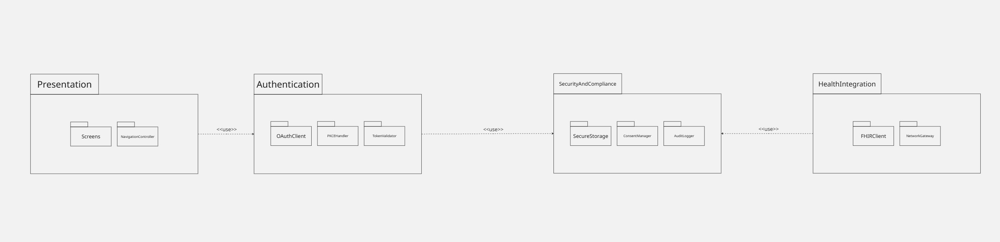
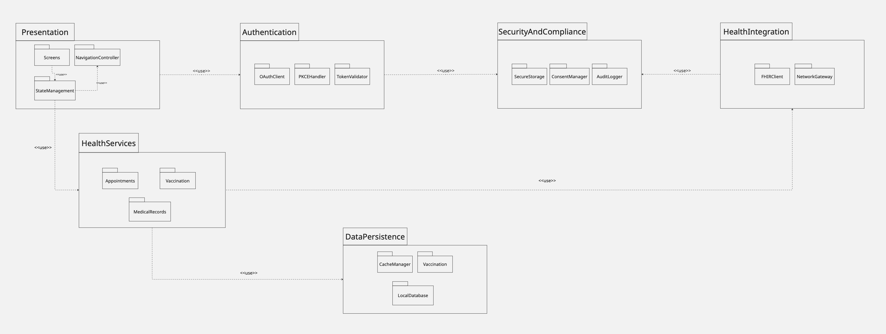
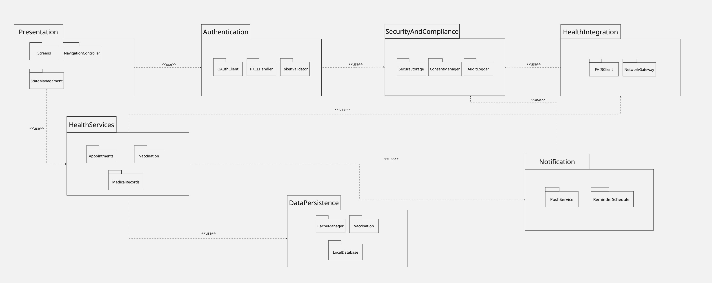
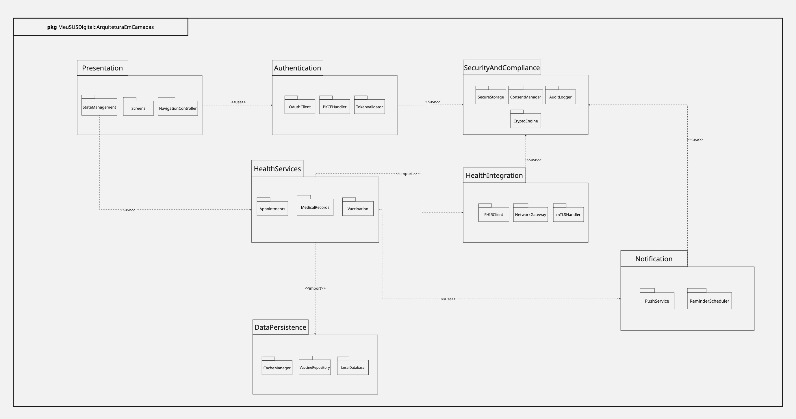

# Modelagem Estática | Diagrama de Pacotes

---

## Versão Final

<iframe 
  width="768" 
  height="432" 
  src="https://miro.com/app/board/uXjVHmp1ME8=/?share_link_id=760710539095" 
  frameborder="0" 
  scrolling="no" 
  allow="fullscreen; clipboard-read; clipboard-write" 
  allowfullscreen>
</iframe>

<strong>Legenda:</strong> Diagrama de Pacotes Final (Arquitetura em Camadas e Módulos do Sistema)

---

## Participantes 
| Nome do Membro | 
| :--- |
| [Artur Galdino](https://github.com/ArturFGaldino) |
| [Giovani Coelho](https://github.com/Gotc2607) |
| [João Leles](https://github.com/joaoleless) |
| [Nicole Jovita](https://github.com/nicolejovita) |

---

## Fundamentação Teórica

### O que é o Diagrama de Pacotes 

O **Diagrama de Pacotes** é um diagrama estrutural e estático da UML (Unified Modeling Language) cujo principal objetivo é organizar o sistema em subsistemas, módulos ou camadas lógicas de alto nível. Ele permite agrupar elementos de modelagem — como classes, interfaces, componentes e outros pacotes — em contêineres gerenciáveis representados graficamente como pastas de arquivos. 

Essa notação reduz a complexidade visual de projetos complexos, facilitando a visualização de dependências, acoplamentos e separação de responsabilidades (como a divisão entre camadas de apresentação, lógica de negócios, segurança e persistência), mantendo a arquitetura modular e escalável.

---

## Desenvolvimento

### Versão 1.0

**Autoria:** [Artur Galdino](https://github.com/ArturFGaldino)

<strong>Legenda:</strong> Estruturação inicial dos pacotes principais e dependências arquiteturais do sistema

Nesta primeira e definitiva versão do artefato, realizamos a modelagem estática de pacotes traduzindo os requisitos funcionais, fluxos de autenticação (OAuth 2.0 / Gov.br) e restrições não funcionais (como LGPD e segurança) mapeados nos relatórios anteriores (*Rich Picture*, *NFR Framework* e *BPMN*). 

O sistema foi estruturado em quatro grandes pacotes e seus respectivos subpacotes internos para encapsular as responsabilidades lógicas:
* **`Presentation`**: Contém os subpacotes `Screens` (responsável pelas interfaces gráficas e telas de dashboard de saúde) e `NavigationController` (gerenciador de rotas e fluxo de navegação, incluindo o acesso sem login/visitante).
* **`Authentication`**: Agrupa os módulos de segurança de borda e federação de identidade, contendo `OAuthClient` (gerenciamento do fluxo de login federado), `PKCEHandler` (tratamento criptográfico de códigos de verificação via SHA-256) e `TokenValidator` (validação de assinaturas e tokens via JWKS e RS256).
* **`SecurityAndCompliance`**: Focado na conformidade regulatória e proteção de dados, englobando `SecureStorage` (cofre criptografado local para sessões), `ConsentManager` (gestão explícita de termos de uso e privacidade exigidos pela LGPD) e `AuditLogger` (geração de logs imutáveis com hash SHA-256).
* **`HealthIntegration`**: Responsável pela interoperabilidade e comunicação com o ecossistema de saúde, contendo `FHIRClient` (consumo de dados clínicos no padrão internacional HL7 FHIR) e `NetworkGateway` (camada de transporte protegida por mTLS).

As dependências entre os pacotes foram estabelecidas por meio de setas pontilhadas com o estereótipo `<<use>>`, refletindo diretamente o sentido de consumo de serviços: a camada de apresentação consome o módulo de autenticação, enquanto os módulos funcionais dependem das diretrizes de segurança, auditoria e conformidade legal providas pelo pacote de segurança.

### Versão 1.1

**Autoria:** [Giovani Coelho](https://github.com/Gotc2607)

<strong>Legenda:</strong> Evolução do Diagrama de Pacotes com adição das camadas de Domínio (HealthServices) e Persistência de Dados.

#### O Que Foi Modificado na Estrutura

* **Refinamento do pacote Presentation:** Adicionamos o subpacote StateManagement atuando como intermediário obrigatório dentro da camada de apresentação.
* **Criação do pacote HealthServices (Domínio):** Inserimos este novo pacote central para abrigar as regras de negócio, contendo os submódulos Appointments, Vaccination e MedicalRecords.
* **Criação do pacote DataPersistence:** Adicionamos este pacote voltado ao armazenamento local de dados, contendo os submódulos CacheManager e LocalDatabase.
* **Atualização do Fluxo de Dependências:** Redirecionamos as setas para que o Presentation consuma apenas o HealthServices, e este passe a orquestrar as chamadas para o HealthIntegration e para o DataPersistence.
* **Ajuste nas notações UML:** Padronizamos todas as conexões (tanto internas quanto entre os grandes pacotes) utilizando rigorosamente setas tracejadas com o estereótipo `<<use>>`.
* **Exclusão consciente de escopo:** Optamos por não incluir o NotificationService nesta iteração específica, mantendo o diagrama focado exclusivamente na resolução do fluxo principal de dados e estado offline.

#### Por Que Essas Modificações Foram Feitas (Justificativas Arquiteturais)

* **Isolamento de Responsabilidades na UI:** A introdução do StateManagement garante que as telas (Screens) sejam componentes puramente visuais, transferindo toda a responsabilidade de acionar casos de uso e controlar a navegação para um gerenciador de estado dedicado.
* **Adoção de Arquitetura Centrada no Domínio:** A criação do HealthServices coloca as regras de negócio do aplicativo governamental no centro do sistema, evitando que a lógica principal fique espalhada pelas telas ou misturada com a infraestrutura de rede.
* **Atendimento a Requisitos Não Funcionais (Disponibilidade Offline):** O pacote DataPersistence foi adicionado para suprir a necessidade crítica de um aplicativo de saúde pública: garantir que o cidadão possa acessar sua carteira de vacinação e agendamentos mesmo sem conexão à internet.
* **Aumento da Testabilidade:** Com as regras de negócio isoladas no domínio e as ações de tela encapsuladas no gerenciador de estado, torna-se viável escrever testes unitários sem depender da renderização de interfaces gráficas ou de conexões reais com o servidor FHIR.
* **Rigor Técnico e Padronização:** O ajuste visual para as setas tracejadas garante que o artefato esteja em total conformidade com a notação oficial da UML, demonstrando maturidade na engenharia de software e evitando ambiguidades de interpretação.

### Versão 1.2

**Autoria:** [João Leles](https://github.com/joaoleless)

<strong>Legenda:</strong> Correção de inconsistências estruturais e introdução da camada de Notificações

#### O Que Foi Modificado na Estrutura

- **Correção do fluxo de dependência em `Presentation`:** as setas entre `Screens`, `StateManagement` e `NavigationController` eram bidirecionais na Versão 1.1, o que violava o próprio princípio declarado naquela versão ("telas puramente visuais"). Agora o fluxo é estritamente unidirecional: `Screens` **use** `StateManagement` **use** `NavigationController` — as telas disparam casos de uso, o gerenciador de estado decide, e só ele aciona a navegação.
- **Correção de um subpacote duplicado/mal nomeado:** o pacote `DataPersistence` continha um subpacote chamado `Vaccination`, duplicando o nome de um subpacote já existente em `HealthServices` — um resíduo de cópia/colagem sem sentido semântico na camada de persistência. Foi renomeado para `SyncManager`, responsável por enfileirar e sincronizar dados offline (agendamentos, vacinas, prontuários) quando a conexão é restabelecida.
- **Criação do pacote `Notification`:** a Versão 1.1 registrou conscientemente a exclusão de um serviço de notificações "nesta iteração". Esta versão introduz esse pacote, contendo `PushService` (disparo de notificações push) e `ReminderScheduler` (agendamento de lembretes de consultas e doses de vacina).
- **Atualização do Fluxo de Dependências:** `HealthServices` passa a orquestrar também o `Notification` (para lembretes de agenda/vacinação), e `Notification` depende de `SecurityAndCompliance` para validar consentimento (LGPD) antes de enviar qualquer notificação e para registrar o envio em log de auditoria.

#### Por Que Essas Modificações Foram Feitas (Justificativas Arquiteturais)

- **Integridade da Regra de Dependência Unidirecional:** setas bidirecionais entre `Screens` e `StateManagement` criam acoplamento circular, dificultando testes isolados e contrariando a própria motivação de isolar responsabilidades definida na Versão 1.1. Corrigir isso torna o pacote `Presentation` de fato testável em camadas.
- **Eliminação de Ambiguidade Semântica:** um subpacote chamado `Vaccination` dentro de `DataPersistence` confundiria qualquer leitor do diagrama sobre seu papel — parece uma entidade de domínio, não uma responsabilidade de infraestrutura. Renomear para `SyncManager` deixa clara a responsabilidade técnica (sincronização offline-first).
- **Fechamento de uma Lacuna Já Identificada:** como o próprio artefato da Versão 1.1 já apontava a ausência do serviço de notificações como uma lacuna consciente, esta versão evolui o diagrama para cobrir esse cenário, essencial em um app de saúde pública (lembretes de vacinação e consultas aumentam a adesão do cidadão).
- **Conformidade LGPD End-to-End:** ao fazer `Notification` depender de `SecurityAndCompliance`, garantimos que nenhuma notificação seja disparada sem consentimento explícito registrado e sem gerar log auditável — estendendo a mesma disciplina de conformidade já aplicada a `Authentication` e `HealthIntegration`.
- **Centralização do Papel de `SecurityAndCompliance`:** o pacote de segurança passa a ser consumido por três módulos distintos (`Authentication`, `HealthIntegration` e `Notification`), reforçando visualmente seu papel de camada transversal de conformidade e segurança, e não apenas um apêndice do fluxo de login.

### Versão 1.3

**Autoria:** [Nicole Jovita](https://github.com/nicolejovita)

<strong>Legenda:</strong> Diagrama de Pacotes Refinado (Enquadramento UML 2.0, Semântica de Importação e Segurança Avançada)

#### O Que Foi Modificado na Estrutura

* **Enquadramento com Moldura (*Diagram Frame*):** Enquadramento de todo o diagrama dentro de uma moldura retangular com o cabeçalho (*Frame Heading*) no canto superior esquerdo identificando o tipo de artefato (`pkg`) e o namespace do sistema (`MeuSUSDigital::ArquiteturaEmCamadas`).
* **Reorganização do Layout Espacial (Eliminação de Cruzamentos):** Reposicionamento dos pacotes lógicos no canvas para eliminar o cruzamento de linhas de dependência e importação. O pacote `HealthServices` foi trazido para o centro visual, mantendo a camada de infraestrutura e persistência (`DataPersistence`) centralizada na base e o pacote de notificação (`Notification`) na extremidade direita.
* **Refinamento Semântico dos Estereótipos (`<<import>>` e `<<use>>`):** Substituição do estereótipo genérico `<<use>>` por **`<<import>>`** nas conexões de `HealthServices` com `HealthIntegration` e de `HealthServices` com `DataPersistence`. O estereótipo `<<use>>` foi mantido para o consumo operacional de serviços.
* **Aprimoramento do Pacote `SecurityAndCompliance`:** Adição do subpacote **`CryptoEngine`** para encapsular a lógica de criptografia e funções de dispersão (hash).
* **Evolução do Pacote `HealthIntegration`:** Inclusão do subpacote **`mTLSHandler`** para gestão de certificados digitais e canais de transmissão seguros.
* **Padronização de Nomenclatura na Persistência:** Renomeação do subpacote interno `Vaccination` no pacote `DataPersistence` para **`VaccineRepository`**, garantindo clareza e eliminando ambiguidades de nome com a camada de serviços.

---

#### Por Que Essas Modificações Foram Feitas (Justificativas Arquiteturais)

* **Conformidade com a UML 2.0:** A adição da moldura retangular (*Diagram Frame*) delimita formalmente o escopo da modelagem estática, garantindo rigor sintático equivalente ao utilizado nos diagramas dinâmicos do projeto.
* **Clareza Visual e Legibilidade do Grafo de Pacotes:** A disposição do layout sem setas cruzadas reduz a poluição visual, facilitando o rastreamento intuitivo do fluxo de dependências desde as camadas de apresentação e borda até os serviços centrais e o banco local.
* **Precisão Arquitetural na Importação de Tipos:** A alteração para `<<import>>` reflete com precisão que a camada de domínio (`HealthServices`) precisa importar e expor os tipos, interfaces e DTOs clínicos no padrão HL7 FHIR (definidos em `HealthIntegration`), além das entidades do banco local (`DataPersistence`), diferentemente do simples acionamento de serviços externos representado por `<<use>>`.
* **Alinhamento com o NFR SIG e Requisitos de Segurança:** A criação dos subpacotes `CryptoEngine` e `mTLSHandler` oferece respaldo arquitetural direto aos requisitos não funcionais mapeados no NFR Framework e no BPMN, contemplando a criptografia de dados em repouso (AES-256), a geração de logs imutáveis com Hash SHA-256 e a autenticação mútua via mTLS para comunicação com a RNDS.
* **Clareza de Responsabilidades e Desacoplamento:** A renomeação para `VaccineRepository` explicita que o módulo trata estritamente da camada de persistência local/sincronização de dados, evitando duplicidade de nomes com as regras de negócio de vacinação presentes no pacote superior.

---

## Metodologia

A elaboração da modelagem estática seguiu uma abordagem colaborativa e incremental, fundamentada nas definições da r[reunião de alinhamento realizada em 14/09/2026](../../../Atas/Entrega2/AtasSub1/Ata-14-09.md). A equipe converteu os requisitos operacionais, fluxos do BPMN e restrições do NFR SIG mapeados na Entrega 1 em módulos e pacotes de software organizados no Miro. Para garantir clareza e transparência no processo de desenvolvimento, definiu-se um cronograma de entregas diárias, no qual cada versão evoluiu o artefato sob uma perspectiva arquitetural específica: a Versão 1.0 mapeou a estrutura primária do sistema; a Versão 1.1 introduziu o núcleo de domínio (HealthServices) e o suporte offline (DataPersistence); a Versão 1.2 corrigiu acoplamentos circulares em Presentation, eliminou ambiguidades semânticas e incorporou o módulo Notification; por fim, a Versão 1.3 refinou a notação aplicando a moldura (Diagram Frame) da UML 2.0, ajustou estereótipos para <<import>> e eliminou o cruzamento de linhas. Todo o embasamento teórico seguiu os materiais de aula da Profa. Milene Serrano e literaturas da notação UML, integrando ainda o registro auditável do uso de Inteligência Artificial Generativa para dar suporte às decisões arquiteturais.

---

### Embasamento teórico para criação:

1. SERRANO, Milene. [Arquitetura e Desenho de Software - Aula Modelagem UML Estática](https://drive.google.com/file/d/17TPUNv5Pllzhx23HIpZ0aJnU9hAJ9Ln9/view). Brasília: UnB Gama, 2026. 1 arquivo PDF.
2. UML Diagrams. UML Package Diagrams Overview. Disponível em: https://www.uml-diagrams.org/package-diagrams-overview.html. Acesso em: 15 set. 2026.
3. UML Diagrams. Unified Modeling Language (UML) Diagrams. Disponível em: https://www.uml-diagrams.org/. Acesso em: 15 set. 2026.

---

## Histórico de Versionamento

| Nome do Membro  | Contribuição   | Data  | Commit |
| ---- | ------ | ----- | ---- |
| [Gustavo Fornaciari](https://github.com/GUGOFO) | Criação do Repositorio | 10/09/2026 | [efd139e](https://github.com/UnBArqDsw2026-2-Turma01/2026.2-T01-_G5_ProjetoGovernoEletronico_Entrega_02/commit/efd139e36025a5c1610fff909ac41451ab13eecd) | 
| [Artur Galdino](https://github.com/ArturFGaldino) | Estruturação inicial do artefato de modelagem estática de pacotes e definição dos módulos | 15/09/2026 | [74546bc](https://github.com/UnBArqDsw2026-2-Turma01/2026.2-T01-_G5_ProjetoGovernoEletronico_Entrega_02/commit/74546bc3f8c51bdd738df156dbc65de0edcfceac) |
| [Giovani Coelho](https://github.com/Gotc2607) | Elaboração da Versão 1.1 da modelagem estática de pacotes (adição de Domínio e Persistência) | 16/09/2026 | [6cf3912](https://github.com/UnBArqDsw2026-2-Turma01/2026.2-T01-_G5_ProjetoGovernoEletronico_Entrega_02/commit/6cf3912) |
| [João Leles](https://github.com/joaoleless) | Elaboração da Versão 1.2 da modelagem estática de pacotes | 16/09/2026 | [50b64b6](https://github.com/UnBArqDsw2026-2-Turma01/2026.2-T01-_G5_ProjetoGovernoEletronico_Entrega_02/commit/50b64b600b5cba1e34f46c0d18ec2d21c6a4a204) |
| [Nicole Jovita](https://github.com/nicolejovita) | Elaboração da Versão 1.3 da modelagem estática de pacotes | 18/09/2026 | [41cc791](https://github.com/UnBArqDsw2026-2-Turma01/2026.2-T01-_G5_ProjetoGovernoEletronico_Entrega_02/commit/41cc791) |
