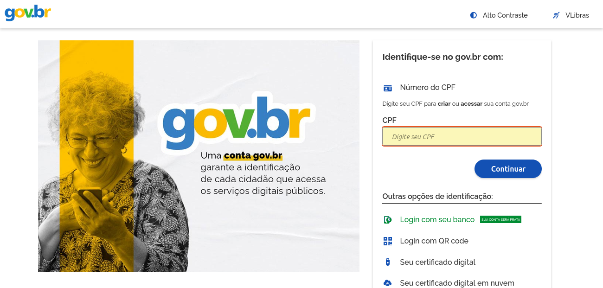
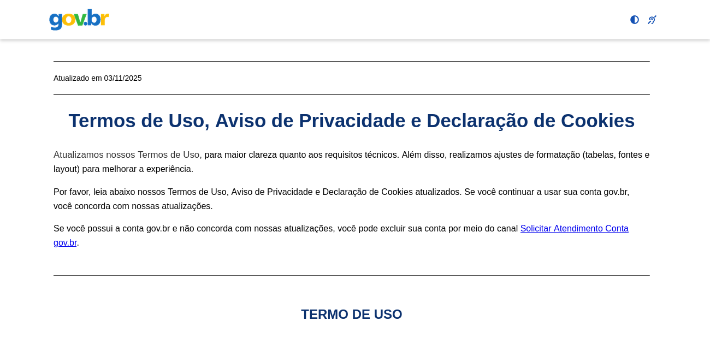
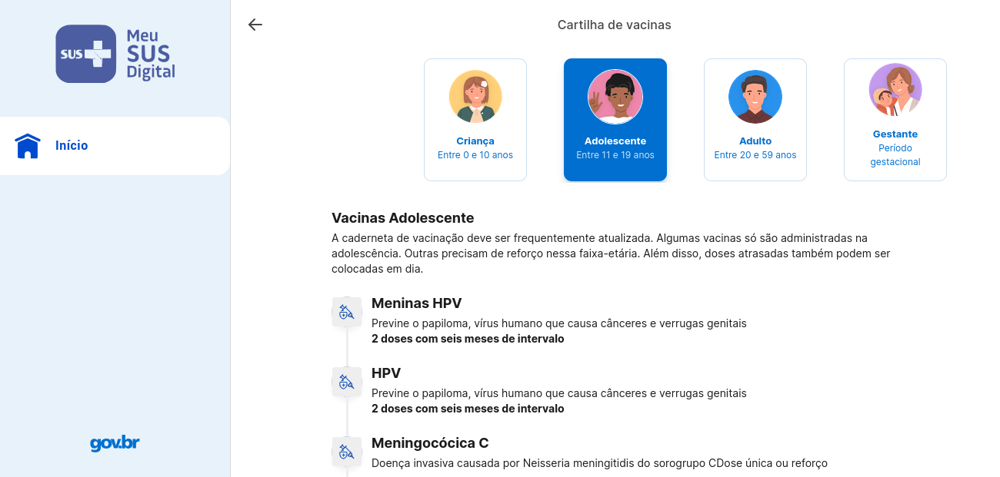

# Fluxo Selecionado para Modelagem

---

## Participantes da SubEquipe 1
| Nome do Membro | 
| :--- |
| [Artur Galdino](https://github.com/ArturFGaldino) |
| [Giovani Coelho](https://github.com/Gotc2607) |
| [João Leles](https://github.com/joaoleless) |
| [Nicole Jovita](https://github.com/nicolejovita) |

---

## Mapeamento do Fluxo

### Nome do Fluxo
Autenticação, Consentimento (LGPD) e Busca de Histórico Clínico no MEU SUS DIGITAL

### Passo a Passo do Fluxo

1. **Acesso e Redirecionamento (Gov.br):** O cidadão abre o aplicativo "Meu SUS Digital" e seleciona a opção de entrar. O aplicativo redireciona o usuário para a página segura do provedor de identidade do governo (gov.br).
2. **Autenticação Segura:** O usuário insere suas credenciais (CPF e Senha) na interface externa. Após validação, o gov.br devolve um token de sessão válido para o aplicativo.
3. **Gestão de Consentimento:** O aplicativo verifica se o usuário já aceitou os Termos de Uso e Política de Privacidade. Caso haja alguma pendência legal, a tela de consentimento (LGPD) é exibida para coleta do aceite explícito.
4. **Navegação no Histórico Clínico:** Com a sessão liberada, o usuário clica na seção de Saúde (ex: "Vacinas" ou "Exames") solicitando seu histórico.
5. **Busca na RNDS e Renderização:** O aplicativo faz uma consulta assíncrona na base da Rede Nacional de Dados em Saúde (RNDS). Ao obter sucesso, renderiza os dados (ex: Cartão de Vacina) na interface do usuário. Caso a rede falhe, apresenta a tela de indisponibilidade.

---

## Interface do Sistema (Imagens Reais)

<strong>Legenda:</strong> Figura 1 - Tela inicial de redirecionamento e login via portal Gov.br

<strong>Legenda:</strong> Figura 2 - Tela de aviso sobre Política de Privacidade e Tratamento de Dados (LGPD)

<strong>Legenda:</strong> Figura 3 - Interface de exibição dos dados de saúde consumidos da base da RNDS

---

## Histórico de Versionamento

| Nome do Membro | Contribuição | Data | Commit |
| :--- | :--- | :--- | :--- |
| [Giovani Coelho](https://github.com/Gotc2607) | Criação da estrutura do fluxograma e descrição dos passos da jornada | 17/09/2026 | [a859de6](https://github.com/UnBArqDsw2026-2-Turma01/2026.2-T01-_G5_ProjetoGovernoEletronico_Entrega_02/commit/a859de6aaa86883152dd4f48e04eee053e09a1e5) |