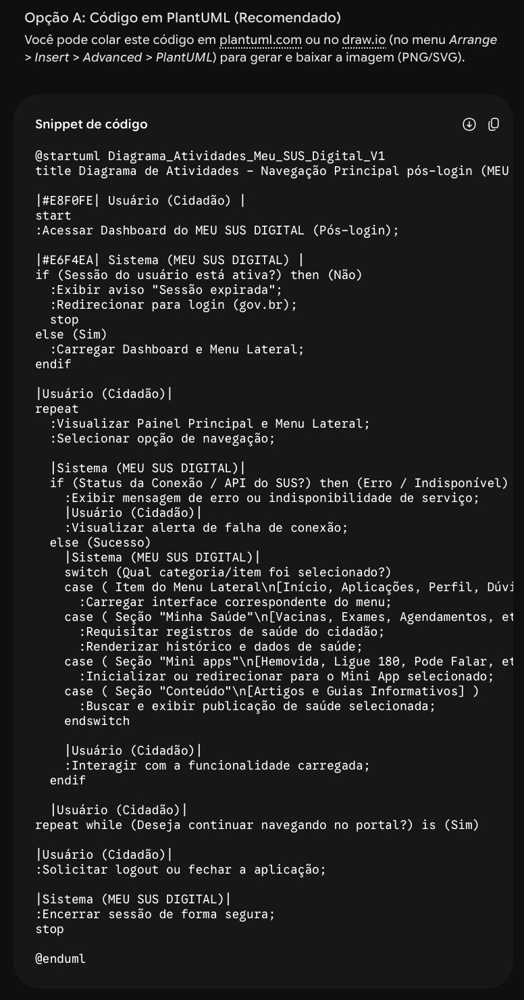
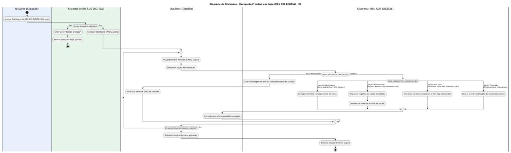
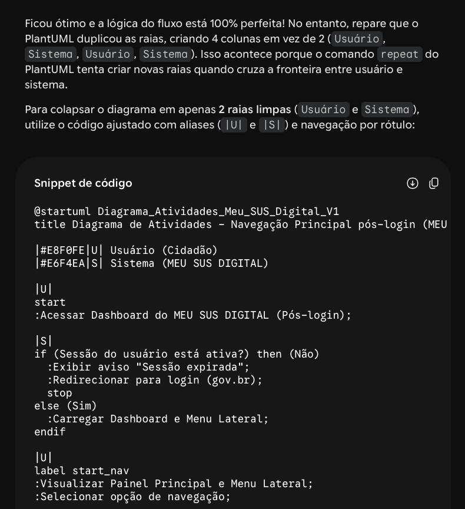
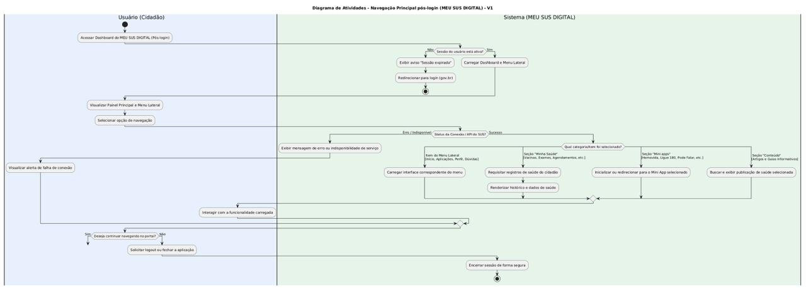
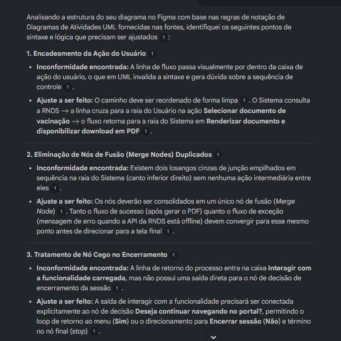
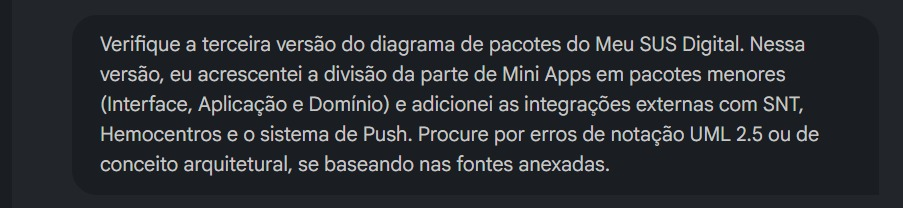
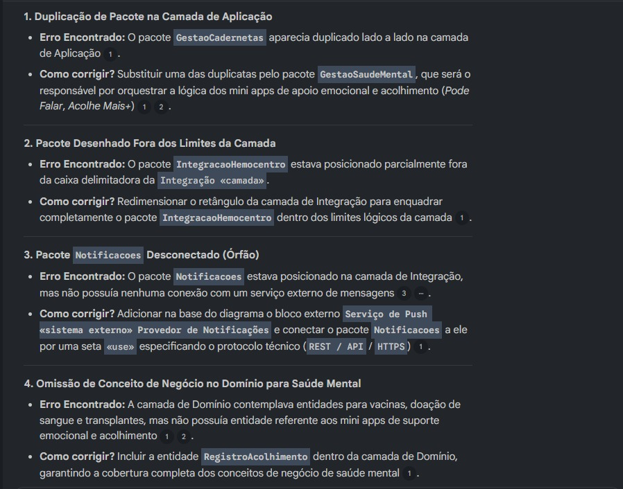

# Uso de Inteligência Artificial Generativa

## 1. Descrição e Objetivo

Este documento registra o apoio e o uso de ferramentas de **Inteligência Artificial Generativa (IAG)** na **Entrega 2** pela **SubEquipe 02**. O objetivo é apresentar com transparência, senso crítico e rastreabilidade como os modelos de linguagem foram utilizados no processo de engenharia de software, na construção e validação da **Modelagem Estática (Diagrama de Pacotes)** e da **Modelagem Dinâmica (Diagrama de Atividades)**, bem como na documentação no MkDocs.

A abordagem adotada priorizou o uso da IA como um **agente colaborador e acelerador**, mantendo o rigor técnico, a revisão humana constante e a tomada de decisão final sob responsabilidade exclusiva dos integrantes da equipe.

---

## 2. Metodologia do Foco

A coleta de depoimentos e dados de uso ocorreu de forma **assíncrona e individual**. Cada integrante contribuiu com sua própria avaliação crítica e relatos de prompts/experimentos, garantindo a autoria e a perspectiva individualizada do aprendizado.

### Ferramentas Empregadas
* **Gemini:** Utilizado para processar o fluxo detalhado em texto e converter as regras de negócio em código estruturado para a geração automática do diagrama no PlantUML, além de auxiliar na validação lógica e sintática do modelo.
* **NotebookLM:** Utilizado para auditar as imagens dos diagramas no Figma com base na bibliografia da disciplina.
* **PlantUML:** Ferramenta *open-source* baseada em código estruturado (sintaxe declarativa) para renderização automática de diagramas UML.
* **Claude Code:** Agente de IA executado em terminal, com acesso ao repositório local. Empregado para converter o BPMN da subequipe em uma proposta de estrutura de pacotes em camadas e para escrever utilitários de verificação automatizada do layout produzido.

---

## 3. Experimento com IA Generativa nas Modelagens por Frente de Trabalho

Como parte da avaliação da Entrega 2, os integrantes da subequipe aplicaram IAG nas diferentes versões e evoluções dos artefatos estáticos e dinâmicos:

### Experimento 01: Diagrama de Atividades
**Responsável:** Gustavo Fornaciari

#### Objetivo
Testar a capacidade do modelo de linguagem (Gemini) em interpretar o fluxo textual do sistema pós-login e convertê-lo diretamente em código PlantUML para a geração automática do Diagrama de Atividades, avaliando a precisão do código gerado e a qualidade da imagem resultante.

#### Resultado Obtido (1ª Iteração)

<strong>Legenda:</strong> Figura 1 - Prompt enviado à IA com o fluxo estruturado em texto.

<strong>Legenda:</strong> Figura 2 - Código PlantUML gerado pela IA.

<strong>Legenda:</strong> Figura 3 - Diagrama incorreto gerado pela primeira iteração do PlantUML.

#### Análise Crítica e Intervenção Humana (1ª Iteração)
Ao compilar o código gerado, foi identificado um erro estrutural na diagramação: as raias (*swimlanes*) foram duplicadas incorretamente devido a falhas na sintaxe declarativa do PlantUML. Embora a sequência lógica de passos estivesse em conformidade com o texto fornecido, os rótulos de transição nas setas e a organização visual ficaram comprometidos. Para corrigir o problema, foi realizada uma nova iteração enviando o código acompanhado de uma captura de tela do erro para a IA.

#### Resultado Obtido (2ª Iteração)

<strong>Legenda:</strong> Figura 4 - Prompt de correção enviado com a imagem do erro.

<strong>Legenda:</strong> Figura 5 - Código corrigido retornado pela IA.

<strong>Legenda:</strong> Figura 6 - Diagrama com raias e sintaxe corrigidas no PlantUML.

#### Análise Crítica e Intervenção Humana

A segunda iteração corrigiu com sucesso a estrutura das raias e a sintaxe lógica das decisões e agrupamentos. No entanto, a imagem exportada diretamente pelo compilador do PlantUML apresentou limitações técnicas significativas de renderização: baixa resolução gráfica e pixelização dos elementos. Diante disso, optou-se por utilizar o código validado pela IA como um **gabarito lógico**, realizando o redesenho vetorial completo dentro do Figma.

---

### Experimento 02: Diagrama de Atividades V2 e Diagrama de Pacotes V3
**Responsável:** Ana Beatriz

#### Objetivo
Utilizar o **NotebookLM** carregado com as fontes teóricas (material da profa. Milene Serrano, OMG UML 2.5.1 e livro do Guedes) para realizar revisões sobre as imagens dos diagramas gerados no Figma, identificando falhas de sintaxe UML, inconformidades de notação e omissões de conceito tanto no Diagrama de Atividades (V2) quanto no Diagrama de Pacotes (V3).

---
#### Parte 1: Validação do Diagrama de Atividades (V2)

##### Prompt Enviado

<strong>Legenda:</strong> Figura 7 - Prompt de validação do Diagrama de Atividades enviado ao NotebookLM.

##### Resultado Retornado pelo NotebookLM

<strong>Legenda:</strong> Figura 8 - Análise de sintaxe e lógica do Diagrama de Atividades retornado pelo NotebookLM.

##### Análise Crítica e Intervenção Humana
A partir dos apontamentos da IA, reestruturei manualmente o diagrama no Figma reorganizando o traçado das setas para contornar os blocos sem sobreposições e unificando dois losangos redundantes em um único *Merge Node* para tratar os fluxos de sucesso e erro da RNDS. Também eliminei um nó cego ao conectar a ação de interação de volta à decisão de navegação, garantindo a continuidade lógica e a conformidade sintática da sessão.

---

#### Parte 2: Validação do Diagrama de Pacotes (V3)

##### Prompt Enviado

<strong>Legenda:</strong> Figura 9 - Prompt enviado ao NotebookLM para auditoria da V3 do Diagrama de Pacotes.

##### Resultado Retornado pelo NotebookLM

<strong>Legenda:</strong> Figura 10 - Inconformidades estruturais apontadas pelo NotebookLM na V3 do Diagrama de Pacotes.

##### Análise Crítica e Intervenção Humana
Avaliando o relatório da IA, refatorei a modelagem no Figma substituindo um pacote duplicado pelo módulo `GestaoSaudeMental` na Aplicação e inserindo a entidade `RegistroAcolhimento` no Domínio. Além disso, ajustei o container gráfico da camada de Integração para enquadrar completamente o pacote de Hemocentros e adicionei o bloco externo `Serviço de Push` conectado via REST/API ao pacote de Notificações, garantindo a completude técnica da arquitetura.

---

### Experimento 03: Diagramas de Pacotes V1 e Atividades V3
**Responsável:** Victor Leandro

#### Objetivo
Avaliar o uso do **Claude Code**, agente de IA executado em terminal, com acesso aos artefatos do repositório, nas duas frentes sob minha responsabilidade: a **Versão 1 do Diagrama de Pacotes** (modelagem estática) e a **Versão 3 do Diagrama de Atividades** (modelagem dinâmica).

O experimento é relevante porque a IAG foi empregada em **dois papéis distintos** nas duas frentes, o que permite comparar até onde vale delegar:

* Na **V1 do Pacotes**, a IA atuou como **tradutora conceitual**: converteu os artefatos anteriores da subequipe em uma proposta de estrutura arquitetural, e o diagrama foi desenhado por mim a partir dela.
* Na **V3 das Atividades**, a IA atuou como **autora do artefato**: gerou o arquivo-fonte do draw.io (`.drawio`, XML mxGraph) e os utilitários para verificar o próprio resultado.

A hipótese testada na segunda frente era: se o diagrama nasce como **código estruturado e versionável**, então ele pode ser **verificado programaticamente**, checando sobreposição de caixas, arestas atravessando blocos e nós desconectados, algo impossível de automatizar quando o diagrama é desenhado manualmente no Figma.

---

#### Parte 1: Diagrama de Pacotes V1 (Modelagem Estática)

##### Metodologia

Nesta frente utilizei a IAG exclusivamente na etapa de **tradução conceitual entre artefatos**. O ponto de partida era o BPMN produzido pela subequipe na Entrega 1, que descrevia o sistema em termos de **fluxo**, piscinas, gateways, eventos de mensagem e depósitos de dados. O Diagrama de Pacotes, porém, exige o sistema descrito em termos de **estrutura**: responsabilidades alocadas em módulos.

Submeti os artefatos anteriores ao Claude Code e pedi a conversão de um registro para o outro. O modelo propôs o agrupamento das responsabilidades observadas no fluxo em uma **arquitetura em camadas**, Apresentação, Aplicação, Domínio e Integração,, mais um pacote transversal para as preocupações que o SIG e o Rich Picture destacavam (segurança, privacidade e tratamento de falhas), e a manutenção de `gov.br` e `RNDS` como sistemas externos fora da fronteira.

##### Análise Crítica e Intervenção Humana

**O que a IA entregou.** O valor da IAG aqui foi de **natureza conceitual, não gráfica**: ela ajudou a enxergar que serviços aparentemente distintos no BPMN (vacinas, exames, agendamentos) percorriam o mesmo caminho, autenticar, consultar a RNDS, exibir, opcionalmente gerar comprovante, e que, por isso, organizar os pacotes por funcionalidade duplicaria essa estrutura três ou quatro vezes, enquanto camadas a representariam uma única vez.

**O que eu fiz.** O diagrama em si foi **construído manualmente por mim** a partir dessa proposta. A IA não produziu o artefato final nesta frente: ela produziu o raciocínio de agrupamento, e a modelagem, posicionamento dos pacotes, traçado e sentido das dependências, aplicação dos estereótipos `«camada»`, `«use»` e `«sistema externo»`, e delimitação da fronteira do sistema, foi feita no editor de diagramas por decisão própria.

**Por que essa divisão foi deliberada.** Em um Diagrama de Pacotes, o conteúdo relevante é a **decisão de acoplamento**: o que depende de quê, e em que sentido. Aceitar um layout gerado automaticamente significaria aceitar decisões arquiteturais sem tê-las avaliado uma a uma. Manter o desenho sob controle manual foi o que permitiu verificar a ausência de ciclos entre pacotes e sustentar cada dependência com uma justificativa própria.

---

#### Parte 2: Diagrama de Atividades V3 (Modelagem Dinâmica)

Na evolução da V2 para a V3 do Diagrama de Atividades a delegação foi mais profunda: o agente recebeu acesso de leitura e escrita ao repositório local e produziu ele mesmo o arquivo-fonte do diagrama.

##### Metodologia e Iterações

Esta parte do experimento seguiu cinco etapas:

1. **Diagnóstico da V2 pela IA:** forneci a imagem da V2 e o relatório da página de Modelagem Dinâmica. O modelo identificou por conta própria a nota `Fluxo de Agendamentos a ser completado` como pendência de modelagem e apontou a ausência total de *Forks*/*Joins*, apesar de a fundamentação teórica da própria página citá-los como recurso distintivo do Diagrama de Atividades.
2. **Delimitação humana de escopo:** das melhorias propostas pela IA, selecionei apenas duas, completar o fluxo de Agendamentos e introduzir *Forks*/*Joins*. Recusei deliberadamente as correções de sintaxe UML e a criação de uma terceira raia, para manter a rastreabilidade em relação à V2.
3. **Geração do artefato-fonte:** o modelo produziu o arquivo `.drawio` com 58 nós e 72 fluxos de controle, distribuídos nas raias `USUÁRIO` e `SISTEMA`.
4. **Construção de instrumentos de verificação:** a máquina de trabalho não possuía Python, Java nem o draw.io desktop instalados, de modo que não havia como renderizar o arquivo para conferência visual. Diante disso, a IA escreveu dois utilitários em Node.js: um **renderizador** que interpreta o XML mxGraph e aproxima o roteamento ortogonal das arestas, exportando SVG; e um **validador** que recalcula o trajeto de cada aresta e reporta qualquer segmento que intersecte a caixa de um nó, além de verificar sobreposições, contenção nas raias e nós órfãos.
5. **Ciclo de correção:** a primeira versão gerada passava na checagem de sobreposição, mas a inspeção visual do render revelou **defeitos reais de layout**, as arestas dos ramos "Ver detalhes" e "Cancelar agendamento" cruzavam por cima do bloco `Exibir detalhes do agendamento`. A região de Agendamentos foi reposicionada e a validação passou a retornar ausência de conflitos.

##### Análise Crítica e Intervenção Humana

A abordagem confirmou parcialmente a hipótese, mas expôs uma limitação de fundo que considero o achado mais relevante do experimento.

**O que funcionou.** Gerar o diagrama como código permitiu transformar "está bonito?" em uma pergunta objetiva e automatizada. O validador apontou conflitos de layout que eu não teria percebido manualmente em um diagrama com 72 arestas, e o resultado final é um artefato versionável, passível de `diff` e revisão em *pull request*, ao contrário de uma imagem exportada.

**O que não funcionou.** A IA **não consegue enxergar o próprio resultado** nativamente: ela precisou construir um renderizador para inspecionar o que havia produzido. Esse renderizador apenas *aproxima* o algoritmo de roteamento do draw.io, portanto a verificação recaiu sobre uma aproximação do artefato, e não sobre o artefato real. A conferência definitiva continuou dependendo de eu abrir o arquivo no draw.io e reexportar a imagem manualmente.

**Intervenções humanas que foram indispensáveis:**

* **Controle de escopo.** A IA introduziu por iniciativa própria condições de guarda entre colchetes (`[Sim]`, `[Não]`), correção que eu havia **explicitamente recusado** ao delimitar o escopo. Foi necessário revertê-la para preservar a nomenclatura da V2. Isso evidencia que a disciplina de escopo permanece responsabilidade humana, mesmo quando a sugestão do modelo é tecnicamente correta.
* **Decisão de modelagem.** A escolha de quais melhorias incorporar, e de quais deixar para uma V4, partiu da avaliação do histórico da subequipe, não do modelo.
* **Exportação final.** O PNG publicado nesta entrega foi reexportado por mim no draw.io, já que o render gerado pela IA tinha acabamento tipográfico distinto do padrão visual adotado pelo grupo nas versões anteriores.

**Falha de processo registrada para transparência.** O arquivo-fonte `.drawio` não foi incluído no commit da V3, e apenas o PNG foi versionado. Sem o fonte, uma futura V4 precisaria redesenhar o diagrama desde o início, o que anula justamente a principal vantagem da abordagem testada. O episódio reforça que gerar o artefato em formato versionável só entrega valor se a disciplina de versionamento acompanhar a decisão técnica.

---

## 4. Análise Crítica e Lições Aprendidas

Abaixo estão consolidados os aspectos avaliados durante a experimentação de IA Generativa na construção e validação dos artefatos:

* **Cobertura Conceitual:** A IA demonstrou alta eficiência em mapear caminhos lógicos e apoiar a revisão notacional das especificações da OMG.
* **Legibilidade e Layout:** Layouts gerados automaticamente (ex: PlantUML) apresentam limitações de legibilidade e acabamento visual, exigindo redesign manual no Figma.
* **Aderência à Técnica UML:** A verificação de regras como fluxo *top-down* e uso de estereótipos (`«use»`, `«camada»`) é acelerada com IAG, mas requer conferência com a bibliografia da disciplina.
* **Influência do Prompting:** Prompts iterativos acompanhados de capturas de tela e trechos da norma resultam em correções sintáticas significativamente mais precisas.
* **Formato de Saída como Decisão de Engenharia:** Solicitar à IAG o **arquivo-fonte** do diagrama (ex: `.drawio`, PlantUML) em vez de uma imagem permite verificação automatizada por script, `diff` e revisão em *pull request*. O ganho só se concretiza, porém, se o arquivo-fonte for efetivamente versionado junto ao artefato exportado.
* **Limites da Autoavaliação:** Os modelos não inspecionam nativamente o resultado visual que produzem. Toda validação de legibilidade e acabamento recaiu sobre renderização intermediária ou conferência humana direta na ferramenta de diagramação.

---

## 5. Pontos de Vista Individuais

### Ana Beatriz 
* **GitHub:** [@AnnaBeatrizAraujo](https://github.com/AnnaBeatrizAraujo)

* **Uso da IA Generativa (Senso Crítico):** Utilizei a IAG (especificamente o NotebookLM abastecido com fontes confiaveis) para a validação arquitetural e notacional tanto do Diagrama de Atividades (V2) quanto da Versão 3 do Diagrama de Pacotes. A ferramenta auxiliou na checagem de conformidade com as regras de sintaxe da UML 2.5.1 (OMG e Guedes), na identificação de falhas de fluxo, nos nós de fusão (*Merge Nodes*) e na verificação do desacoplamento da camada de Mini Apps. A IA funcionou de forma excelente como auditora técnica para apontar erros no Figma.

* **Lições Aprendidas:**
 A principal lição foi compreender a importância do rigor notacional e da coesão estrutural na modelagem de sistemas complexos. Entendi na prática como aplicar o desacoplamento em camadas e a modularização de componentes (separando interface, aplicação e domínio nos Mini Apps), além de perceber que a rastreabilidade entre o BPMN e a modelagem UML é fundamental para garantir que o software reflita com precisão as regras de negócio do domínio da saúde.

---

### Gustavo Fornaciari

* **GitHub:** [@GUGOFO](https://github.com/GUGOFO)

* **Uso da IA Generativa (Senso Crítico):** Utilizei o Gemini para converter a especificação textual do fluxo do sistema em código PlantUML e validar a coerência lógica do Diagrama de Atividades. A ferramenta funcionou de maneira excelente como um copiloto para aceleração sintática, permitindo estruturar em minutos um diagrama complexo com múltiplas raias e tomadas de decisão. No entanto, o experimento evidenciou as limitações da IA e do PlantUML no quesito de qualidade e acabamento visual. O redesenho manual no Figma foi indispensável para entregar um artefato com padrão profissional.

* **Lições Aprendidas:**
  A principal lição foi compreender a importância da clareza notacional e da coesão estrutural na representação visual de sistemas de grande porte. Ao elaborar a **Primeira Versão (V1) do Diagrama de Atividades**, consolidei na prática o mapeamento de fluxos dinâmicos e o uso de partições (*swimlanes*) para delimitar claramente as responsabilidades entre as ações do cidadão e do sistema. Complementarmente, o desenvolvimento da **Segunda Versão (V2) do Diagrama de Pacotes** aprofundou meu entendimento sobre modularização, organização de subsistemas e controle de dependências arquiteturais, garantindo uma visão coerente, escalável e bem delimitada da aplicação.
---

### Victor Leandro
* **GitHub:** [@Afrontoso](https://github.com/Afrontoso)

* **Uso da IA Generativa (Senso Crítico):** Utilizei o Claude Code nas duas frentes que conduzi, mas em profundidades deliberadamente diferentes. Na **V1 do Diagrama de Pacotes**, deixei a IA apenas na tradução conceitual, converter o BPMN, que descreve o sistema como fluxo, em uma proposta de estrutura em camadas, e desenhei o diagrama eu mesmo a partir dela. Fiz essa escolha porque, num Diagrama de Pacotes, o que está em jogo é a decisão de acoplamento: aceitar um layout automático seria aceitar decisões arquiteturais sem avaliá-las uma a uma. Na **V3 do Diagrama de Atividades**, deleguei mais: a IA gerou o próprio arquivo-fonte do draw.io (XML mxGraph), tratando o diagrama como código em vez de imagem. O ganho real aí não foi velocidade de desenho, e sim **verificação automatizada**, pedi um validador que percorre as 72 arestas e acusa qualquer uma que atravesse um bloco, além de checar sobreposições e nós desconectados, e ele encontrou defeitos que eu não teria notado a olho nu. Em contrapartida, a ferramenta expôs um limite claro: não enxerga o próprio resultado e precisou construir um renderizador para se inspecionar, de modo que a conferência recaiu sobre uma aproximação do artefato, não sobre ele. A palavra final continuou sendo minha, abrindo o arquivo no draw.io.

* **Lições Aprendidas:**
  A lição central foi perceber que **o quanto delegar depende da natureza do artefato**, e não da capacidade do modelo. No diagrama estático, o conteúdo de valor é a decisão de dependência entre módulos, e terceirizar o desenho significaria terceirizar a arquitetura, então a IA ficou no raciocínio e eu no traçado. No diagrama dinâmico, o conteúdo de valor é a completude do fluxo, e o layout é consequência mecânica disso, o que tornou seguro delegar o desenho inteiro. Aprendi também que escolher o **formato de saída** é uma decisão de engenharia mais importante que escolher o prompt: pedir uma imagem produz algo que só pode ser avaliado por inspeção humana, enquanto pedir o arquivo-fonte produz algo testável por script, revisável em *pull request* e evoluível numa próxima versão. Por fim, duas lições vindas de erro próprio, a IA aplicou correções de sintaxe UML que eu havia explicitamente recusado, e foi preciso revertê-las, o que mostra que decidir *o que não fazer* segue sendo função humana; e o arquivo-fonte não entrou no commit inicial da V3, de modo que versionar só o PNG jogaria fora exatamente a vantagem que eu havia buscado.

---

## 6. Síntese do Aprendizado da Subequipe

A utilização da Inteligência Artificial Generativa ao longo da Entrega 2 permitiu otimizar o tempo de validação lógica e sintática tanto dos diagramas estáticos quanto dos dinâmicos. A experiência consolidou o entendimento de que a IAG é extremamente eficaz na prevenção de erros notacionais e na aceleração de rascunhos, mas que o trabalho de engenharia de software é um processo estritamente humano e reflexivo.

## Histórico de Versionamento

| Nome do Membro  | Contribuição   | Data  | Commit |
| ---- | ------ | ----- | ---- |
| [Gustavo Fornaciari](https://github.com/GUGOFO) | Criação do Repositório | 10/09/2026 | [efd139e](https://github.com/UnBArqDsw2026-2-Turma01/2026.2-T01-_G5_ProjetoGovernoEletronico_Entrega_02/commit/efd139e36025a5c1610fff909ac41451ab13eecd) |
| [Artur Galdino](https://github.com/ArturFGaldino) e [Nicole Jovita](https://github.com/nicolejovita) | Criação do template da documentação de IA Generativa, experimentos e relatos | 17/09/2026 | [8ddaf26](https://github.com/UnBArqDsw2026-2-Turma01/2026.2-T01-_G5_ProjetoGovernoEletronico_Entrega_02/commit/8ddaf262b0619515620ef2f029cc1ae973b3626f) |
| [Gustavo Fornaciari](https://github.com/GUGOFO) | Criação do Repositório | 10/09/2026 | [cbc2910](https://github.com/UnBArqDsw2026-2-Turma01/2026.2-T01-_G5_ProjetoGovernoEletronico_Entrega_02/commit/cbc291011901135eddbe798db4fd4650e2530000) |
| [Ana Beatriz Araujo](https://github.com/AnnaBeatrizAraujo) | Modificações na estrutura do template e adição do experimento de IA Generativa | 17/09/2026 | [7873814](https://github.com/UnBArqDsw2026-2-Turma01/2026.2-T01-_G5_ProjetoGovernoEletronico_Entrega_02/commit/7873814259569e3c67ceb28e7448e54588b18ea4) |
| [Gustavo Fornaciari](https://github.com/GUGOFO) | Atualizar Licoes Aprendidas | 10/09/2026 | [37c82b9](https://github.com/UnBArqDsw2026-2-Turma01/2026.2-T01-_G5_ProjetoGovernoEletronico_Entrega_02/commit/efd139e36025a5c1610fff909ac41451ab13eecd) |
| [Victor Leandro](https://github.com/Afrontoso) | Adição do Experimento 03 (Diagrama de Pacotes V1 e Diagrama de Atividades V3), ponto de vista individual e ferramenta empregada | 17/09/2026 | [46113ed](https://github.com/UnBArqDsw2026-2-Turma01/2026.2-T01-_G5_ProjetoGovernoEletronico_Entrega_02/commit/46113ed33d814b0c5008f33dd924a705d593605a) |
| [Gustavo Fornaciari](https://github.com/GUGOFO) | Atualizar Commits e Imagens | 10/09/2026 | [37c82b9](https://github.com/UnBArqDsw2026-2-Turma01/2026.2-T01-_G5_ProjetoGovernoEletronico_Entrega_02/commit/efd139e36025a5c1610fff909ac41451ab13eecd) |
