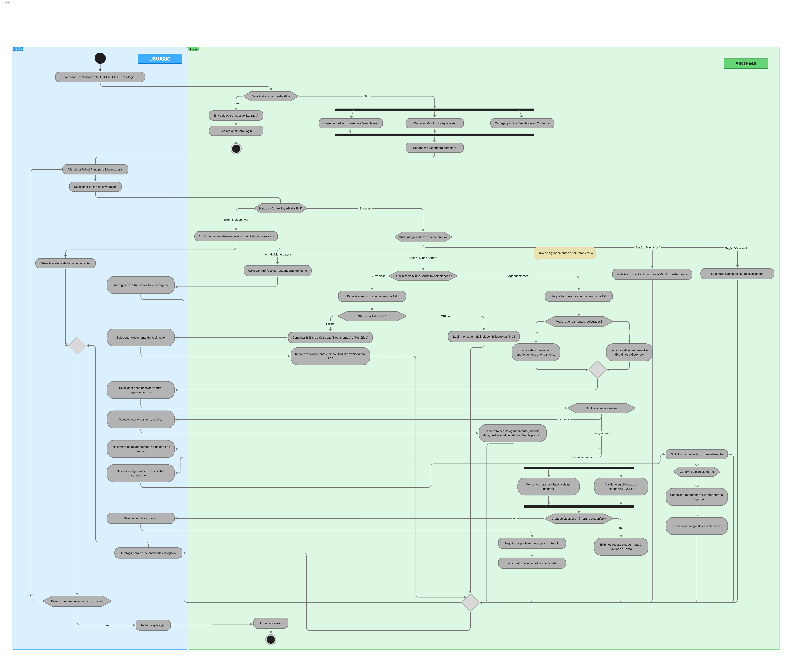

# Modelagem Dinamica 

---

## Versão Final

<iframe style="border: 1px solid rgba(0, 0, 0, 0.1); border-radius: 8px;" width="100%" height="450" src="https://www.figma.com/embed?embed_host=share&url=https%3A%2F%2Fwww.figma.com%2Fboard%2FEMs5IeE2EYVVNnXhxXQ6DB%2FSem-t%25C3%25ADtulo%3Fnode-id%3D2-8%26t%3DOx3KOFxJhVSagYIZ-1" allowfullscreen></iframe>

<strong>Legenda:</strong> Diagrama de Atividade Completo

---

## Participantes 
| Nome do Membro | 
| :--- |
| [Gustavo Fornaciari](https://github.com/GUGOFO) |
| [Ana Beatriz](https://github.com/AnnaBeatrizAraujo) |
| [Victor Leandro](https://github.com/Afrontoso) |

---

## Fundamentação Teorica

### O que é o Diagrama de Atividades

O **Diagrama de Atividades** é um artefato comportamental e dinâmico da **UML** (*Unified Modeling Language*). Ele é utilizado para mapear a sequência procedural de ações, fluxos de trabalho operacionais, regras de negócio e processos de sistema. Enquanto diagramas estruturais descrevem a arquitetura estática das classes e componentes, o Diagrama de Atividades enfatiza a lógica do fluxo de controle e de dados de um determinado cenário de uso.

Conforme apresentado nas diretrizes teóricas da Profa. Milene Serrano, os diagramas dinâmicos visam expor o comportamento em tempo de execução da aplicação. Embora apresente semelhanças conceituais com fluxogramas tradicionais, a notação UML do Diagrama de Atividades oferece suporte a construções semânticas avançadas, tais como:

* Execução paralela e sincronizada de ações (*Forks* e *Joins*).
* Segregação clara de responsabilidades por domínios ou atores via Raias de Responsabilidade (*Swimlanes/Partitions*).
* Mecanismos explícitos para tratamento de eventos, recepção/envio de sinais e gerenciamento de exceções.

### Principais Elementos e Regras da Notação UML

* **Nó Inicial (*Initial Node*):** Círculo preenchido que marca o ponto de partida do fluxo de atividades.
* **Ação ou Atividade (*Action State*):** Retângulo com cantos arredondados que representa uma tarefa executável individual ou etapa do processo.
* **Fluxo de Controle (*Control Flow*):** Aresta direcionada (seta) que indica a ordem cronológica e a transição entre atividades.
* **Nó de Decisão (*Decision Node*):** Símbolo em losango com um fluxo de entrada e múltiplos fluxos de saída associados a condições de guarda `[condição]`, orientando o desvio do caminho segundo validações de contexto.
* **Nó de Mesclagem/Junção (*Merge Node*):** Losango com múltiplos fluxos de entrada e apenas um de saída, utilizado para reordenar rotas alternativas que concorrem para o mesmo ponto do fluxo.
* **Partições / Raias de Responsabilidade (*Swimlanes*):** Colunas ou faixas visuais que organizam e agrupam as atividades de acordo com o ator, subsistema ou camada responsável pela sua execução.
* **Nó Final de Atividade (*Activity Final Node*):** Círculo preenchido contido dentro de um anel externo, representando o encerramento completo de todas as execuções do diagrama.

---

## Desenvolvimento

### Versão 1

<strong>Legenda:</strong> Figura 2 - Diagrama de Atividades de alto nível para a navegação pós-login

#### Descrição da Versão 1
A **Versão 1** foca no mapeamento de **alto nível** da jornada do cidadão após a autenticação bem-sucedida no portal MEU SUS DIGITAL. O objetivo principal foi formalizar o comportamento dinâmico do menu lateral e das áreas do painel principal, contemplando o tratamento de exceções de sessão e falhas de comunicação com serviços legados da plataforma.

#### Convenções Visuais e Legenda do Modelo
Para garantir uniformidade e legibilidade, a modelagem foi estruturada sob as seguintes diretrizes:
* **Partições:** O diagrama é dividido em duas colunas visuais — **Usuário** e **Sistema**.
* **Condições de Guarda:** Expressões de validação associadas às saídas de nós de decisão.
* **Estrutura de Repetição:** Implementação de um ciclo de navegação que permite ao cidadão realizar múltiplas consultas seguidas sem a necessidade de reautenticação, direcionando-o para o nó de encerramento seguro apenas quando optar por sair ou quando a sessão expirar.

#### Mapeamento de Raias e Responsabilidades

| Raia / Partição | Camada / Ator | Responsabilidades no Fluxo |
| :--- | :--- | :--- |
| **`Usuário`** | Ator Humano / Frontend | Disparar requisições na interface, selecionar itens do menu lateral/painel, visualizar alertas e decidir pela continuidade da sessão ou encerramento. |
| **`Sistema`** | Backend / Serviços Integrados | Validar token/sessão do usuário, verificar conectividade com APIs do SUS, rotear requisições, buscar dados clínicos e encerrar a sessão de forma segura. |

---

### Versão 2

<strong>Legenda:</strong> Figura 3 - Diagrama de Atividades refinado e adaptado ao padrão UML 

#### O Que Foi Modificado na Estrutura

* **Adição e Detalhamento Completo do Fluxo de Vacinas:** Incorporação de todo o fluxo funcional do módulo de vacinas, englobando a requisição de registros na API da RNDS, tratamento de estados de conexão (Online/Offline), exibição das abas "Documentos" e "Histórico", seleção do documento e renderização do PDF para download.
* **Inclusão dos Símbolos de Decisão:** Adição dos losangos de decisão para representar explicitamente as ramificações condicionais (como Sim/Não), que antes não utilizavam os símbolos adequados para nós de decisão.
* **Correção da Ação na Opção "Sim" da Validação de Sessão:** Ajuste no texto e na ação do ramo Sim após a verificação *"Sessão do usuário está ativa?"*. O texto anterior estava incorreto e foi ajustado para a ação funcional real: `Carregar Dashboard e Menu lateral`.
* **Padronização de Nomenclatura com Verbos de Ação:** Alteração do bloco estático "Seção Conteúdo" para a ação verbal `Exibir publicação de saúde selecionada`.

#### Por Que Essas Modificações Foram Feitas 

* **Fidelidade ao Domínio de Negócio (Módulo de Vacinas):** O detalhamento da integração com a RNDS e da emissão de comprovantes vacinais garante que o artefato retrate com precisão uma das funcionalidades centrais do Meu SUS Digital.
* **Sintaxe e Padrão Visual UML** A introdução formal dos losangos de decisão com rótulos de guarda nas arestas (ex: `Sim`, `Não`, `Online`, `Offline`) garante conformidade com a especificação oficial de modelagem comportamental da UML para desvios de fluxo.
* **Correção de Inconsistência de Texto de Interface:** A alteração do rótulo no ramo Sim elimina erros de texto que comprometiam o entendimento do comportamento do sistema no momento pós-autenticação.
* **Padronização Semântica de Ações:** Na UML, blocos de ação representam unidades executáveis de comportamento (expressas por verbos no infinitivo) e não rótulos estáticos de menus ou categorias da interface.

### Versão 3

<strong>Legenda:</strong> Figura 4 - Diagrama de Atividades com o fluxo de Agendamentos completo e uso de Forks/Joins

#### O Que Foi Modificado na Estrutura

* **Detalhamento Completo do Fluxo de Agendamentos:** Substituição da nota `Fluxo de Agendamentos a ser completado`, que na Versão 2 sinalizava uma pendência de modelagem, pelo fluxo funcional completo do módulo. O novo trecho contempla a verificação da existência de registros (`Possui agendamentos registrados?`), a exibição da lista segmentada em "Próximos" e "Histórico", o tratamento do estado vazio e a ramificação nas três ações disponíveis ao cidadão:
    * **Ver detalhes:** seleção do agendamento na lista e exibição de unidade, data, profissional e orientações de preparo.
    * **Novo agendamento:** seleção de tipo de atendimento e unidade, validação combinada de elegibilidade e disponibilidade, escolha de data e horário, registro com geração de protocolo e confirmação com notificação ao cidadão. O caminho de recusa exibe o motivo e sugere unidade ou data alternativa.
    * **Cancelar agendamento:** solicitação de cancelamento, confirmação explícita pelo cidadão, liberação do horário na agenda e exibição do comprovante de cancelamento.
* **Introdução de Nós de Bifurcação e União (*Forks* e *Joins*):** Inclusão de duas barras de sincronização no diagrama, representando comportamentos que ocorrem de forma concorrente:
    * **Carregamento do Dashboard:** após a validação da sessão, o fluxo se divide em três ações paralelas — `Carregar dados do usuário e Menu lateral`, `Carregar Mini Apps disponíveis` e `Carregar publicações da seção Conteúdo` — que se reagrupam em um *Join* antes de `Renderizar Dashboard completo`.
    * **Validação de um novo agendamento:** `Consultar horários disponíveis na unidade` e `Validar elegibilidade do cidadão (CNS/CPF)` passam a ser executadas em paralelo, sincronizando-se antes da decisão que autoriza o agendamento.

#### Por Que Essas Modificações Foram Feitas

* **Eliminação de Pendência de Modelagem:** A nota de "fluxo a ser completado" deixava uma das funcionalidades centrais do Meu SUS Digital sem representação comportamental. O detalhamento do módulo de Agendamentos encerra essa lacuna e coloca o fluxo no mesmo nível de profundidade já aplicado ao módulo de Vacinas na Versão 2.
* **Aderência à Notação Comportamental da UML:** A fundamentação teórica desta página aponta a execução paralela e sincronizada de ações (*Forks* e *Joins*) como um dos recursos semânticos que distinguem o Diagrama de Atividades de um fluxograma tradicional. Até a Versão 2, porém, o artefato não utilizava nenhum desses nós, descrevendo como estritamente sequencial um comportamento que é concorrente. Os dois *Forks* introduzidos alinham o diagrama ao referencial teórico adotado pela subequipe.
* **Fidelidade ao Comportamento Real da Aplicação:** O carregamento do painel principal e as validações que antecedem um agendamento não dependem uma da outra e são disparadas simultaneamente pela aplicação. Modelá-las em série transmitiria uma noção incorreta de acoplamento e de tempo de resposta entre as etapas.
* **Cobertura dos Caminhos de Exceção do Novo Fluxo:** As ramificações de estado vazio, de cidadão inelegível ou sem horário disponível e de desistência do cancelamento garantem que o fluxo de Agendamentos represente também os cenários alternativos, e não apenas o caminho de sucesso.

---

## Metodologia

A Subequipe alinhou-se à metodologia geral estabelecida para o projeto. Para a construção, refinamento e garantia de qualidade dos artefatos de modelagem, adotou-se o seguinte fluxo de trabalho:

1. **Alinhamento Geral da Equipe:** Realização de reunião com todo o grupo para discutir a distribuição dos artefatos. Ficou sob responsabilidade do nosso subgrupo a elaboração da Modelagem Dinâmica (**Diagrama de Atividades**) e da Modelagem Estática (**Diagrama de Pacotes**).
2. **Planejamento e Alinhamento Interno:** Encontro focado do subgrupo para delimitar o escopo, alinhar conceitos arquiteturais e estruturar a divisão das entregas em iterativas de versionamento.
3. **Elaboração Individual e Evolutiva:** Cada integrante desenvolveu suas próprias versões dos diagramas (V1, V2, etc.), garantindo que todos exercitassem ambas as notações (estática e dinâmica). Essa prática promoveu a divergência positiva de ideias e o refinamento contínuo do artefato final.
4. **Revisão por Pares e Validação via Pull Requests (PRs):** Para a inclusão de qualquer alteração ou novo versionamento, o integrante responsável abria um *Pull Request* no repositório. A fusão (*merge*) dependia da revisão e validação assíncrona dos demais membros, estabelecendo uma camada adicional de controle de qualidade e consistência técnica.

---

### Embasamento teórico para criação:

1. UML-DIAGRAMS. *UML Activity Diagrams*. Disponível em: https://www.uml-diagrams.org/activity-diagrams.html. Acesso em: 15/09/2026.
2. GUEDES, Gilleanes T. A. UML 2 - Uma Abordagem Prática. 3. ed. São Paulo: Novatec Editora, 2018. ISBN 978-85-7522-646-9.

---

| Nome do Membro  | Contribuição   | Data  | Commit |
| ---- | ------ | ----- | ---- |
| [Gustavo Fornaciari](https://github.com/GUGOFO) | Criação do Repositorio | 10/09/2026 | [efd139e](https://github.com/UnBArqDsw2026-2-Turma01/2026.2-T01-_G5_ProjetoGovernoEletronico_Entrega_02/commit/efd139e36025a5c1610fff909ac41451ab13eecd) | 
| [Gustavo Fornaciari](https://github.com/GUGOFO) | Versão 1 do documento | 16/09/2026 | [49119c4](https://github.com/UnBArqDsw2026-2-Turma01/2026.2-T01-_G5_ProjetoGovernoEletronico_Entrega_02/commit/49119c4aa83aea0ca96363dbf53056a7dfb382e0) | 
| [Gustavo Fornaciari](https://github.com/GUGOFO) | Adicionar Figma | 16/09/2026 | [c49c2e7](https://github.com/UnBArqDsw2026-2-Turma01/2026.2-T01-_G5_ProjetoGovernoEletronico_Entrega_02/commit/c49c2e7f338713f2ccf0bebdef2fc262a4eea01d) | 
| [Ana Beatriz Araujo](https://github.com/AnnaBeatrizAraujo) | Versão 2 do diagrama de atividades | 16/09/2026 | [6cf9cf0](https://github.com/UnBArqDsw2026-2-Turma01/2026.2-T01-_G5_ProjetoGovernoEletronico_Entrega_02/commit/6cf9cf0ae92b83a9b56113a1c4d218094bd8c2da) |
| [Victor Leandro](https://github.com/Afrontoso) | Versão 3 do diagrama de atividades: fluxo de Agendamentos completo e inclusão de Forks/Joins | 17/09/2026 | [d9ec46d](https://github.com/UnBArqDsw2026-2-Turma01/2026.2-T01-_G5_ProjetoGovernoEletronico_Entrega_02/commit/d9ec46d42f9148f46df6aacdd9baf00504491a3d) |
| [Gustavo Fornaciari](https://github.com/GUGOFO) | Atualizar Commits e Imagens | 17/09/2026 | [3a6415f](https://github.com/UnBArqDsw2026-2-Turma01/2026.2-T01-_G5_ProjetoGovernoEletronico_Entrega_02/commit/3a6415f535b9141b651bd6ff5c6e17d46f2bb892) |