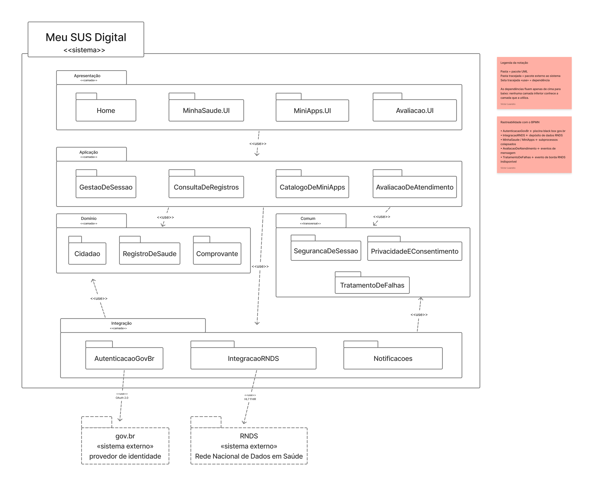
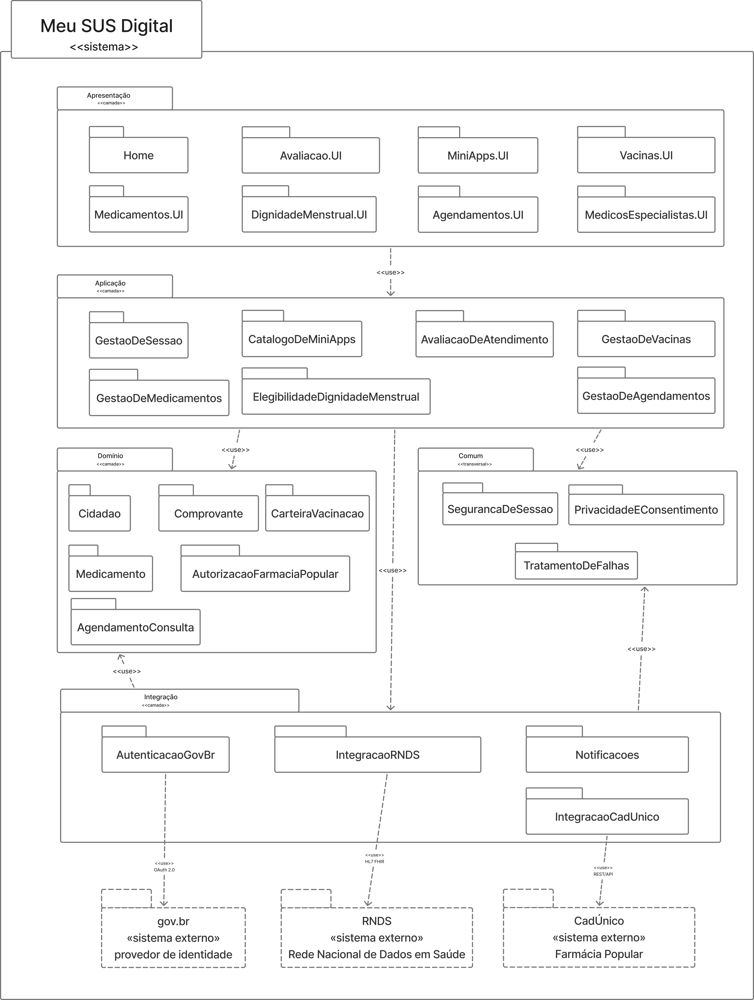

# Modelagem Estática

A modelagem estática da SubEquipe 02 foi feita com o **Diagrama de Pacotes** da UML, aplicado ao **Meu SUS Digital**, o mesmo sistema que a subequipe já havia analisado por Engenharia Reversa nos artefatos da Entrega 01 (Rich Picture, SIG e BPMN).

---

## Versão Final

<iframe style="border: 1px solid rgba(0, 0, 0, 0.1);" width="800" height="450" src="https://embed.figma.com/board/EMs5IeE2EYVVNnXhxXQ6DB/Sem-t%C3%ADtulo?node-id=0-1&embed-host=share" allowfullscreen></iframe>

<strong>Legenda:</strong> Diagrama de Pacotes do Meu SUS Digital.

---

## Participantes
| Nome do Membro |
| :--- |
| [Gustavo Fornaciari](https://github.com/GUGOFO) |
| [Ana Beatriz](https://github.com/AnnaBeatrizAraujo) |
| [Victor Leandro](https://github.com/Afrontoso) |

---

#### Fundamentação Teórica

O **Diagrama de Pacotes** é um diagrama **estrutural e organizacional** da UML. Segundo o material da disciplina, trata-se de "mais um diagrama estrutural, estático, o qual permite organizar o sistema como se representasse uma visão em módulos" (SERRANO, 2026). Ele não descreve comportamento nem detalha classes: seu papel é **agrupar elementos de modelagem em unidades maiores e mostrar como essas unidades dependem umas das outras**.

Na taxonomia apresentada em aula, a UML é dividida em diagramas estruturais/estáticos, comportamentais/dinâmicos, **organizacionais (ou em pacotes)** e anotacionais. O Diagrama de Pacotes ocupa justamente a fatia organizacional; é o diagrama que responde à pergunta *"como o sistema está dividido?"* antes de responder *"como cada parte funciona?"*.

##### Elementos da notação utilizados

| Elemento | Representação | Uso neste artefato |
| ------ | ------ | ------ |
| **Pacote** | Retângulo com aba, no formato de pasta | Cada camada lógica e cada módulo interno do Meu SUS Digital |
| **Aninhamento** | Pacote desenhado dentro de outro | Os módulos internos dentro de suas camadas, e as camadas dentro da fronteira do sistema |
| **Dependência «use»** | Seta tracejada com ponta aberta | Um pacote precisa de outro para cumprir sua função; a ponta aponta para o pacote **fornecedor** |
| **Estereótipo** | Texto entre guilhemés («camada», «sistema externo») | Classifica o papel de cada pacote, distinguindo camada interna, pacote transversal e sistema de terceiros |
| **Nota** | Retângulo com canto dobrado | Legenda da notação e tabela de rastreabilidade |

---

## Desenvolvimento

### Versão 1

**Autoria:** [Victor Leandro](https://github.com/Afrontoso)

<strong>Legenda:</strong> Primeira versão do Diagrama de Pacotes quatro camadas internas, um pacote transversal e dois sistemas externos.

#### O que foi feito

A modelagem partiu do BPMN produzido pela subequipe e converteu **responsabilidades observadas em fluxo** para **responsabilidades alocadas em módulos**. O sistema foi organizado em uma **arquitetura em camadas**, com dependências fluindo em sentido único (de cima para baixo), mais um pacote transversal.

* **Apresentação «camada»**: Reúne Home, MinhaSaude.UI, MiniApps.UI e Avaliacao.UI.
* **Aplicação «camada»**: Orquestração dos casos de uso (GestaoDeSessao, ConsultaDeRegistros, CatalogoDeMiniApps, AvaliacaoDeAtendimento).
* **Domínio «camada»**: Conceitos de negócio independentes de tela (Cidadao, RegistroDeSaude e Comprovante).
* **Integração «camada»**: Fronteira técnica com o mundo externo (AutenticacaoGovBr, IntegracaoRNDS e Notificacoes).
* **Comum «transversal»**: Preocupações transversais (SegurancaDeSessao, PrivacidadeEConsentimento e TratamentoDeFalhas).
* **Sistemas externos**: gov.br e RNDS mantidos fora da fronteira do sistema com traço tracejado.

#### Decisões de modelagem e justificativas

| # | Decisão | Justificativa |
| :--- | :--- | :--- |
| 1 | Organizar em **camadas**, e não por funcionalidade (ex.: um pacote `Vacinas`, outro `Exames`) | O BPMN mostrou que os serviços compartilham o mesmo caminho: autenticar, consultar a RNDS, exibir, opcionalmente gerar comprovante. Pacotes por funcionalidade duplicariam essa estrutura três ou quatro vezes; camadas a representam uma vez só. |
| 2 | **Dependências em sentido único**, sempre de cima para baixo | Evita ciclos entre pacotes, que são o principal sintoma de acoplamento ruim em um diagrama organizacional. Nenhuma camada inferior conhece quem a utiliza. |
| 3 | Separar `Integração` de `Domínio` | Protege as regras de negócio de mudanças de protocolo: se a RNDS trocar de contrato, o impacto fica contido em `IntegracaoRNDS`, sem atingir `RegistroDeSaude`. |
| 4 | Criar `Comum` como pacote **transversal**, em vez de distribuir segurança e privacidade pelas camadas | Segurança, privacidade e tratamento de falhas foram justamente os pontos que o SIG e o Rich Picture destacaram como preocupações do projeto. Concentrá-los em um pacote os torna visíveis no diagrama, em vez de diluí-los. |
| 5 | Manter `gov.br` e `RNDS` **fora** da fronteira, com traço tracejado | Coerência com a piscina *black box* e o depósito de dados externo do BPMN. Marca explicitamente o limite do que a subequipe pode afirmar sobre o sistema. |
| 6 | Dependências para os externos partindo dos **pacotes internos**, e não da camada inteira | Mostra qual módulo especificamente conversa com cada terceiro, o que é a informação útil para quem for avaliar impacto de uma indisponibilidade. |
| 7 | Incluir `Notificacoes` mesmo sem ele aparecer como serviço na home | Na v2 do BPMN a avaliação de atendimento deixou de ser uma escolha do cidadão e virou um evento de mensagem disparado pelo sistema. Um disparador de mensagem é um módulo, e precisava de lugar na estrutura. |

#### Rastreabilidade com os artefatos anteriores

| Elemento do artefato anterior | Pacote correspondente |
| :--- | :--- |
| BPMN — piscina *black box* `gov.br (provedor de identidade)` | `gov.br` «sistema externo» + `AutenticacaoGovBr` |
| BPMN — depósito de dados `RNDS` | `RNDS` «sistema externo» + `IntegracaoRNDS` |
| BPMN — subprocesso colapsado `Minha saúde` | `MinhaSaude.UI` + `ConsultaDeRegistros` |
| BPMN — subprocesso colapsado `Mini apps` | `MiniApps.UI` + `CatalogoDeMiniApps` |
| BPMN — gateway `Deseja comprovante?` | `Comprovante` |
| BPMN — gateway `Usa dados pessoais?` | `PrivacidadeEConsentimento` |
| BPMN — evento de borda `RNDS indisponível` | `TratamentoDeFalhas` |
| BPMN — eventos de mensagem da avaliação de atendimento | `Notificacoes` + `AvaliacaoDeAtendimento` + `Avaliacao.UI` |
| BPMN — gateway `Consultar outro serviço?` (reuso da sessão) | `GestaoDeSessao` |
| Rich Picture — ator `Cidadão` | `Cidadao` |
| Rich Picture — ícones de Agendamento, Vacinação e Exames/Laudos | `RegistroDeSaude` |

#### Limitações identificadas nesta versão

- O diagrama trata o Meu SUS Digital como **uma única unidade implantável**. A separação real entre o que roda no aplicativo do cidadão e o que roda em servidor do Ministério da Saúde não é observável por Engenharia Reversa caixa-preta e, portanto, não foi afirmada aqui.
- As dependências estão **todas no estereótipo `«use»`**. A UML também oferece `«import»` e `«access»`, que distinguem se os elementos do pacote fornecedor passam a fazer parte do espaço de nomes do cliente distinção que só faz sentido com acesso ao código e que ficou como possível refinamento para a V2.
- `Notificacoes` foi inferido a partir do comportamento observado, mas **nenhum provedor externo de push foi representado**, porque a subequipe não conseguiu observar qual serviço é usado.
- O pacote `Comum` agrupa três preocupações de natureza diferente (segurança, privacidade e resiliência). Se ele crescer nas próximas versões, vale avaliar se deve ser quebrado em pacotes irmãos.

### Versão 2

<strong>Legenda:</strong> Segunda versão do Diagrama de Pacotes

**O Que Foi Modificado na Estrutura**

* **Decomposição da Camada de Apresentação (`Apresentação «camada»`)**: Substituição do pacote monolítico `MinhaSaude.UI` por 5 subpacotes funcionais especializados: `Vacinas.UI`, `Medicamentos.UI`, `DignidadeMenstrual.UI`, `Agendamentos.UI` e `MedicosEspecialistas.UI` (preservando `Home`, `MiniApps.UI` e `Avaliacao.UI`).

* **Detalhamento da Camada de Aplicação (`Aplicação «camada»`)**: Substituição do pacote orquestrador genérico `ConsultaDeRegistros` por 4 gerenciadores dedicados de regras de negócio: `GestaoDeVacinas`, `GestaoDeMedicamentos`, `ElegibilidadeDignidadeMenstrual` e `GestaoDeAgendamentos` (mantendo `GestaoDeSessao`, `CatalogoDeMiniApps` e `AvaliacaoDeAtendimento`).

* **Especialização do Domínio (`Domínio «camada»`)**: Refinamento da entidade genérica `RegistroDeSaude` nas entidades de negócio reais do Meu SUS Digital: `CarteiraVacinacao`, `Medicamento`, `AutorizacaoFarmaciaPopular` e `AgendamentoConsulta` (mantendo `Cidadao` e `Comprovante`).

* **Criação do Módulo de Integração com o CadÚnico (`Integração «camada»`)**: Adição do pacote `IntegracaoCadUnico` conectado ao novo sistema externo `CadÚnico / Farmácia Popular «sistema externo»` (via seta tracejada `«use»` e protocolo `REST / API`) para suporte às regras de elegibilidade da Dignidade Menstrual.

* **Padronização das Conexões UML 2.5**: Padronização de todas as dependências entre pacotes no sentido top-down (de cima para baixo) utilizando rigorosamente setas tracejadas com o estereótipo `«use»` e enquadramento no pacote do sistema (`Meu SUS Digital «sistema»`).

**Por Que Essas Modificações Foram Feitas**

* **Isolamento de Responsabilidades e Alta Coesão**: A quebra dos pacotes genéricos em submódulos funcionais aplica o Princípio da Responsabilidade Única (SRP), garantindo que alterações nas regras de negócio de um serviço específico (ex: critérios de elegibilidade do CadÚnico) não afetem outros módulos isolados (ex: Agendamento de Consultas).

* **Rastreabilidade de 1 para 1 com a Modelagem Dinâmica (V2)**: A reestruturação estabelece correspondência direta entre os pacotes estáticos e os fluxos de controle modelados no Diagrama de Atividades V2 do Módulo "Minha Saúde", garantindo consistência completa entre os artefatos da equipe.

* **Atendimento a Requisitos Não Funcionais e Regras Governamentais**: A criação do pacote `IntegracaoCadUnico` supre a necessidade técnica de integrar o app com os serviços de assistência social do governo federal para concessão automatizada da autorização de retirada de absorventes na Farmácia Popular.

* **Aumento da Testabilidade e Manutenibilidade**: O desacoplamento das regras de negócio em gerenciadores e entidades de domínio isoladas viabiliza a escrita de testes unitários e de integração sem dependência da renderização de interfaces gráficas ou de instabilidade de redes externas.

* **Rigor Técnico e Padronização UML 2.5**: O ajuste das dependências e a aplicação dos estereótipos eliminam ambiguidades de interpretação e alinham o diagrama aos padrões formais definidos pela OMG para diagramas organizacionais em camadas.

### Versão 3

<strong>Legenda:</strong> Terceira versão do Diagrama de Pacotes com decomposição completa da plataforma de Mini Apps e integrações externas

#### O Que Foi Modificado na Estrutura

* **Decomposição e Detalhamento da Camada de Apresentação (`Apresentação «camada»`)**: Substituição e desmembramento do módulo genérico de mini apps em subpacotes de interface especializados: `CatalogoMiniApps.UI`, `Hemovida.UI`, `Transplantes.UI`, `CadernetasSaude.UI` e `SaudeMental.UI`

* **Detalhamento da Camada de Aplicação (`Aplicação «camada»`)**: Expansão do orquestrador genérico de mini apps em gerenciadores dedicados de regras de negócio para cada categoria funcional: `GerenciadorCatalogoMiniApps`, `GestaoHemovida`, `GestaoTransplantes`, `GestaoCadernetas` e `GestaoSaudeMental`.

* **Especialização do Domínio (`Domínio «camada»`)**: Inclusão de novas entidades de negócio essenciais para suportar as operações dos mini apps e do suporte de acolhimento emocional: `DoadorSangue`, `RegistroTransplante`, `CadernetaAcompanhamento` e `RegistroAcolhimento`.

* **Criação dos Módulos de Integração e Sistemas Externos (`Integração «camada»`)**: Adição dos pacotes de integração `IntegracaoSNT` e `IntegracaoHemocentro`, conectados aos novos sistemas externos `SNT «sistema externo»` (Sistema Nacional de Transplantes) e `Rede de Hemocentros «sistema externo»`. Além disso, vinculação do pacote `Notificacoes` ao novo sistema externo `Serviço de Push «sistema externo»` (Provedor de Notificações, via protocolo REST / API).

* **Padronização das Conexões UML e Correções de Dependência**: Correção  de todas as dependências entre pacotes no sentido top-down (de cima para baixo), eliminando o fluxo inverso entre camadas, rotulando todas as conexões com sistemas externos com o estereótipo `«use»` e seu respectivo protocolo técnico.

#### Por Que Essas Modificações Foram Feitas (Justificativas Arquiteturais)

* **Isolamento de Responsabilidades e Arquitetura de Plataforma de Mini Apps (SRP)**: A decomposição do ecossistema de Mini Apps aplica o Princípio da Responsabilidade Única (SRP), permitindo que o aplicativo atue como uma plataforma modular de micro-frontends. Isso garante que a inclusão ou alteração de mini apps específicos ocorra de forma isolada, sem impactar a estabilidade do núcleo do app.

* **Rastreabilidade de 1 para 1 com a Modelagem Dinâmica (BPMN)**: A reestruturação estabelece correspondência direta entre a arquitetura estática e os fluxos de controle modelados no BPMN. A V3 detalha o **subprocesso colapsado "Mini apps"** nas suas unidades de interface, aplicação, domínio e integração, complementando a decomposição do **subprocesso colapsado "Minha Saúde"** realizada na V2.

* **Atendimento a Requisitos não Funcionais e Saúde Pública**: A criação dos pacotes `IntegracaoSNT` e `IntegracaoHemocentro` supre a necessidade técnica de interoperabilidade com o Sistema Nacional de Transplantes e com as redes regionais de bancos de sangue

* **Extensibilidade e Autonomia do Ecossistema**: A modularização em pacotes específicos permite incorporar novas ferramentas de saúde pública (novas cadernetas, guias e serviços regionais) como módulos independentes, garantindo a evolução contínua da plataforma do Ministério da Saúde.

* **Conformidade Notacional UML**: A eliminação da dependência ascendente (*bottom-up*), a conexão do pacote `Notificacoes` a um provedor externo de push e alinha o artefato aos padrões formais da OMG para arquiteturas organizacionais em camadas.

---

## Metodologia

Seguindo a metodologia geral da equipe, a subequipe manteu a prática já adotada na Entrega 01: **partir sempre de um artefato existente, e não de uma folha em branco**. A modelagem estática foi construída em cima do BPMN que a própria subequipe havia produzido e revisado, de modo que cada pacote do diagrama pudesse ser justificado por um elemento concreto do fluxo modelado anteriormente é essa a origem da tabela de rastreabilidade apresentada acima.

O processo seguiu quatro passos:

1. **Releitura dos artefatos da Entrega 01**, listando cada responsabilidade que o sistema demonstrou ter (autenticar, consultar, exibir, gerar comprovante, notificar, tratar indisponibilidade, pedir consentimento).
2. **Agrupamento das responsabilidades por afinidade**, buscando alta coesão dentro de cada grupo e o mínimo de conversa entre grupos.
3. **Escolha do critério de decomposição.** Foram consideradas duas alternativas decompor por funcionalidade ou por camada e a segunda foi adotada pelo motivo registrado na decisão nº 1 do quadro acima.
4. **Verificação do resultado**, conferindo a notação contra o material da disciplina e a referência da OMG, e checando que não havia dependência cíclica entre pacotes.

Como **particularidade da subequipe**, manteve-se a restrição metodológica assumida desde o BPMN: *não afirmar no modelo aquilo que a Engenharia Reversa caixa-preta não permite observar*. É por essa razão que o gov.br e a RNDS aparecem como pacotes externos tracejados, que o diagrama não desce ao nível de classes e que a separação cliente/servidor não foi representada. A seção de limitações existe justamente para deixar essa fronteira explícita em vez de escondê-la.

A ferramenta escolhida foi o **[Figma](https://www.figma.com/)**, decisão tomada pela própria subequipe por ser o ambiente em que os membros já colaboram: o arquivo é editado simultaneamente por mais de uma pessoa, o histórico de alterações fica registrado na própria plataforma e o controle sobre alinhamento e tipografia ajudou a manter a leitura das camadas e das dependências consistente entre as versões. Como o Figma não traz a forma de pacote UML nativamente, o retângulo com aba foi montado como componente reutilizável e aplicado a todos os pacotes, garantindo que a notação ficasse idêntica em todo o diagrama.

---

### Embasamento teórico para criação:

1. SERRANO, Milene. *Arquitetura e Desenho de Software — Aula: Modelagem UML Estática*. Brasília: FGA/UnB, 2026. 1 arquivo PDF.
2. OBJECT MANAGEMENT GROUP (OMG). *Unified Modeling Language (UML), Version 2.5.1*. Needham: OMG, 2017. Disponível em: https://www.omg.org/spec/UML/2.5.1/. Acesso em: 15 set. 2026.
3. UML DIAGRAMS. *UML Package Diagrams Overview*. Disponível em: https://www.uml-diagrams.org/package-diagrams-overview.html. Acesso em: 15 set. 2026.
4. GUEDES, Gilleanes T. A. UML 2 - Uma Abordagem Prática. 3. ed. São Paulo: Novatec Editora, 2018. ISBN 978-85-7522-646-9.

---

## Histórico de Versionamento

| Nome do Membro  | Contribuição   | Data  | Commit |
| ---- | ------ | ----- | ---- |
| [Gustavo Fornaciari](https://github.com/GUGOFO) | Criação do Repositorio | 10/09/2026 | [efd139e](https://github.com/UnBArqDsw2026-2-Turma01/2026.2-T01-_G5_ProjetoGovernoEletronico_Entrega_02/commit/efd139e36025a5c1610fff909ac41451ab13eecd) |
| [Victor Leandro](https://github.com/Afrontoso) | Versão 1.0 da Modelagem Estática: Diagrama de Pacotes do Meu SUS Digital, fundamentação teórica, decisões de modelagem, rastreabilidade com o BPMN e metodologia | 15/09/2026 | [39332e5](https://github.com/UnBArqDsw2026-2-Turma01/2026.2-T01-_G5_ProjetoGovernoEletronico_Entrega_02/commit/39332e594e1f96ca1ef526ec803d645b8c671ab8) |
| [Gustavo Fornaciari](https://github.com/GUGOFO) | Versao 2 | 10/09/2026 | [b32955f](https://github.com/UnBArqDsw2026-2-Turma01/2026.2-T01-_G5_ProjetoGovernoEletronico_Entrega_02/commit/b32955f3c409109190f26a957067839975bae311) |
| [Ana Beatriz Araujo](https://github.com/AnnaBeatrizAraujo) | Versão 3 do diagrama de pacotes e atualização da documentação estática | 17/09/2026 | [7dacf92](https://github.com/UnBArqDsw2026-2-Turma01/2026.2-T01-_G5_ProjetoGovernoEletronico_Entrega_02/commit/7dacf92) |
