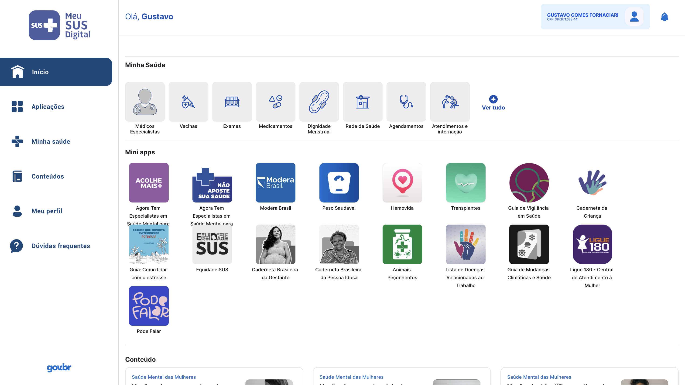
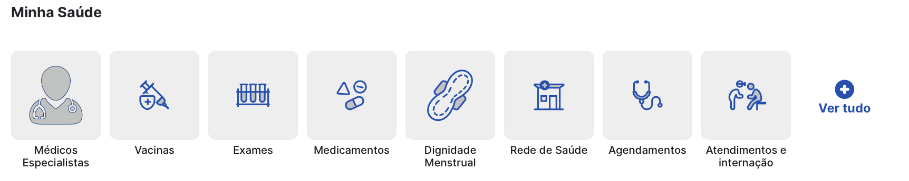
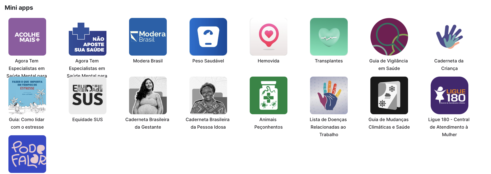

# Fluxo Selecionado para Modelagem

---

## Participantes da SubEquipe 2
| Nome do Membro | 
| :--- |
| [Gustavo Fornaciari](https://github.com/GUGOFO) |
| [Ana Beatriz](https://github.com/AnnaBeatrizAraujo) |
| [Victor Leandro](https://github.com/Afrontoso) |

---

## Mapeamento do Fluxo

### Nome do Fluxo
Navegação Principal e Dashboard Pós-Login no MEU SUS DIGITAL

### Passo a Passo do Fluxo

1. **Autenticação e Acesso ao Dashboard:** O cidadão realiza a autenticação na plataforma (via gov.br). O sistema valida o token de sessão e renderiza a tela inicial (*Dashboard*), exibindo o menu lateral (*Sidebar*) e o painel de serviços centrais.
2. **Visualização das Seções da Tela Inicial:** A interface disponibiliza três áreas principais de interação: a seção **Minha Saúde** (registros e serviços clínicos diretos), a seção **Mini apps** (ecossistema de aplicativos integrados) e a seção **Conteúdo** (materiais educativos e informativos).
3. **Interação com a Seção "Minha Saúde":** O cidadão pode selecionar cartões de acesso rápido para consultar serviços como *Médicos Especialistas*, *Vacinas*, *Exames*, *Medicamentos*, *Dignidade Menstrual*, *Rede de Saúde*, *Agendamentos* e *Atendimentos e Internação*.
4. **Interação com a Seção "Mini apps":** O usuário pode navegar e acionar ferramentas governamentais e de utilidade pública em saúde (como *Acolhe Mais+*, *Modera Brasil*, *Peso Saudável*, *Hemovida*, *Caderneta da Criança*, *Ligue 180*, entre outros).
5. **Navegação Global via Menu Lateral:** A qualquer momento durante a sessão, o usuário pode utilizar a *Sidebar* para transitar entre *Início*, *Aplicações*, *Minha saúde*, *Conteúdos*, *Meu perfil* e *Dúvidas frequentes*, ou optar pelo encerramento seguro da sessão.

---

## Interface do Sistema (Imagens Reais)

<strong>Legenda:</strong> Figura 1 - Visão Geral do Painel Principal (Dashboard) e Menu Lateral após a autenticação do cidadão no MEU SUS DIGITAL

<strong>Legenda:</strong> Figura 2 - Detalhamento dos cartões de atalho da seção "Minha Saúde"

<strong>Legenda:</strong> Figura 3 - Detalhamento da grade de atalhos e serviços da seção "Mini apps"

---

## Histórico de Versionamento

| Nome do Membro | Contribuição | Data | Commit |
| :--- | :--- | :--- | :--- |
| [Gustavo Fornaciari](https://github.com/GUGOFO) | Criação do documento de fluxo e Inciar o fluxo SubGrupo2 | 17/09/2026 | [df5d7d2](https://github.com/UnBArqDsw2026-2-Turma01/2026.2-T01-_G5_ProjetoGovernoEletronico_Entrega_02/commit/df5d7d2a5c4c247e7cf9c9b98a3c234674aee3a4) |