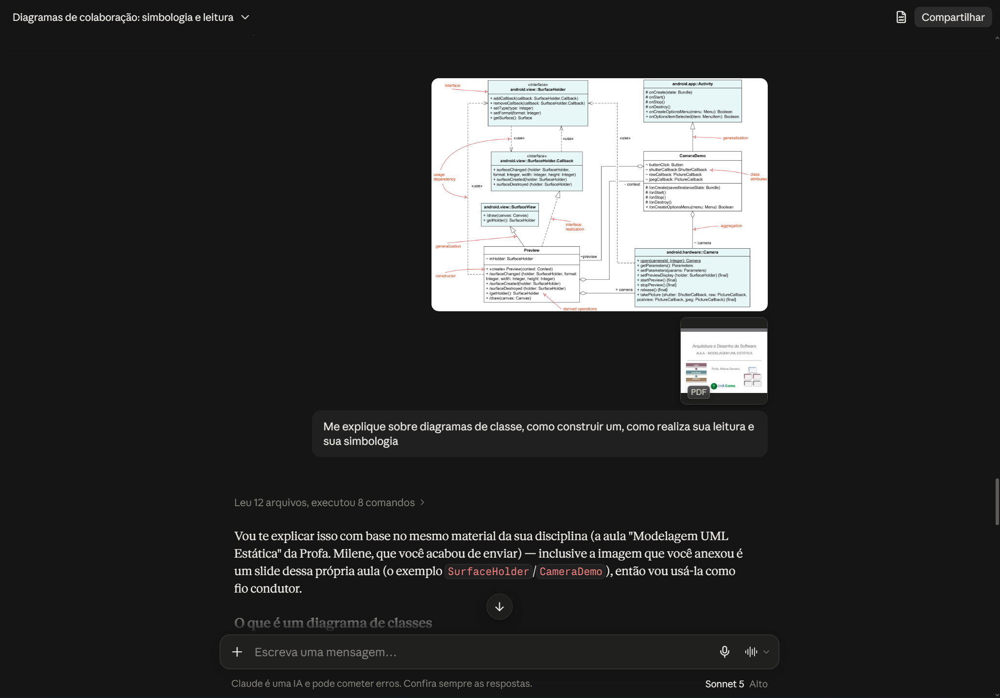
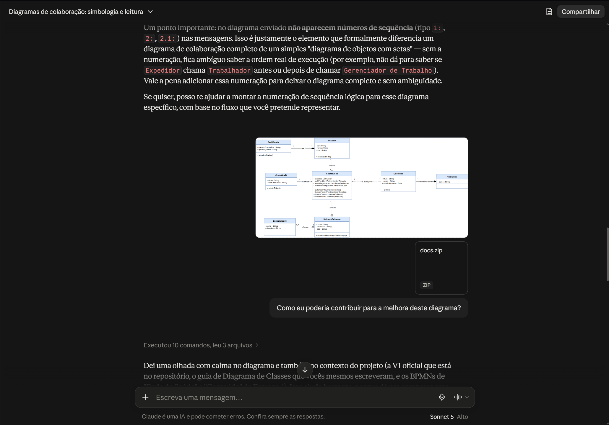
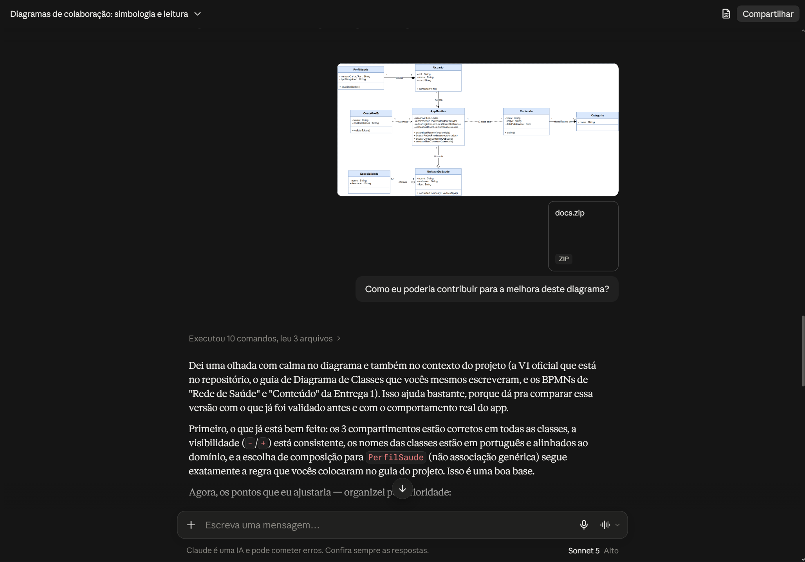
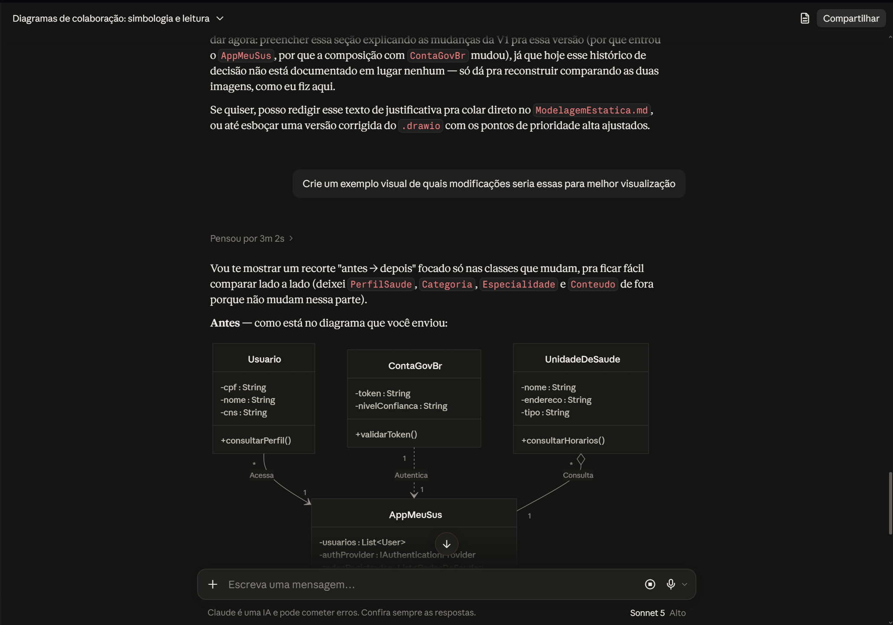
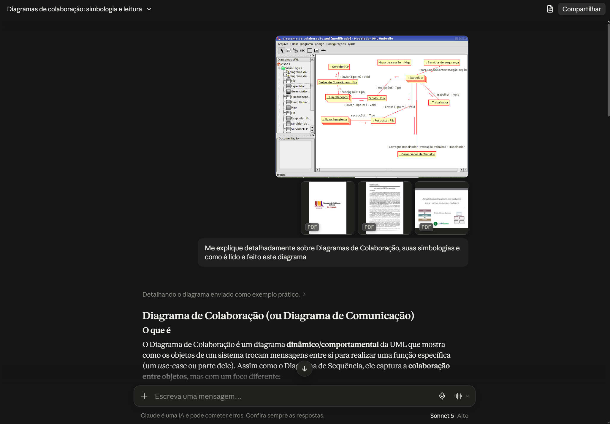

# Uso de Inteligência Artificial Generativa

---

## 1. Descrição e Objetivo

Este documento registra o apoio e o uso de ferramentas de **Inteligência Artificial Generativa (IAG)** na **Entrega 2** pela **SubEquipe 03**. O objetivo é apresentar com transparência, senso crítico e rastreabilidade como os modelos de linguagem foram utilizados no processo de engenharia de software, na construção e validação da **Modelagem Estática (Diagrama de Classes)** e da **Modelagem Dinâmica (Diagrama de Colaborações)**, bem como na documentação no MkDocs.

A abordagem adotada priorizou o uso da IA como um **agente colaborador e acelerador**, mantendo o rigor técnico, a revisão humana constante e a tomada de decisão final sob responsabilidade exclusiva dos integrantes da equipe.

---

## 2. Metodologia do Foco

A coleta de depoimentos e dados de uso ocorreu de forma **assíncrona e individual**. Cada integrante contribuiu com sua própria avaliação crítica e relatos de prompts/experimentos, garantindo a autoria e a perspectiva individualizada do aprendizado.

### Ferramentas Empregadas

- **Claude:** Utilizado como agente de apoio na redação e estruturação da documentação em Markdown (metodologia, embasamento teórico e tabelas de contribuição), além do levantamento e verificação de commits para o histórico de versionamento

---

## 3. Experimento com IA Generativa nas Modelagens (opcional)

Como parte da avaliação das versões finais da entrega, a subequipe realizou experimentos de geração e validação com IA aplicáveis às duas frentes de modelagem da Entrega 2. Os experimentos relatados abaixo foram conduzidos por Yasmim Santos com o **Claude** (Sonnet 5), utilizando como contexto os PDFs de referência da disciplina (apostila genérica de UML, módulo 3 de Ricardo Barcelar e os slides de Modelagem UML Estática/Dinâmica da Profa. Milene Serrano) e os próprios artefatos do repositório.

### Experimento 01: Modelagem Estática (Diagrama de Classes)

#### Objetivo:

Utilizar a IA para (i) consolidar o entendimento teórico sobre diagramas de classes (construção, leitura e simbologia) a partir do material da disciplina, e (ii) obter uma revisão crítica da Versão 2 do Diagrama de Classes do "Meu SUS Digital", identificando pontos de melhoria a incorporar na Versão 3.

#### Resultado Obtido:

<strong>Legenda:</strong> Prompt "Me explique sobre diagramas de classe, como construir um, como realiza sua leitura e sua simbologia", enviado ao Claude junto aos PDFs de referência da disciplina e um exemplo de diagrama de classes (SurfaceHolder/CameraDemo) extraído dos slides da Profa. Milene Serrano.

<strong>Legenda:</strong> Prompt "Como eu poderia contribuir para a melhora deste diagrama?", enviado com o pacote de documentação do projeto (docs.zip) e a imagem da Versão 2 do Diagrama de Classes.

<strong>Legenda:</strong> Resposta da IA apontando os pontos já corretos da Versão 2 (3 compartimentos, visibilidade consistente, composição de PerfilSaude) e organizando por prioridade os pontos a ajustar.

<strong>Legenda:</strong> Prompt "Crie um exemplo visual de quais modificações seria essas para melhor visualização", com a IA propondo um recorte comparativo "antes → depois" das classes Usuario, ContaGovBr, UnidadeDeSaude e AppMeuSus.

#### **Análise Crítica e Intervenção Humana:**

A IA identificou corretamente que a Versão 2 não explicitava as mudanças em relação à Versão 1 (por que a composição com `ContaGovBr` foi alterada, por que `AppMeuSus` foi introduzida), sugerindo que essa justificativa fosse documentada no `ModelagemEstatica.md` — recomendação que foi acatada e resultou na seção "O que foi alterado e por que" da Versão 3. A comparação visual "antes → depois" ajudou a visualizar rapidamente o impacto das mudanças propostas nas classes `Usuario`, `ContaGovBr`, `UnidadeDeSaude` e `AppMeuSus`, mas não substituiu a decisão de modelagem: cada relacionamento sugerido foi conferido manualmente pela equipe contra as regras de associação/agregação/composição vistas em aula antes de ser incorporado à V3, e nomes de atributos/operações foram ajustados para manter a nomenclatura em português já usada nas versões anteriores.

### Experimento 02: Modelagem Dinâmica (Diagrama de Colaboração)

#### Objetivo:

Utilizar a IA para consolidar o entendimento teórico sobre o Diagrama de Colaboração (simbologia, numeração de mensagens, diferença em relação ao Diagrama de Sequência) e validar a leitura de um diagrama de colaboração de exemplo (modelado no Umbrello), com base no material da disciplina.

#### Resultado Obtido:

<strong>Legenda:</strong> Prompt "Me explique detalhadamente sobre Diagramas de Colaboração, suas simbologias e como é lido e feito este diagrama", enviado ao Claude com um diagrama de exemplo modelado no Umbrello e os PDFs de referência da disciplina (apostila de UML, módulo 3 de Ricardo Barcelar e os slides de Modelagem UML Dinâmica da Profa. Milene Serrano).

#### **Análise Crítica e Intervenção Humana:**

A IA destacou um ponto relevante para a validação do Diagrama de Colaboração V1 da subequipe: sem a numeração de sequência (`1:`, `2:`, `2.1:`) nas mensagens, o diagrama vira um "diagrama de objetos com setas", ambíguo quanto à ordem de execução. Esse alerta foi usado para conferir se o Diagrama de Colaboração V1 (elaborado por Gabriel Mota) já contemplava a numeração corretamente antes da consolidação da versão final, evitando que a ambiguidade passasse despercebida na revisão entre os membros da subequipe.

---

## 4. Análise Crítica e Lições Aprendidas

Abaixo estão consolidados os aspectos avaliados durante a experimentação de IA Generativa na construção e validação dos artefatos de modelagem:

- **Cobertura Conceitual:** A IA cobriu bem os conceitos centrais de diagramas de classes e de colaboração (compartimentos, visibilidade, tipos de relacionamento, numeração de mensagens), sempre remetendo ao material da disciplina quando os PDFs eram fornecidos como contexto.
- **Legibilidade e Organização:** As respostas priorizaram explicações organizadas por prioridade (ex.: "pontos que já estão bons" vs. "pontos a ajustar"), o que facilitou transformar o feedback em ações concretas para a Versão 3.
- **Aderência à Técnica UML:** Ao comparar a Versão 2 do Diagrama de Classes com o guia de modelagem do próprio grupo e o material de aula, a IA identificou pontos coerentes com a notação ensinada, mas toda sugestão de relacionamento foi checada manualmente antes de entrar na V3.
- **Influência do Prompting:** Perguntas abertas ("como eu poderia contribuir para a melhora deste diagrama?") geraram respostas mais ricas e específicas do que perguntas fechadas, especialmente quando acompanhadas do contexto do repositório (`docs.zip`).
- **Editabilidade dos Artefatos:** A IA não gerou diretamente o arquivo `.drawio` da V3, apenas recortes visuais comparativos ("antes → depois"), então a edição do diagrama em si permaneceu manual, no draw.io.
- **Confiabilidade e Validação:** Nem toda sugestão da IA correspondia exatamente ao domínio do "Meu SUS Digital" (ex.: nomes de atributos genéricos), exigindo ajuste humano para manter a nomenclatura em português já estabelecida pela subequipe.
- **Limites do Experimento:** A IA depende inteiramente do contexto fornecido (PDFs, imagens, `docs.zip`); quando esse contexto não é enviado, as respostas tendem a ser mais genéricas e menos alinhadas ao domínio específico do projeto.

---

## 5. Pontos de Vista Individuais

### Davi Ursulino

- **GitHub:** [@DaviUrsulino](https://github.com/DaviUrsulino)

- **Uso da IA Generativa (Senso Crítico):** Lorem ipsum dolor sit amet, consectetur adipiscing elit...

- **Lições Aprendidas:**
  Lorem ipsum dolor sit amet, consectetur adipiscing elit...

---

### Gabriel Mota

- **GitHub:** [@Gabro-MO](https://github.com/Gabro-MO)

- **Uso da IA Generativa (Senso Crítico):** Utilizei o Gemini e ChatGPT para criar o esqueleto dos textos, validar decisões de modelagens e a coerência lógica do Diagrama de Colaboração V1 e Diagrama de Classes V2. A ferramenta funcionou de maneira excelente para sanar as duvidas, permitindo estruturar mais rapidamente os diagramas escolhidos. Pórem, tiveram momentos em que a IA recomendava fontes inexistentes ou referenciava algo que não foi dito de verdade, o senso crítico foi essencial para entender que a IA ajudou com a parte bruta, mas a verificação e validação humana continuaram indispensaveis.

- **Lições Aprendidas:** A principal lição foi entender o papel da IA como facilitador de etapas mais longas e não como uma solução absoluta. Ela reduz drasticamente o tempo gasto com pesquisas e a checagem de regras, mas a verifcação desses fatos pelo lado humano, garante uma melhor estrutura e ebasamento no projeto.

---

### Yasmim Santos

- **GitHub:** [@eii-yahs](https://github.com/eii-yahs)

- **Uso da IA Generativa (Senso Crítico):** Utilizei o Claude principalmente para dois fins: (1) consolidar o entendimento teórico sobre Diagrama de Classes e Diagrama de Colaboração, como simbologia, formas de leitura e diferenças entre diagramas estáticos e dinâmicos, sempre fornecendo como contexto os PDFs de referência da disciplina para evitar respostas genéricas; e (2) obter uma revisão crítica da Versão 2 do Diagrama de Classes antes de elaborar a Versão 3, enviando o pacote de documentação do projeto (`docs.zip`) e pedindo sugestões de melhoria. A IA foi útil para apontar inconsistências que passariam despercebidas numa revisão rápida (como a falta de numeração de sequência no Diagrama de Colaboração e a ausência de justificativa das mudanças entre versões do Diagrama de Classes), mas toda sugestão de relacionamento, atributo ou operação foi validada manualmente contra as regras de UML vistas em aula antes de ser incorporada aos diagramas finais.

- **Lições Aprendidas:**
  A principal lição foi que a IA rende muito mais quando alimentada com o contexto certo (PDFs da disciplina, os próprios artefatos do repositório) do que quando usada com perguntas isoladas — isso evita respostas genéricas e "fora do domínio" do projeto. Também aprendi que pedir explicitamente por comparações "antes → depois" ou por priorização dos pontos a ajustar torna o feedback da IA muito mais fácil de transformar em ação concreta na modelagem.

---

## 6. Síntese do Aprendizado da Subequipe

Nos relatos individuais registrados nesta seção, um padrão comum emerge: a subequipe utilizou a IA Generativa predominantemente como um **acelerador de etapas**, para montagem de esqueletos de texto, esclarecimento de dúvidas teóricas sobre UML e revisão crítica de versões intermediárias dos diagramas, e não como uma fonte de decisão final. Em todos os relatos, a validação humana permaneceu indispensável: todos identificaram momentos em que a IA trouxe informações incorretas, genéricas ou fora do contexto específico do domínio do "Meu SUS Digital" (fontes inexistentes, nomes de atributos fora do padrão em português adotado pelo grupo), reforçando que cada sugestão precisou ser conferida manualmente contra as regras de UML vistas em aula e contra os artefatos já existentes no repositório antes de ser incorporada.

Essa forma de uso está alinhada à metodologia de trabalho da subequipe (rotação de versões com revisão contínua entre os membros, descrita na seção "Metodologia" dos documentos de Modelagem Estática e Dinâmica): assim como cada versão de um diagrama é revisada pelo colega responsável pela versão seguinte, o uso da IA passou por uma camada adicional de revisão crítica antes de qualquer sugestão virar conteúdo definitivo. A principal lição coletiva foi que o resultado da IA depende diretamente da qualidade do contexto fornecido, como PDFs da disciplina, artefatos do próprio repositório e exemplos concretos, o que tornou os prompts mais elaborados (com anexos e pedidos específicos de comparação ou priorização) consistentemente mais úteis do que perguntas genéricas e isoladas.

---

## 7. Referências e Ferramentas Utilizadas

- **[Claude](https://claude.ai/) (Sonnet 5):** utilizado para consolidar o entendimento teórico dos diagramas de classes e de colaboração, revisar criticamente a Versão 2 do Diagrama de Classes e apoiar a redação/estruturação da documentação em Markdown (ver [Experimento 01](#experimento-01-modelagem-estatica-diagrama-de-classes) e [Experimento 02](#experimento-02-modelagem-dinamica-diagrama-de-colaboracao) na Seção 3).

---

## Histórico de Versionamento

| Nome do Membro                                                                                       | Contribuição                                                                 | Data       | Commit                                                                                                                                                   |
| ---------------------------------------------------------------------------------------------------- | ---------------------------------------------------------------------------- | ---------- | -------------------------------------------------------------------------------------------------------------------------------------------------------- |
| [Gustavo Fornaciari](https://github.com/GUGOFO)                                                      | Criação do Repositorio                                                       | 10/09/2026 | [efd139e](https://github.com/UnBArqDsw2026-2-Turma01/2026.2-T01-_G5_ProjetoGovernoEletronico_Entrega_02/commit/efd139e36025a5c1610fff909ac41451ab13eecd) |
| [Artur Galdino](https://github.com/ArturFGaldino) e [Nicole Jovita](https://github.com/nicolejovita) | Criação do template da documentação de IA Generativa, experimentos e relatos | 17/09/2026 | [8ddaf26](https://github.com/UnBArqDsw2026-2-Turma01/2026.2-T01-_G5_ProjetoGovernoEletronico_Entrega_02/commit/8ddaf262b0619515620ef2f029cc1ae973b3626f) |
| [Artur Galdino](https://github.com/ArturFGaldino) e [Nicole Jovita](https://github.com/nicolejovita) | Correção dos integrantes na seção "Pontos de Vista Individuais" para os membros da SubEquipe 03 (Davi, Gabriel e Yasmim) | 17/09/2026 | [5208090](https://github.com/UnBArqDsw2026-2-Turma01/2026.2-T01-_G5_ProjetoGovernoEletronico_Entrega_02/commit/520809013f93bc3c3e12b6b7d5558b7fcbc1e3e3) |
| [Gabriel Mota](https://github.com/Gabro-MO)                                                          | Adição do Uso de inteligencia artificial e como a usei                       | 17/09/2026 | [09a52b6](https://github.com/UnBArqDsw2026-2-Turma01/2026.2-T01-_G5_ProjetoGovernoEletronico_Entrega_02/commit/09a52b61c58fac4cf8ca557491927c61d7f57fbe) |
| [Artur Galdino](https://github.com/ArturFGaldino)                                                    | Adição do link do commit na tabela de versionamento                         | 17/09/2026 | [fee519c](https://github.com/UnBArqDsw2026-2-Turma01/2026.2-T01-_G5_ProjetoGovernoEletronico_Entrega_02/commit/fee519ce1b6c05e63daa8699f2aae3533863df4c) |
