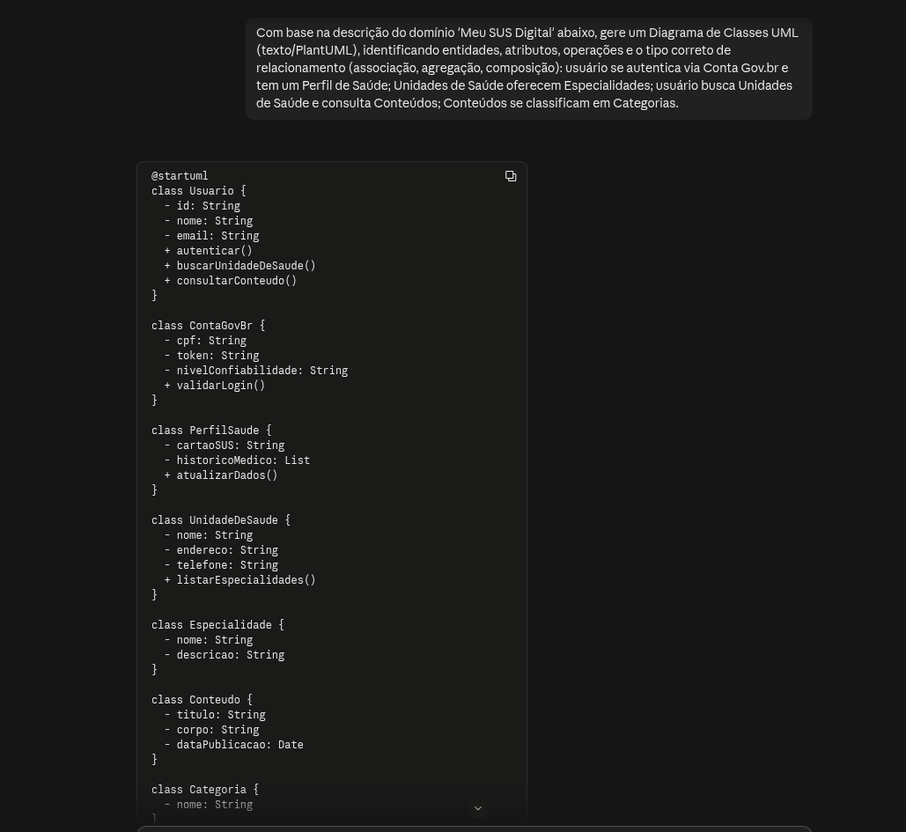
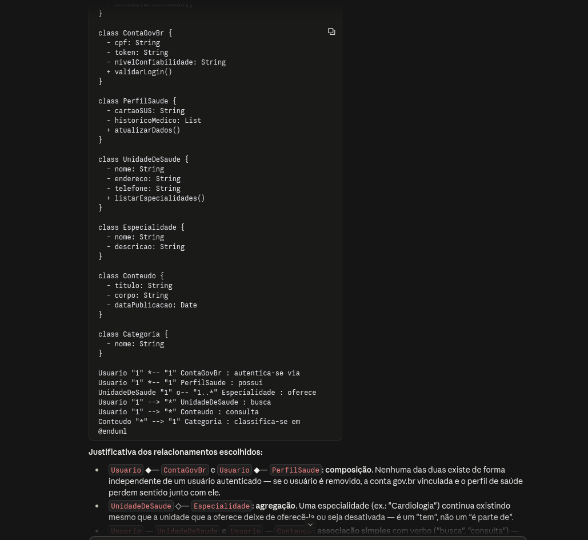

# Uso de Inteligência Artificial Generativa

---

## 1. Descrição e Objetivo

Este documento registra o apoio e o uso de ferramentas de **Inteligência Artificial Generativa (IAG)** na **Entrega 2** pela **SubEquipe 03**. O objetivo é apresentar com transparência, senso crítico e rastreabilidade como os modelos de linguagem foram utilizados no processo de engenharia de software, na construção e validação da **Modelagem Estática (Diagrama de Classes)** e da **Modelagem Dinâmica (Diagrama de Colaboração)**, bem como na documentação no MkDocs.

A abordagem adotada priorizou o uso da IA como um **agente colaborador e acelerador**, mantendo o rigor técnico, a revisão humana constante e a tomada de decisão final sob responsabilidade exclusiva dos integrantes da equipe.

---

## 2. Metodologia do Foco

A coleta de depoimentos e dados de uso ocorreu de forma **assíncrona e individual**. Cada integrante contribuiu com sua própria avaliação crítica e relatos de prompts/experimentos, garantindo a autoria e a perspectiva individualizada do aprendizado.

### Ferramentas Empregadas
* **Claude (Sonnet):** Utilizado para gerar, a partir da descrição textual do domínio "Meu SUS Digital", uma proposta de Diagrama de Classes (em PlantUML) como contraponto de validação para a Versão 1 elaborada manualmente, além de apoiar a revisão crítica das semânticas de relacionamento (associação, agregação, composição) aplicadas.
* **draw.io (diagrams.net):** Ferramenta de diagramação vetorial utilizada para a elaboração manual e edição do Diagrama de Classes final, a partir do qual o resultado da IA foi comparado.

---

## 3. Experimento com IA Generativa nas Modelagens (opcional)

Como parte da avaliação das versões finais da entrega, a subequipe realizou um **experimento de geração e validação** aplicável às duas frentes de modelagem da Entrega 2:

### Experimento 01: Modelagem Estática (Diagrama de Classes)
#### Objetivo:
Testar a capacidade da IA (Claude) de interpretar a descrição textual do domínio "Meu SUS Digital" — autenticação via Conta Gov.br, Perfil de Saúde, Unidades de Saúde e suas Especialidades, busca de Conteúdo por Categoria — e gerar de forma autônoma um Diagrama de Classes coerente, comparando o resultado com a Versão 1 já elaborada manualmente no draw.io, para validar se as semânticas de relacionamento (associação, agregação, composição) escolhidas fazem sentido do ponto de vista de um modelo externo.

#### Resultado Obtido:

<strong>Legenda:</strong> Figura 1 - Prompt enviado ao Claude com a descrição textual do domínio

<strong>Legenda:</strong> Figura 2 - Código PlantUML e proposta de Diagrama de Classes gerados pela IA

#### **Análise Crítica e Intervenção Humana:**
A IA reproduziu corretamente as sete entidades centrais do domínio e, mais importante, acertou a semântica dos relacionamentos sem que isso fosse explicitado no prompt: identificou `Usuario`–`ContaGovBr` e `Usuario`–`PerfilSaude` como **composição** (a autenticação e o perfil não existem fora do usuário logado) e `UnidadeDeSaude`–`Especialidade` como **agregação** (a especialidade existe independentemente da unidade). Isso confirmou, por uma fonte externa e independente, que a modelagem manual da Versão 1 estava tecnicamente consistente.
Por outro lado, a IA gerou os atributos e operações de cada classe em um nível muito genérico (ex.: `autenticar()`, `historico: List`), sem o detalhamento de tipos e visibilidade exigido pela notação de 3 compartimentos usada em aula — esse refinamento (visibilidade `+`/`-`, tipos concretos, nomes em português alinhados ao domínio) foi mantido sob responsabilidade humana e não foi delegado à IA. A saída também veio em código PlantUML, não em um artefato editável no padrão adotado pela equipe (draw.io), reforçando que a IA serviu como **validação lógica**, não como fonte do artefato final.

**Conclusão do Experimento:** a IA se mostrou confiável como um "revisor cego" da semântica de relacionamento UML — por não conhecer a decisão prévia da equipe, sua convergência com a Versão 1 funciona como validação cruzada independente. Porém, ela não substitui o refinamento de atributos, tipos, visibilidade e nomenclatura de domínio, nem entrega o artefato no formato editável exigido pelo projeto (draw.io); o experimento reforça que o papel da IA aqui foi de checagem lógica, não de autoria do diagrama final.

### Experimento 02: Modelagem Dinâmica (Diagrama de Colaboração)
#### Objetivo: 
Descrever o objetivo do teste com IA.
#### Resultado Obtido: 
(inserir imagem do resultado da versão gerada por IA)

<strong>Legenda:</strong> Inserir legenda

(imagem do prompt dado)

<strong>Legenda:</strong> Inserir legenda

#### **Análise Crítica e Intervenção Humana:** 
Explicar pontos que a IA corrigiu e o que foi acatado pela equipe ou não e por que - citar extrapolação e limites do uso da IA.

---

## 4. Análise Crítica e Lições Aprendidas

Abaixo estão consolidados os aspectos avaliados durante a experimentação de IA Generativa na construção e validação dos artefatos de modelagem:

* **Cobertura Conceitual:** XXXXX.
* **Legibilidade e Organização:** XXXXX.
* **Aderência à Técnica UML:** XXXXX.
* **Influência do Prompting:** XXXXX.
* **Editabilidade dos Artefatos:** OXXXXX.
* **Confiabilidade e Validação:** XXXXX.
* **Limites do Experimento:** XXXXX.

---

## 5. Pontos de Vista Individuais

### Davi Ursulino
* **GitHub:** [@DaviUrsulino](https://github.com/DaviUrsulino)

* **Uso da IA Generativa (Senso Crítico):** Usei o Claude como uma segunda opinião independente sobre a Versão 1 do Diagrama de Classes que eu já tinha modelado manualmente: descrevi o domínio em texto puro, sem citar que tipo de relacionamento eu havia usado, e pedi que a IA propusesse a modelagem do zero. O fato de o resultado convergir para as mesmas semânticas (composição para Conta Gov.br/Perfil de Saúde, agregação para Especialidade) me deu confiança de que a escolha não era arbitrária. Ao mesmo tempo, o senso crítico foi necessário pra não aceitar o resultado da IA como definitivo: os atributos e operações vieram rasos demais e a saída em PlantUML não corresponde ao artefato editável (draw.io) que a equipe adotou como padrão — então o papel da IA ficou limitado a validar a estrutura de relacionamentos, não a substituir a modelagem manual.

* **Lições Aprendidas:**
  A IA generativa funciona bem como um "revisor cego" da modelagem estática — como não conhece minha decisão prévia, ela serve de checagem independente da semântica UML escolhida. Mas ela não substitui o cuidado com o nível de detalhe (tipos, visibilidade, nomenclatura alinhada ao domínio) nem o formato de artefato exigido pela disciplina; esse trabalho de refinamento e de manter a rastreabilidade (prompt → resposta → diagrama final) continua sendo responsabilidade humana.

---

### Gabriel Mota
* **GitHub:** [@Gabro-MO](https://github.com/Gabro-MO)

* **Uso da IA Generativa (Senso Crítico):** Lorem ipsum dolor sit amet, consectetur adipiscing elit...

* **Lições Aprendidas:**
  Lorem ipsum dolor sit amet, consectetur adipiscing elit...
---

### Yasmim Santos
* **GitHub:** [@eii-yahs](https://github.com/eii-yahs)

* **Uso da IA Generativa (Senso Crítico):** Lorem ipsum dolor sit amet, consectetur adipiscing elit...

* **Lições Aprendidas:**
  Lorem ipsum dolor sit amet, consectetur adipiscing elit...

---

## 6. Síntese do Aprendizado da Subequipe

Lorem ipsum dolor sit amet, consectetur adipiscing elit...

---

## 7. Referências e Ferramentas Utilizadas

* **[Claude](https://claude.ai):** Modelo de linguagem utilizado para gerar uma proposta independente de Diagrama de Classes e validar a semântica dos relacionamentos da Versão 1.
* **[draw.io](https://app.diagrams.net):** Ferramenta de diagramação utilizada para a elaboração manual do Diagrama de Classes final.
* Experimento com IA na Modelagem Estática: ver [Seção 3](#3-experimento-com-ia-generativa-nas-modelagens-opcional) deste documento.

---

## Histórico de Versionamento

| Nome do Membro  | Contribuição   | Data  | Commit |
| ---- | ------ | ----- | ---- |
| [Gustavo Fornaciari](https://github.com/GUGOFO) | Criação do Repositorio | 10/09/2026 | [efd139e](https://github.com/UnBArqDsw2026-2-Turma01/2026.2-T01-_G5_ProjetoGovernoEletronico_Entrega_02/commit/efd139e36025a5c1610fff909ac41451ab13eecd) |
| [Artur Galdino](https://github.com/ArturFGaldino) e [Nicole Jovita](https://github.com/nicolejovita) | Criação do template da documentação de IA Generativa, experimentos e relatos | 17/09/2026 | [8ddaf26](https://github.com/UnBArqDsw2026-2-Turma01/2026.2-T01-_G5_ProjetoGovernoEletronico_Entrega_02/commit/8ddaf262b0619515620ef2f029cc1ae973b3626f) |
| [Davi Ursulino de Oliveira](https://github.com/DaviUrsulino) | Experimento de IA (Claude) no Diagrama de Classes, análise crítica e depoimento individual | 17/09/2026 | *(preencher no commit)* |
