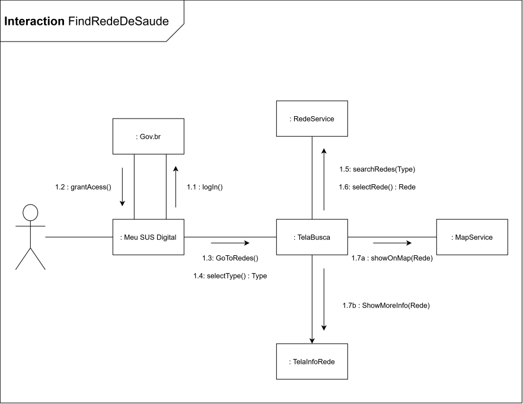
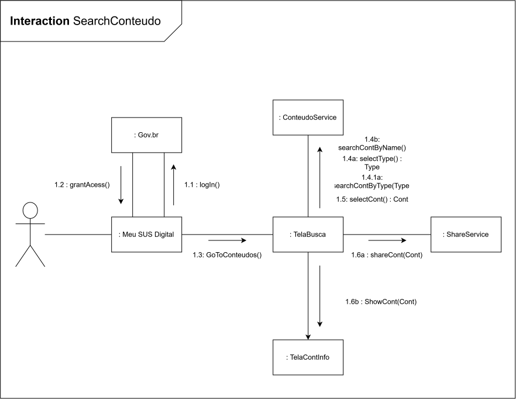

# Modelagem Dinamica

---

## Versão Final

A versão final da Modelagem Dinâmica contempla os dois fluxos comportamentais mapeados pela subequipe para o sistema **Meu SUS Digital**: a localização geográfica de unidades de saúde e a busca/compartilhamento de conteúdos informativos.

### Fluxo 1: Rede de Saúde

<strong>Legenda:</strong> Diagrama de Colaboração - Fluxo Rede de Saúde (Versão Final)

---

### Fluxo 2: Conteúdos

<strong>Legenda:</strong> Diagrama de Colaboração - Fluxo Conteúdos (Versão Final)

---

## Participantes

| Nome do Membro                                               |
| :----------------------------------------------------------- |
| [Davi Ursulino de Oliveira](https://github.com/DaviUrsulino) |
| [Gabriel Mota Oliveira](https://github.com/Gabro-MO)         |
| [Yasmim de Souza Santos](https://github.com/eii-yahs)        |

---

## Fundamentação Teorica

### O que é um diagrama dinâmico?

Diagramas dinâmicos (também chamados de comportamentais) são os diagramas da UML que mostram a natureza dinâmica dos objetos de um sistema, descrita como uma série de mudanças que ocorrem no sistema com o passar do tempo. Ao contrário dos diagramas estáticos/estruturais — que retratam apenas a estrutura de classes, objetos e seus relacionamentos, sem noção de tempo —, os diagramas dinâmicos enfatizam o comportamento e a interação entre os elementos do sistema, revelando como os objetos colaboram, trocam mensagens e mudam de estado para realizar uma funcionalidade.

### Para que serve?

O diagrama dinâmico serve para descrever como os objetos das classes definidas na Modelagem Estática colaboram entre si para realizar um comportamento ou cenário de uso específico do sistema — mostrando a ordem e/ou a estrutura das mensagens trocadas entre eles. No caso desta subequipe, o Diagrama de Colaboração complementa o Diagrama de Classes (Modelagem Estática): ele evidencia como os objetos (`:Cidadao`, `:Meu SUS Digital`, `:RedeService`, `:ConteudoService`, etc.) interagem para realizar os fluxos "Rede de Saúde" e "Conteúdo", já mapeados na Rich Picture e no BPMN da Entrega 1.

### O que é um diagrama de colaboração?

O **Diagrama de Colaboração** (denominado **Diagrama de Comunicação** a partir da especificação UML 2.0) é um dos diagramas dinâmicos da UML (_Unified Modeling Language_), utilizado para demonstrar a interação comportamental entre objetos ou partes do sistema por meio de mensagens sequenciais organizadas em torno de uma estrutura gráfica de enlaces — funcionando, na prática, como um diagrama de objetos ao qual se somam as mensagens trocadas entre eles.

Conforme apresentado nas diretrizes teóricas da Profa. Milene Serrano, os diagramas dinâmicos da UML buscam revelar a dimensão comportamental da solução computacional. Diferentemente do Diagrama de Sequência, que prioriza a ordenação estritamente temporal disposta ao longo de linhas de vida verticais, o Diagrama de Colaboração destaca a **organização e o relacionamento estrutural entre os objetos** que participam da interação, dando ênfase no caminho pelo qual as mensagens trafegam durante determinado cenário de uso — sendo, por isso, a escolha mais adequada quando o foco está no contexto/estrutura do sistema, e não apenas na cronologia das chamadas.

A fundamentação conceitual do Diagrama de Colaboração na UML resgata as contribuições históricas de **Grady Booch**, um dos criadores da notação ao lado de James Rumbaugh (OMT) e Ivar Jacobson (OOSE).

### Simbologias do diagrama de colaboração

- **Atores e Objetos (_Lifelines_):** Representam os papéis e as instâncias de classes envolvidas no fluxo, escritos com o nome sublinhado e precedido de dois-pontos (ex.: `: Usuário`, `: Meu SUS Digital`).
- **Enlaces de Comunicação (_Links_):** Linhas sólidas ligando os objetos para indicar a existência de um canal de comunicação estrutural por onde as mensagens transitam — equivalentes aos relacionamentos de um diagrama de objetos.
- **Setas de Mensagem e Sentido de Disparo:** Setas paralelas aos enlaces que indicam a direção da chamada de método, com o nome da mensagem e, quando necessário, seus parâmetros e tipo de retorno (ex.: `Enviar(Tipo m): Void`).
- **Numeração de Sequência Cronológica:** Identificadores numéricos que estabelecem a ordem temporal do fluxo (ex.: `1`, `1.1`, `2.2.1`). A notação decimal aninhada expressa sub-operações ou chamadas derivadas disparadas a partir de um método pai.
- **Expressões de Guarda (`[condição]`):** Regras condicionais entre colchetes que delimitam o disparo da mensagem mediante validação de contexto (ex.: `[tokensValidos]`, `[termoPendente]`).
- **Iteração (`*`):** Símbolo de asterisco associado à sequência para indicar execuções repetitivas em laço.
- **Moldura e Cabeçalho (_Diagram Frame_ e _Frame Heading_):** Delimitação retangular do diagrama com um pentágono no canto superior esquerdo identificando a notação (`communication` ou `sd`) e o nome do caso de uso modelado.

---

## Desenvolvimento

### Versão 1

#### Fluxo Rede de Saúde

**Autoria:** [Gabriel Mota](https://github.com/Gabro-MO)

Link Editavel: [Diagrama de Colaboração do fluxo de redes de saúde](https://viewer.diagrams.net/?tags=%7B%7D&lightbox=1&highlight=0000ff&edit=_blank&layers=1&nav=1&title=C%C3%B3pia%20do%20Diagrama_de_Colabora%C3%A7%C3%A3o-Rede_de_Saude.drawio.svg&dark=auto#R%3Cmxfile%3E%3Cdiagram%20name%3D%22P%C3%A1gina-1%22%20id%3D%22FU4cY91N6D-FIcj03wjP%22%3E7VvbcuI4EP0aqjIPoSxf4TGE3Gonu1Mhm5l52hK2Apo1lksWAebrV4plbNmGGMd2YHZeQGpLst2nT3erBT3jcrG%2BoTCc3xMP%2BT1d89Y9Y9zTdWBoQ%2F4lJJtYYg%2FtWDCj2JODUsEE%2F0RSqEnpEnsoUgYyQnyGQ1XokiBALlNkkFKyUoc9E1%2B9awhnqCCYuNAvSr9ij81j6UB3UvktwrN5cmdgyxdewGSwfJNoDj2yyoiMq55xSQlhcWuxvkS%2BUF6il3je9Y6r2wejKGBVJtjuQtdu2cO3H%2BP1V28TPI2ebs4do7iMXDlim0QJlCwDD4l1tJ4xWs0xQ5MQuuLqisPOZXO28HkP8GY8%2BwX6SzlbChBlaJ25g3zKG0QWiNENHzLPKNIeSLWtMlpPZHKZRLMbtQsl5LPtyqlWeEMq5hAlmVWUxPENRdOF1HtbSx6m3FwxCXg%2FIkvxiqNnH4e38jolDMrL52CgNaZXp6hWA3yQWq0qauUvx1TVlWk2YpT8iy6JTygXBiRAQp%2FY93Mi6OOZ0KnL74i4fCTUhzndL%2BSFBfY8ceuRavPPJGDSOek7wLB98ZxT3piJxp24AYwh1m24EE8ZTKPwdXI8lmttO7wwv2zQNQ68B%2BShMZrApYdqGYBVNAA9zytbMQCjNQOQ90FewQcXLYIsqYv2LeYUTEesO5FdQtmczEgA%2FatUmgM5HfOZkFBa2w%2FE2EZCD5eMqLbIH5Nuvsn5r53votO3ku54nb043mx73oWITqllcsk1Fvobp%2FbFIJ0htuelB1o54BT53Hu8qFptHj9nN1xFv7hc%2BBcuI1nSfYZT5H8hEZaebkoYI4sSVjKSc5%2FcY%2Fo44IRPov5eUnr4pcAzWkI0ZVwNbgFQJJelcsvMccu22gJn0CC5EgfRMbnWmL1yq%2B9Ysvs94Q9vp9QSnZRZCSPlrISUoCNK6iVm%2BIEcHbZrBo2BDLII9603MG4GKvuooEq022oublxwwT1a8s%2FJ3xP%2BOcYzzKBfy9%2FZRXcH9FwuAdRs0hi2lU0MQJOWrn9MNnEcWcHrVP4kcJMZEBIcsCiz8hchyCCdD21mbj962HjeiJ8gtYjtq7zDSPSuOHZDXvoiyeiGVu3t0gZGk7SyT5hWQ%2FO4woX5GxgJjHNcwFgnD0xFxQNNOy7N211590f%2BPqNl5MK2HLw5yEXH9vKmSrv44yjDZaqipRt%2B0BeCGKIZhQG7cFEUnX2qhZJRgpKmogTy2W17YfiQ7XzGVxQ8bAZBVbcRpztLBrs%2BjCLsJmLpk8EOD%2F0m%2FcsKkKUuoaRwsjNBLWaU%2BcKlPVCXiL2tnLUvNS1UQA11odgzFhZqLEs9ZNP%2BPwXbAHmMtHpgFxZytE7BHlba9p%2BK%2FwVb%2F%2BuT2V3QnOt1VM9rGF153uEhdYVSMqb82snHnVXLtE65o2q5rZHq1Wukx0Vkx%2BpbCpZm%2FsSpKpVNU3trqbbJXKm%2BcBpkLjk9AaIwK8gdIUjduTiLjM4eNyH61OApSlneZajstxJSJuWP1rLjYaUfSJwwoGYCqI9cJqAULlu6cNHtFljDNFT%2B5oNxc8BW%2BlFHE3tFwZIJoi%2FYrXdiX2O3CNrjwyHFjfKahbTyGmUJFY2KUeytiAXyieMBlfCdkciy80ll7py3akjLL6R3nZ1WKqmcsP%2Bzs%2F5PUDXj%2F0S3Zf9n5gJbvuzTXlpbqezTyGkjDFt2f47VVbFsODgdOhTgAH0Hbm07mpPVXwHH5kxYeXMVspxB20DN1EyzNWjeXTT5vU%2Fbt0%2BzzaGKZN1dmgPM%2FQu1HNK2Ab%2BbY4K74JnEgaSb3M%2Fel8%2B8i2FAq1kKaSH5q17ArHDCeBo5pOXULGfnFzKdbsvZQPvVqyLOdBtXJzyu3hOKBO2T0NpqBunszyCtJjLIh8enKX78hzlP53%2BAO%2F8GX%2F45Ov%2FVKyNG8kOeRxIXujouchVqITVSJ95N%2F2EU8zn9n5Zx9R8%3D%3C%2Fdiagram%3E%3C%2Fmxfile%3E)

<strong>Legenda:</strong> Imagem do Diagrama de Colaboração do fluxo de redes de saúde versão 1

Nesta primeira versão do artefato dinâmico, fez-se o mapeamento inicial das interações necessarias para a jornada de acesso ás Redes de Saúde proximas ao Usuário integrando os requisitos levantados na Rich Picture, no NFR SIG e no BPMN.

##### Mapeamento de Objetos e Responsabilidades

| Objeto / Papel         | Tipo / Camada                | Responsabilidade no Fluxo                                                                                               |
| :--------------------- | :--------------------------- | :---------------------------------------------------------------------------------------------------------------------- |
| **`:Cidadao`**         | Ator Externo                 | Cidadão que interage com a interface do aplicativo.                                                                     |
| **`:Meu SUS Digital`** | App / Cliente                | Cliente móvel que coordena a navegação e a renderização da interface.                                                   |
| **`:Gov.Br`**          | Serviço Externo              | Provedor federado de identidade responsável pela autenticação e autorização do Usuário.                                 |
| **`:TelaBusca`**       | Frontend                     | Pagina responsável pela comunicação entre usuário e sistema de busca e envio dos dados de cada rede de saúde cadastrada |
| **`:RedeService`**     | Controller                   | Controlador responsável pela busca e envio dos dados de cada rede de saúde cadastrada                                   |
| **`:TelaInfoRede`**    | Frontend                     | Pagina responsável por mostrar informações adicionais da rede de saúde selecionada                                      |
| **`:MapService`**      | Controller / Serviço Externo | Controlador responsável por mostrar a localização geografica da rede de saúde selecionada                               |

#### Fluxo Conteudos

**Autoria:** [Gabriel Mota](https://github.com/Gabro-MO)

Link Editavel: [Diagrama de Colaboração do fluxo de conteudos](https://viewer.diagrams.net/?tags=%7B%7D&lightbox=1&highlight=0000ff&edit=_blank&layers=1&nav=1&title=Diagrama_de_Colabora%C3%A7%C3%A3o-Redes_de_saude.drawio.svg&dark=auto#R%3Cmxfile%3E%3Cdiagram%20name%3D%22P%C3%A1gina-1%22%20id%3D%22FU4cY91N6D-FIcj03wjP%22%3E7Vtdc5s4FP01mWkf4kF82o92nCaZbXcz62zTPMqgYFpAHpBjs79%2BJSMBAuxgB4id7QtBF0nAPTr3Xh2cC%2B0q2NxEcLn4hh3kX6iKs7nQpheqChRrSP8wS5JaDEtLDW7kObxTbph5%2FyIxkltXnoNiqSPB2CfeUjbaOAyRTSQbjCK8lrs9Y1%2B%2B6xK6qGKY2dCvWh89hyxS61C1cvst8tyFuDMwR%2BmVAIrO%2FE3iBXTwumDSri%2B0qwhjkp4FmyvkM%2BcJv6Tjvuy4mj1YhELSZIBpB6pyS%2F7%2B8XO6eXSS8Pvk%2B82lQKM4DZ85JolwQoRXoYPYPMqFNlkvPIJmS2izq2sKO7UtSODTFqCn6egX6K%2F4aG5AEUGbwh34U94gHCASJbTLouBIc8jdti54Xdj4NMKzidyEHHI3mzn3Cj3hjjnESXoTJ1F8l%2BzUhpHzupccL6LL1cMhbcd4xV5x8ux7y1t%2BPcIE8suXYKi05ler6lYNvJNbjSZupS9HZNfVeTYmEf6FrrCPI2oMcYiYPz3fL5mg77nMpza9I6L2CXOfR%2Bk%2B5hcCz3HYrSfymn%2FGIeHBSd0Bhumz55zTE5ed3LEbwBRi1YQBe8pwHi%2B3g9O%2B1GtZ9xmCkb24ordBKwcfBa1RhVYtM8aUoNU6g5bfBzmV6FrFGq8iG%2B2bzKosCjbvjDdxRBbYxSH0r3NrCb68z1eMl3wd%2FUSEJBxUuCJYXmX0MaPkBx%2B%2FbTyxxsAQzemmeHGaZC1nzPJOvuao5YvH%2FDfNVw6BkYvInpceKvWAR8inceFF9mr7%2BFm74apGvFXgj22Ci3T6CufIv8exx2PYHBOCgxq%2BEVwKjDQW%2Bl5IqSzy%2BV66Od6LYFDGwKhsoS6Q%2Bh3BLQCq5DJkbuklbplGV%2BAMWySXCBA9k2vjkS23BpbBm0%2BCP%2FQ8pxZr5MwSjOSjBClBT5RUa5bhO3J01O0yaA1kUER4YLyCcTtQmScFlfBup1W2NqaGb2hFj7N%2FZvQ49VyPQP%2BoeGdWwx1QS7UEkOtEbdRVNTEEba509X2qidOoCrZD6ZPApNBhib2QxIWZ75mhgHQ5temlneZh%2FelJ%2BgT5ishe5Q2LRO2LYzf4ZcCKjH5o1d3%2Ba6i1SSvzjGk10k8rXei%2FgeHAWKcFjHH2wDR0PFCU0%2FK82Vd0f6DvM1nFNuwqwOvDUnbsrm5qtIs%2FDYGtoHfWbvjBgBlSiNwIhmRsozj%2B9PkolLQalBQZJVCubrtLw4ds5wuxohJhCwjKvo0p3YnobPswjj1bmHlMBjsi9Kv0rxMga0NCjXCys0CtVpRl4dIcylOk0ZaP2leaVhRQTZ4ojYyViVqrUg%2FZtP9PwdZAGSPlOLArE1lKr2CPGm37zyX%2Bgiz%2B%2Bti9C9sLvZYceTWtr8g7OkRXqCVjzq%2BdfNypWuY65Q7VMtNI1eYa6WkR2TIGhoSlXv7i1JTKuq68NlXXZG6kL5wHmWu%2BnoCBPgAw5XecfYucJA%2FJEn1ih88tfk2pq780OQoYgpwiCoCuPqeMGv0E4oyB1YRs9YDF9%2BVt4dwnnJquyezVOwvqjX6s0cZOUThzhqIXjw7tab8IOtsvjg6RN%2BpVC76%2BjxAmZEQa5rHXchYol44HaOE7c5FhlsvKUmhqmtTKE6l916eNRJUzjnyGyGc%2BsgmjKwt7Ss7ejmOgXkppZeFH7yylNRJ%2B2oiBswW9RccB0DL6EsxGw%2FMhRAUQMDBhtrpjhst2xbNDeypZaUmbQK7SOkzrbxZOfu%2FV9u3VTH0kI3nsTs0C%2Bv6JOk5qWcrv51MBo9dd%2BHzcLzaPqP7MfRXNmxgGlCPlkA7Kv%2BYiZoOvjOdRRRrWkZJ2eSLd6lfSBspHV0bMeZZXZwu8LqbVTutHa3%2F9aLQhjP7xuP7l31pBgkjy1%2B2TOnbv7y4%2FOqD6vCp0%2FQkD1LcqUha59ubtNyH60TUuHRa3elvRMt%2FqseY7AzvUDgaWNvN%2FDkuDdf4vdtr1fw%3D%3D%3C%2Fdiagram%3E%3C%2Fmxfile%3E)

<strong>Legenda:</strong> Imagem do Diagrama de Colaboração do fluxo de Conteudos versão 1

Nesta primeira versão do artefato dinâmico, fez-se o mapeamento inicial das interações necessarias para a jornada de acesso aos conteudos disponibilazos pelo app do Meu SUS Digital, integrando os requisitos levantados na Rich Picture, no NFR SIG e no BPMN.

##### Mapeamento de Objetos e Responsabilidades

| Objeto / Papel         | Tipo / Camada                | Responsabilidade no Fluxo                                                                                               |
| :--------------------- | :--------------------------- | :---------------------------------------------------------------------------------------------------------------------- |
| **`:Cidadao`**         | Ator Externo                 | Cidadão que interage com a interface do aplicativo.                                                                     |
| **`:Meu SUS Digital`** | App / Cliente                | Cliente móvel que coordena a navegação e a renderização da interface.                                                   |
| **`:Gov.Br`**          | Serviço Externo              | Provedor federado de identidade responsável pela autenticação e autorização do Usuário.                                 |
| **`:TelaBusca`**       | Frontend                     | Pagina responsável pela comunicação entre usuário e sistema de busca e envio dos dados de cada rede de saúde cadastrada |
| **`:ConteudoService`** | Controller                   | Controlador responsável pela busca e envio dos dados de cada Conteudo cadastrado                                        |
| **`:TelaContInfo`**    | Frontend                     | Pagina responsável por mostrar todas as informações do conteudo selecionado                                             |
| **`:ShareService`**    | Controller / Serviço Externo | Controlador responsável por mostrar as opções de compartilhamento para o conteudo selecionado                           |

## Metodologia

A **Versão 1** do Diagrama de Colaboração foi elaborada por [Gabriel Mota](https://github.com/Gabro-MO), cobrindo os fluxos de "Rede de Saúde" e "Conteúdo". 

Assim como na Modelagem Estática, a validação de cada versão é feita pelos demais integrantes do subgrupo, que revisam a entrega em busca de coerência com os artefatos anteriores (Rich Picture, BPMN e o próprio Diagrama de Classes) e garantem um entendimento compartilhado do comportamento modelado.

---

### Embasamento teórico para criação:

1. SERRANO, Milene. [Arquitetura e Desenho de Software - Aula Modelagem UML Dinâmica](https://drive.google.com/file/d/1wLDrtIJleri9zf0g5VANhwqzCJ7WTpOE/view). Brasília: UnB Gama, 2026. 1 arquivo PDF.
2. UML Diagrams. Communication Diagrams Overview. Disponível em: https://www.uml-diagrams.org/communication-diagrams.html. Acesso em: 15 set. 2026.
3. UML Diagrams. Unified Modeling Language (UML) Diagrams. Disponível em: https://www.uml-diagrams.org/. Acesso em: 15 set. 2026.
4. KDESDK. UML Basics. Disponível em: https://docs.kde.org/trunk4/pt_BR/kdesdk/umbrello/uml-basics.html. Acesso em: 15 set. 2026.
5. BARCELAR, Ricardo Rodrigues. Engenharia de Software - Módulo 3: Modelagem de Sistemas Orientada a Objetos com UML. Disponível em: http://www.ricardobarcelar.com.br. Acesso em: 17 set. 2026.
6. UML — UNIFIED MODELING LANGUAGE. Linguagem de Modelagem Unificada em Português. Apostila de referência sobre a UML (introdução, modelos de elementos e diagramas). [S.l.: s.n.], [s.d.].

---

| Nome do Membro                                        | Contribuição                                                                                                                    | Data       | Commit                                                                                                                                                    |
| ------------------------------------------------------ | -------------------------------------------------------------------------------------------------------------------------------- | ---------- | ------------------------------------------------------------------------------------------------------------------------------------------------------- |
| [Gustavo Fornaciari](https://github.com/GUGOFO)       | Criação do Repositorio                                                                                                          | 10/09/2026 | [efd139e](https://github.com/UnBArqDsw2026-2-Turma01/2026.2-T01-_G5_ProjetoGovernoEletronico_Entrega_02/commit/efd139e36025a5c1610fff909ac41451ab13eecd) |
| [Gabriel Mota](https://github.com/Gabro-MO)           | Adição da Versão 1 do Diagrama de Colaboração (fluxos "Rede de Saúde" e "Conteúdo") e do embasamento teórico inicial            | 16/09/2026 | [efb53b8](https://github.com/UnBArqDsw2026-2-Turma01/2026.2-T01-_G5_ProjetoGovernoEletronico_Entrega_02/commit/efb53b8ab446160420be28ffaab127cf49900b14) |
| [Yasmim de Souza Santos](https://github.com/eii-yahs) | Detalhamento da metodologia de trabalho da subequipe (rotação de versões e revisão contínua entre os membros)                   | 17/09/2026 | [37e0f46](https://github.com/UnBArqDsw2026-2-Turma01/2026.2-T01-_G5_ProjetoGovernoEletronico_Entrega_02/commit/37e0f46438bba1ecf427a8d69b12afda091c7fca) |
| [Gabriel Mota](https://github.com/Gabro-MO)           | Remoção do conteudo não usado do template            | 18/09/2026 | [4da4bba](https://github.com/UnBArqDsw2026-2-Turma01/2026.2-T01-_G5_ProjetoGovernoEletronico_Entrega_02/commit/4da4bba21ccc320ff367ce888753378db537c5ae) |
