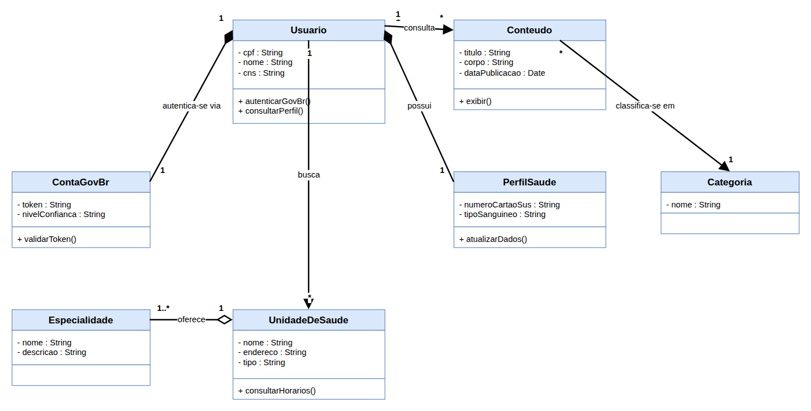
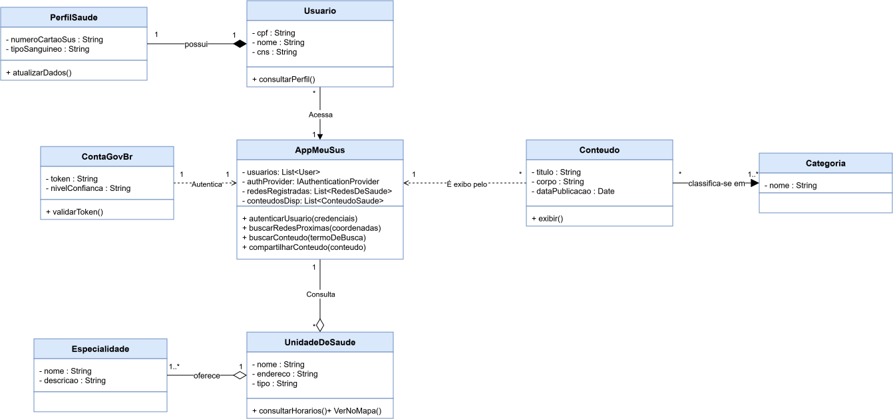

# Modelagem Estatica

---

## Versão Final

<strong>Legenda:</strong> Diagrama de Classes (Versão 3 — Final) do domínio "Meu SUS Digital", elaborado por Yasmim de Souza Santos, consolidando os refinamentos das Versões 1 e 2.

### Leitura do diagrama

- **Classes de domínio** (`Usuario`, `PerfilSaude`, `ContaGovBr`, `UnidadeDeSaude`, `Especialidade`, `Conteudo`, `Categoria`) representam as entidades centrais do "Meu SUS Digital", cada uma com 3 compartimentos (Nome / Atributos / Operações) e visibilidade explícita (`+` público, `-` privado).
- **`AppMeuSus`** funciona como fachada da aplicação: é por ela que `Usuario` acessa as demais funcionalidades, em vez de se relacionar diretamente com `UnidadeDeSaude` e `Conteudo`.
- **Serviços externos** (`ContaGovBr` e `GoogleMaps`) ficam fora do domínio persistido pelo sistema — por isso se conectam ao restante do diagrama por **dependência** (seta tracejada), e não por associação/agregação/composição.
- **Tipos de relacionamento** devem ser lidos pela ponta do losango/seta: losango preenchido junto à classe "todo" indica **composição** (a parte não existe sem o todo, ex. `PerfilSaude` ◆— `Usuario`); losango vazado indica **agregação** (a parte existe independentemente do todo, ex. `Especialidade` ◇— `UnidadeDeSaude`); linha cheia com nome de verbo indica **associação** simples (ex. `Conteudo` — `Categoria`, "classifica-se em"); linha tracejada com seta indica **dependência** (uso pontual, ex. `UnidadeDeSaude` ┄► `GoogleMaps`).
- **Multiplicidades** nas pontas das linhas (`1`, `1..*`, `*`) indicam quantas instâncias de cada lado participam da relação — por exemplo, `Especialidade` (1..\*) — `UnidadeDeSaude` (1) mostra que uma unidade pode oferecer várias especialidades.
- Para acompanhar a evolução de cada elemento até chegar a esta versão final, ver o detalhamento "O que foi alterado" na [Versão 3](#versão-3) e nas versões anteriores, na seção Desenvolvimento abaixo.

---

## Participantes

| Nome do Membro                                               |
| :----------------------------------------------------------- |
| [Davi Ursulino de Oliveira](https://github.com/DaviUrsulino) |
| [Gabriel Mota Oliveira](https://github.com/Gabro-MO)         |
| [Yasmim de Souza Santos](https://github.com/eii-yahs)        |

---

## Fundamentação Teórica

### O que é um diagrama estático?

Diagramas estáticos (também chamados de estruturais) são os diagramas da UML que retratam a estrutura do sistema e de suas partes em diferentes níveis de abstração, bem como a forma como elas estão relacionadas entre si. Ao contrário dos diagramas dinâmicos/comportamentais, eles não utilizam conceitos relacionados ao tempo e não mostram detalhes de comportamento — funcionam como uma "fotografia" da organização do sistema (classes, objetos, pacotes, componentes), sem descrever a ordem ou o fluxo de mensagens entre eles.

### Para que serve?

O diagrama estático serve para representar a modelagem estática do domínio de um sistema: quais entidades (classes) ele gerencia, seus atributos e operações, e como essas entidades se relacionam entre si (por associação, agregação, composição, generalização, dependência ou realização). Essa estrutura é a base sobre a qual, depois, a modelagem dinâmica descreve como os objetos colaboram e trocam mensagens para realizar os casos de uso do sistema — no caso desta subequipe, essa continuidade pode ser vista na comparação entre este Diagrama de Classes e o Diagrama de Colaboração produzido na Modelagem Dinâmica.

### O que é um diagrama de classes?

O Diagrama de Classes é o diagrama estático da UML mais utilizado, reunindo os elementos mais importantes de um sistema orientado a objetos: um conjunto de classes, interfaces e os relacionamentos entre elas. Cada classe especifica tanto as propriedades (atributos) quanto os comportamentos (operações/métodos) dos objetos que dela derivam, sendo representada por um retângulo dividido em três compartimentos — **Nome**, **Atributos** e **Operações**.

### Simbologias do diagrama de classes

- **Compartimentos da classe:** nome da classe (topo), atributos (meio) e operações/métodos (base).
- **Visibilidade:** `+` público (visível por qualquer classe), `-` privado (visível apenas pela própria classe), `#` protegido (visível pela classe e suas subclasses) e `~` pacote (visível apenas dentro do mesmo pacote).
- **Associação:** linha sólida simples entre duas classes, indicando que seus objetos se conhecem/interagem; pode ter nome (geralmente um verbo) e multiplicidade em cada extremidade.
- **Agregação:** linha com losango vazado do lado do "todo"; representa uma relação "tem", em que a parte pode existir independentemente do todo (ex.: `Especialidade` ◇— `UnidadeDeSaude`).
- **Composição:** linha com losango preenchido do lado do "todo"; representa uma relação "contém"/"é composto de", em que a parte não existe sem o todo e é destruída junto com ele (ex.: `PerfilSaude` ◆— `Usuario`).
- **Generalização (herança):** linha com seta de ponta vazada (triangular) apontando para a superclasse; representa a relação "é um tipo de", em que a subclasse herda atributos e operações.
- **Dependência:** linha tracejada com seta aberta; indica que uma mudança em um elemento pode afetar o outro (uso pontual, sem relação de posse), como no caso de `UnidadeDeSaude` que depende do serviço externo `GoogleMaps`.
- **Realização:** linha tracejada com seta de ponta vazada (triangular); usada entre uma classe e uma interface que ela implementa.
- **Multiplicidade:** números ou intervalos nas extremidades das linhas (`1`, `0..1`, `1..*`, `*`, etc.) indicando quantos objetos de cada lado participam da relação.
- **Classe abstrata:** representada com o nome em itálico ou com o estereótipo `<<abstract>>`, indicando que não gera instâncias diretas — diferente das classes concretas.

---

## Desenvolvimento

### Versão 1

<strong>Legenda:</strong> Diagrama de Classes (Versão 1) do domínio "Meu SUS Digital", elaborado por Davi Ursulino de Oliveira.

**Link Editável:** [Abrir e editar no draw.io](https://viewer.diagrams.net/?tags=%7B%7D&lightbox=1&highlight=0000ff&edit=_blank&layers=1&nav=1&dark=auto#R%3Cmxfile%3E%3Cdiagram%20name%3D%22ClasseV1_MeuSUS%22%20id%3D%22classe-v1-davi%22%3E7Vpdc9o6EP01zLQPmQGbkOQxQJo%2B9M50hnT6LOy10URIjCQD6a%2B%2FK1sGGTulpbJ7Gd88EGu1srXnrI714UE4W%2B%2BfJdms%2FhExsEEwjPeDcD4IglE4vsd%2FxvJWWO4ewsKQShpbp6NhQX%2BANQ6tNaMxqIqjFoJpuqkaI8E5RLpiI1KKXdUtEaz61A1JoWZYRITVrd9prFfWOh4OjxWfgaYr%2B%2BiHsmJNSmdrUCsSi51jCp8G4UwKoYur9X4GzIBX4lK0%2B%2FRO7aFjErj%2BlQaZyoik4kZTjcHVGtv7Kf1Whi5FxmMwrYeDcLpbUQ2LDYlM7Q7JRttKrxmWRniZUMZmggmZtw1jAvdJhHalpXgFp2YS3cMyMS0E1wv7tFFZLvgfhVgu%2BrMlLLP9%2BVYEYO0gNeydrtugn0GsQcs3dFk5tISWhN2RwwMx9i7jsS3bTC2LxGZQerjzEWS8sDj%2FHHOitVReMTfVhNGU4zWDBG84NZBQzNxHa9bC%2BCtsTnn6JfeZT46WF1M9H9e5S%2FK%2F89xZroImrm7MkNwk%2BDsIH%2FF3oSU%2BchBM8C4j03fjwBHQn3tEXNUcLmD%2F7vfZv%2FPIvtj0ivtBMDXAZRpjxT7JZ7Gdyg8fHWoLD5RslTFN5FeQ2A3jcQG3t7%2FP7cjH0Mbea5KK7fXq6cxEkJPjTVKHVeBHQRX4YOIT%2BF6KqsbG%2FIys0i3go3lCCY%2BID%2F1sGmPnqH7wSXUvFRQNNCbyxTB%2BoTheMEZDH%2BK4yRVdkSyG69XH4rW0MEG0Nee8m7QgkC74vdRInq1BihmRmohFVp9BVtQSV5JiQTiuMzmItsTyHO0%2BxNKlvZd6SXSGffxB5BwX2sqjYp5hz4tiZhy1%2FprV8lsRwBxaFczaIt2HYJbY91Mszy7CAWOVENXFsaajf2mtPvYhn2US9FI6D0vxz0KaLYsW1fOUvFsfIxjUBiKaz5evWUOf3DC8EXBmwu9FQqsE%2FC%2BkjRIZg4okdrm1aeY5pn3oZJXp3qllN2Py1tcOJWTxFZ%2F4zGwEbb2LTmfyXlHvpQhiqmXszEwxErJhqlhVSqLJ12zJMDRXLudEX%2FZa%2FIVJ5Wku%2BDgAOuRC72TSTCphT5dUdrcO93OsgymWCknJFatmGUJrb6thG9uWR%2BR7qZyN08eu%2BPNyWHPgr3dq1xFNYeBj%2Fm6JgLj24VOdLJHJyHo1fD7kcAk8fjRfW2GJCw45oETq0hZTshY8fllRXlZ9oqzUxLxcQnyPBkaWwKYkek3zHGni65QVR2KLzuE9U9DH9%2FDpWb1D4OFThRtlhuC2UM46fxIY0XRbhe2PuAj6x8U7R4MOHRuhVEa7oiBsmYIlE9ErIoEmB2YslYgNTwmypPkGvuGEwQF9mamos7QfX4h5PQIfaT%2FsIu3f3aF0OBCJ2WeHrli47UvmN22EOLCXm99d4T65DPemKP7rwDctplzkGVGKJoc3L6zb4QCLx%2B%2Bs8zrna%2FXw6V8%3D%3C%2Fdiagram%3E%3C%2Fmxfile%3E)

**Tipo de UML escolhido: Diagrama de Classes** — decisão do subgrupo por ser o diagrama estático mais adequado pra representar as entidades do domínio já mapeadas na Entrega 1 (Rich Picture e BPMN dos fluxos "Rede de Saúde" e "Conteúdo").

Nesta segunda versão, modelei a entidade do AppMeuSUS para melhorar a logica de ligação entre os fluxos escolhidos e seus relacionamentos, aplicando as diferentes semânticas de relacionamento da UML, e fiz modificações visuais para melhorar a legibilidade.

#### Mapeamento das relações

- **`Usuario` ◆— `ContaGovBr`** (composição, 1..1): a autenticação via gov.br não existe fora do contexto de um usuário logado no app — é parte que não sobrevive sem o todo.
- **`Usuario` ◆— `PerfilSaude`** (composição, 1..1): o perfil de saúde é parte inseparável do usuário autenticado.
- **`UnidadeDeSaude` ◇— `Especialidade`** (agregação, 1..1..\*): uma unidade "oferece" especialidades, mas a especialidade existe independentemente da unidade (agregação, não composição).
- **`Usuario` — `UnidadeDeSaude`** (associação, "busca", 1..\*) e **`Usuario` — `Conteudo`** (associação, "consulta", 1..\*): navegação simples, sem relação de posse.
- **`Conteudo` — `Categoria`** (associação, "classifica-se em", \*..1).

Cada classe segue a estrutura de 3 compartimentos (Nome / Atributos / Operações) com visibilidade explícita (`+` público, `-` privado), conforme a notação apresentada em aula.

### Versão 2

**Autoria:** [Gabriel Mota](https://github.com/Gabro-MO)

<strong>Legenda:</strong> Diagrama de Classes (Versão 2) do domínio "Meu SUS Digital".

**Link Editável:** [Abrir e editar no draw.io](https://viewer.diagrams.net/?tags=%7B%7D&lightbox=1&highlight=0000ff&edit=_blank&layers=1&nav=1&title=DigramaDeClasses-MeuSusDigital.drawio.svg&dark=auto#R%3Cmxfile%3E%3Cdiagram%20name%3D%22ClasseV1_MeuSUS%22%20id%3D%22classe-v1-davi%22%3E7Vxbc9soFP41nkl3xhldfH30JW13JtnJ1u1ud9%2BIhG0SWWgAJU5%2B%2FYKEZCHJF9nIiertQyqOAMH5DufCAbfsyWr9hYBgeYdd6LUsw1237GnLssyBbfH%2FBOU1pgz7nZiwIMiVlTaEGXqDkmhIaohcSJWKDGOPoUAlOtj3ocMUGiAEv6jV5thTvxqABSwQZg7witS%2FkcuWktoxjM2LrxAtlvLTw%2BTFCiSVJYEugYtfMiT7pmVPCMYsflqtJ9ATzEv4Erf7vOVtOjACfXZIg5CGgCDcZojxyRUay%2F4oe02mTnDou1C0Nlr2%2BGWJGJwFwBFvXzjYnLZkK4%2BXTP44R543wR4mUVvbBXAwdzidMoKfYOZNzxnAh7logX02k18zk3KMv2nzcjyeZ%2BCFcjw%2F4glIOiQMrjNDl5P%2BAvEKMvLKqywzsNgShJcNhikwspdOR5alpCZFICVokfa8YTJ%2FkHzezXPAGKFaeS5eAw8tfP7swTnvcCxYgrjkjiSZYVGf8ubIX9xGdaa9DeW7eD3tFLGbR%2F%2F2YyexssqwaoslGcz535Y94n9njPBPtqwe72U94i1EBZ8zdHcNx6eFCkeg36%2BOfl8D%2Bt9Gf%2F5rPd6%2BrOfz5ePd8sV7vIXtXtwvdAt6pygXOCQOVCUJB7QgNKKvZCVhwpZ4gX3g3WyoY1WsNnVucSQEYvk9QsZeJaYgZFhd3nxo5PWnaH%2FdTYr%2FyO6iwnStlF7TkjsSWpgXHzzsPMWkz8hLOpYqHZAFZDu4ZpWDTKAHGHpWOakdsoFiYsBDwnejiNwuyHOI3YIHbisVLicL2uH9QVKypFfIdWNAIUVvciSCzwFGPovm3R23utOyJTlyIKXg4PVTylrZxLjudJXV0ra2s152fS9GuOnCUtubA7UDPJ9TLhB55NLxVdK%2B6Zq5DN3bssaxtNLQ4wvrHhL%2BkatP57Kbpg7DyUfPwAI%2FN9dbmYgZfMHPY6KN8YbKeNNWGW%2F16rJZ3eNsVgpixv15L7OlGK2NDdtitlxAl9F3TdWG4QD6igkzDjdh9nuasP6JJqz7MUxYyHi3vDdNVixvhKoasfZwZwdajFgpHOapLsnHwNPUgmPbuB50jJ6qC6tCaeeQtGuAskwfXoZL0o62bZ648twdEHKE%2Baf9OQK%2BWOSnR37dI8zoUKf%2FcpG%2BJycgF5DvAnGNjuce4GwdjmcQecsUhC5sru8Zu%2FwzMQltzM95%2FX2V913NrL9IDemHK0jwBBAG8Cws7nwpupKhAM%2BAvwiRD3FdqnI36APNoF%2BkrgQs5GN8A2QKXEzrC9Nz2KXKU3uokWRuKu9w%2BtxmqFr3yGDRPDZYTOM8H%2FuwEOdRHuKliA44wQnJcyqHsSAkOSLZX7Z21Dz5gIvACvvu9yXyk1fVI8pOBV9ZP8xq4q16CJLIyTvHIBO5T3bwutsTiljm4OSw0sx10Fd70LM5WlxuzXJyfsQTmMJa%2FZz87mZXS1pQ8v4yvZy9WT%2BuOCGBTtGrKThAOvyeI5KDXR3ZwUQILtLrSbMTXzEROZrI8REv%2FoLkD3wHAnC%2BhEVPx5KGNIAOiuLeJivVm%2Bw0tAGQD9yt3HLSET2qAPyvWUt1pgupQ%2FiQawsY9yGtI2RUkb449XmeNdnTER%2BKXVAYug0%2BczaRM6jLFg16Ktu1bKSVh1snJHEjDN8tiasEzjIyz0fM%2B3K0hdhdyfC2Dou33zWDa56awjU%2FRs6vNbFbg6EQxDV6EHYogN7hy2tP8G1Y%2Fe3szwXb2lN7%2BVVyGQYpDsVY6O0J1xxMSuI11TsBDNyHDx6fWtZFmQJ2nCt6QGRX0L86HJRUGC7ONxnLdY1IfeFbHjJbh8l0uIwtMEGgwa5KMoX6XEQzt1h0bINsOH%2BRqrM0ZjsTfrahFb%2BL03bngklHKAbleI%2B9d7DF%2By%2BkzA7McqV%2BfdYn94QrOgbO0yKSkTK88qiUnfVMC4ed9eT2iv3MPGda8dKmkSgkbVqFgGHL4YWMvASY0hBVcGtPgrtzJNzFzIQOuEtDsCbDvXW3MQM4nossBjwX4kdeLNoX3%2B%2B7wJPJcht5gZBCciLQEjCzAmDHnvsuAl3qnmRAdjxAKZpzo9SmwpDD1Znw3n5NqmmO6ygI7mAYHXjSZFG7qkXtWOptpfo22exLcoCE%2ByrdAxr7r7eIMh7Te2KkPygk%2FHnBoqZKnA9Ctrwn%2BBm5YndJNPx9xEnx0X6GsJ%2B%2BnFitkZFrTaAL6Te44N8iwAUln%2F4maqTnAkqHkGg9OkU0KPaQbPvmutC0B7FPPHXsQWw%2FMHQp4imP1yVXRoi8Pn7lCAHyufFG9FNGKuLqDyHlVSMB4kK4RitArxyMCW8hZG1bg0RerhgkKzyFY0EtVnbwivOeIW%2BZaZKI4nEbJoPq8qVlw6Tc%2FMiOD9mjLgrex76BkjCzjhi6nJkVDtg1lJnd3EkMLb%2B5UM5Mq2nM%2FO1UZpq7zEguF7LlGnd9F9iS%2B1bNwaOycNu5jPquzdJt50D7KqLDs8HT%2BeXh6eTg0XHrq5yXvabxsrLqGXTPZhQrZME%2FBjMrC2ZveDZmDhvHzOvrysJpphvstTPUbpz%2FW52bxtnE0748B7hTmwOc%2FA5fc5h5sgPcre2Km%2F3re6%2Bd3OXqbm3%2Bkd08X%2FMIK2Rr4Ccvbn4uMnb1Nz%2B6ad%2F8Bw%3D%3D%3C%2Fdiagram%3E%3C%2Fmxfile%3E)

Nesta primeira versão, modelei as entidades centrais do "Meu SUS Digital" e seus relacionamentos, aplicando as diferentes semânticas de relacionamento da UML (não usando "associação" genérica pra tudo):

- **`AppMeuSUS` — `Usuario`** (associação, 1..\*): Varios usuários acessam o app do "Meu SUS digtal" por uma navegação simples sem relação de posse.
- **`Usuario` ◆— `PerfilSaude`** (composição, 1..1): o perfil de saúde é parte inseparável do usuário autenticado.
- **`ContaGovBr` <- - `AppMeuSUS`** (dependencia, 1..1): a autenticação do "Meu SUS digital" depedende do "gov.br", send uma parte que não sobrevive sem o conjunto.
- **`UnidadeDeSaude` ◇— `AppMeuSUS`** (agregação, 1..\*): O app do "Meu SUS digital" consulta as unidades de saúde nas proximidades, mas as unidades de saúde existem independentemente do app.
- **`UnidadeDeSaude` ◇— `Especialidade`** (agregação, 1..1..\*): uma unidade "oferece" especialidades, mas a especialidade existe independentemente da unidade (agregação, não composição).
- **`AppMeuSUS` <- - `Conteudo`** (dependencia, 1..\*): O app do "Meu SUS digital" exibi os conteudos salvos no banco de dados, e os conteudos dependem do app para serem exibidos.
- **`Conteudo` — `Categoria`** (associação, "classifica-se em", \*..1..\*): Cada Conteudo pode ser associado a uma ou mais Categorias, mas não possuem relação de posse entre sí.

Cada classe segue a estrutura de 3 compartimentos (Nome / Atributos / Operações) com visibilidade explícita (`+` público, `-` privado), conforme a notação apresentada em aula.

### Versão 3

<strong>Legenda:</strong> Diagrama de Classes (Versão 3) do domínio "Meu SUS Digital", elaborado por Yasmim de Souza Santos.

#### O que foi alterado em relação à Versão 2

A Versão 2 introduziu a classe `AppMeuSus` como fachada da aplicação (substituindo as associações diretas `Usuario`–`UnidadeDeSaude` e `Usuario`–`Conteudo` da V1 por `Usuario` → `AppMeuSus` → {`UnidadeDeSaude`, `Conteudo`}), refletindo a mesma separação de responsabilidades já identificada na Modelagem Dinâmica (objetos `:TelaBusca`, `:RedeService`, `:ConteudoService`). Essa classe e os relacionamentos que ela participa (Acessa, Autentica, É exibido por, Consulta) foram mantidos sem nenhuma alteração nesta V3.

Como fechamento, o trabalho desta versão incidiu sobre as demais classes do domínio, com dois objetivos:

1. **Fechar a lacuna do fluxo "Rede de Saúde"**: até a V2, a chegada ao Google Maps (último passo do fluxo reconstruído via Engenharia Reversa e modelado no BPMN — "Abrir rota até a unidade no Google Maps") não tinha nenhuma representação estática. O Diagrama de Colaboração `FindRedeDeSaude` (Modelagem Dinâmica) já havia identificado esse ponto como um objeto `:MapService`, então esta versão traduz esse papel para uma classe no diagrama estático.
2. **Detalhar atributos e operações** das classes que chegaram à V2 apenas com o compartimento de atributos preenchido (`Categoria` e `Especialidade` estavam sem nenhuma operação) ou com operações genéricas/mal formatadas demais para o comportamento real observado na Engenharia Reversa (`Conteudo`, `UnidadeDeSaude`).

##### 1. Classe nova: `GoogleMaps` («Serviço Externo»)

| Atributo | Tipo | Justificativa |
| --- | --- | --- |
| `- urlBase` | String | URL/endpoint base usado para montar a rota (equivalente ao `token`/`nivelConfianca` que já existem em `ContaGovBr` para representar outro serviço externo — o gov.br). |

| Operação | Retorno | Justificativa |
| --- | --- | --- |
| `+ abrirRota(destino : UnidadeDeSaude)` | void | Ação executada ao clicar em "Ver no mapa" na tela de resultado (`02-maternidade-resultado.png`), correspondente à atividade "Abrir rota até a unidade no Google Maps" no BPMN do fluxo Rede de Saúde. |

**Relacionamento:** `UnidadeDeSaude` ┄┄`verNoMapa()`┄┄► `GoogleMaps` — modelada como dependência (linha tracejada), e não como associação/agregação, pelo mesmo motivo já usado para `ContaGovBr`↔`AppMeuSus`: o Google Maps é um serviço externo ao domínio do "Meu SUS Digital" (não é uma entidade que o sistema persiste ou possui), então `UnidadeDeSaude` apenas usa esse serviço no momento da chamada, sem manter uma referência permanente a ele. A seta aponta de quem depende (`UnidadeDeSaude`, o cliente que precisa da rota) para quem é o fornecedor do serviço (`GoogleMaps`).

Optamos por não modelar `Localizacao`/`Coordenada` como uma classe à parte nesta versão — os pares latitude/longitude foram adicionados diretamente como atributos de `UnidadeDeSaude` (ver seção 5), por ser a solução mais simples que ainda suporta o método `verNoMapa()`. Como esta é a versão de fechamento, essa é registrada como uma possível evolução futura (fora do escopo desta entrega), caso o time queira extrair um Value Object `Coordenada` em uma iteração posterior.

##### 2. `PerfilSaude`

| Atributo | Tipo | Status |
| --- | --- | --- |
| `- numeroCartaoSus` | String | mantido da V2 |
| `- tipoSanguineo` | String | mantido da V2 |
| `- alergias` | String | novo — campo de saúde recorrente em cadastros desse tipo, dá suporte a um cartão de saúde mais completo |

| Operação | Retorno | Status |
| --- | --- | --- |
| `+ atualizarDados()` | void | mantido da V2 |
| `+ visualizarCartaoSus()` | void | novo — o Meu SUS Digital oferece a visualização do Cartão SUS digital a partir do perfil; adicionamos a operação correspondente |

##### 3. `Usuario`

Mantido como na V2 — `cpf`, `nome`, `cns` e `+ consultarPerfil()` já cobriam bem o papel de entidade de identidade do cidadão dentro do domínio. Apenas explicitamos o tipo de retorno: `+ consultarPerfil() : PerfilSaude`.

##### 4. `ContaGovBr`

| Atributo | Tipo | Status |
| --- | --- | --- |
| `- token` | String | mantido da V2 |
| `- nivelConfianca` | String | mantido da V2 |
| `- dataExpiracao` | Date | novo — todo token de sessão federada (gov.br) tem expiração; sem esse campo não é possível justificar a necessidade de `renovarToken()` |

| Operação | Retorno | Status |
| --- | --- | --- |
| `+ validarToken()` | Boolean | tipo de retorno explicitado (antes sem retorno declarado) |
| `+ renovarToken()` | Boolean | novo — complementa `validarToken()` no ciclo de vida da sessão gov.br |

##### 5. `UnidadeDeSaude`

| Atributo | Tipo | Status |
| --- | --- | --- |
| `- nome` | String | mantido |
| `- endereco` | String | mantido |
| `- tipo` | String | mantido (valores observados na Engenharia Reversa: Médicos Especialistas, Hospital, Unidade Básica de Saúde, Maternidade, Atenção Psicossocial, Academia da Saúde, Saúde Bucal, Doenças Raras, Transplante, Serviços Hemoterápicos, Atendimento Antiveneno) |
| `- latitude` | Double | novo — necessário para `verNoMapa()` |
| `- longitude` | Double | novo — necessário para `verNoMapa()` |

| Operação | Retorno | Status |
| --- | --- | --- |
| `+ consultarHorarios()` | List\<String\> | separada corretamente da operação de mapa (na V2 as duas operações estavam grudadas em uma única linha, `consultarHorarios()+ VerNoMapa()`, o que não é uma notação UML válida) |
| `+ verNoMapa()` | void | ação do botão "Ver no mapa"; delega para `GoogleMaps.abrirRota(this)` |

> **Nota:** o botão "Detalhes" da mesma tela não precisou de uma operação nova — ele apenas exibe os atributos já existentes (`nome`, `endereco`, `tipo`), então é coberto pelos getters implícitos da classe.

##### 6. `Conteudo`

| Atributo | Tipo | Status |
| --- | --- | --- |
| `- titulo` | String | mantido |
| `- corpo` | String | mantido |
| `- dataPublicacao` | Date | mantido |
| `- curtidas` | int | novo — suporta a operação `curtir()` |

| Operação | Retorno | Status |
| --- | --- | --- |
| `+ exibir()` | void | mantido |
| `+ curtir()` | void | novo — ícone de coração na tela do artigo (`02-artigo-detalhe.png`) |
| `+ compartilhar()` | void | novo — ícone de compartilhar na mesma tela; complementa (em nível de classe) o `compartilharConteudo(conteudo)` que já existe em `AppMeuSus` |

##### 7. `Categoria`

Estava sem nenhuma operação na V2. Como `Categoria` é o lado "1" da associação classifica-se em com `Conteudo` (lado "\*"), a operação natural de navegação inversa é:

| Operação | Retorno | Justificativa |
| --- | --- | --- |
| `+ listarConteudos()` | List\<Conteudo\> | corresponde ao filtro por categoria na tela de listagem de artigos (`01-lista-artigos.png`: Todas, Animais peçonhentos, Atenção e cuidado, Doenças, Doenças contagiosas, Saúde da família...) |

##### 8. `Especialidade`

Mesma situação de `Categoria` — sem operações na V2. Como é o lado "1..\*" da agregação oferece com `UnidadeDeSaude` (lado "1"):

| Operação | Retorno | Justificativa |
| --- | --- | --- |
| `+ listarUnidades()` | List\<UnidadeDeSaude\> | permite, a partir de uma especialidade, encontrar quais unidades a oferecem — caminho inverso ao já existente |

##### Tabela-resumo de relacionamentos (V3)

| Origem | Relação | Destino | Tipo UML | Multiplicidade |
| --- | --- | --- | --- | --- |
| `PerfilSaude` | possui | `Usuario` | Composição | 1 — 1 |
| `Usuario` | Acessa | `AppMeuSus` | Associação | — |
| `ContaGovBr` | Autentica | `AppMeuSus` | Dependência | — |
| `Conteudo` | É exibido por | `AppMeuSus` | Dependência | — |
| `AppMeuSus` | Consulta | `UnidadeDeSaude` | Agregação | 1 — \* |
| `Especialidade` | oferece | `UnidadeDeSaude` | Agregação | 1..\* — 1 |
| `Conteudo` | classifica-se em | `Categoria` | Associação | \* — 1 |
| `UnidadeDeSaude` | `verNoMapa()` (abre rota) | `GoogleMaps` | Dependência (novo) | — |

##### Rastreabilidade com as demais entregas da Subequipe 03

- **BPMN — Fluxo Rede de Saúde:** o gateway "Como continuar?" e o ramo "Abrir rota até a unidade no Google Maps" são a origem direta da classe `GoogleMaps` e do método `verNoMapa()`.
- **Diagrama de Colaboração `FindRedeDeSaude`:** o objeto `:MapService` (mensagem `1.7a: showOnMap(Rede)`) é o equivalente dinâmico da dependência `UnidadeDeSaude` → `GoogleMaps` criada nesta versão.
- **Diagrama de Colaboração `SearchConteudo`:** os objetos `:ConteudoService` e `:ShareService` (mensagens `1.6a: shareCont(Cont)`) embasam as novas operações `curtir()`/`compartilhar()` em `Conteudo`.
- **Engenharia Reversa (prints):** telas `01-categorias.png`, `02-maternidade-resultado.png`, `01-lista-artigos.png` e `02-artigo-detalhe.png` foram usadas para validar nomes e tipos de atributos/operações.

---

## Metodologia

O subgrupo trabalha em rotação: cada integrante fica responsável por uma versão (V1, V2 e V3) do diagrama, sempre refinando a versão anterior do colega. Nesta frente (Modelagem Estática), a rotação é: **Versão 1 — Davi Ursulino** (elaboração inicial) → **Versão 2 — Gabriel Mota** (refinamento) → **Versão 3 — Yasmim Santos** (fechamento). O tipo de UML (Diagrama de Classes) foi definido em conjunto pelo subgrupo antes do início da V1, pra manter consistência entre as três versões.

Além da rotação de autoria, há uma revisão contínua entre os membros: a cada nova versão, os demais integrantes validam a entrega do colega responsável, conferindo se o diagrama está coerente com as versões anteriores e com os artefatos já produzidos (Rich Picture, BPMN, etc.), garantindo um entendimento compartilhado do domínio modelado.

---

### Embasamento teórico para criação:

1. A notação segue o Diagrama de Classes da UML (Unified Modeling Language), conforme material da disciplina (Profa. Milene Serrano) e a documentação de referência [uml-diagrams.org](https://www.uml-diagrams.org/class-diagrams-overview.html): cada classe é representada em 3 compartimentos (Nome, Atributos, Operações), com visibilidade `+` (público), `-` (privado) e `#` (protegido).
2. Os relacionamentos seguem semânticas distintas, e não uma associação genérica: **associação** (uso simples, verbo no meio da linha), **agregação** (losango vazado, relação "tem", parte sobrevive sem o todo) e **composição** (losango preenchido, relação "contém"/"é composto de", parte não existe sem o todo), conforme Booch, Rumbaugh & Jacobson (criadores da UML).
3. SERRANO, Milene. [Arquitetura e Desenho de Software - Aula Modelagem UML Estática](https://drive.google.com/file/d/17TPUNv5Pllzhx23HIpZ0aJnU9hAJ9Ln9/view). Brasília: UnB Gama, 2026. 1 arquivo PDF.
4. BARCELAR, Ricardo Rodrigues. Engenharia de Software - Módulo 3: Modelagem de Sistemas Orientada a Objetos com UML. Disponível em: http://www.ricardobarcelar.com.br. Acesso em: 17 set. 2026.
5. UML — UNIFIED MODELING LANGUAGE. Linguagem de Modelagem Unificada em Português. Apostila de referência sobre a UML (introdução, modelos de elementos e diagramas). [S.l.: s.n.], [s.d.].

---

| Nome do Membro | Contribuição | Data | Commit  |
| ----| -------------- | ---------- | ------------ |
| [Gustavo Fornaciari](https://github.com/GUGOFO)     | Criação do Repositorio  | 10/09/2026 | [efd139e](https://github.com/UnBArqDsw2026-2-Turma01/2026.2-T01-_G5_ProjetoGovernoEletronico_Entrega_02/commit/efd139e36025a5c1610fff909ac41451ab13eecd)   |
| [Davi Ursulino de Oliveira](https://github.com/DaviUrsulino) | Elaboração da Versão 1 do Diagrama de Classes do domínio Meu SUS Digital, com documentação de metodologia e embasamento teórico  | 15/09/2026 | [3ff3924](https://github.com/UnBArqDsw2026-2-Turma01/2026.2-T01-_G5_ProjetoGovernoEletronico_Entrega_02/commit/3ff39242252bef9a52102eb0a04433f3beef31b8)  |
| [Davi Ursulino de Oliveira](https://github.com/DaviUrsulino) | Adição do link editável e do arquivo `.drawio` do Diagrama de Classes V1  | 15/09/2026 | [2db370f](https://github.com/UnBArqDsw2026-2-Turma01/2026.2-T01-_G5_ProjetoGovernoEletronico_Entrega_02/commit/2db370f4b4fca3738924ef8834d33aa29680bf94)  |
| [Gabriel Mota](https://github.com/Gabro-MO)                  | Adição da versão 2 do Diagrama Estatico (Diagrama de Classes) e correçãos dos links | 17/09/2026 | [f5b99b1](https://github.com/UnBArqDsw2026-2-Turma01/2026.2-T01-_G5_ProjetoGovernoEletronico_Entrega_02/commit/f5b99b154cdd70761cc3d787040b86b3bde1cafb)         |
| [Gabriel Mota](https://github.com/Gabro-MO)                  | Correção dos link que estavam em HTML e da imagem V2 incorreta | 17/09/2026 | [5f20857](https://github.com/UnBArqDsw2026-2-Turma01/2026.2-T01-_G5_ProjetoGovernoEletronico_Entrega_02/commit/5f20857d8c425ac538558cfc792b70f419cd0765)         |
| [Yasmim de Souza Santos](https://github.com/eii-yahs)        | Detalhamento da metodologia de trabalho da subequipe (rotação de versões e revisão contínua entre os membros)                                            | 17/09/2026 | [37e0f46](https://github.com/UnBArqDsw2026-2-Turma01/2026.2-T01-_G5_ProjetoGovernoEletronico_Entrega_02/commit/37e0f46438bba1ecf427a8d69b12afda091c7fca)         |
| [Yasmim de Souza Santos](https://github.com/eii-yahs)        | Elaboração da Versão 3 (fechamento) do Diagrama de Classes, com o detalhamento das alterações em relação à V2                                            | 17/09/2026 | [f0228fb](https://github.com/UnBArqDsw2026-2-Turma01/2026.2-T01-_G5_ProjetoGovernoEletronico_Entrega_02/commit/f0228fbf1d396bb7714c00d13a90a4bc19fb2e10)         |
| [Yasmim de Souza Santos](https://github.com/eii-yahs)        | Consolidação da Versão Final do diagrama e inclusão do tópico "Leitura do diagrama"                                                                       | 17/09/2026 | [6ea2291](https://github.com/UnBArqDsw2026-2-Turma01/2026.2-T01-_G5_ProjetoGovernoEletronico_Entrega_02/commit/6ea22916965532232b483b5b312ee0c2e7f6416a)         |
| [Yasmim de Souza Santos](https://github.com/eii-yahs)        | Adição da Fundamentação Teórica (diagrama estático, diagrama de classes e simbologias) e das referências bibliográficas                                  | 17/09/2026 | [f0f1ffc](https://github.com/UnBArqDsw2026-2-Turma01/2026.2-T01-_G5_ProjetoGovernoEletronico_Entrega_02/commit/f0f1ffc6d4897cd649e8966c7e438d168dae3db0)         |
| [Gabriel Mota](https://github.com/Gabro-MO)                  | Correção do caminho da imagem V3  | 18/09/2026 | [1fab78c](https://github.com/UnBArqDsw2026-2-Turma01/2026.2-T01-_G5_ProjetoGovernoEletronico_Entrega_02/commit/1fab78c354aa552df151f7cb3ee43356a0edfd10)         |
