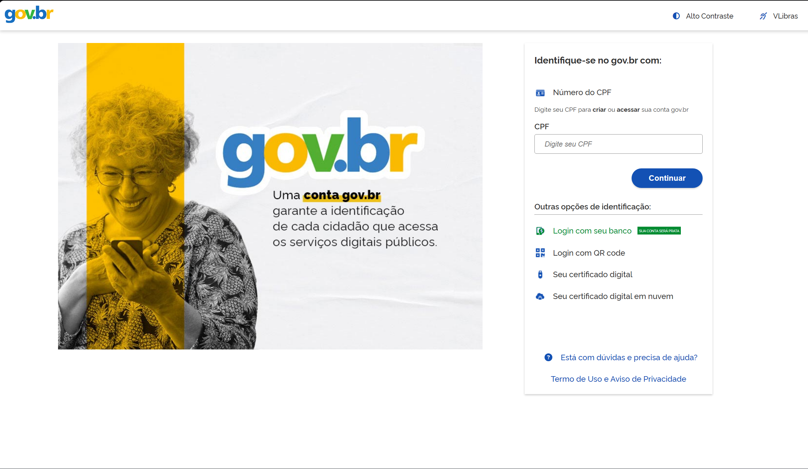
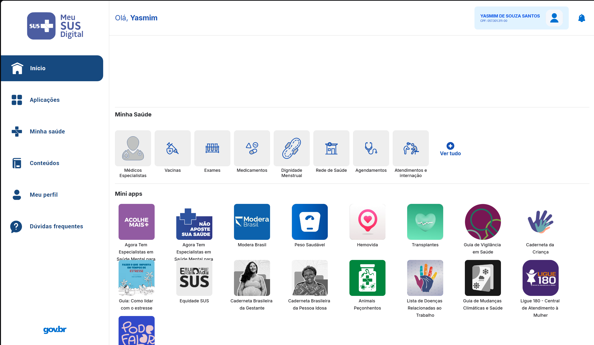
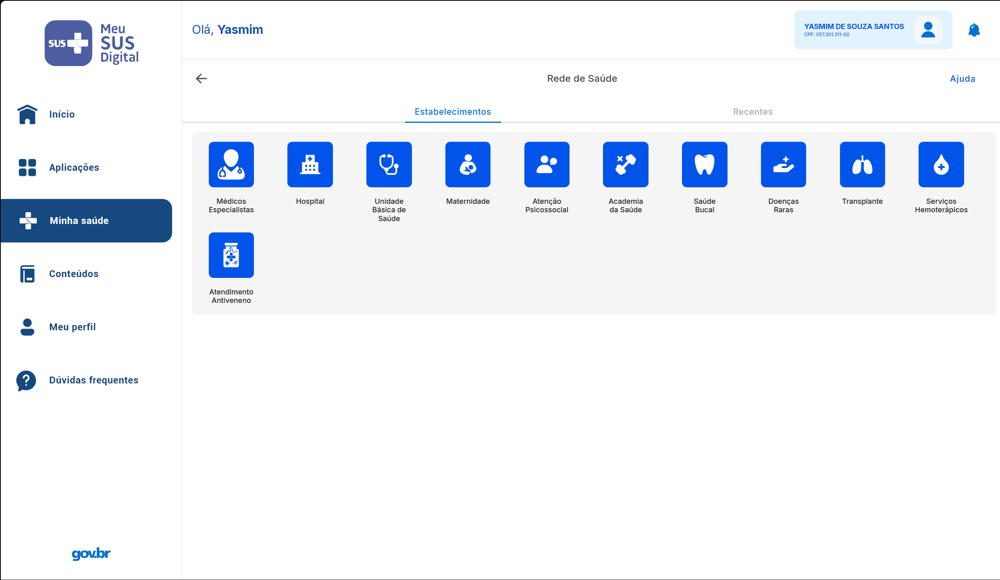
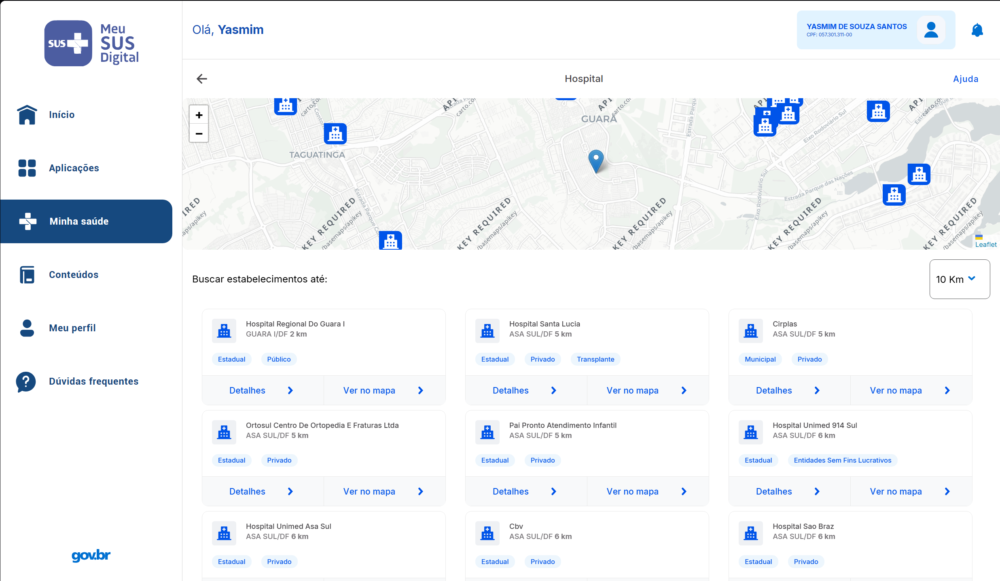
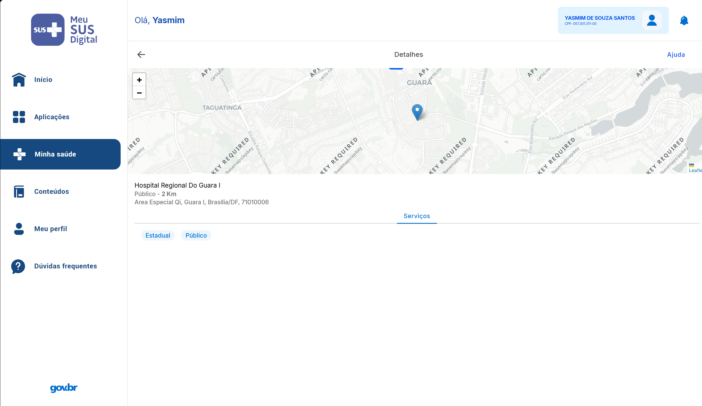
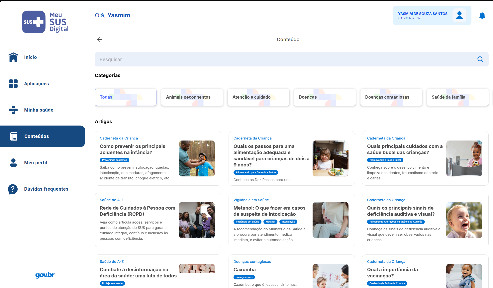
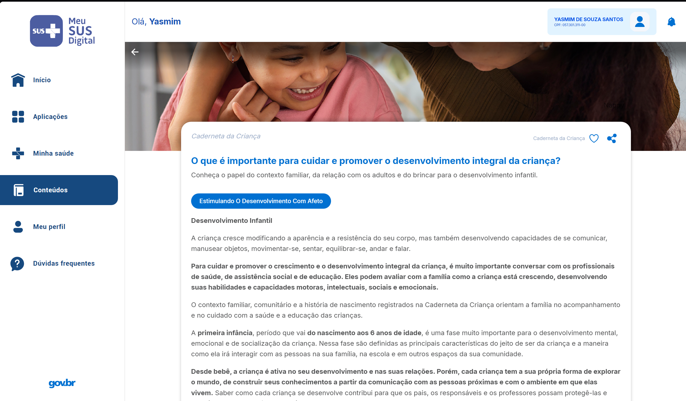

# Fluxo Selecionado para Modelagem

---

## Participantes da SubEquipe 3

| Nome do Membro                                               |
| :----------------------------------------------------------- |
| [Davi Ursulino de Oliveira](https://github.com/DaviUrsulino) |
| [Gabriel Mota Oliveira](https://github.com/Gabro-MO)         |
| [Yasmim de Souza Santos](https://github.com/eii-yahs)        |

---

## Mapeamento do Fluxo

### Nome do Fluxo
Acesso à Rede de Saúde e Consulta de Conteúdo no MEU SUS DIGITAL

### Passo a Passo do Fluxo

**Fluxo 1 — Rede de Saúde**

1. **Autenticação via gov.br:** O cidadão se identifica na plataforma informando o CPF (ou por login com banco, QR code ou certificado digital), garantindo a autenticação federada exigida para acessar os serviços digitais públicos.
2. **Acesso à seção "Rede de Saúde":** Já autenticado, o cidadão é direcionado à tela inicial (*Dashboard*) do Meu SUS Digital e seleciona o atalho **Rede de Saúde**, dentro da seção "Minha Saúde".
3. **Seleção da categoria de estabelecimento:** O sistema exibe a tela "Rede de Saúde" com as categorias de estabelecimentos disponíveis (Médicos Especialistas, Hospital, Unidade Básica de Saúde, Maternidade, Atenção Psicossocial, Academia da Saúde, Saúde Bucal, Doenças Raras, Transplante, Serviços Hemoterápicos e Atendimento Antiveneno).
4. **Busca por estabelecimentos próximos:** Ao escolher uma categoria (ex.: *Hospital*), o sistema exibe um mapa com a localização do cidadão e dos estabelecimentos nas proximidades, além de uma lista com nome, distância, natureza (estadual/municipal, público/privado) e as ações "Detalhes" e "Ver no mapa".
5. **Consulta de detalhes do estabelecimento:** Ao acionar "Detalhes", o sistema exibe a tela de Detalhes do estabelecimento selecionado, com sua localização no mapa, endereço completo e os serviços/categorias que ele oferece.

**Fluxo 2 — Conteúdo**

1. **Autenticação via gov.br:** Mesma etapa de identificação do cidadão descrita no Fluxo 1.
2. **Acesso à seção "Conteúdos":** Da tela inicial, o cidadão navega pelo menu lateral até a opção **Conteúdos**.
3. **Busca e filtro de artigos:** O sistema exibe a tela "Conteúdo", com um campo de pesquisa, categorias de filtro (Todas, Animais peçonhentos, Atenção e cuidado, Doenças, Doenças contagiosas, Saúde da família) e a listagem de artigos disponíveis.
4. **Leitura do conteúdo selecionado:** Ao escolher um artigo, o sistema exibe a tela do conteúdo específico, com título, resumo, corpo do texto e as opções de curtir e compartilhar.

---

## Interface do Sistema (Imagens Reais)

<strong>Legenda:</strong> Figura 1 - Tela de autenticação do cidadão via gov.br

<strong>Legenda:</strong> Figura 2 - Tela inicial (Dashboard) do Meu SUS Digital após a autenticação, com as seções "Minha Saúde" e "Mini apps"

<strong>Legenda:</strong> Figura 3 - Categorias de estabelecimentos disponíveis na Rede de Saúde

<strong>Legenda:</strong> Figura 4 - Mapa e listagem de estabelecimentos próximos ao selecionar a categoria "Hospital"

<strong>Legenda:</strong> Figura 5 - Detalhes do estabelecimento de saúde selecionado

<strong>Legenda:</strong> Figura 6 - Tela "Conteúdo", com categorias de filtro e listagem de artigos

<strong>Legenda:</strong> Figura 7 - Tela de leitura de um conteúdo específico selecionado

---

## Histórico de Versionamento

| Nome do Membro | Contribuição | Data | Commit |
| :--- | :--- | :--- | :--- |
| [Gustavo Fornaciari](https://github.com/GUGOFO) | Criação do documento de fluxo | 17/09/2026 | [df5d7d2](https://github.com/UnBArqDsw2026-2-Turma01/2026.2-T01-_G5_ProjetoGovernoEletronico_Entrega_02/commit/df5d7d2a5c4c247e7cf9c9b98a3c234674aee3a4) |
| [Gustavo Fornaciari](https://github.com/GUGOFO) | Criação do template do documento de fluxograma | 17/09/2026 | [4ccc855](https://github.com/UnBArqDsw2026-2-Turma01/2026.2-T01-_G5_ProjetoGovernoEletronico_Entrega_02/commit/4ccc85558bc4da2a39a4c0f6fce6703de2ca5d0d) |
| [Yasmim de Souza Santos](https://github.com/eii-yahs) | Preenchimento do fluxograma da SubEquipe 03 (fluxos "Rede de Saúde" e "Conteúdo") com base nas imagens reais do sistema | 17/09/2026 | [3bd2565](https://github.com/UnBArqDsw2026-2-Turma01/2026.2-T01-_G5_ProjetoGovernoEletronico_Entrega_02/commit/3bd2565556a7351bcf44d7a09dbfb74e8d865369) |
