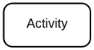
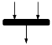
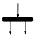
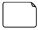
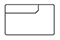
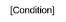

### Diagramas Dinâmicos

# Guia do Diagrama de Atividades

Este documento apresenta uma introdução ao **Diagrama de Atividades UML** e orientações sobre sua utilização, principais elementos da notação e ferramentas de modelagem para o projeto.

---

## Introdução ao Diagrama de Atividades

O **Diagrama de Atividades** é um diagrama comportamental da UML utilizado para representar o fluxo de ações de um processo. Ele permite visualizar a sequência de atividades, decisões, caminhos alternativos e ações que podem ocorrer simultaneamente.

Pode ser utilizado para representar processos de negócio, fluxos de trabalho e comportamentos de sistemas. Embora seja semelhante a um fluxograma, o Diagrama de Atividades utiliza a notação UML e permite representar recursos como paralelismo, sincronização e fluxo de objetos.
### Principais Elementos da Notação

| Elemento | Símbolo | Descrição |
| ------------------------------------------------ | -------------------------------------------- | ---------------------------------------------------------------------------------------------------------------- |
| **Símbolo Inicial** |  | Representa o começo de um processo ou fluxo de trabalho em um diagrama de atividades. |
| **Símbolo de Atividade** |  | Indica as atividades que compõem um processo modelado. |
| **Símbolo de Conector** |  | Mostra a direção do fluxo, ou fluxo de controle, da atividade. |
| **Símbolo de Junção ou Barra de Sincronização** |  | Combina duas atividades simultâneas e as reintroduz em um fluxo onde apenas uma atividade ocorre por vez. |
| **Símbolo de Garfo** |  | Divide um único fluxo de atividade em duas atividades simultâneas. |
| **Símbolo de Decisão** |  | Representa uma decisão e permite que o fluxo siga por diferentes caminhos de acordo com uma condição. |
| **Símbolo de Nota** |  | Permite adicionar mensagens ou observações ao diagrama para fornecer informações complementares. |
| **Símbolo de Enviar Sinal** |  | Indica que um sinal está sendo enviado a uma atividade recebedora. |
| **Símbolo de Receber Sinal** |  | Demonstra a aceitação de um evento. Após o evento ser recebido, o fluxo que vem desta ação é concluído. |
| **Símbolo de Opção em Loop** |  | Permite modelar uma sequência repetitiva dentro do símbolo de opção em loop. |
| **Símbolo de Final de Fluxo** |  | Representa o final de um fluxo de processo específico, sem necessariamente representar o fim de todos os fluxos da atividade. |
| **Texto de Condição** |  | É colocado ao lado de um marcador de decisão para indicar a condição em que um fluxo de atividade deve seguir determinado caminho. |
| **Símbolo de Término** |  | Marca o estado final de uma atividade e representa a conclusão de todos os fluxos de um processo. |

### Como criar um Diagrama de Atividades?

A construção de um Diagrama de Atividades pode seguir algumas etapas:

1. **Defina o processo:** determine qual processo ou comportamento será representado no diagrama.

2. **Identifique o início e o fim:** defina onde o processo começa e em qual ponto ele termina.

3. **Liste as ações:** identifique as principais tarefas realizadas durante o processo e organize-as na sequência em que normalmente acontecem.

4. **Identifique decisões e caminhos alternativos:** verifique se existem situações em que o fluxo pode seguir caminhos diferentes. Essas condições podem ser representadas por nós de decisão e guardas.

5. **Identifique atividades paralelas:** verifique se existem ações que podem acontecer simultaneamente. Nesse caso, utilize um **Fork** para dividir o fluxo e um **Join** para sincronizá-lo posteriormente.

6. **Identifique os responsáveis:** quando diferentes pessoas, sistemas ou setores participarem do processo, utilize **partições (*swimlanes*)** para organizar as ações de acordo com seus responsáveis.

7. **Represente o fluxo de objetos:** quando necessário, indique os dados ou objetos que são produzidos, utilizados ou modificados durante o processo.

---

## Ferramentas de Modelagem Recomendadas

Para a criação de Diagramas de Atividades, podem ser utilizadas ferramentas gratuitas de modelagem e diagramação.

### 1. [Visual Paradigm Online](https://online.visual-paradigm.com/)

O Visual Paradigm Online permite criar diagramas UML diretamente pelo navegador e possui recursos para a criação de Diagramas de Atividades.

---

### 2. [diagrams.net (draw.io)](https://app.diagrams.net/)

É uma ferramenta gratuita de criação de diagramas que pode ser utilizada para representar modelos UML, incluindo Diagramas de Atividades.

---

## Referências Bibliográficas

* UML-DIAGRAMS. *UML Activity Diagrams*. Disponível em: https://www.uml-diagrams.org/activity-diagrams.html. Acesso em: 15/09/2026.

* WONDERSHARE. *Domínio do fluxo de processos: Projetando diagramas de atividades para o sucesso*. EdrawMax. Disponível em: https://edraw.wondershare.com.br/diagram-tips/uml-activity-diagram.html. Acesso em: 15/09/2026.

* LUCIDCHART. *Tutorial de diagrama de atividades UML*. Disponível em: https://lucid.co/pt/diagrama/uml/tutorial-de-diagrama-de-atividades. Acesso em: 15/09/2026.

---

## Histórico de Versionamento

| Nome do Membro                                   | Contribuição                                               | Data       | Commit |
| ------------------------------------------------ | ---------------------------------------------------------- | ---------- | ------ |
| [Nicole Jovita](https://github.com/nicolejovita) | Criação do template padronizado para os guias de diagramas | 14/09/2026 | [3227304](https://github.com/UnBArqDsw2026-2-Turma01/2026.2-T01-_G5_ProjetoGovernoEletronico_Entrega_02/commit/3227304c3509461ab58ddf498320e2a16272fe7d) |
| [Ana Beatriz Araujo](https://github.com/AnnaBeatrizAraujo) | Criação do guia do Diagrama de Atividades | 15/09/2026 | [b6d55ad](https://github.com/UnBArqDsw2026-2-Turma01/2026.2-T01-_G5_ProjetoGovernoEletronico_Entrega_02/commit/b6d55ad7180104e40754a923c857f7e02c86260f) |