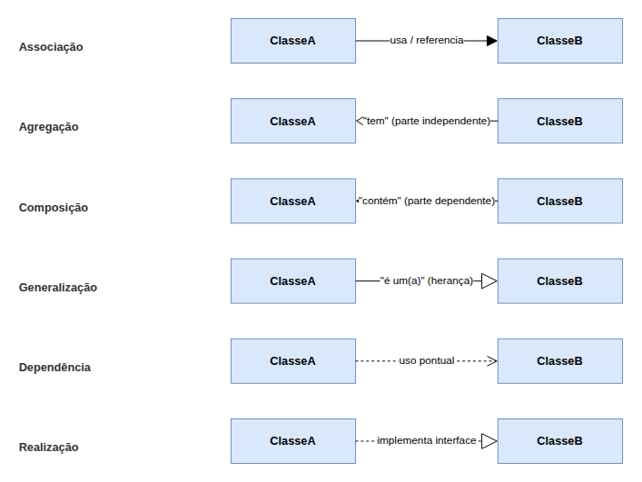

### Diagramas Estáticos 
# Guia do Diagrama de Classes 

Este documento apresenta uma introdução ao **Diagrama de Classes** e orientações sobre a escolha e utilização de ferramentas de modelagem para o projeto.

---

## Introdução ao Diagrama de Classes

O Diagrama de Classes é o diagrama **estático** mais utilizado da UML (*Unified Modeling Language*). Ele reúne os elementos mais importantes de um sistema orientado a objetos, exibindo um conjunto de classes, interfaces e seus relacionamentos. As classes especificam tanto as propriedades (atributos) quanto os comportamentos (operações) dos objetos.

A UML nasceu da fusão das notações de três autores — Grady Booch, Ivar Jacobson e James Rumbaugh — reunindo as melhores práticas de modelagem que haviam provado sucesso na época, num padrão único e amplamente utilizado pela comunidade de software.

### Estrutura de uma Classe

Toda classe é representada por um retângulo dividido em 3 compartimentos:

1. **Nome** da classe (ex: `Pedido`).
2. **Atributos**, no formato `visibilidade nome : tipo`. A visibilidade é indicada por um símbolo: `+` público, `-` privado e `#` protegido.
3. **Operações** (métodos), no mesmo formato de visibilidade, incluindo parâmetros e tipo de retorno quando relevante (ex: `+ calcularTotal() : double`).

### Principais Elementos da Notação

- **Associação:** relacionamento simples entre duas classes (linha reta, com um verbo no meio indicando o sentido, ex: "Cliente **faz** Pedido"). Cada ponta tem uma multiplicidade.
- **Agregação:** relacionamento "tem" (losango **vazado** do lado do "todo") — a parte existe independentemente do todo. Ex: uma `Empresa` tem `Funcionario`, mas o funcionário existe mesmo se a empresa deixar de existir.
- **Composição:** relacionamento "contém"/"é composto de" (losango **preenchido** do lado do "todo") — a parte não existe sem o todo. Ex: um `Carro` é composto de `Motor`; não existe motor "solto" nesse contexto.
- **Generalização (herança):** seta de triângulo vazado, indica que uma classe "é um(a)" outra (ex: `Aluno` é uma `Pessoa`). A superclasse pode ser abstrata (não gera instâncias diretas — representada em itálico ou com `<<abstract>>`).
- **Dependência:** seta tracejada, indica um uso pontual entre classes (ex: um método recebe outro objeto como parâmetro), sem relação de posse.
- **Realização:** seta tracejada com triângulo vazado, usada quando uma classe implementa uma interface (`<<interface>>`).
- **Associação Reflexiva:** liga objetos da mesma classe entre si (ex: `Funcionario` "supervisiona" outro `Funcionario`) — os papéis (`supervisor`/`supervisionado`) evitam ambiguidade na leitura.
- **Classe Associativa:** usada quando uma associação `*..*` precisa guardar informação própria (ex: `Empresa` "emprega" `Pessoa`, e o vínculo tem `tipoContrato` e `valorContrato` — esses atributos viram uma `Contrato-Trabalho`, classe que "nasce" do relacionamento).

<strong>Legenda:</strong> Resumo visual dos 6 tipos de relacionamento entre classes, elaborado pelo autor deste guia com base na notação apresentada em aula.

### Multiplicidade (Cardinalidade)

A multiplicidade fica nas pontas da linha de relacionamento e indica quantas instâncias podem participar da ligação:

| Notação | Significado | Exemplo |
| --- | --- | --- |
| `1` | Exatamente um | Um `Cidadao` possui exatamente um `CPF` |
| `0..1` | Zero ou um (opcional) | Um `Usuario` tem no máximo uma `ContaGovBr` vinculada |
| `*` ou `0..*` | Zero ou muitos | Uma `Categoria` pode não ter nenhum `Conteudo`, ou vários |
| `1..*` | Um ou muitos | Uma `UnidadeDeSaude` oferece pelo menos uma `Especialidade` |
| `1..2`, `2..5` | Intervalo específico | Um `Pedido` tem entre 2 e 5 `ItemDeLinha` |

### Erros comuns a evitar

- **Usar "associação" genérica pra tudo:** antes de traçar a linha, pergunte "a parte sobrevive sem o todo?" — se não sobrevive, é composição; se sobrevive, é agregação; se não há relação de posse, é associação simples.
- **Esquecer a multiplicidade:** um relacionamento sem número nas pontas deixa a cardinalidade em aberto, o que é ambíguo pra quem for implementar o modelo depois.
- **Confundir dependência com associação:** dependência é um uso **momentâneo** (ex: parâmetro de um método), não uma referência guardada como atributo — por isso é uma seta tracejada, mais "fraca" que a associação.

---

## Ferramentas de Modelagem Recomendadas

O subgrupo pode escolher livremente a ferramenta de modelagem, desde que o resultado final seja exportado como imagem (PNG/SVG) para o GitPages, junto com um link editável para quem quiser revisar o diagrama.

### 1. draw.io / diagrams.net

Ferramenta gratuita, baseada em navegador, com suporte nativo a formas de UML (inclusive Diagrama de Classes com os 3 compartimentos prontos). Permite exportar a imagem final e gerar um link "Publicar" ou "Editar" pra compartilhar o arquivo editável com o restante da equipe.

- **Acesso:** [app.diagrams.net](https://app.diagrams.net/) ou [viewer.diagrams.net](https://viewer.diagrams.net/) (apenas visualização)

### 2. Astah / StarUML

Ferramentas desktop dedicadas à modelagem UML, com validação de sintaxe da notação e suporte a todos os diagramas (classe, sequência, pacotes, etc). Exigem instalação, mas têm recursos mais completos pra quem for modelar sistemas grandes.

- **Acesso:** [astah.net](https://astah.net/) / [staruml.io](https://staruml.io/)

---

## Referências Bibliográficas

* Material da disciplina Arquitetura e Desenho de Software (FGA0208/UnB), Profa. Milene Serrano — Aula "Modelagem UML Estática".
* [uml-diagrams.org — Class Diagrams Overview](https://www.uml-diagrams.org/class-diagrams-overview.html)

---

## Histórico de Versionamento

| Nome do Membro | Contribuição | Data | Commit |
| -- | -- | -- | -- |
| [Nicole Jovita](https://github.com/nicolejovita) | Criação do template padronizado para os guias de diagramas | 14/09/2026 | [3227304](https://github.com/UnBArqDsw2026-2-Turma01/2026.2-T01-_G5_ProjetoGovernoEletronico_Entrega_02/commit/3227304c3509461ab58ddf498320e2a16272fe7d) |
| [Davi Ursulino de Oliveira](https://github.com/DaviUrsulino) | Elaboração do Guia do Diagrama de Classes (Iniciativa Extra) | 15/09/2026 | |
