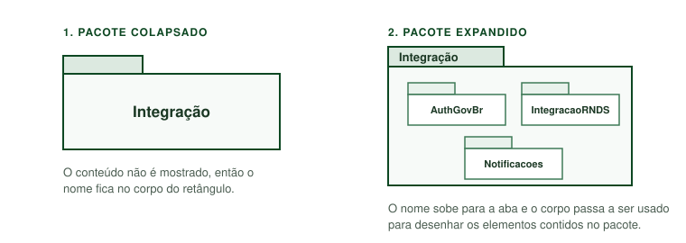
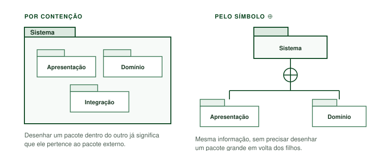
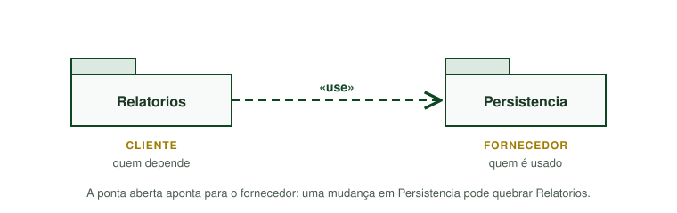
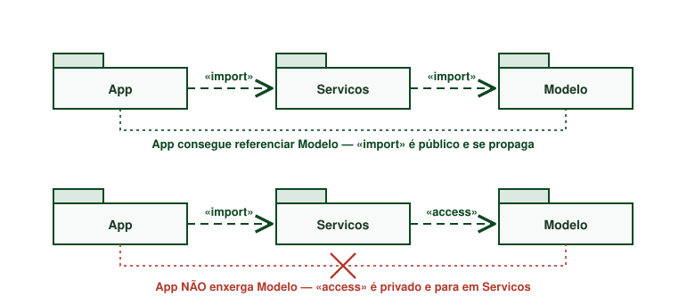
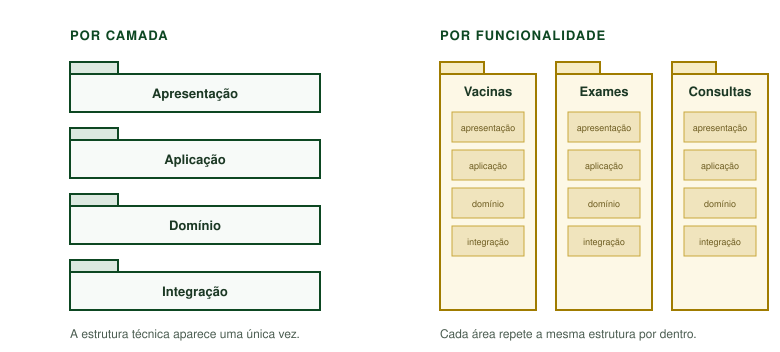
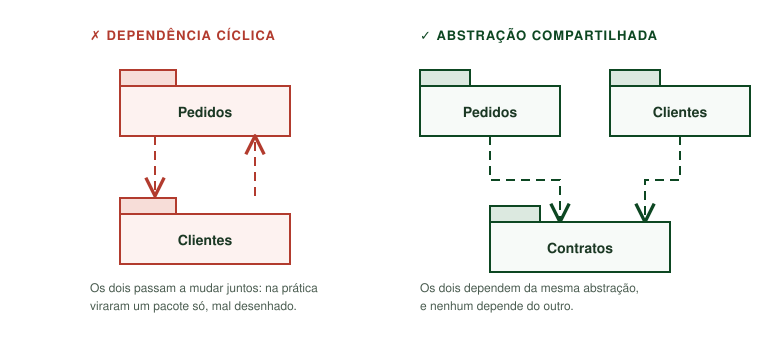
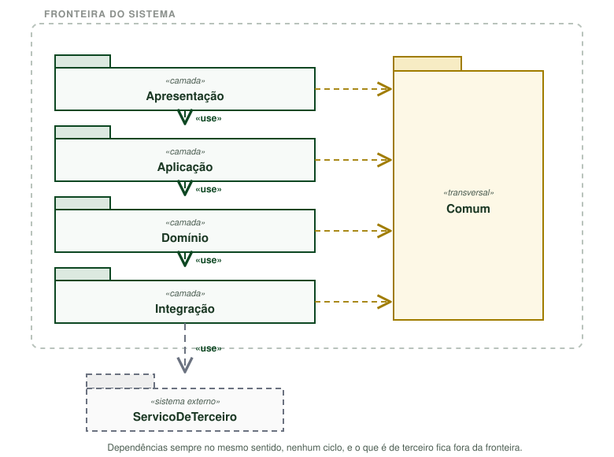

### Diagramas Estáticos
# Guia do Diagrama de Pacotes

Este documento apresenta uma introdução ao **Diagrama de Pacotes** e orientações sobre a escolha e utilização de ferramentas de modelagem para o projeto.

---

## Introdução ao Diagrama de Pacotes

O **Diagrama de Pacotes** é um diagrama **estrutural e estático** da UML que, como descrito no material da disciplina, "permite organizar o sistema como se representasse uma visão em módulos". Ele não mostra como o sistema se comporta nem detalha atributos e operações: seu papel é responder a uma pergunta anterior a essas **como o sistema está dividido, e quem depende de quem**.

Na classificação apresentada em aula, a UML reúne diagramas estruturais (ou estáticos), comportamentais (ou dinâmicos), **organizacionais (ou em pacotes)** e anotacionais. O Diagrama de Pacotes é o representante da fatia organizacional, e tem origem no OOSE, de Ivar Jacobson, uma das três notações fundidas na criação da UML.

Um **pacote** é um agrupador de propósito geral: ele pode conter classes, interfaces, componentes, casos de uso e **outros pacotes**. Essa capacidade de aninhamento é o que torna o diagrama útil em sistemas grandes permite olhar a arquitetura em vários níveis de zoom, do sistema inteiro até um módulo específico, sem mudar de notação.

### Quando usar e quando não usar

| Use quando… | Prefira outro diagrama quando… |
| :--- | :--- |
| Você quer mostrar a arquitetura em camadas ou a divisão em subsistemas | Você precisa detalhar atributos, operações e multiplicidades → **Diagrama de Classes** |
| O sistema é grande o bastante para que um Diagrama de Classes único fique ilegível | Você quer mostrar artefatos implantáveis e as interfaces que eles requerem/oferecem → **Diagrama de Componentes** |
| Você quer evidenciar acoplamento entre módulos e detectar dependências cíclicas | Você quer mostrar ordem temporal ou fluxo de execução → diagramas **dinâmicos** |
| Você não tem acesso ao código-fonte e só consegue afirmar coisas em nível de módulo (Engenharia Reversa) | O sistema é pequeno e cabe inteiro em um Diagrama de Classes legível |

### Principais Elementos da Notação

- **Pacote (*Package*):** representado por um retângulo com uma aba no canto superior esquerdo, no formato de uma pasta de arquivos. Quando o pacote está **vazio ou colapsado**, o nome vai no corpo do retângulo; quando ele **mostra seu conteúdo**, o nome sobe para a aba e o corpo é usado para desenhar os elementos internos.

<strong>Figura 1:</strong> As duas formas de desenhar um pacote. Repare que a posição do nome muda conforme o conteúdo é ou não exibido.

- **Aninhamento (*Nesting*):** um pacote desenhado **dentro** de outro indica que ele pertence ao pacote externo. É a forma mais direta de representar hierarquia. Existe também a notação alternativa com o **símbolo de círculo cruzado (⊕)** ligando o pacote pai aos filhos, útil quando desenhar um dentro do outro deixaria o diagrama grande demais.

<strong>Figura 2:</strong> As duas notações de aninhamento dizem exatamente a mesma coisa a escolha é só de espaço no desenho.

- **Nome qualificado:** a UML usa `::` para separar níveis de hierarquia. Por exemplo, `Sistema::Integracao::AutenticacaoGovBr` identifica o pacote `AutenticacaoGovBr`, contido em `Integracao`, contido em `Sistema`. É a mesma ideia de um caminho de diretórios.

- **Dependência (*Dependency*):** seta **tracejada com ponta aberta**, que parte do pacote **cliente** e aponta para o pacote **fornecedor**. Lê-se "o cliente depende do fornecedor", isto é, uma mudança no fornecedor pode quebrar o cliente. É o relacionamento mais usado no diagrama, e vem em três variações:

  

  
<strong>Figura 3:</strong> Sentido da seta de dependência. Inverter essa ponta é o erro mais comum na hora de ler o diagrama.

  | Estereótipo | Significado |
  | :--- | :--- |
  | `«use»` | Dependência genérica: o cliente precisa do fornecedor para cumprir sua função. É a escolha segura quando não se quer afirmar nada sobre espaço de nomes. |
  | `«import»` | Importação **pública**: os elementos públicos do fornecedor passam a fazer parte do espaço de nomes do cliente e podem ser referenciados sem o nome qualificado. Quem depende do cliente também enxerga esses elementos. |
  | `«access»` | Importação **privada**: o cliente enxerga os elementos do fornecedor, mas não os repassa. Quem depende do cliente **não** enxerga o que veio do fornecedor. |

  

  
<strong>Figura 4:</strong> A diferença entre «import» e «access» só aparece quando existe um terceiro pacote na cadeia: o primeiro é repassado adiante, o segundo para onde foi declarado.

- **Generalização entre pacotes:** seta com **triângulo vazado**, indicando que um pacote é uma especialização de outro por exemplo, um pacote genérico `PersistenciaBD` especializado em `PersistenciaPostgres`. É pouco frequente, mas faz parte da notação.

- **Merge (`«merge»`):** funde o conteúdo de dois pacotes, combinando definições de mesmo nome. Aparece sobretudo em modelagem de metamodelos e raramente é necessário em projetos de disciplina.

- **Visibilidade dos elementos:** assim como em classes, os elementos dentro de um pacote podem ser marcados com `+` (público, visível de fora) ou `-` (privado, visível apenas dentro do pacote). Marcar visibilidade é o que dá sentido prático à diferença entre `«import»` e `«access»`.

- **Estereótipo (`«...»`):** rótulo entre guilhemés que classifica o papel do pacote. Além dos estereótipos padrão, é comum e aceitável criar os seus (`«camada»`, `«subsistema»`, `«sistema externo»`, `«transversal»`) desde que estejam explicados em uma legenda.

- **Nota:** retângulo com o canto dobrado, usado para legenda da notação, decisões de projeto ou avisos que não cabem na estrutura do diagrama.

### Como criar um Diagrama de Pacotes?

1. **Delimite a fronteira do sistema.** Decida o que está dentro e o que é sistema de terceiros. Desenhar os externos com traço diferente (tracejado, por exemplo) deixa o limite visível.

2. **Liste as responsabilidades.** Antes de criar qualquer caixa, escreva o que o sistema faz. Em projetos de Engenharia Reversa, essa lista costuma sair direto de artefatos anteriores como o BPMN ou o Rich Picture.

3. **Escolha um critério de decomposição um só.** Os dois mais comuns são:
   - **Por camada** (apresentação, aplicação, domínio, integração): bom quando as funcionalidades compartilham o mesmo caminho técnico.
   - **Por funcionalidade/domínio** (um pacote por área de negócio): bom quando as áreas são independentes entre si.

   

   
<strong>Figura 5:</strong> Os dois critérios aplicados ao mesmo sistema. À direita, cada área de negócio carrega sua própria cópia das camadas — o que compensa quando as áreas são realmente independentes, e vira duplicação quando não são.

   Misturar os dois critérios no mesmo nível é a origem mais comum de diagramas confusos.

4. **Agrupe buscando alta coesão e baixo acoplamento.** Elementos que mudam juntos ficam no mesmo pacote; elementos que mudam por motivos diferentes ficam separados. Um bom teste: se uma mudança de requisito obriga a mexer em cinco pacotes, o agrupamento provavelmente está errado.

5. **Desenhe as dependências, não as "ligações".** Só trace a seta quando houver de fato uma relação de uso, e sempre no sentido cliente → fornecedor.

6. **Verifique se há ciclos.** Se `A` depende de `B` e `B` depende de `A`, os dois na prática são um pacote só, ou falta uma abstração (uma interface) entre eles. Ciclos são o principal defeito que este diagrama existe para revelar.

   

   
<strong>Figura 6:</strong> Um ciclo e a forma mais comum de desfazê-lo: extrair para um terceiro pacote aquilo de que os dois lados precisam.

7. **Estabilize o sentido das dependências.** Em arquitetura em camadas, a convenção é que elas fluam em um único sentido. Uma seta na contramão deve ser justificada ou eliminada.

8. **Adicione legenda.** Se você usou estereótipos próprios ou cores para diferenciar tipos de pacote, explique-os em uma nota dentro do diagrama.

Aplicando os oito passos a um sistema em camadas, o resultado tem mais ou menos esta cara:

<strong>Figura 7:</strong> Exemplo completo reunindo os elementos da notação: camadas com dependências em sentido único, um pacote transversal, a fronteira do sistema e um sistema de terceiro desenhado fora dela.

### Erros comuns a evitar

- **Transformar o diagrama em um mapa de pastas do repositório.** Pacote é uma unidade **lógica**. A estrutura de diretórios pode até coincidir, mas modelar a árvore de pastas literalmente não comunica arquitetura nenhuma.
- **Inverter o sentido da seta.** A ponta aponta para quem é **usado**, não para quem usa. É o erro de leitura mais frequente na hora da apresentação.
- **Aceitar dependências cíclicas.** Ver o item 7 acima — um ciclo é sempre um achado, nunca um detalhe.
- **Detalhar demais.** Se você está desenhando classes dentro dos pacotes com atributos e operações, o artefato virou um Diagrama de Classes mal formatado. Escolha o nível de abstração e mantenha-o.
- **Criar um pacote "Utilitários" genérico.** Um pacote que recebe tudo que não coube em outro lugar costuma virar o ponto de maior acoplamento do sistema. Se ele for necessário, dê a ele um nome que descreva uma responsabilidade real.
- **Usar `«import»` sem saber o que isso significa.** Se você não tem certeza sobre espaço de nomes, `«use»` é a escolha correta e honesta.

---

## Ferramentas de Modelagem Recomendadas

O subgrupo pode escolher livremente a ferramenta, desde que o resultado final seja exportado como imagem (PNG/SVG) para o GitPages, acompanhado do arquivo-fonte editável ou de um link de edição, para que qualquer membro consiga evoluir o artefato nas próximas versões.

### 1. diagrams.net (draw.io)

Ferramenta gratuita, executável no navegador ou como aplicativo de desktop, com a forma de pacote UML já disponível na biblioteca (`shape=folder`). Permite salvar o arquivo `.drawio` diretamente no repositório, o que torna o artefato versionável junto com a documentação — vantagem relevante para um diagrama que passará por várias versões ao longo da entrega.

- **Acesso:** [app.diagrams.net](https://app.diagrams.net/)

---

### 2. Visual Paradigm Online / StarUML

Ferramentas dedicadas à modelagem UML. Diferentemente de ferramentas de desenho livre, elas conhecem a semântica da notação: validam os relacionamentos permitidos entre pacotes e mantêm os nomes qualificados coerentes automaticamente. O Visual Paradigm Online roda no navegador; o StarUML é desktop e exige instalação.

- **Acesso:** [online.visual-paradigm.com](https://online.visual-paradigm.com/) / [staruml.io](https://staruml.io/)

---

## Referências Bibliográficas

* SERRANO, Milene. *Arquitetura e Desenho de Software — Aula: Modelagem UML Estática*. Brasília: FGA/UnB, 2026. 1 arquivo PDF.
* OBJECT MANAGEMENT GROUP (OMG). *Unified Modeling Language (UML), Version 2.5.1*. Needham: OMG, 2017. Disponível em: https://www.omg.org/spec/UML/2.5.1/. Acesso em: 15/09/2026.
* UML-DIAGRAMS. *UML Package Diagrams Overview*. Disponível em: https://www.uml-diagrams.org/package-diagrams-overview.html. Acesso em: 15/09/2026.
* KDE DOCUMENTATION. *UML Basics — Umbrello*. Disponível em: https://docs.kde.org/trunk4/pt_BR/kdesdk/umbrello/uml-basics.html. Acesso em: 15/09/2026.

---

## Histórico de Versionamento

| Nome do Membro | Contribuição | Data | Commit |
| -- | -- | -- | -- |
| [Nicole Jovita](https://github.com/nicolejovita) | Criação do template padronizado para os guias de diagramas | 14/09/2026 | [3227304](https://github.com/UnBArqDsw2026-2-Turma01/2026.2-T01-_G5_ProjetoGovernoEletronico_Entrega_02/commit/3227304c3509461ab58ddf498320e2a16272fe7d) |
| [Victor Leandro](https://github.com/Afrontoso) | Elaboração do Guia do Diagrama de Pacotes (Iniciativa Extra) | 15/09/2026 | |
| [Victor Leandro](https://github.com/Afrontoso) | Inclusão das sete figuras ilustrando a notação, os critérios de decomposição e o exemplo em camadas | 16/09/2026 | |
